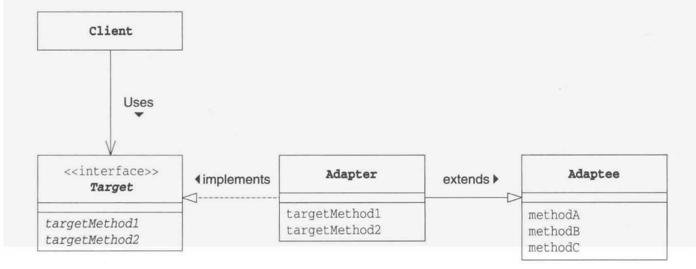

### 适配器模式

这个模式个人的感觉是解决了代码特殊部分和通用部分差异性的问题，在处理逻辑中有一部分存在相同的地方但是有部分地方不同的时候可以使用这个方法将相关的不同点进行进一步的适配从而实现代码的复用。

### 适配器模式类图

适配器模式在GAF书中定义了两种

1. 使用引用的方式进行构建


2. 使用继承的方式进行构建



> 注意： 使用接口和使用抽象类的原因是因为java只能支持单继承，如果业务数据和逻辑操作之间的数据交互使用的集成方法而不是使用引用的方式的时候，将有局限性

### 适配器模式例子

#### 接口和抽象类

1. 使用接口方式进行构建

```java
package org.kys.Gaf.adapter;
public interface AdapterImterface {
    public String show(String s);
}
```

2. 使用抽象类实现

```java
package org.kys.Gaf.adapter;

public abstract class AdapterAbstractClass {
    public abstract String show(String s);
}
```

### 实现类

1. 接口的实现类，使用集成进行数据桥接

```java
package org.kys.Gaf.adapter;

public class AdapterInterfaceImpShopItem extends ShowItem implements AdapterImterface {
    @Override
    public String show(String s) {
        return "*"+this.showItem(s)+"*";
    }
}

```


2. 抽象类的实现类，使用引用进行数据桥接

```java
package org.kys.Gaf.adapter;

public class AdapterAbstactImpShowItem extends AdapterAbstractClass{

    private ShowItem showItem;

    public AdapterAbstactImpShowItem(ShowItem showItem){
        this.showItem = showItem;
    }

    @Override
    public String show(String s) {
        return "&&"+this.showItem.showItem(s)+"&&";
    }
}
```

#### 桥接数据

```java
package org.kys.Gaf.adapter;
public class ShowItem {
    public String showItem(String s){
        return "{"+s+"}";
    }
}
```

#### mian 实现类


```java
package org.kys.Gaf.adapter;
public class Main {
    public static void main(String[] args) {
        ShowItem showItem = new ShowItem();
        AdapterImterface adapterImterface = new AdapterInterfaceImpShopItem();
        AdapterAbstractClass adapterAbstractClass = new AdapterAbstactImpShowItem(showItem);
        System.out.println(adapterImterface.show("123123"));
        System.out.println(adapterAbstractClass.show("123123"));
    }
}
```

> 总结反思：针对之前的迭代器模式，我觉得这个模式处理文章开头说的东西，还有一个重要的思想就是使用继承还是使用数据引用。