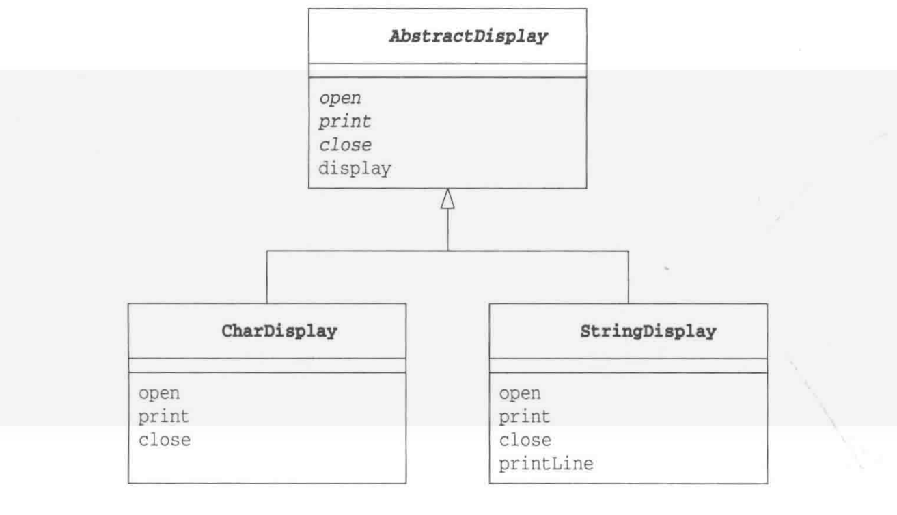

### 模板方法模式

这个设计模式个人的感觉，其实实现了一个标准化的流程，实现类是实现标准的类，而流程由一开始的抽先类或者接口定义了，是标准的继承用法

### 模板方法模式类图



### 模板方法例子

#### 使用抽象类的模板

```java
package org.kys.Gaf.templateMethod;

/**
 * 模板
 */
public abstract class AbstractDisplay {
    private int speed=5;
    public abstract void start();
    public abstract void stop();
    public abstract void print();

    public int getSpeed() {
        return speed;
    }

    public void setSpeed(int speed) {
        this.speed = speed;
    }

    public void display(){
        start();
        for(int a=0;a<this.speed;a++){
            this.print();
        }
        this.stop();
    }
}
```

#### 抽象类的实现类

1. char 实现类

```java
package org.kys.Gaf.templateMethod;

public class CharDisplay extends AbstractDisplay{

    private char itemChar;
    public CharDisplay(char itemChar){
        this.itemChar=itemChar;
    }

    public CharDisplay(int speed,char itemChar){
        this.setSpeed(speed);
        this.itemChar=itemChar;
    }

    @Override
    public void start() {
        System.out.print("<<");
    }

    @Override
    public void stop() {
        System.out.println(">>");
    }

    @Override
    public void print() {
        System.out.print(this.itemChar);
    }
}
```

2. string 实现类

```java
package org.kys.Gaf.templateMethod;

public class StringDisplay extends AbstractDisplay{

    private String string_name;

    public StringDisplay(String s){
        this.string_name = s;
    }

    public StringDisplay(String s,int speed){
        this.setSpeed(speed);
        this.string_name=s;
    }

    @Override
    public void start() {
        printLine();
    }

    @Override
    public void stop() {
        printLine();
    }

    private void printLine(){
        System.out.print("+");
        for (int a=0;a<this.string_name.length();a++){
            System.out.print("-");
        }
        System.out.println("+");
    }

    @Override
    public void print() {
        System.out.println("|"+this.string_name+"|");
    }
}
```

#### main 函数

```java
package org.kys.Gaf.templateMethod;

public class Main {
    public static void main(String[] args) {
        AbstractDisplay display1 =new CharDisplay('A');
        AbstractDisplay display2 = new StringDisplay("template");
        AbstractDisplay display3 = new StringDisplay("GAF_TEMPLATE");
        display1.display();
        display2.display();
        display3.display();
    }
}
```


