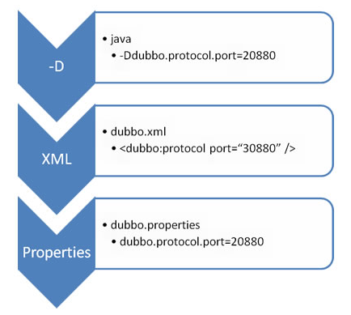

### 快速启动

Dubbo 采用全 Spring 配置方式，透明化接入应用，对应用没有任何 API 侵入，只需用 Spring 加载 Dubbo 的配置即可，Dubbo 基于 Spring 的 Schema 扩展进行加载。

如果不想使用 Spring 配置，可以通过 API 的方式 进行调用。

### 服务提供者

> 定义服务接口 DemoService.java：

```java
package com.kys.dubbo.demo;

public interface DemoService {
    String sayHello(String name);
}
```

> 在服务提供方实现接口DemoServiceImpl.java：

```java
package com.alibaba.dubbo.demo.provider;
 
import com.alibaba.dubbo.demo.DemoService;
 
public class DemoServiceImpl implements DemoService {
    public String sayHello(String name) {
        return "Hello " + name;
    }
}
```

> 用 Spring 配置声明暴露服务provider.xml：

```xml
<?xml version="1.0" encoding="UTF-8"?>
<beans xmlns="http://www.springframework.org/schema/beans"
    xmlns:xsi="http://www.w3.org/2001/XMLSchema-instance"
    xmlns:dubbo="http://dubbo.apache.org/schema/dubbo"
    xsi:schemaLocation="http://www.springframework.org/schema/beans        http://www.springframework.org/schema/beans/spring-beans-4.3.xsd        http://dubbo.apache.org/schema/dubbo        http://dubbo.apache.org/schema/dubbo/dubbo.xsd">
 
    <!-- 提供方应用信息，用于计算依赖关系 -->
    <dubbo:application name="hello-world-app"  />
 
    <!-- 使用multicast广播注册中心暴露服务地址 -->
    <dubbo:registry address="multicast://224.5.6.7:1234" />
 
    <!-- 用dubbo协议在20880端口暴露服务 -->
    <dubbo:protocol name="dubbo" port="20880" />
 
    <!-- 声明需要暴露的服务接口 -->
    <dubbo:service interface="com.alibaba.dubbo.demo.DemoService" ref="demoService" />
 
    <!-- 和本地bean一样实现服务 -->
    <bean id="demoService" class="com.alibaba.dubbo.demo.provider.DemoServiceImpl" />
</beans>
```

> 加载 Spring 配置Provider.java：

```java
import org.springframework.context.support.ClassPathXmlApplicationContext;
 
public class Provider {
    public static void main(String[] args) throws Exception {
        ClassPathXmlApplicationContext context = new ClassPathXmlApplicationContext(new String[] {"http://10.20.160.198/wiki/display/dubbo/provider.xml"});
        context.start();
        System.in.read(); // 按任意键退出
    }
}
```

### 服务消费者

> 通过 Spring 配置引用远程服务consumer.xml：

```xml
<?xml version="1.0" encoding="UTF-8"?>
<beans xmlns="http://www.springframework.org/schema/beans"
    xmlns:xsi="http://www.w3.org/2001/XMLSchema-instance"
    xmlns:dubbo="http://dubbo.apache.org/schema/dubbo"
    xsi:schemaLocation="http://www.springframework.org/schema/beans        http://www.springframework.org/schema/beans/spring-beans-4.3.xsd        http://dubbo.apache.org/schema/dubbo        http://dubbo.apache.org/schema/dubbo/dubbo.xsd">
 
    <!-- 消费方应用名，用于计算依赖关系，不是匹配条件，不要与提供方一样 -->
    <dubbo:application name="consumer-of-helloworld-app"  />
 
    <!-- 使用multicast广播注册中心暴露发现服务地址 -->
    <dubbo:registry address="multicast://224.5.6.7:1234" />
 
    <!-- 生成远程服务代理，可以和本地bean一样使用demoService -->
    <dubbo:reference id="demoService" interface="com.alibaba.dubbo.demo.DemoService" />
</beans>
```

> 加载Spring配置，并调用远程服务Consumer.java：

```java
import org.springframework.context.support.ClassPathXmlApplicationContext;
import com.alibaba.dubbo.demo.DemoService;
 
public class Consumer {
    public static void main(String[] args) throws Exception {
        ClassPathXmlApplicationContext context = new ClassPathXmlApplicationContext(new String[] {"http://10.20.160.198/wiki/display/dubbo/consumer.xml"});
        context.start();
        DemoService demoService = (DemoService)context.getBean("demoService"); // 获取远程服务代理
        String hello = demoService.sayHello("world"); // 执行远程方法
        System.out.println( hello ); // 显示调用结果
    }
}
```

### dubbo 的四中配置方式

#### xml　配置方法

配置实例

```xml
<?xml version="1.0" encoding="UTF-8"?>
<beans xmlns="http://www.springframework.org/schema/beans"
    xmlns:xsi="http://www.w3.org/2001/XMLSchema-instance"
    xmlns:dubbo="http://dubbo.apache.org/schema/dubbo"
    xsi:schemaLocation="http://www.springframework.org/schema/beans http://www.springframework.org/schema/beans/spring-beans-4.3.xsd http://dubbo.apache.org/schema/dubbo http://dubbo.apache.org/schema/dubbo/dubbo.xsd">  
    <dubbo:application name="hello-world-app"  />  
    <dubbo:registry address="multicast://224.5.6.7:1234" />  
    <dubbo:protocol name="dubbo" port="20880" />  
    <dubbo:service interface="com.alibaba.dubbo.demo.DemoService" ref="demoServiceLocal" />  
    <dubbo:reference id="demoServiceRemote" interface="com.alibaba.dubbo.demo.DemoService" />  
</beans>
```

所有标签都支持自定义参数，用于不同扩展点实现的特殊配置，如：

```xml
<dubbo:protocol name="jms">
    <dubbo:parameter key="queue" value="your_queue" />
</dubbo:protocol>
<!--或者使用缩进的方法-->
<dubbo:protocol name="jms" p:queue="your_queue" />  
```

dubbo 所有的标签和作用

标签|用途|解释
--|--|--
<dubbo:service/>|服务配置|用于暴露一个服务，定义服务的元信息，一个服务可以用多个协议暴露，一个服务也可以注册到多个注册中心
<dubbo:reference/>|引用配置|用于创建一个远程服务代理，一个引用可以指向多个注册中心
<dubbo:protocol/>|协议配置|用于配置提供服务的协议信息，协议由提供方指定，消费方被动接受
<dubbo:application/>|应用配置|用于配置当前应用信息，不管该应用是提供者还是消费者
<dubbo:module/>|模块配置|用于配置当前模块信息，可选
<dubbo:registry/>|注册中心配置|用于配置连接注册中心相关信息
<dubbo:monitor/>|监控中心配置|用于配置连接监控中心相关信息，可选
<dubbo:provider/>|提供方配置|当 ProtocolConfig 和 ServiceConfig 某属性没有配置时，采用此缺省值，可选
<dubbo:consumer/>|消费方配置|当 ReferenceConfig 某属性没有配置时，采用此缺省值，可选
<dubbo:method/>|方法配置|用于 ServiceConfig 和 ReferenceConfig 指定方法级的配置信息
<dubbo:argument/>|参数配置|用于指定方法参数配置

> 配置覆盖关系

以 timeout 为例，显示了配置的查找顺序，其它 retries, loadbalance, actives 等类似：

- 方法级优先，接口级次之，全局配置再次之。
- 如果级别一样，则消费方优先，提供方次之。

其中，服务提供方配置，通过 URL 经由注册中心传递给消费方。

> 从上到下优先级递减


#### 属性配置

如果公共配置很简单，没有多注册中心，多协议等情况，或者想多个 Spring 容器想共享配置，可以使用 dubbo.properties 作为缺省配置。

映射规则
将 XML 配置的标签名，加属性名，用点分隔，多个属性拆成多行

- 比如：dubbo.application.name=foo等价于<dubbo:application name="foo" />
- 比如：dubbo.registry.address=10.20.153.10:9090等价于<dubbo:registry address="10.20.153.10:9090" />
如果 XML 有多行同名标签配置，可用 id 号区分，如果没有 id 号将对所有同名标签生效

- 比如：dubbo.protocol.rmi.port=1234等价于<dubbo:protocol id="rmi" name="rmi" port="1099" /> [2]
- 比如：dubbo.registry.china.address=10.20.153.10:9090等价于<dubbo:registry id="china" address="10.20.153.10:9090" />
下面是 dubbo.properties 的一个典型配置：

```
dubbo.application.name=foo
dubbo.application.owner=bar
dubbo.registry.address=10.20.153.10:9090
```

> 覆盖策略（从上到下优先级递减）



- 如果 classpath 根目录下存在多个 dubbo.properties，比如多个 jar 包中有 dubbo.properties，Dubbo 会任意加载，并打印 Error 日志，后续可能改为抛异常。

- 协议的 id 没配时，缺省使用协议名作为 id

#### api 配置

API 属性xml与配置项一对一

> 服务提供者

```java
import com.alibaba.dubbo.rpc.config.ApplicationConfig;
import com.alibaba.dubbo.rpc.config.RegistryConfig;
import com.alibaba.dubbo.rpc.config.ProviderConfig;
import com.alibaba.dubbo.rpc.config.ServiceConfig;
import com.xxx.XxxService;
import com.xxx.XxxServiceImpl;
 
// 服务实现
XxxService xxxService = new XxxServiceImpl();
 
// 当前应用配置
ApplicationConfig application = new ApplicationConfig();
application.setName("xxx");
 
// 连接注册中心配置
RegistryConfig registry = new RegistryConfig();
registry.setAddress("10.20.130.230:9090");
registry.setUsername("aaa");
registry.setPassword("bbb");
 
// 服务提供者协议配置
ProtocolConfig protocol = new ProtocolConfig();
protocol.setName("dubbo");
protocol.setPort(12345);
protocol.setThreads(200);
 
// 注意：ServiceConfig为重对象，内部封装了与注册中心的连接，以及开启服务端口
 
// 服务提供者暴露服务配置
ServiceConfig<XxxService> service = new ServiceConfig<XxxService>(); // 此实例很重，封装了与注册中心的连接，请自行缓存，否则可能造成内存和连接泄漏
service.setApplication(application);
service.setRegistry(registry); // 多个注册中心可以用setRegistries()
service.setProtocol(protocol); // 多个协议可以用setProtocols()
service.setInterface(XxxService.class);
service.setRef(xxxService);
service.setVersion("1.0.0");
 
// 暴露及注册服务
service.export();
```

> 服务消费者

```java
import com.alibaba.dubbo.rpc.config.ApplicationConfig;
import com.alibaba.dubbo.rpc.config.RegistryConfig;
import com.alibaba.dubbo.rpc.config.ConsumerConfig;
import com.alibaba.dubbo.rpc.config.ReferenceConfig;
import com.xxx.XxxService;
 
// 当前应用配置
ApplicationConfig application = new ApplicationConfig();
application.setName("yyy");
 
// 连接注册中心配置
RegistryConfig registry = new RegistryConfig();
registry.setAddress("10.20.130.230:9090");
registry.setUsername("aaa");
registry.setPassword("bbb");
 
// 注意：ReferenceConfig为重对象，内部封装了与注册中心的连接，以及与服务提供方的连接
 
// 引用远程服务
ReferenceConfig<XxxService> reference = new ReferenceConfig<XxxService>(); // 此实例很重，封装了与注册中心的连接以及与提供者的连接，请自行缓存，否则可能造成内存和连接泄漏
reference.setApplication(application);
reference.setRegistry(registry); // 多个注册中心可以用setRegistries()
reference.setInterface(XxxService.class);
reference.setVersion("1.0.0");
 
// 和本地bean一样使用xxxService
XxxService xxxService = reference.get(); // 注意：此代理对象内部封装了所有通讯细节，对象较重，请缓存复用
```

特殊场景
下面只列出不同的地方，其它参见上面的写法

> 方法级设置
 
```java
// 方法级配置
List<MethodConfig> methods = new ArrayList<MethodConfig>();
MethodConfig method = new MethodConfig();
method.setName("createXxx");
method.setTimeout(10000);
method.setRetries(0);
methods.add(method);
 
// 引用远程服务
ReferenceConfig<XxxService> reference = new ReferenceConfig<XxxService>(); // 此实例很重，封装了与注册中心的连接以及与提供者的连接，请自行缓存，否则可能造成内存和连接泄漏
reference.setMethods(methods); // 设置方法级配置
```

> 点对点直连

```java 
ReferenceConfig<XxxService> reference = new ReferenceConfig<XxxService>(); // 此实例很重，封装了与注册中心的连接以及与提供者的连接，请自行缓存，否则可能造成内存和连接泄漏
// 如果点对点直连，可以用reference.setUrl()指定目标地址，设置url后将绕过注册中心，
// 其中，协议对应provider.setProtocol()的值，端口对应provider.setPort()的值，
// 路径对应service.setPath()的值，如果未设置path，缺省path为接口名
reference.setUrl("dubbo://10.20.130.230:20880/com.xxx.XxxService"); 
```

API使用范围说明：API 仅用于 OpenAPI, ESB, Test, Mock 等系统集成，普通服务提供方或消费方，请采用XML 配置方式使用 Dubbo

#### 注解配置


> 服务提供方

> Service注解暴露服务

```java
import com.alibaba.dubbo.config.annotation.Service;
 
@Service(timeout = 5000)
public class AnnotateServiceImpl implements AnnotateService { 
    // ...
}
```

> javaconfig形式配置公共模块

```java
@Configuration
public class DubboConfiguration {

    @Bean
    public ApplicationConfig applicationConfig() {
        ApplicationConfig applicationConfig = new ApplicationConfig();
        applicationConfig.setName("provider-test");
        return applicationConfig;
    }

    @Bean
    public RegistryConfig registryConfig() {
        RegistryConfig registryConfig = new RegistryConfig();
        registryConfig.setAddress("zookeeper://127.0.0.1:2181");
        registryConfig.setClient("curator");
        return registryConfig;
    }
}
```

>指定dubbo扫描路径

```java
@SpringBootApplication
@DubboComponentScan(basePackages = "com.alibaba.dubbo.test.service.impl")
public class ProviderTestApp {
    // ...
}
```

> 服务消费方

> Reference注解引用服务

```java
public class AnnotationConsumeService {

    @com.alibaba.dubbo.config.annotation.Reference
    public AnnotateService annotateService;
    
    // ...
}
```

> javaconfig形式配置公共模块

```java
@Configuration
public class DubboConfiguration {

    @Bean
    public ApplicationConfig applicationConfig() {
        ApplicationConfig applicationConfig = new ApplicationConfig();
        applicationConfig.setName("consumer-test");
        return applicationConfig;
    }

    @Bean
    public ConsumerConfig consumerConfig() {
        ConsumerConfig consumerConfig = new ConsumerConfig();
        consumerConfig.setTimeout(3000);
        return consumerConfig;
    }

    @Bean
    public RegistryConfig registryConfig() {
        RegistryConfig registryConfig = new RegistryConfig();
        registryConfig.setAddress("zookeeper://127.0.0.1:2181");
        registryConfig.setClient("curator");
        return registryConfig;
    }
}
```

> 指定dubbo扫描路径

```java
@SpringBootApplication
@DubboComponentScan(basePackages = "com.alibaba.dubbo.test.service")
public class ConsumerTestApp {
    // ...
}
```

> 注意

> 如果你曾使用旧版annotation配置，请删除所有相关配置，我们将在下个版本删除所有旧版配置项。

```xml
<dubbo:annotation package="com.alibaba.dubbo.test.service" /> 
```