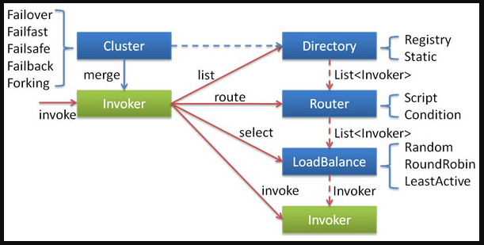
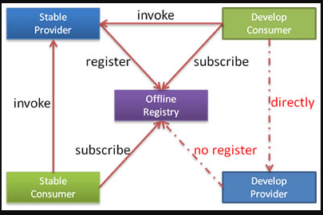

## 启动时检查

Dubbo 缺省会在启动时检查依赖的服务是否可用，不可用时会抛出异常，阻止 Spring 初始化完成，以便上线时，能及早发现问题，默认 check="true"。

注意使用懒加载的时候可以指定这个方法为false，当这个为false的时候，如果服务不可用将会为null 而不是抛出异常，当服务恢复时，能自动连上。

### 配置方法

通过 spring 配置文件
关闭某个服务的启动时检查 (没有提供者时报错)：
```xml
<dubbo:reference interface="com.foo.BarService" check="false" />
```
关闭所有服务的启动时检查 (没有提供者时报错)：
```xml
<dubbo:consumer check="false" />
```
关闭注册中心启动时检查 (注册订阅失败时报错)：
```xml
<dubbo:registry check="false" />
```
通过 dubbo.properties
```
dubbo.reference.com.foo.BarService.check=false
dubbo.reference.check=false
dubbo.consumer.check=false
dubbo.registry.check=false
```

配置的含义

- dubbo.reference.check=false，强制改变所有 reference 的 check 值，就算配置中有声明，也会被覆盖。

- dubbo.consumer.check=false，是设置 check 的缺省值，如果配置中有显式的声明，如：<dubbo:reference check="true"/>，不会受影响。

- dubbo.registry.check=false，前面两个都是指订阅成功，但提供者列表是否为空是否报错，如果注册订阅失败时，也允许启动，需使用此选项，将在后台定时重试。

## 集群容错



各节点关系：

- 这里的 Invoker 是 Provider 的一个可调用 Service 的抽象，Invoker 封装了 Provider 地址及 Service 接口信息
- Directory 代表多个 Invoker，可以把它看成 List<Invoker> ，但与 List 不同的是，它的值可能是动态变化的，比如注册中心推送变更
- Cluster 将 Directory 中的多个 Invoker 伪装成一个 Invoker，对上层透明，伪装过程包含了容错逻辑，调用失败后，重试另一个
- Router 负责从多个 Invoker 中按路由规则选出子集，比如读写分离，应用隔离等
- LoadBalance 负责从多个 Invoker 中选出具体的一个用于本次调用，选的过程包含了负载均衡算法，调用失败后，需要重选

### 集群容错模式

> Failover Cluster

失败自动切换，当出现失败，重试其它服务器 [1]。通常用于读操作，但重试会带来更长延迟。可通过 retries="2" 来设置重试次数(不含第一次)。

重试次数配置如下：

```xml
<dubbo:service retries="2" />
或
<dubbo:reference retries="2" />
或
<dubbo:reference>
    <dubbo:method name="findFoo" retries="2" />
</dubbo:reference>
```

> Failfast Cluster
快速失败，只发起一次调用，失败立即报错。通常用于非幂等性的写操作，比如新增记录。

> Failsafe Cluster
失败安全，出现异常时，直接忽略。通常用于写入审计日志等操作。

> Failback Cluster
失败自动恢复，后台记录失败请求，定时重发。通常用于消息通知操作。

> Forking Cluster
并行调用多个服务器，只要一个成功即返回。通常用于实时性要求较高的读操作，但需要浪费更多服务资源。可通过 forks="2" 来设置最大并行数。

> Broadcast Cluster
广播调用所有提供者，逐个调用，任意一台报错则报错 [2]。通常用于通知所有提供者更新缓存或日志等本地资源信息。

### 集群模式配置
按照以下示例在服务提供方和消费方配置集群模式

```xml
<dubbo:service cluster="failsafe" />
或
<dubbo:reference cluster="failsafe" />
```

## 负载均衡

在集群负载均衡时，Dubbo 提供了多种均衡策略，缺省为 random 随机调用。

### 负载均衡策略

> Random LoadBalance

随机，按权重设置随机概率。
在一个截面上碰撞的概率高，但调用量越大分布越均匀，而且按概率使用权重后也比较均匀，有利于动态调整提供者权重。

> RoundRobin LoadBalance

轮循，按公约后的权重设置轮循比率。
存在慢的提供者累积请求的问题，比如：第二台机器很慢，但没挂，当请求调到第二台时就卡在那，久而久之，所有请求都卡在调到第二台上。

> LeastActive LoadBalance

最少活跃调用数，相同活跃数的随机，活跃数指调用前后计数差。
使慢的提供者收到更少请求，因为越慢的提供者的调用前后计数差会越大。

> ConsistentHash LoadBalance
一致性 Hash，相同参数的请求总是发到同一提供者。
当某一台提供者挂时，原本发往该提供者的请求，基于虚拟节点，平摊到其它提供者，不会引起剧烈变动。
算法参见：http://en.wikipedia.org/wiki/Consistent_hashing
缺省只对第一个参数 Hash，如果要修改，请配置 

```xml
<dubbo:parameter key="hash.arguments" value="0,1" />
```

缺省用 160 份虚拟节点，如果要修改，请配置 
```xml
<dubbo:parameter key="hash.nodes" value="320" />
```
### 配置

服务端服务级别

```xml
<dubbo:service interface="..." loadbalance="roundrobin" />
```

客户端服务级别

```xml
<dubbo:reference interface="..." loadbalance="roundrobin" />
```

服务端方法级别

```xml
<dubbo:service interface="...">
    <dubbo:method name="..." loadbalance="roundrobin"/>
</dubbo:service>
```

客户端方法级别

```xml
<dubbo:reference interface="...">
    <dubbo:method name="..." loadbalance="roundrobin"/>
</dubbo:reference>
```

## 线程模型
如果事件处理的逻辑能迅速完成，并且不会发起新的 IO 请求，比如只是在内存中记个标识，则直接在 IO 线程上处理更快，因为减少了线程池调度。

但如果事件处理逻辑较慢，或者需要发起新的 IO 请求，比如需要查询数据库，则必须派发到线程池，否则 IO 线程阻塞，将导致不能接收其它请求。

如果用 IO 线程处理事件，又在事件处理过程中发起新的 IO 请求，比如在连接事件中发起登录请求，会报“可能引发死锁”异常，但不会真死锁。


因此，需要通过不同的派发策略和不同的线程池配置的组合来应对不同的场景:

```xml
<dubbo:protocol name="dubbo" dispatcher="all" threadpool="fixed" threads="100" />
```

> Dispatcher

- all 所有消息都派发到线程池，包括请求，响应，连接事件，断开事件，心跳等。
- direct 所有消息都不派发到线程池，全部在 IO 线程上直接执行。
- message 只有请求响应消息派发到线程池，其它连接断开事件，心跳等消息，直接在 IO 线程上执行。
- execution 只请求消息派发到线程池，不含响应，响应和其它连接断开事件，心跳等消息，直接在 IO 线程上执行。
- connection 在 IO 线程上，将连接断开事件放入队列，有序逐个执行，其它消息派发到线程池。

> ThreadPool

- fixed 固定大小线程池，启动时建立线程，不关闭，一直持有。(缺省)
- cached 缓存线程池，空闲一分钟自动删除，需要时重建。
- limited 可伸缩线程池，但池中的线程数只会增长不会收缩。只增长不收缩的目的是为了避免收缩时突然来了大流量引起的性能问题。
- eager 优先创建Worker线程池。在任务数量大于corePoolSize但是小于maximumPoolSize时，优先创建Worker来处理任务。当任务数量大于maximumPoolSize时，将任务放入阻塞队列中。阻塞队列充满时抛出RejectedExecutionException。(相比于cached:cached在任务数量超过maximumPoolSize时直接抛出异常而不是将任务放入阻塞队列)

## 直连提供者（只有测试环境使用）和只订阅，只注册

### 直连

在开发及测试环境下，经常需要绕过注册中心，只测试指定服务提供者，这时候可能需要点对点直连，点对点直联方式，将以服务接口为单位，**忽略注册中心的提供者列表**，A 接口配置点对点，不影响 B 接口从注册中心获取列表。

> 通过 XML 配置

如果是线上需求需要点对点，可在 <dubbo:reference> 中配置 url 指向提供者，将绕过注册中心，多个地址用分号隔开，配置如下 [1]：

```xml
<dubbo:reference id="xxxService" interface="com.alibaba.xxx.XxxService" url="dubbo://localhost:20890" />
```
> 通过文件映射

如果服务比较多，也可以用文件映射，用 -Ddubbo.resolve.file 指定映射文件路径，此配置优先级高于 <dubbo:reference> 中的配置 [3]，如：

```
java -Ddubbo.resolve.file=xxx.properties
```

然后在映射文件 xxx.properties 中加入配置，其中 key 为服务名，value 为服务提供者 URL：

```
com.alibaba.xxx.XxxService=dubbo://localhost:20890
```

> 注意:为了避免复杂化线上环境，不要在线上使用这个功能，只应在测试阶段使用。

### 禁用注册

就是指服务方可以拉取配置中心的信息当时并不在配置中心进行注册



禁用注册配置
```xml
<dubbo:registry address="10.20.153.10:9090" register="false" />
```
或者
```xml
<dubbo:registry address="10.20.153.10:9090?register=false" />
```

### 禁用拉取

制定一个配置中心只将自己注册进去但是不进行订阅功能

禁用订阅配置

<dubbo:registry id="hzRegistry" address="10.20.153.10:9090" />
<dubbo:registry id="qdRegistry" address="10.20.141.150:9090" subscribe="false" />
或者

<dubbo:registry id="hzRegistry" address="10.20.153.10:9090" />
<dubbo:registry id="qdRegistry" address="10.20.141.150:9090?subscribe=false" />

## 多协议

> 不同服务不同协议

不同服务在性能上适用不同协议进行传输，比如大数据用短连接协议，小数据大并发用长连接协议

```xml
<?xml version="1.0" encoding="UTF-8"?>
<beans xmlns="http://www.springframework.org/schema/beans"
    xmlns:xsi="http://www.w3.org/2001/XMLSchema-instance"
    xmlns:dubbo="http://dubbo.apache.org/schema/dubbo"
    xsi:schemaLocation="http://www.springframework.org/schema/beans http://www.springframework.org/schema/beans/spring-beans-4.3.xsd http://dubbo.apache.org/schema/dubbo http://dubbo.apache.org/schema/dubbo/dubbo.xsd"> 
    <dubbo:application name="world"  />
    <dubbo:registry id="registry" address="10.20.141.150:9090" username="admin" password="hello1234" />
    <!-- 多协议配置 -->
    <dubbo:protocol name="dubbo" port="20880" />
    <dubbo:protocol name="rmi" port="1099" />
    <!-- 使用dubbo协议暴露服务 -->
    <dubbo:service interface="com.alibaba.hello.api.HelloService" version="1.0.0" ref="helloService" protocol="dubbo" />
    <!-- 使用rmi协议暴露服务 -->
    <dubbo:service interface="com.alibaba.hello.api.DemoService" version="1.0.0" ref="demoService" protocol="rmi" /> 
</beans>
```

> 多协议暴露服务

需要与 http 客户端互操作

```xml
<?xml version="1.0" encoding="UTF-8"?>
<beans xmlns="http://www.springframework.org/schema/beans"
    xmlns:xsi="http://www.w3.org/2001/XMLSchema-instance"
    xmlns:dubbo="http://dubbo.apache.org/schema/dubbo"
    xsi:schemaLocation="http://www.springframework.org/schema/beans http://www.springframework.org/schema/beans/spring-beans-4.3.xsd http://dubbo.apache.org/schema/dubbo http://dubbo.apache.org/schema/dubbo/dubbo.xsd">
    <dubbo:application name="world"  />
    <dubbo:registry id="registry" address="10.20.141.150:9090" username="admin" password="hello1234" />
    <!-- 多协议配置 -->
    <dubbo:protocol name="dubbo" port="20880" />
    <dubbo:protocol name="hessian" port="8080" />
    <!-- 使用多个协议暴露服务 -->
    <dubbo:service id="helloService" interface="com.alibaba.hello.api.HelloService" version="1.0.0" protocol="dubbo,hessian" />
</beans>
```

## 服务分组

当一个接口有多种实现时，可以用 group 区分。

> 服务

```xml
<dubbo:service group="feedback" interface="com.xxx.IndexService" />
<dubbo:service group="member" interface="com.xxx.IndexService" />
```

> 引用

```xml
<dubbo:reference id="feedbackIndexService" group="feedback" interface="com.xxx.IndexService" />
<dubbo:reference id="memberIndexService" group="member" interface="com.xxx.IndexService" />

> 任意组

```xml
<dubbo:reference id="barService" interface="com.foo.BarService" group="*" />
```

## 多版本
当一个接口实现，出现不兼容升级时，可以用版本号过渡，版本号不同的服务相互间不引用。

可以按照以下的步骤进行版本迁移：

- 在低压力时间段，先升级一半提供者为新版本
- 再将所有消费者升级为新版本
- 然后将剩下的一半提供者升级为新版本

> 老版本服务提供者配置：

```xml
<dubbo:service interface="com.foo.BarService" version="1.0.0" />
```
> 新版本服务提供者配置：

```xml
<dubbo:service interface="com.foo.BarService" version="2.0.0" />
```

> 老版本服务消费者配置：

```xml
<dubbo:reference id="barService" interface="com.foo.BarService" version="1.0.0" />
```

> 新版本服务消费者配置：

```xml
<dubbo:reference id="barService" interface="com.foo.BarService" version="2.0.0" />
```

> 如果不需要区分版本，可以按照以下的方式配置 [1]：

```xml
<dubbo:reference id="barService" interface="com.foo.BarService" version="*" />
```

## 分组聚合
按组合并返回结果 [1]，比如菜单服务，接口一样，但有多种实现，用group区分，现在消费方需从每种**group**中调用一次返回结果，合并结果返回，这样就可以实现聚合菜单项。

> 配置

搜索所有分组

```xml
<dubbo:reference interface="com.xxx.MenuService" group="*" merger="true" />
```

> 合并指定分组

```xml
<dubbo:reference interface="com.xxx.MenuService" group="aaa,bbb" merger="true" />
```

> 指定方法合并结果，其它未指定的方法，将只调用一个 Group

```xml
<dubbo:reference interface="com.xxx.MenuService" group="*">
    <dubbo:method name="getMenuItems" merger="true" />
</dubbo:service>
```

> 某个方法不合并结果，其它都合并结果

```xml
<dubbo:reference interface="com.xxx.MenuService" group="*" merger="true">
    <dubbo:method name="getMenuItems" merger="false" />
</dubbo:service>
```

指定合并策略，缺省根据返回值类型自动匹配，如果同一类型有两个合并器时，需指定合并器的名称

```xml
<dubbo:reference interface="com.xxx.MenuService" group="*">
    <dubbo:method name="getMenuItems" merger="mymerge" />
</dubbo:service>
```

指定合并方法，将调用返回结果的指定方法进行合并，合并方法的参数类型必须是返回结果类型本身

```xml
<dubbo:reference interface="com.xxx.MenuService" group="*">
    <dubbo:method name="getMenuItems" merger=".addAll" />
</dubbo:service>
```

## 结果缓存
结果缓存 [1]，用于加速热门数据的访问速度，Dubbo 提供声明式缓存，以减少用户加缓存的工作量 [2]。

> 缓存类型

- lru 基于最近最少使用原则删除多余缓存，保持最热的数据被缓存。
- threadlocal 当前线程缓存，比如一个页面渲染，用到很多 portal，每个 portal 都要去查用户信息，通过线程缓存，可以减少这种多余访问。
- jcache 与 JSR107 集成，可以桥接各种缓存实现。
- 缓存类型可扩展，参见：缓存扩展

> 配置

```xml
<dubbo:reference interface="com.foo.BarService" cache="lru" />
```
或：

```xml
<dubbo:reference interface="com.foo.BarService">
    <dubbo:method name="findBar" cache="lru" />
</dubbo:reference>
```

## 使用泛化调用

泛化接口调用方式主要用于客户端没有 API 接口及模型类元的情况，参数及返回值中的所有 POJO 均用 Map 表示，通常用于框架集成，比如：实现一个通用的服务测试框架，可通过 GenericService 调用所有服务实现。

通过 Spring 使用泛化调用
在 Spring 配置申明 generic="true"：

```xml
<dubbo:reference id="barService" interface="com.foo.BarService" generic="true" />

```
在 Java 代码获取 barService 并开始泛化调用：

```java
GenericService barService = (GenericService) applicationContext.getBean("barService");
Object result = barService.$invoke("sayHello", new String[] { "java.lang.String" }, new Object[] { "World" });
```

> 通过 API 方式使用泛化调用

```java
import com.alibaba.dubbo.rpc.service.GenericService; 
... 
 
// 引用远程服务 
// 该实例很重量，里面封装了所有与注册中心及服务提供方连接，请缓存
ReferenceConfig<GenericService> reference = new ReferenceConfig<GenericService>(); 
// 弱类型接口名
reference.setInterface("com.xxx.XxxService");  
reference.setVersion("1.0.0");
// 声明为泛化接口 
reference.setGeneric(true);  

// 用com.alibaba.dubbo.rpc.service.GenericService可以替代所有接口引用  
GenericService genericService = reference.get(); 
 
// 基本类型以及Date,List,Map等不需要转换，直接调用 
Object result = genericService.$invoke("sayHello", new String[] {"java.lang.String"}, new Object[] {"world"}); 
 
// 用Map表示POJO参数，如果返回值为POJO也将自动转成Map 
Map<String, Object> person = new HashMap<String, Object>(); 
person.put("name", "xxx"); 
person.put("password", "yyy"); 
// 如果返回POJO将自动转成Map 
Object result = genericService.$invoke("findPerson", new String[]
{"com.xxx.Person"}, new Object[]{person}); 
```

> 有关泛化类型的进一步解释

假设存在 POJO 如：

```java
package com.xxx;

public class PersonImpl implements Person {
    private String name;
    private String password;

    public String getName() {
        return name;
    }

    public void setName(String name) {
        this.name = name;
    }

    public String getPassword() {
        return password;
    }

    public void setPassword(String password) {
        this.password = password;
    }
}
```
> 则 POJO 数据：

```java
Person person = new PersonImpl(); 
person.setName("xxx"); 
person.setPassword("yyy");
```

可用下面 Map 表示：

```java
Map<String, Object> map = new HashMap<String, Object>(); 
// 注意：如果参数类型是接口，或者List等丢失泛型，可通过class属性指定类型。
map.put("class", "com.xxx.PersonImpl"); 
map.put("name", "xxx"); 
map.put("password", "yyy");
```