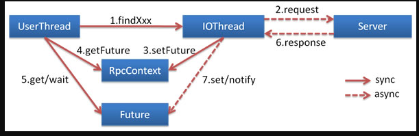

## 泛化调用客户端

泛化接口调用方式主要用于客户端没有 API 接口及模型类元的情况，参数及返回值中的所有 POJO 均用 Map 表示，通常用于框架集成，比如：实现一个通用的服务测试框架，可通过 GenericService 调用所有服务实现。

通过 Spring 使用泛化调用
在 Spring 配置申明 generic="true"：

```xml
<dubbo:reference id="barService" interface="com.foo.BarService" generic="true" />

```
在 Java 代码获取 barService 并开始泛化调用：

```java
GenericService barService = (GenericService) applicationContext.getBean("barService");
Object result = barService.$invoke("sayHello", new String[] { "java.lang.String" }, new Object[] { "World" });
```

> 通过 API 方式使用泛化调用

```java
import com.alibaba.dubbo.rpc.service.GenericService; 
... 
 
// 引用远程服务 
// 该实例很重量，里面封装了所有与注册中心及服务提供方连接，请缓存
ReferenceConfig<GenericService> reference = new ReferenceConfig<GenericService>(); 
// 弱类型接口名
reference.setInterface("com.xxx.XxxService");  
reference.setVersion("1.0.0");
// 声明为泛化接口 
reference.setGeneric(true);  

// 用com.alibaba.dubbo.rpc.service.GenericService可以替代所有接口引用  
GenericService genericService = reference.get(); 
 
// 基本类型以及Date,List,Map等不需要转换，直接调用 
Object result = genericService.$invoke("sayHello", new String[] {"java.lang.String"}, new Object[] {"world"}); 
 
// 用Map表示POJO参数，如果返回值为POJO也将自动转成Map 
Map<String, Object> person = new HashMap<String, Object>(); 
person.put("name", "xxx"); 
person.put("password", "yyy"); 
// 如果返回POJO将自动转成Map 
Object result = genericService.$invoke("findPerson", new String[]
{"com.xxx.Person"}, new Object[]{person}); 
```

> 有关泛化类型的进一步解释

假设存在 POJO 如：

```java
package com.xxx;

public class PersonImpl implements Person {
    private String name;
    private String password;

    public String getName() {
        return name;
    }

    public void setName(String name) {
        this.name = name;
    }

    public String getPassword() {
        return password;
    }

    public void setPassword(String password) {
        this.password = password;
    }
}
```
> 则 POJO 数据：

```java
Person person = new PersonImpl(); 
person.setName("xxx"); 
person.setPassword("yyy");
```

可用下面 Map 表示：

```java
Map<String, Object> map = new HashMap<String, Object>(); 
// 注意：如果参数类型是接口，或者List等丢失泛型，可通过class属性指定类型。
map.put("class", "com.xxx.PersonImpl"); 
map.put("name", "xxx"); 
map.put("password", "yyy");
```

## 泛化调用服务端
泛接口实现方式主要用于服务器端没有API接口及模型类元的情况，参数及返回值中的所有POJO均用Map表示，通常用于框架集成，比如：实现一个通用的远程服务Mock框架，可通过实现GenericService接口处理所有服务请求。

在 Java 代码中实现 GenericService 接口：

```java
package com.foo;
public class MyGenericService implements GenericService {
 
    public Object $invoke(String methodName, String[] parameterTypes, Object[] args) throws GenericException {
        if ("sayHello".equals(methodName)) {
            return "Welcome " + args[0];
        }
    }
}
```

通过 Spring 暴露泛化实现
在 Spring 配置申明服务的实现：

```xml
<bean id="genericService" class="com.foo.MyGenericService" />
<dubbo:service interface="com.foo.BarService" ref="genericService" />
```

通过 API 方式暴露泛化实现

```java 
// 用com.alibaba.dubbo.rpc.service.GenericService可以替代所有接口实现 
GenericService xxxService = new XxxGenericService(); 

// 该实例很重量，里面封装了所有与注册中心及服务提供方连接，请缓存 
ServiceConfig<GenericService> service = new ServiceConfig<GenericService>();
// 弱类型接口名 
service.setInterface("com.xxx.XxxService");  
service.setVersion("1.0.0"); 
// 指向一个通用服务实现 
service.setRef(xxxService); 
 
// 暴露及注册服务 
service.export();
```

## 回声测试

回声测试用于检测服务是否可用，回声测试按照正常请求流程执行，能够测试整个调用是否通畅，可用于监控。

所有服务自动实现 EchoService 接口，只需将任意服务引用强制转型为 EchoService，即可使用。

Spring 配置：

```xml
<dubbo:reference id="memberService" interface="com.xxx.MemberService" />
```

代码：

```java
// 远程服务引用
MemberService memberService = ctx.getBean("memberService"); 
 
EchoService echoService = (EchoService) memberService; // 强制转型为EchoService

// 回声测试可用性
String status = echoService.$echo("OK"); 
 
assert(status.equals("OK"));
```

## 上下文信息
上下文中存放的是当前调用过程中所需的环境信息。所有配置信息都将转换为 URL 的参数，参见 schema 配置参考手册 中的对应URL参数一列。

RpcContext 是一个 ThreadLocal 的临时状态记录器，当接收到 RPC 请求，或发起 RPC 请求时，RpcContext 的状态都会变化。比如：A 调 B，B 再调 C，则 B 机器上，在 B 调 C 之前，RpcContext 记录的是 A 调 B 的信息，在 B 调 C 之后，RpcContext 记录的是 B 调 C 的信息。

服务消费方

```java
// 远程调用
xxxService.xxx();
// 本端是否为消费端，这里会返回true
boolean isConsumerSide = RpcContext.getContext().isConsumerSide();
// 获取最后一次调用的提供方IP地址
String serverIP = RpcContext.getContext().getRemoteHost();
// 获取当前服务配置信息，所有配置信息都将转换为URL的参数
String application = RpcContext.getContext().getUrl().getParameter("application");
// 注意：每发起RPC调用，上下文状态会变化
yyyService.yyy();
```

服务提供方
```java
public class XxxServiceImpl implements XxxService {
 
    public void xxx() {
        // 本端是否为提供端，这里会返回true
        boolean isProviderSide = RpcContext.getContext().isProviderSide();
        // 获取调用方IP地址
        String clientIP = RpcContext.getContext().getRemoteHost();
        // 获取当前服务配置信息，所有配置信息都将转换为URL的参数
        String application = RpcContext.getContext().getUrl().getParameter("application");
        // 注意：每发起RPC调用，上下文状态会变化
        yyyService.yyy();
        // 此时本端变成消费端，这里会返回false
        boolean isProviderSide = RpcContext.getContext().isProviderSide();
    } 
}
```

## 隐式参数
可以通过 RpcContext 上的 setAttachment 和 getAttachment 在服务消费方和提供方之间进行参数的隐式传递。 [1]


在服务消费方端设置隐式参数
setAttachment 设置的 KV 对，在完成下面一次远程调用会被清空，即多次远程调用要多次设置。

```java
RpcContext.getContext().setAttachment("index", "1"); // 隐式传参，后面的远程调用都会隐式将这些参数发送到服务器端，类似cookie，用于框架集成，不建议常规业务使用
xxxService.xxx(); // 远程调用
// ...
```

在服务提供方端获取隐式参数
public class XxxServiceImpl implements XxxService {
 
    public void xxx() {
        // 获取客户端隐式传入的参数，用于框架集成，不建议常规业务使用
        String index = RpcContext.getContext().getAttachment("index"); 
    }
}

## 异步调用


基于 NIO 的非阻塞实现并行调用，客户端不需要启动多线程即可完成并行调用多个远程服务，相对多线程开销较小。 [1]



在 consumer.xml 中配置：

```xml
<dubbo:reference id="fooService" interface="com.alibaba.foo.FooService">
      <dubbo:method name="findFoo" async="true" />
</dubbo:reference>
<dubbo:reference id="barService" interface="com.alibaba.bar.BarService">
      <dubbo:method name="findBar" async="true" />
</dubbo:reference>
```

调用代码:

```java
// 此调用会立即返回null
fooService.findFoo(fooId);
// 拿到调用的Future引用，当结果返回后，会被通知和设置到此Future
Future<Foo> fooFuture = RpcContext.getContext().getFuture(); 
 
// 此调用会立即返回null
barService.findBar(barId);
// 拿到调用的Future引用，当结果返回后，会被通知和设置到此Future
Future<Bar> barFuture = RpcContext.getContext().getFuture(); 
 
// 此时findFoo和findBar的请求同时在执行，客户端不需要启动多线程来支持并行，而是借助NIO的非阻塞完成
 
// 如果foo已返回，直接拿到返回值，否则线程wait住，等待foo返回后，线程会被notify唤醒
Foo foo = fooFuture.get(); 
// 同理等待bar返回
Bar bar = barFuture.get(); 
 
// 如果foo需要5秒返回，bar需要6秒返回，实际只需等6秒，即可获取到foo和bar，进行接下来的处理。
```

你也可以设置是否等待消息发出： [2]

sent="true" 等待消息发出，消息发送失败将抛出异常。
sent="false" 不等待消息发出，将消息放入 IO 队列，即刻返回。

```xml
<dubbo:method name="findFoo" async="true" sent="true" />
```

如果你只是想异步，完全忽略返回值，可以配置 return="false"，以减少 Future 对象的创建和管理成本：

```xml
<dubbo:method name="findFoo" async="true" return="false" />
```

## 本地调用

本地调用使用了 injvm 协议，是一个伪协议，它不开启端口，不发起远程调用，只在 JVM 内直接关联，但执行 Dubbo 的 Filter 链。

> 配置

定义 injvm 协议

```xml
<dubbo:protocol name="injvm" />
```

> 设置默认协议

```xml
<dubbo:provider protocol="injvm" />
```

> 设置服务协议

```xml
<dubbo:service protocol="injvm" />
```

> 优先使用 injvm

```xml
<dubbo:consumer injvm="true" .../>
<dubbo:provider injvm="true" .../>
```

> 或

```xml
<dubbo:reference injvm="true" .../>
<dubbo:service injvm="true" .../>
```

> 注意：服务暴露与服务引用都需要声明 injvm="true"


自动暴露、引用本地服务
从 2.2.0 开始，每个服务默认都会在本地暴露。在引用服务的时候，默认优先引用本地服务。如果希望引用远程服务可以使用一下配置强制引用远程服务。

```xml
<dubbo:reference ... scope="remote" />
```