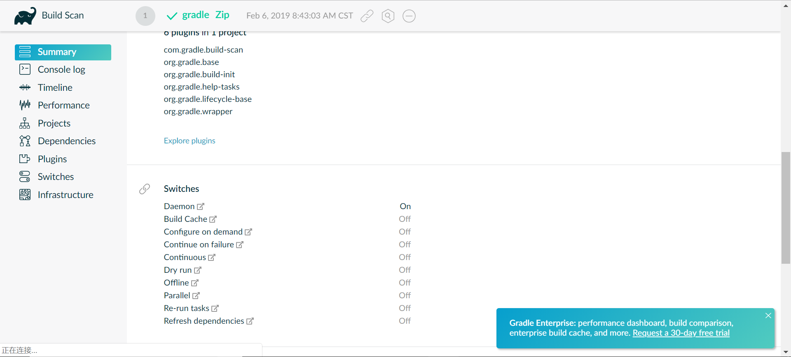

最近想深入的学习一下工程化方面相关的东西，在maven和gradle直接纠结不已，因为maven的扩展性太差劲了，学习成本颇高，所以最后投入了gradle的怀抱中，以后有时间再重新学习一下maven吧

最近的学习笔记是基于gradle 5 系列，其中各种教程和例子大都是来源于官方文档或者网络上的博客。内容涵盖我在学习gradle过程中的各种心得和gradle的一些使用方法

注意: 这里使用的配偶语言世kotlin 而不是使用groovy

# gradle创建项目

一个命令 

```shell
gradle init
```

用户可以通过这个命令创建一个基本的gradle项目包括gradle项目的目录结构

```shell
├── build.gradle (1)
├── gradle
│   └── wrapper
│       ├── gradle-wrapper.jar (2)
│       └── gradle-wrapper.properties (3)
├── gradlew (4)
├── gradlew.bat (5)  
└── settings.gradle (6)  
```

- (1) gradle 的构建脚本用来构建当前的gradle项目,最核心的配置文件
- (2) (3) 一个gradle副本和配置文件，用来当如果系统中的gradle版本和项目使用的gradle版本不同，将会在这里下载一个项目中的版本
- (4) (5) 配套使用的命令行工具 没有.bat后缀的是unix系统命令有的是windowns系统，可以用来执行gradle中定义的各种task 任务
- (6) 用于配置Gradle构建的Gradle设置脚本 

# gradle的task

gradle 方便用户进行配置的特性是源于gradle提供了方便使用task参数
这里编写一个很基本的copy文件的权限，在路径中添加一个src文件夹和dest文件夹，在src文件中添加一个文件markfile.txt 并且里面有一个内容hello world！

然后在build.gradle 中编写一个任务

```groovy
task copy(type:Copy,group:"custom",description:"test one"){
    from "src"
    into "dest"
}
```

其中的type 字段将会调用系统中的Copy函数，而group和description 只是描述这个过程的描述符，只会影响系统的log输出，并不会影响实际的效果

```groovy
./gradlew Copy
```

运行对应的命令就能运行对应的copy方法

# 使用一个gradle内部的插件系统

在项目中使用插件标签plugins添加指定的base插件到系统中

```groovy
plugins {
    id "base"
}
```

然后在指定的位置我们添加一个插件(和任务的使用方法相同，我怀疑其实gradle的插件就是打包好的任务)

```groovy
task zip(type: Zip, group: "Archive", description: "Archives sources in a zip file") {
    from "src"
    setArchiveName "basic-demo-1.0.zip"
}
```

然后运行对应的命令,就可以在对应的目录 build/distributions 中找到 src目录下的压缩文件了

```groovy
./gradlew Zip
```

# 查看当前拥有的task

gradle 有一个内置的命令

```groovy
./gradlew task
```

这条命令将会将所有的当前的gradle项目中拥有的构建命令全部列出来

```groovy
> Task :tasks

------------------------------------------------------------
Tasks runnable from root project
------------------------------------------------------------

Archive tasks
-------------
zip - Archives sources in a zip file

Build tasks
-----------
assemble - Assembles the outputs of this project.
build - Assembles and tests this project.
clean - Deletes the build directory.

Build Setup tasks
-----------------
init - Initializes a new Gradle build.
wrapper - Generates Gradle wrapper files.

Custom tasks
------------
copy - Copies sources to the dest directory

Help tasks
----------
buildEnvironment - Displays all buildscript dependencies declared in root project 'gradle'.
components - Displays the components produced by root project 'gradle'. [incubating]
dependencies - Displays all dependencies declared in root project 'gradle'.
dependencyInsight - Displays the insight into a specific dependency in root project 'gradle'.
dependentComponents - Displays the dependent components of components in root project 'gradle'. [incubating]
help - Displays a help message.
model - Displays the configuration model of root project 'gradle'. [incubating]
projects - Displays the sub-projects of root project 'gradle'.
properties - Displays the properties of root project 'gradle'.
tasks - Displays the tasks runnable from root project 'gradle'.

Verification tasks
------------------
check - Runs all checks.

Rules
-----
Pattern: clean<TaskName>: Cleans the output files of a task.
Pattern: build<ConfigurationName>: Assembles the artifacts of a configuration.
Pattern: upload<ConfigurationName>: Assembles and uploads the artifacts belonging to a configuration.

To see all tasks and more detail, run gradlew tasks --all

To see more detail about a task, run gradlew help --task <task>

BUILD SUCCESSFUL in 1s
1 actionable task: 1 executed
<-------------> 0% WAITING
> IDLE
```

# gradle 提供的在线查看构建详情的方法 --scan命令

我们在使用构建命令的时候可以在命令的后面添加一个 --scan命令,通过这个命令可以链接到gradle官方的view显示仓库或者连接到自定义的链接仓库中,然后轻松的查看项目使用的构建任务,构建时间等等信息

```
./gradlew Zip --scan
```

然后可以登入命令行打出的一个网址,在其中的form表单中填写邮箱地址,然后就会将构建的信息发送到邮箱中了



> 注意:这个功能是收费的


# gradle 展示当前系统的可用参数信息 properties命令

```
$ ./gradlew properties
> Task :properties

------------------------------------------------------------
Root project
------------------------------------------------------------

buildDir: /Users/.../basic-demo/build
buildFile: /Users/.../basic-demo/build.gradle
description: null
group:
name: basic-demo
projectDir: /Users/.../basic-demo
version: unspecified

BUILD SUCCESSFUL
```
