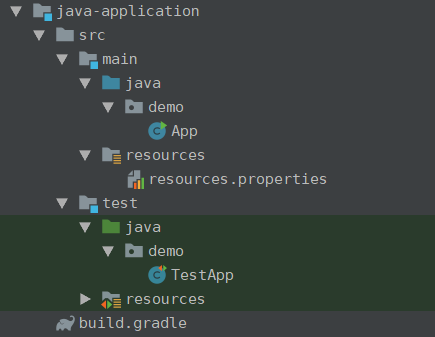

gradle 初步的学习已经进行到这里了,越来越觉得gradle设计的非常巧妙,并且idea对gradle的支持也是非常到位的

在我们深入理解gradle体系的时候,一定要贯彻一个gradle的设计哲学,一切皆task

# gradle生成可执行的application - gradle 的 application 插件

gradle 想要生成一个可执行的任务是非常容易的,只要在build.gradle 文件中引入application插件,并且使用mainapplication 字段指明了main函数的对象,就可以使用 gradle run 命令来执行这个main函数 (或者使用gradlew 这两个命令本质上是等价的)

```groovy
plugins {
    id 'java'
    id 'application'
}
sourceCompatibility = 1.8
mainClassName='xxx.Xxx'
repositories {
    mavenCentral()
}
```

这个是在idea中查看的,可以看出已经出现了run的task


通过gradle的task --all命令同样可以看见

```
Application tasks
-----------------
run - Runs this project as a JVM application
```

# 一个demo实例

项目的目录结构如下



首先在main方法中实现了一个简单的函数返回一个字符串

```java
public class App {

    public String getGreeting(){
        return "hello world";
    }

    public static void main(String[] args) {
        System.out.println(new App().getGreeting());
    }
}
```