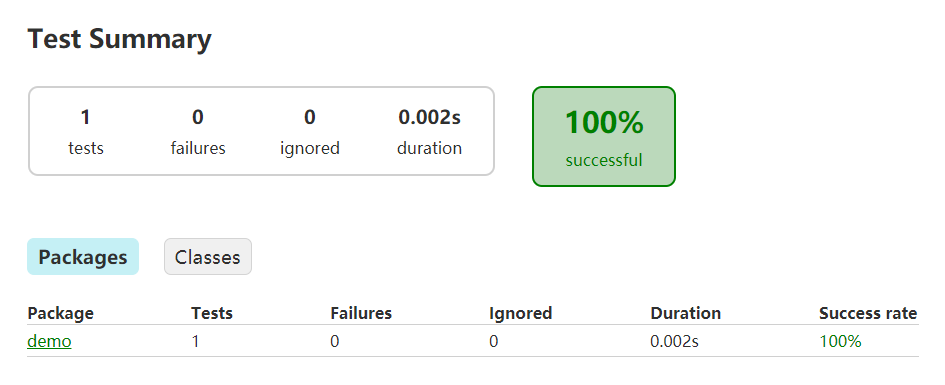

gradle 初步的学习已经进行到这里了,越来越觉得gradle设计的非常巧妙,并且idea对gradle的支持也是非常到位的

在我们深入理解gradle体系的时候,一定要贯彻一个gradle的设计哲学,一切皆task

# gradle生成可执行的application - gradle 的 application 插件

gradle 想要生成一个可执行的任务是非常容易的,只要在build.gradle 文件中引入application插件,并且使用mainapplication 字段指明了main函数的对象,就可以使用 gradle run 命令来执行这个main函数 (或者使用gradlew 这两个命令本质上是等价的)

```groovy
plugins {
    id 'java'
    id 'application'
}
sourceCompatibility = 1.8
mainClassName='xxx.Xxx'
repositories {
    mavenCentral()
}
```

这个是在idea中查看的,可以看出已经出现了run的task


通过gradle的task --all命令同样可以看见

```
Application tasks
-----------------
run - Runs this project as a JVM application
```

# 一个demo实例

项目的目录结构如下


首先在main方法中实现了一个简单的函数返回一个字符串

```java
public class App {

    public String getGreeting(){
        return "hello world";
    }

    public static void main(String[] args) {
        System.out.println(new App().getGreeting());
    }
}
```

并且编写了一个test样例 TestApp

```java
public class TestApp {
    @Test
    public void testAppHasAGreeting(){
        App classItem = new App();
        assertNotNull("app should have a greeting" , classItem.getGreeting());
    }
}
```

整个项目的build.gradle如下

```groovy
plugins {
    id 'java'
    id 'application'
}
group 'com.kyssion'
version '1.0-SNAPSHOT'
sourceCompatibility = 1.8
mainClassName='demo.App'
repositories {
    mavenCentral()
}
dependencies {
    implementation 'com.google.guava:guava:26.0-jre'
    testImplementation 'junit:junit:4.12'
}
```

这里我们引入了application插件,通过这个插件,我们就能在项目中使用gradle 对应的命令来执行我们自己的main方法了

> 执行 gradle run

```
> Task :java-application:compileJava UP-TO-DATE
> Task :java-application:processResources UP-TO-DATE
> Task :java-application:classes UP-TO-DATE

> Task :java-application:run
hello world

BUILD SUCCESSFUL in 0s
3 actionable tasks: 1 executed, 2 up-to-date
10:53:30: Task execution finished 'run'.
```

可以看见这里其实运行了对应的函数输出了hello world

> 引申 一下把,看一下这里的测试,当运行了gradle 的build命令的时候,同样会执行测试样例,并且在build的reports文件夹中生成对应的测试报告html

