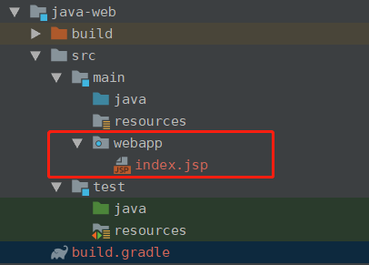
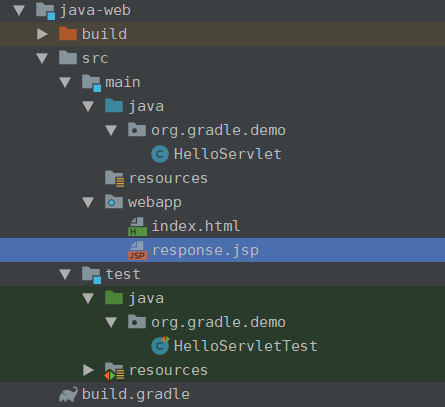

gradle 通过自带的war插件可以编程生成web包项目,并且社区提供了gretty这个插件,通过这个插件,我们可以不必人工的采用手动打war包部署到web容器中来运行web项目,而是直接编译成class文件在项目中运行容器和web项目

# gradle web 项目目录解析

其实本质上gradle 的web 项目相比较war 项目的一个本质上的区别就是在main 目录下多了一个webapp 文件夹,这个是默认存放javaweb 相关信息的文件夹



# 一个简单的web项目

1. web项目的build.gradle

```groovy
plugins {
    id 'war'
    id 'org.gretty' version '2.2.0'
}

group 'com.kyssion'
version '1.0-SNAPSHOT'

sourceCompatibility = 1.8

repositories {
    mavenCentral()
    jcenter()
}
gretty {
    integrationTestTask = 'test'
}
dependencies {
    providedCompile 'javax.servlet:javax.servlet-api:3.1.0'
    testCompile group: 'junit', name: 'junit', version: '4.12'
    testCompile 'org.mockito:mockito-core:2.7.19'
}
```

> 注意这里,gradle的war 包体添加了一个新的依赖选项,proovidedCompile和providedRuntime 分别和java 构建的compile和runtime相同,只不过打包的时候不会将这个应用打进对应的包中

> 这里引用了java的mockito自动测试框架,相比较junit更具有流程化的特点

2. servlet

```java
package org.gradle.demo;

import java.io.IOException;
import javax.servlet.ServletException;
import javax.servlet.annotation.WebServlet;
import javax.servlet.http.HttpServlet;
import javax.servlet.http.HttpServletRequest;
import javax.servlet.http.HttpServletResponse;

@WebServlet(name = "HelloServlet", urlPatterns = {"hello"}, loadOnStartup = 1)
public class HelloServlet extends HttpServlet {
    protected void doGet(HttpServletRequest request, HttpServletResponse response)
            throws ServletException, IOException {
        response.getWriter().print("Hello, World!");
    }

    protected void doPost(HttpServletRequest request, HttpServletResponse response)
            throws ServletException, IOException {
        String name = request.getParameter("name");
        if (name == null) name = "World";
        request.setAttribute("user", name);
        request.getRequestDispatcher("response.jsp").forward(request, response);
    }
}
```
3. 测试servlet

```java
package org.gradle.demo;

import org.junit.Before;
import org.junit.Test;
import org.mockito.Mock;
import org.mockito.MockitoAnnotations;

import javax.servlet.RequestDispatcher;
import javax.servlet.http.HttpServletRequest;
import javax.servlet.http.HttpServletResponse;
import java.io.PrintWriter;
import java.io.StringWriter;

import static org.junit.Assert.assertEquals;
import static org.mockito.Mockito.*;

public class HelloServletTest {
    @Mock
    private HttpServletRequest request;
    @Mock
    private HttpServletResponse response;
    @Mock
    private RequestDispatcher requestDispatcher;

    @Before
    public void setUp() throws Exception {
        MockitoAnnotations.initMocks(this);
    }

    @Test
    public void doGet() throws Exception {
        StringWriter stringWriter = new StringWriter();
        PrintWriter printWriter = new PrintWriter(stringWriter);

        when(response.getWriter()).thenReturn(printWriter);

        new HelloServlet().doGet(request, response);

        assertEquals("Hello, World!", stringWriter.toString());
    }

    @Test
    public void doPostWithoutName() throws Exception {
        when(request.getRequestDispatcher("response.jsp"))
                .thenReturn(requestDispatcher);

        new HelloServlet().doPost(request, response);

        verify(request).setAttribute("user", "World");
        verify(requestDispatcher).forward(request, response);
    }

    @Test
    public void doPostWithName() throws Exception {
        when(request.getParameter("name")).thenReturn("Dolly");
        when(request.getRequestDispatcher("response.jsp"))
                .thenReturn(requestDispatcher);

        new HelloServlet().doPost(request, response);

        verify(request).setAttribute("user", "Dolly");
        verify(requestDispatcher).forward(request, response);
    }
}
```

4. jsp和index.html 文件

```html
<html>
<head>
    <title>Web Demo</title>
</head>
<body>
<p>Say <a href="hello">Hello</a></p>

<form method="post" action="hello">
    <h2>Name:</h2>
    <input type="text" id="say-hello-text-input" name="name" />
    <input type="submit" id="say-hello-button" value="Say Hello" />
</form>
</body>
</html>
```

```jsp
<%@ page contentType="text/html;charset=UTF-8" language="java" %>
<html>
<head>
  <title>Hello Page</title>
</head>
<body>
<h2>Hello, ${user}!</h2>
</body>
</html>

```

5. 项目的整体结构



# 项目的运行方法

gradle的gretty插件提供了大量的task供我们选择,这里我们运行只是使用appRun Task就行了

> 注意:gretty 的仓库必须使用jcenter()而不能使用mavenCentral(),因为其中的一些依赖包在maven中不存在,我在使用的时候是两个都连

这里我们运行一下gradle appRun --console=plain

> 引申:--console=plain gradle5 将一些控制台输出合并了,这里使用这个参数可以将合并的信息展开显示

```
$ gradle appRun --console=plain
> Task :java-web:prepareInplaceWebAppFolder UP-TO-DATE
> Task :java-web:createInplaceWebAppFolder UP-TO-DATE
> Task :java-web:compileJava UP-TO-DATE
> Task :java-web:processResources NO-SOURCE
> Task :java-web:classes UP-TO-DATE
> Task :java-web:prepareInplaceWebAppClasses UP-TO-DATE
> Task :java-web:prepareInplaceWebApp UP-TO-DATE
12:57:59 INFO  Jetty 9.2.24.v20180105 started and listening on port 8080
12:57:59 INFO  java-web runs at:
12:57:59 INFO    http://localhost:8080/java-web

> Task :java-web:appRun
Press any key to stop the server.
```

我们发现gretty启动了一个jetty服务监听8080打开对应的地址就能显示对应的信息了