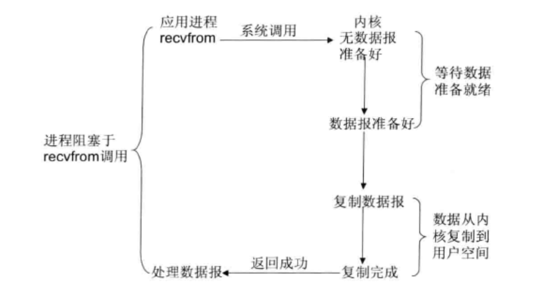
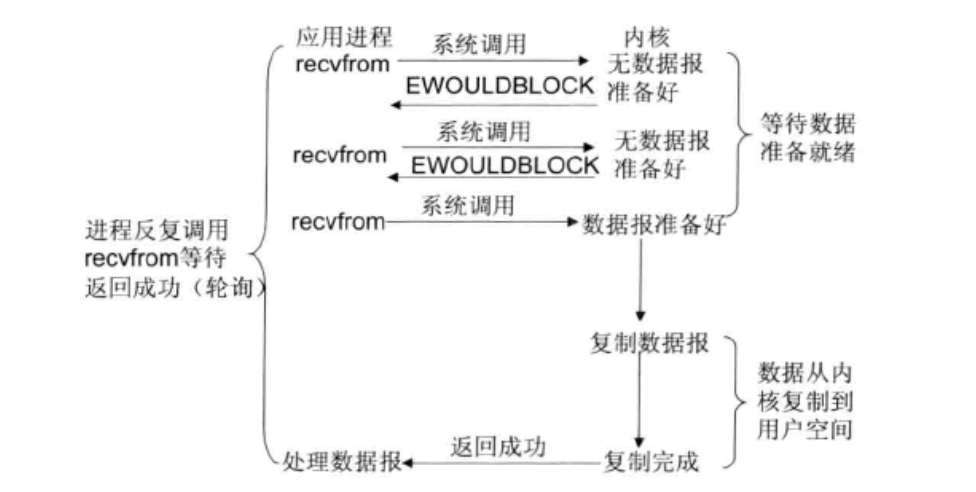
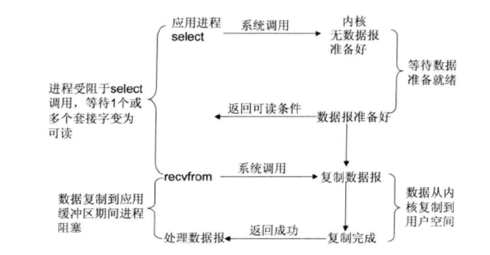
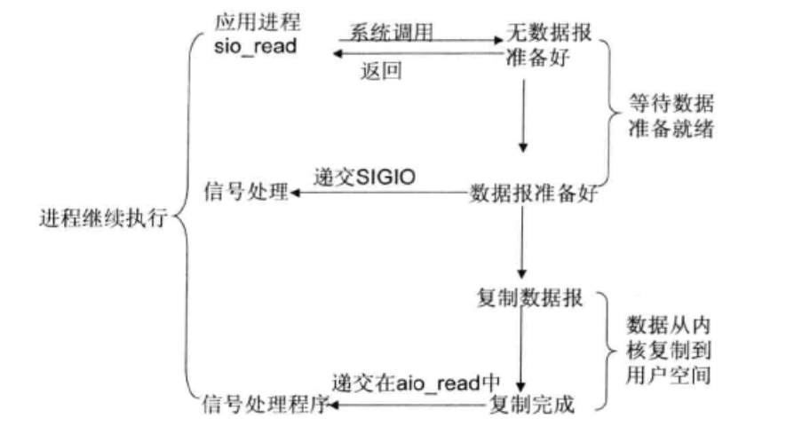

### java nio支持的背后unix系统的五种IO模型

(1) 阻塞I/O模型

非常好理解最简单的IO模型

(2) 非阻塞I/O模型

其实本质上就是轮训来查找是否有可以进行读取的资源

(3) I/O复用模型

这个是select/poll,linux 的epoll是进化版,基于事件驱动模型性能更好

(4) 信号驱动I/O模型

(5) 异步I/O模型

这个就是AIO 全信号驱动模型

### java 集中io模型样例

#### BIO 模型

java 的同步阻塞模型是一对一的线程模型最大的缺点就是缺少弹性,单用户量增加的时候,系统的线程数出于一种线性的增加状态中

