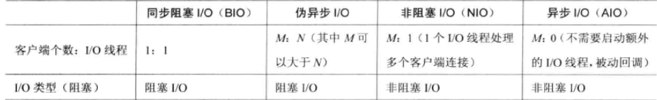
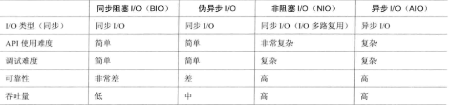

### java nio支持的背后unix系统的五种IO模型

(1) 阻塞I/O模型

非常好理解最简单的IO模型


(2) 非阻塞I/O模型

其实本质上就是轮训来查找是否有可以进行读取的资源


(3) I/O复用模型

这个是select/poll,linux 的epoll是进化版,基于事件驱动模型性能更好


(4) 信号驱动I/O模型


(5) 异步I/O模型

这个就是AIO 全信号驱动模型


### java 几种io的对比





### java 集中io模型样例

#### BIO 模型

java 的同步阻塞模型是一对一的线程模型最大的缺点就是缺少弹性,单用户量增加的时候,系统的线程数出于一种线性的增加状态中


> 服务端

```java
import java.io.BufferedReader;
import java.io.IOException;
import java.io.InputStreamReader;
import java.io.PrintWriter;
import java.net.Socket;
public class ServerWorker implements Runnable{
    private Socket socket;
    public ServerWorker(Socket socket){
        this.socket = socket;
    }
    @Override
    public void run() {
        BufferedReader reader = null;
        PrintWriter writer = null;
        try {
            reader = new BufferedReader(new InputStreamReader(socket.getInputStream()));
            writer = new PrintWriter(socket.getOutputStream());
            String question = reader.readLine();//没有内容会阻塞
            while(!question.equals("OVER")){
                String answer = getAnswer(question);
                writer.println(answer);
                question = reader.readLine();
            }
            writer.println("OVER");//OVER作为操作完成暗号
            writer.flush();
            if(writer != null){
                writer.close();
            }

            if(reader != null){
                reader.close();
            }
        } catch (IOException e) {
            e.printStackTrace();
        }
    }
    private static String getAnswer(String question){
        String answer = null;
        switch(question){
            case "who":
                answer = "我是小娜";
                break;
            case "what":
                answer = "我是来帮你解闷的";
                break;
            case "where":
                answer = "我来自外太空";
                break;
            default:
                answer = "请输入 who， 或者what， 或者where";
        }
        return answer;
    }
}
```

> 服务端使用线程池

```java
import java.util.concurrent.ArrayBlockingQueue;
import java.util.concurrent.ExecutorService;
import java.util.concurrent.ThreadPoolExecutor;
import java.util.concurrent.TimeUnit;

public class ServerHandlerExecutePool {
    private ExecutorService executorService;

    public ServerHandlerExecutePool(int maxPoolSize,int queueSize){
        executorService = new ThreadPoolExecutor(Runtime.getRuntime().availableProcessors(),maxPoolSize,
                120L, TimeUnit.SECONDS,new ArrayBlockingQueue<Runnable>(queueSize));
    }

    public void execute(Runnable task){
        executorService.execute(task);
    }
}

import com.magic.web.bio.ServerWorker;
import com.magic.web.bio.simple.BIOService;
import javax.net.ServerSocketFactory;
import java.io.IOException;
import java.net.ServerSocket;
import java.net.Socket;

public class BIOServiceWithExecute {
    public static void main(String[] args){
        BIOService bioService = new BIOService();
        ServerSocket serverSocket = null;
        Socket socket = null;
        try {
            //可以设置客户连接请求队列的长度，比如5，队列长度超过5后拒绝连接请求
            //serverSocket = ServerSocketFactory.getDefault().createServerSocket(8383, 5);
            serverSocket = ServerSocketFactory.getDefault().createServerSocket(8383);
            ServerHandlerExecutePool executePool = new ServerHandlerExecutePool(50,10000);
            while(true){
                try{
                    //监听直到接受连接后返回一个新Socket对象
                    socket = serverSocket.accept();//阻塞
                    //new一个线程处理连接请求
                    executePool.execute(new ServerWorker(socket));
                }
                catch (Throwable e) {    //防止发生异常搞死服务器
                    e.printStackTrace();
                }
            }
        } catch (IOException e) {
            e.printStackTrace();
        }
        finally{
            try {
                if(socket != null){
                    socket.close();
                }
            } catch (IOException e) {
                e.printStackTrace();
            }
        }
    }
}

```

> 客户端
```java
import java.io.BufferedReader;
import java.io.IOException;
import java.io.InputStreamReader;
import java.io.PrintWriter;
import java.net.Socket;

public class BIOClient {
    public static void main(String[] args) {
        BIOClient c = new BIOClient();
        //种20个线程发起Socket客户端连接请求
        for (int i = 0; i < 20; i++) {
            new Thread(c.new Worker()).start();
        }
    }
    private class Worker implements Runnable {
        @Override
        public void run() {
            Socket socket = null;
            BufferedReader reader = null;
            PrintWriter writer = null;
            try {
                //创建一个Socket并连接到指定的目标服务器
                socket = new Socket("localhost", 8383);
                reader = new BufferedReader(new InputStreamReader(
                        socket.getInputStream()));
                writer = new PrintWriter(socket.getOutputStream());
                //TODO 这里必须是使用的println 因为读取的时候使用的就是 readline
                writer.println("who");
                writer.println("what");
                writer.println("where");
                writer.println("OVER");//OVER作为操作完成暗号
                writer.flush();
                String answer = reader.readLine();   //没有内容会阻塞
                while (!answer.equals("OVER")) {
                    System.out.println(Thread.currentThread().getId() + "---Message from server:" + answer);
                    answer = reader.readLine();
                }
            } catch (IOException e) {
                e.printStackTrace();
            } finally {
                try {
                    if (writer != null) {
                        writer.close();
                    }

                    if (reader != null) {
                        reader.close();
                    }

                    if (socket != null) {
                        socket.close();
                    }
                } catch (IOException e) {
                    e.printStackTrace();
                }
            }
        }
    }
}
```

>　这种阻塞式网络io模型的缺点和优点

缺点: 

1. 线程占用的比较多
2. 如果处理多个请求一个请求阻塞了,会导致所有的请求都阻塞掉

#### java NIO

ps java nio比较难 , 里面有很多的点需要处理

```java 

//client
import java.io.IOException;

public class NioClient {
    public static void main(String[] args) throws IOException {
        new Thread(new ClientReactor("127.0.0.1",12345)).start();
    }
}

import java.io.IOException;
import java.net.InetAddress;
import java.net.InetSocketAddress;
import java.nio.ByteBuffer;
import java.nio.channels.SelectionKey;
import java.nio.channels.Selector;
import java.nio.channels.SocketChannel;
import java.util.Iterator;
import java.util.Set;

public class ClientReactor implements Runnable {

    private int port;
    private String host;
    private SocketChannel socketChannel;
    private Selector selector;
    private volatile boolean stop;

    public void stop() {
        this.stop = true;
    }
    public ClientReactor(String host, int port) {
        this.host = host == null ? "127.0.0.1" : host;
        this.port = port;
        try {
            selector = Selector.open();
            socketChannel = SocketChannel.open();
            socketChannel.configureBlocking(false);
        } catch (IOException e) {
            e.printStackTrace();
            System.exit(1);
        }
    }
    public void doWrite(SocketChannel socketChannel) throws IOException {
        byte[] bytes = "client send info".getBytes();
        ByteBuffer byteBuffer = ByteBuffer.allocate(bytes.length);
        byteBuffer.put(bytes);
        byteBuffer.flip();
        socketChannel.write(byteBuffer);
        if (!byteBuffer.hasRemaining()) {
            System.out.println("Send order 2 server succeed.");
        }
    }
    public void doConnect() throws IOException {
        if (this.socketChannel.connect(new InetSocketAddress(host, port))) {
            socketChannel.register(selector, SelectionKey.OP_READ);
            doWrite(socketChannel);
        } else {
            socketChannel.register(selector, SelectionKey.OP_CONNECT);
        }
    }
    public void handleInput(SelectionKey selectionKey) throws IOException {
        if (selectionKey.isValid()) {
            SocketChannel socketChannel = (SocketChannel) selectionKey.channel();
            if (selectionKey.isConnectable()) {
                if(socketChannel.finishConnect()) {
                    socketChannel.register(selector, SelectionKey.OP_READ);
                    doWrite(socketChannel);
                }else{
                    System.exit(1);
                }
            }
            if (selectionKey.isReadable()) {
                ByteBuffer byteBuffer = ByteBuffer.allocate(1024);
                int readLength = socketChannel.read(byteBuffer);
                if (readLength > 0) {
                    byteBuffer.flip();
                    byte[] bytes = new byte[byteBuffer.remaining()];
                    byteBuffer.get(bytes);
                    String body = new String(bytes,"UTF-8");
                    System.out.println(body);
                    this.stop();
                }else if (readLength<0){
                    selectionKey.cancel();
                    socketChannel.close();
                }else{
                    ;
                }
            }
        }
    }
    @Override
    public void run() {
        try {
            doConnect();
        } catch (IOException e) {
            e.printStackTrace();
            System.exit(1);
        }
        while (!stop) {
            try {
                selector.select(1000);
                Set<SelectionKey> selectionKeys = this.selector.selectedKeys();
                Iterator<SelectionKey> iterator = selectionKeys.iterator();
                SelectionKey selectionKey = null;
                while (iterator.hasNext()) {
                    selectionKey = iterator.next();
                    iterator.remove();
                    try {
                        handleInput(selectionKey);
                    } catch (Exception e) {
                        e.printStackTrace();
                        if (selectionKey != null) {
                            selectionKey.cancel();
                            if (selectionKey.channel() != null)
                                selectionKey.channel().close();
                        }
                    }
                }
            } catch (IOException e) {
                e.printStackTrace();
            }
        }
        // 多路复用器关闭后，所有注册在上面的Channel和Pipe等资源都会被自动去注册并关闭，所以不需要重复释放资源
        if (selector != null) {
            try {
                selector.close();
            } catch (IOException e) {
                e.printStackTrace();
            }
        }
    }
}
```

```java
//server
import java.io.IOException;

public class NioServer {
    public static void main(String[] args) throws IOException {
        ServerReactor serverReactor = new ServerReactor(12345);
        new Thread(serverReactor,"nio_server").start();
    }
}
import java.io.IOException;
import java.net.InetAddress;
import java.net.InetSocketAddress;
import java.nio.ByteBuffer;
import java.nio.channels.SelectionKey;
import java.nio.channels.Selector;
import java.nio.channels.ServerSocketChannel;
import java.nio.channels.SocketChannel;
import java.util.Date;
import java.util.Iterator;
import java.util.Set;

public class ServerReactor implements Runnable {

    private Selector selector;
    private ServerSocketChannel serverSocketChannel;
    private volatile boolean stop;

    public ServerReactor(int port) throws IOException {
        //创建reactor线程创建多路复用器
        selector = Selector.open();
        //用于监听客户端管道是所有管道的父管道
        serverSocketChannel = ServerSocketChannel.open();
        //设置为非阻塞模式
        serverSocketChannel.configureBlocking(false);
        //绑定端口
        serverSocketChannel.socket().bind(new InetSocketAddress(port),1024);
        //将channel 注册到selector上监听 ACCEPT
        SelectionKey selectionKey = serverSocketChannel.register(selector, SelectionKey.OP_ACCEPT);
        System.out.println("the server is start in port : " + port);
    }
    public void stop() {
        this.stop = true;
    }
    public void handleInput(SelectionKey key) throws IOException {
        if (key.isValid()) {
            if (key.isAcceptable()) {
                ServerSocketChannel ssc = (ServerSocketChannel) key.channel();
                SocketChannel socketChannel = ssc.accept();
                socketChannel.configureBlocking(false);
                socketChannel.register(selector, SelectionKey.OP_READ);
            }
            if (key.isReadable()) {
                SocketChannel socketChannel = (SocketChannel) key.channel();
                ByteBuffer byteBuffer = ByteBuffer.allocate(1024);
                int readByteLength = socketChannel.read(byteBuffer);
                if (readByteLength > 0) {
                    byteBuffer.flip();
                    byte[] bytes = new byte[byteBuffer.remaining()];
                    byteBuffer.get(bytes);
                    String body = new String(bytes, "UTF-8");
                    System.out.println("the time server receive order : " + body);
                    String sendInfo = "this is server you and now TIme is : " + new Date().toString();
                    doWrite(socketChannel, sendInfo);
                }else if(readByteLength<0){
                    // 对端链路关闭
                    key.cancel();
                    socketChannel.close();
                    System.out.println("close socket");
                }
            }
        }
    }
    public void doWrite(SocketChannel socketChannel, String sendInfo) throws IOException {
        if (sendInfo != null && sendInfo.trim().length() > 0) {
            byte[] bytes = sendInfo.getBytes();
            ByteBuffer writerByteBuffer = ByteBuffer.allocate(bytes.length);
            writerByteBuffer.put(bytes);
            writerByteBuffer.flip();
            socketChannel.write(writerByteBuffer);
        }
    }
    @Override
    public void run() {
        //
        while (!stop) {
            try {
                //设置每秒进行一次查找就绪状态的通道
                selector.select(1000);
                Set<SelectionKey> keys = selector.selectedKeys();
                Iterator<SelectionKey> iterable = keys.iterator();
                SelectionKey selectionKey = null;
                while (iterable.hasNext()) {
                    selectionKey = iterable.next();
                    iterable.remove();
                    try {
                        handleInput(selectionKey);
                    }catch (IOException e){
                        selectionKey.cancel();
                        if(selectionKey.channel() != null){
                            selectionKey.channel().close();
                        }
                        System.out.println("远程连接异常进行关闭");
                    }

                }
            } catch (IOException e) {
                e.printStackTrace();
            }
        }
        // 多路复用器关闭后，所有注册在上面的Channel和Pipe等资源都会被自动去注册并关闭，所以不需要重复释放资源
        if (selector != null) {
            try {
                selector.close();
            } catch (IOException e) {
                e.printStackTrace();
            }
        }
    }
}
```