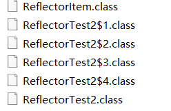

## java针对泛型类型的实现方法,和反射之间的应用

java的泛型实现因为考虑到兼容型的问题,所以一开始采用了类型擦除的机制实现相关的功能.

但是这种类型擦除的机制又带来了一个新的问题,比如这样的场景

```java
public class ReflectorTest2 {
    public static void main(String[] args) throws NoSuchFieldException {
        ReflectorItem<String> reflectorItem =new ReflectorItem<>();
        Class<ReflectorItem<String>> reflectorItemClass = (Class<ReflectorItem<String>>) reflectorItem.getClass();
        Field f = reflectorItemClass.getDeclaredField("item");
        System.out.println(f.getType().getName());
    }
}
class ReflectorItem<T> {
    T item;
    public T getItem() {
        return item;
    }
    public void setItem(T item) {
        this.item = item;
    }
}
```

因为T会在java运行的时候进行擦除,所以这里输出的内容是Object

```shell
java.lang.Object
```

如果想要获取这个参数的类型,我们只能在泛型类的内部获取到

```java
public class ReflectorTest2 {
    public static void main(String[] args) throws NoSuchFieldException {
        ReflectorItem<String> reflectorItem =new ReflectorItem<>("sdf"){};
        reflectorItem.setItem("restset");
    }
}
class  ReflectorItem<T> {
    Type _type;
    ReflectorItem(T s){
        Type superClass = getClass().getGenericSuperclass();
        if (superClass instanceof Class<?>) { // sanity check, should never happen
            throw new IllegalArgumentException("Internal error: TypeReference constructed without actual type information");
        }
        _type = ((ParameterizedType) superClass).getActualTypeArguments()[0];
        TypeVariable<? extends Class<?>>[] typeParameters =s.getClass().getTypeParameters();
    }
    T item;
    public T getItem() {
        return item;
    }
    public void setItem(T item) {
        this.item = item;
    }
}
```

为什么会这样的呢,这里没有得到权威的答案,但是按照我的猜想,应该是这样的过程

我们看一下java生成的class文件,发现上面这个类其实生成了三个类


第一个 和最后一个就不用多说了,重点关心一下中间这个,反编译看看

```java
class ReflectorTest2$1 extends ReflectorItem<String> {
    ReflectorTest2$1(String s) {
        super(s);
    }
}
```

看到这里差不多来了就能知道java虚拟机底层是怎么处理这里的了

我们将代码修改一下变成这样

```java
public class ReflectorTest2 {
    public static void main(String[] args) throws NoSuchFieldException {
        ReflectorItem<String> reflectorItem =new ReflectorItem<>("sdf"){};
        ReflectorItem<String> reflectorItem2 =new ReflectorItem<>("sdf"){};
        ReflectorItem<String> reflectorItem3 =new ReflectorItem<>("sdf"){};
        ReflectorItem<String> reflectorItem4 =new ReflectorItem<>("sdf"){};
        reflectorItem.setItem("restset");
    }
}
```

再看看生成的class文件信息



上面的代码中生成了4个泛型匿名内部类类,然后在java的class 文件中同样生成了四个 类名+$+编号的 动态生成class

>ps 这个机制其实是java实现匿名内部类的原理,jdk自己new了一个新的对象来实现类的生成

这样就是为什么在使用的时候能获取到类型的原因,和获取泛型类型的方法是Type superClass = getClass().getGenericSuperclass();使用的是supper 类.

因为java动态生成一个继承了携带泛型真实类型的class类,在运行的时候进行了类型的动态替换


## 通过上面的例子其实我们可以总结一个规律:如果泛型想要拿到参数,必须在声明类的时候就将泛型对应的参数传递进入

通过这种例子我们就可以在声明的时候大快人心的使用泛型了

```java
class Item<T>{}

class Itemchildren extends Item<String>{
    private Class<T> entityClass; //这里将会获取到entityClass中的值
    public Itemchildren() {
        entityClass =(Class<T>) ((ParameterizedType) getClass()
                       .getGenericSuperclass()).getActualTypeArguments()[0];
    }
    public T get(Serializable id) {
        //拿到了参数内部强制转化
        return entityClass.case(new Object);
    }
}
```

当然我们亦可以参考开篇的分析使用匿名内部类来让jvm自动的时候这个过程,但是不推荐这样使用,因为这个时候java已经退化成一个动态语言了,jvm无法进行优化