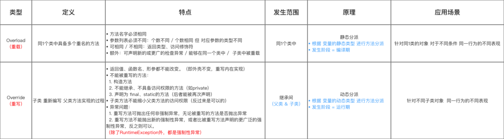

今天在进行 java 反射库的封装过程中,发现了一个问题,之前对java重载和重写的机制认识并不是很深入.这里决定深入的整理一下

## 重载

- 定义
  - 一个类中具有多个重名的方法,如果父子类满足条件也能构成重载方法
- 特点
  - 1. 方法名称相同
  - 2. 参数列表不许不同
    - 个数不同
    - 个数相同但是类型不同(包不包括父子关系)
    - 返回值,访问修饰符号可以相同也可以不相同

注意:这一点没有考虑到如果是继承关系,两个看似重载的父子关系是否实际上构成重载关系

## 重写
- 定义
  - 子类重写父类的一个方法
- 特点
  - 1. 子类继承父类
  - 2. 返回值名称参数不能改变(子类的参数,返回值可以是父类对应的参数的子类)
- 限制(不能进行重写的方法)
  - 1. private修饰的方法
  - 2. 构造函数
  - 3. final,static 方法(static 将会被再次声明)
  - 4. 重写方法不能缩小父方法的权限
  - 5. 重写方法不能抛出任何新的强制性异常或者比父类方法范围广的强制性异常(补充出列RuntimeException之外都是强制异常)

## 重载和重写的对比

