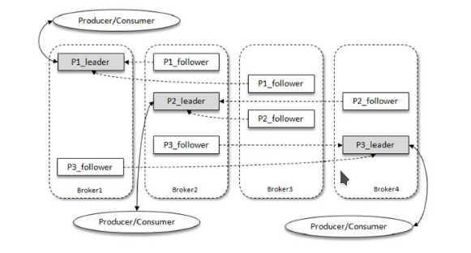
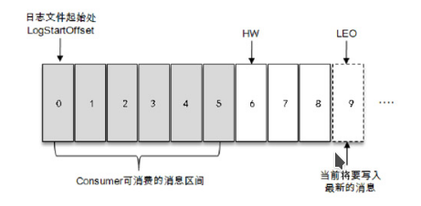

# kafka 基本概念

1. Producer：生产者，也就是发送消息的一方。生产者负责创建消息，然后将其投递到Kafka中
2. Consumer：消费者，也就是接收消息的一方。消费者连接到Kafka上并接收消息，进而进行相应的业务逻辑处理。
3. Broker：服务代理节点。对于Kafka而言，Broker可以简单地看作一个独立的Kafka服务节点或Kafka服务实例。大多数情况下也可以将Broker看作一台Kafka服务器，前提是这台服务器上只部署了一个Kafka实例。一个或多个Broker组成了一个Kafka集群。一般而言，我们更习惯使用首字母小写的broker来表示服务代理节点。
4. Topic: 服务主题 ， Kafka中的消息以主题为单位进行归类，生产者负责将消息发送到特定的主题（发送到Kafka集群中的每一条消息都要指定一个主题），而消费者负责订阅主题并进行消费。
5. Partition：一个topic中的主题可能会有多个分区 ， 并且不同的分区可能并不会在同一个broker中，同一主题下的不同分区包含的消息是不同的，分区在存储层面可以看作一个可追加的日志（Log）文件，消息在被追加到分区日志文件的时候都会分配一个特定的偏移量（offset）。offset是消息在分区中的唯一标识，Kafka通过它来保证消息在分区内的顺序性，不过offset并不跨越分区，也就是说，Kafka保证的是分区有序而不是主题有序。
6. Replica和leader&follow副本：kafka针对分区有多副本机制实现高可用，并且保证副本存放在不同的broker中

注意点：
1. kafka消费者使用pull模式拉取 ？长轮询？
2. 


## kafka 容灾多副本系统架构



> 名词概念

1. AR（Assigned Replicas） ： kafka副本系统统称
2. ISR（In-Sync Replicas）： 与leader副本保持同步的副本
3. OSR（Out-of-Sync Replicas）

leader副本负责维护和跟踪ISR和OSR集合的follower副本的滞后状态，当follower副本落后太多或失效时，leader副本会把它从ISR集合中剔除。如果OSR集合中有follower副本“追上”了leader副本，那么leader副本会把它从OSR集合转移至ISR集合

默认情况下，当leader副本发生故障时，只有在ISR集合中的副本才有资格被选举为新的leader，而在OSR集合中的副本则没有任何机会（不过这个原则也可以通过修改相应的参数配置来改变）

4. LEO ： LEO是Log End Offset的缩写，它标识当前日志文件中下一条待写入消息的offset
5. HW ： HW是High Watermark的缩写，俗称高水位，它标识了一个特定的消息偏移量（offset），消费者只能拉取到这个offset之前的消息。



注意： LEO和HW 都描述的是下一个能插入或者能读入的位置，而不是当前位置

LEO位置的确定方法是每一个副本当前能插入的下一个问题，HW的位置是leader通过同步当前所有副本中最小的LEO来决定HW

# kafka producer

## 发送消息三种主要模式

发后即忘（fire-and-forget）、同步（sync）及异步（async）


1. fire-and0forget：发后即忘，它只管往Kafka中发送消息而并不关心消息是否正确到达
2. sync：使用send方法 阻塞等待Kafka的响应 ,返回一个Future类，直到消息发送成功，或者发生异常。如果发生异常，那么就需要捕获异常并交由外层逻辑处理
3. async:一般是在send（）方法里指定一个Callback的回调函数，Kafka在返回响应时调用该函数来实现异步的发送确认

> 注意： 使用producer之后要调用close方法来关闭请求

## kafka producer异常

KafkaProducer中一般会发生两种类型的异常：可重试的异常和不可重试的异常。
常见的可重试异常有：NetworkException、LeaderNotAvailableException、UnknownTopicOrPartitionException、NotEnoughReplicasException、NotCoordinatorException 等。比如NetworkException 表示网络异常，这个有可能是由于网络瞬时故障而导致的异常，可以通过重试解决；又比如LeaderNotAvailableException表示分区的leader副本不可用，这个异常通常发生在leader副本下线而新的 leader 副本选举完成之前，重试之后可以重新恢复。

不可重试的异常，比如RecordTooLargeException异常，暗示了所发送的消息太大，KafkaProducer对此不会进行任何重试，直接抛出异常。

对于可重试的异常，如果配置了 retries 参数，那么只要在规定的重试次数内自行恢复了，就不会抛出异常。retries参数的默认值为0，配置方式参考如下：

```java
props.put(ProductConfig.RESERVES_CONFIG,10);
```

示例中配置了10次重试。如果重试了10次之后还没有恢复，那么仍会抛出异常，进而发送的外层逻辑就要处理这些异常了

