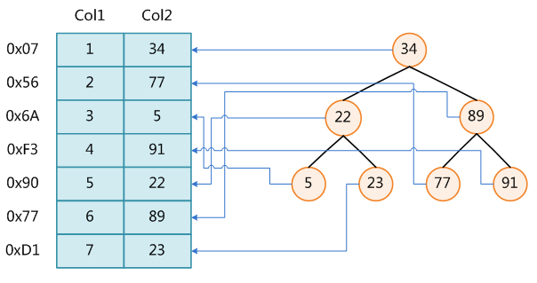

### mysql数据库常见问题总结

#### 主键 超键 候选键 外键

- 主 键：数据库表中对储存数据对象予以唯一和完整标识的数据列或属性的组合。一个数据列只能有一个主键，且主键的取值不能缺失，即不能为空值（Null）。
- 超 键：在关系中能唯一标识元组的属性集称为关系模式的超键。一个属性可以为作为一个超键，多个属性组合在一起也可以作为一个超键。超键包含候选键和主键。
- 候选键：是最小超键，即没有冗余元素的超键。
- 外 键：在一个表中存在的另一个表的主键称此表的外键。

#### 数据库事务的四个特性及含义

数据库事务transanction正确执行的四个基本要素。ACID,原子性(Atomicity)、一致性(Correspondence)、隔离性(Isolation)、持久性(Durability)。

- 原子性:整个事务中的所有操作，要么全部完成，要么全部不完成，不可能停滞在中间某个环节。事务在执行过程中发生错误，会被回滚（Rollback）到事务开始前的状态，就像这个事务从来没有执行过一样。
- 一致性:在事务开始之前和事务结束以后，数据库的完整性约束没有被破坏。
- 隔离性:隔离状态执行事务，使它们好像是系统在给定时间内执行的唯一操作。如果有两个事务，运行在相同的时间内，执行 相同的功能，事务的隔离性将确保每一事务在系统中认为只有该事务在使用系统。这种属性有时称为串行化，为了防止事务操作间的混淆，必须串行化或序列化请 求，使得在同一时间仅有一个请求用于同一数据。
- 持久性:在事务完成以后，该事务所对数据库所作的更改便持久的保存在数据库之中，并不会被回滚。

#### 视图的作用，视图可以更改么？

视图是虚拟的表，与包含数据的表不一样，视图只包含使用时动态检索数据的查询；不包含任何列或数据。使用视图可以简化复杂的sql操作，隐藏具体的细节，保护数据；视图创建后，可以使用与表相同的方式利用它们。

视图不能被索引，也不能有关联的触发器或默认值，如果视图本身内有order by 则对视图再次order by将被覆盖。

> 创建视图 sql 语句

```sql
create view XXX as XXXXXXXXXXXXXX;
```

对于某些视图比如未使用联结子查询分组聚集函数Distinct Union等，是可以对其更新的，对视图的更新将对基表进行更新；但是视图主要用于简化检索，保护数据，并不用于更新，而且大部分视图都不可以更新。

#### 索引的工作原理及其种类

数据库索引，是数据库管理系统中一个排序的数据结构，以协助快速查询、更新数据库表中数据。索引的实现通常使用B树及其变种B+树。
在数据之外，数据库系统还维护着满足特定查找算法的数据结构，这些数据结构以某种方式引用（指向）数据，这样就可以在这些数据结构上实现高级查找算法。这种数据结构，就是索引。
为表设置索引要付出代价的：一是增加了数据库的存储空间，二是在插入和修改数据时要花费较多的时间(因为索引也要随之变动)。



图展示了一种可能的索引方式。左边是数据表，一共有两列七条记录，最左边的是数据记录的物理地址（注意逻辑上相邻的记录在磁盘上也并不是一定物理相邻的）。为了加快Col2的查找，可以维护一个右边所示的二叉查找树，每个节点分别包含索引键值和一个指向对应数据记录物理地址的指针，这样就可以运用二叉查找在O(log2n)的复杂度内获取到相应数据。

> 索引的优势、劣势、和最佳应用场景

索引是建立在数据库表中的某些列的上面。在创建索引的时候，应该考虑在哪些列上可以创建索引，在哪些列上不能创建索引。

**一般来说，应该在这些列上创建索引**：

- 在经常需要搜索的列上，可以加快搜索的速度；
- 在作为主键的列上，强制该列的唯一性和组织表中数据的排列结构；
- 在经常用在连接的列上，这些列主要是一些外键，可以加快连接的速度；
- 在经常需要根据范围进行搜索的列上创建索引，因为索引已经排序，其指定的范围是连续的；
- 在经常需要排序的列上创建索引，因为索引已经排序，这样查询可以利用索引的排序，加快排序查询时间；在经常使用在WHERE子句中的列上面创建索引，加快条件的判断速度。

**对于有些列不应该创建索引。一般来说，不应该创建索引的的这些列具有下列特点:**

- 对于那些在查询中很少使用或者参考的列不应该创建索引。这是因为，既然这些列很少使用到，因此有索引或者无索引，并不能提高查询速度。相反，由于增加了索引，反而降低了系统的维护速度和增大了空间需求。
- 对于那些只有很少数据值的列也不应该增加索引。这是因为，由于这些列的取值很少，例如人事表的性别列，在查询的结果中，结果集的数据行占了表中数据行的很大比例，即需要在表中搜索的数据行的比例很大。增加索引，并不能明显加快检索速度。
- 对于那些定义为text, image和bit数据类型的列不应该增加索引。这是因为，这些列的数据量要么相当大，要么取值很少。
- 当修改性能远远大于检索性能时，不应该创建索引。这是因为，修改性能和检索性能是互相矛盾的。当增加索引时，会提高检索性能，但是会降低修改性能。当减少索引时，会提高修改性能，降低检索性能。因此，当修改性能远远大于检索性能时，不应该创建索引。

-------
> 索引的优势、劣势

**优势：** 

1. 创建索引可以大大提高系统的性能。
2. 通过创建唯一性索引，可以保证数据库表中每一行数据的唯一性。
可以大大加快数据的检索速度，这也是创建索引的最主要的原因。
3. 可以加速表和表之间的连接，特别是在实现数据的参考完整性方面特别有意义
4. 在使用分组和排序子句进行数据检索时，同样可以显著减少查询中分组和排序的时间。
5. 通过使用索引，可以在查询的过程中，使用优化隐藏器，提高系统的性能。

**劣势：**

1. 创建索引和维护索引要耗费时间，这种时间随着数据量的增加而增加。
2. 索引需要占物理空间，除了数据表占数据空间之外，每一个索引还要占一定的物理空间，如果要建立聚簇索引，那么需要的空间就会更大。
3. 当对表中的数据进行增加、删除和修改的时候，索引也要动态的维护，这样就降低了数据的维护速度。


> 根据数据库的功能，可以在数据库设计器中创建三种索引：唯一索引、主键索引和聚集索引。

- 唯一索引：唯一索引是不允许其中任何两行具有相同索引值的索引。 
- 主键索引：数据库表经常有一列或列组合，其值唯一标识表中的每一行。该列称为表的主键。 在数据库关系图中为表定义主键将自动创建主键索引，- 主键索引是唯一索引的特定类型。该索引要求主键中的每个值都唯一。当在查询中使用主键索引时，它还允许对数据的快速访问。
- 聚集索引 在聚集索引中，表中行的物理顺序与键值的逻辑（索引）顺序相同。一个表只能包含一个聚集索引。

### 链接查询种类

#### 使用外连接

外连接包括左向外联接、右向外联接或完整外部联接

> 左连接：left join 或 left outer join

左向外联接的结果集包括 LEFT OUTER 子句中指定的左表的所有行，而不仅仅是联接列所匹配的行。如果左表的某行在右表中没有匹配行，则在相关联的结果集行中右表的所有选择列表列均为空值(null)。

```sql
select * from table1 left join table2 on table1.id=table2.id
```

> 右连接：right join 或 right outer join

右向外联接是左向外联接的反向联接。将返回右表的所有行。如果右表的某行在左表中没有匹配行，则将为左表返回空值。

```sql
select * from table1 right join table2 on table1.id=table2.id
```

> 完整外部联接:full join 或 full outer join

完整外部联接返回左表和右表中的所有行。当某行在另一个表中没有匹配行时，则另一个表的选择列表列包含空值。如果表之间有匹配行，则整个结果集行包含基表的数据值。

```sql
select * from table1 full join table2 on table1.id=table2.id
```

#### 使用内链接

内联接是用比较运算符比较要联接列的值的联接

> 内连接：join 或 inner join 注意这个方法和普通的from 多表查询没什么区别，内链接可以省略on和使用where 作为约束

```sql
select * from table1 join table2 on table1.id=table2.id
等价（与下列执行效果相同）
```

```sql
A:select a.*,b.* from table1 a,table2 b where a.id=b.id
B:select * from table1 cross join table2 where table1.id=table2.id
```
#### 交叉连接(完全)

概念：没有 WHERE（或者on）子句的交叉联接将产生联接所涉及的表的笛卡尔积。第一个表的行数乘以第二个表的行数等于笛卡尔积结果集的大小。（table1和table2交叉连接产生3*3=9条记录）

```sql
select * from table1 cross join table2
等价（与下列执行效果相同）
A:select * from table1,table2
```

#### 数据库范式定义

1. 第一范式（1NF）

在任何一个关系数据库中，第一范式（1NF）是对关系模式的基本要求，不满足第一范式（1NF）的数据库就不是关系数据库。

所谓第一范式（1NF）是指数据库表的每一列都是不可分割的基本数据项，同一列中不能有多个值，即实体中的某个属性不能有多个值或者不能有重复的属性。如果出现重复的属性，就可能需要定义一个新的实体，新的实体由重复的属性构成，新实体与原实体之间为一对多关系。在第一范式（1NF）中表的每一行只包含一个实例的信息。简而言之，第一范式就是无重复的列。

2. 第二范式（2NF）

第二范式（2NF）是在第一范式（1NF）的基础上建立起来的，即满足第二范式（2NF）必须先满足第一范式（1NF）。第二范式（2NF）要求数据库表中的每个实例或行必须可以被惟一地区分。为实现区分通常需要为表加上一个列，以存储各个实例的惟一标识。这个惟一属性列被称为主关键字或主键、主码。

第二范式（2NF）要求实体的属性完全依赖于主关键字。所谓完全依赖是指不能存在仅依赖主关键字一部分的属性，如果存在，那么这个属性和主关键字的这一部分应该分离出来形成一个新的实体，新实体与原实体之间是一对多的关系。为实现区分通常需要为表加上一个列，以存储各个实例的惟一标识。简而言之，第二范式就是非主属性非部分依赖于主关键字。

3. 第三范式（3NF）

满足第三范式（3NF）必须先满足第二范式（2NF）。简而言之，第三范式（3NF）要求一个数据库表中不包含已在其它表中已包含的非主关键字信息。例如，存在一个部门信息表，其中每个部门有部门编号（dept_id）、部门名称、部门简介等信息。那么在员工信息表中列出部门编号后就不能再将部门名称、部门简介等与部门有关的信息再加入员工信息表中。如果不存在部门信息表，则根据第三范式（3NF）也应该构建它，否则就会有大量的数据冗余。简而言之，第三范式就是属性不依赖于其它非主属性。（我的理解是消除冗余）
