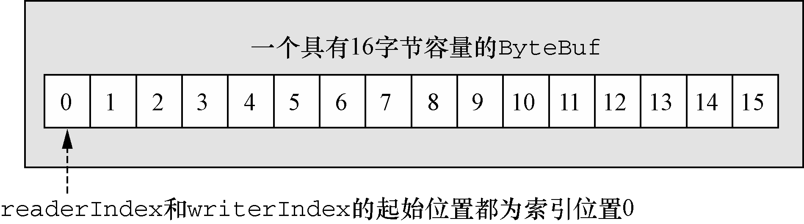
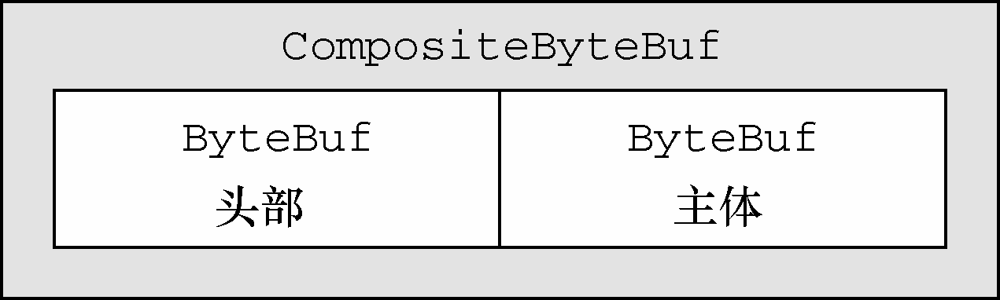

# netty byteBuf

Netty的数据处理API通过两个组件暴露——abstract class ByteBuf和interface ByteBufHolder。

下面是一些ByteBuf API的优点：

- 它可以被用户自定义的缓冲区类型扩展；
- 通过内置的复合缓冲区类型实现了透明的零拷贝；
- 容量可以按需增长（类似于JDK的StringBuilder）；
- 在读和写这两种模式之间切换不需要调用ByteBuffer的flip()方法；
- 读和写使用了不同的索引；
- 支持方法的链式调用；
- 支持引用计数；
- 支持池化。

### byteBuf 的工作方式

byteBuf拥有两个不同的索引- 记录读位置的readerIndex 和记录写位置的writerIndex



可读的位置就是 readerIndex 到writerIndex 之间的位置

可写的位置就是writerIndex 到这个缓存的结尾

注意netty在实现的时候并没有使用循环队列来优化性能 可以看一下 [distuptor框架](https://github.com/LMAX-Exchange/disruptor/?spm=5176.9876270.0.0.306be44ax9cHH6)


### byteBuf 的 三种使用模式

1. 使用堆缓冲区

最常用的ByteBuf模式是将数据存储在JVM的堆空间中。这种模式被称为支撑数组（backing array），它能在没有使用池化的情况下提供快速的分配和释放。非常适合于有遗留的数据需要处理的情况。

```java
ByteBuf heapBuf = ...;
if (heapBuf.hasArray()) {  //  检查ByteBuf 是否有一个支撑数组
　　byte[] array = heapBuf.array();  //  如果有，则获取对该数组的引用　
　　int offset = heapBuf.arrayOffset() + heapBuf.readerIndex();  //  计算第一个字节的偏移量。
　　int length = heapBuf.readableBytes();　 //  获得可读字节数
　　handleArray(array, offset, length);　 //  使用数组、偏移量和长度作为参数调用你的方法
}
```

2. 直接缓冲区

直接缓冲区是另外一种ByteBuf模式。我们期望用于对象创建的内存分配永远都来自于堆中，但这并不是必需的——NIO在JDK 1.4中引入的ByteBuffer类允许JVM实现通过本地调用来分配内存。这主要是为了避免在每次调用本地I/O操作之前（或者之后）将缓冲区的内容复制到一个中间缓冲区（或者从中间缓冲区把内容复制到缓冲区）。

直接缓冲区的主要缺点是，相对于基于堆的缓冲区，它们的分配和释放都较为昂贵。如果处理遗留的数据将必须将数据从直接缓冲区赋值到堆空间中

```java
ByteBuf directBuf = ...; 
if (!directBuf.hasArray()) {  // 检查ByteBuf 是否由数组支撑。如果不是，则这是一个直接缓冲区
　　int length = directBuf.readableBytes();  // 获取可读字节数
　　byte[] array = new byte[length];　 // 分配一个新的数组来保存具有该长度的字节数据　　
　　directBuf.getBytes(directBuf.readerIndex(), array);  // 将字节复制到该数组
　　handleArray(array, 0, length);  // 使用数组、偏移量和长度作为参数调用你的方法
}
```

3. 复合缓冲区

举例说明，让我们考虑一下一个由两部分——头部和主体——组成的将通过HTTP协议传输的消息。这两部分由应用程序的不同模块产生，将会在消息被发送的时候组装。该应用程序可以选择为多个消息重用相同的消息主体。当这种情况发生时，对于每个消息都将会创建一个新的头部。

因为我们不想为每个消息都重新分配这两个缓冲区，所以使用CompositeByteBuf是一个完美的选择。它在消除了没必要的复制的同时，暴露了通用的ByteBuf API



### bytebuffer分配方式

1. ByteBufAllocator接口的实现类实现分配

|名　　称|描　　述|
|---|---|
|buffer()|返回一个基于堆或者直接内存存储的ByteBuf|
|buffer(intinitialCapacity);||
|buffer(intinitialCapacity,intmaxCapacity);||
|heapBuffer()|返回一个基于堆内存存储的ByteBuf|
|heapBuffer(intinitialCapacity)||
|heapBuffer(intinitialCapacity,intmaxCapacity)||
|directBuffer()|返回一个基于直接内存存储的ByteBuf|
|directBuffer(intinitialCapacity)||
|directBuffer(intinitialCapacity,intmaxCapacity)||
|compositeBuffer()|返回一个可以通过添加最大到指定数目的基于堆的或者直接内存存储的缓冲区来扩展的CompositeByteBuf|
|compositeBuffer(intmaxNumComponents)||
|compositeDirectBuffer()||
|compositeDirectBuffer(intmaxNumComponents);||
|compositeHeapBuffer()||
|compositeHeapBuffer(intmaxNumComponents);||
|ioBuffer()[8]|返回一个用于套接字的I/O操作的ByteBuf|

获取方法 通过channel 或者绑定到ChannelHandler的ChannelHandlerContext

```java
Channel channel = ...;
ByteBufAllocator allocator = channel.alloc();  // 从Channel 获取一个到ByteBufAllocator 的引用
....
ChannelHandlerContext ctx = ...;
ByteBufAllocator allocator2 = ctx.alloc();　 // 从ChannelHandlerContext 获取一个到ByteBufAllocator 的引用
```

Netty提供了两种ByteBufAllocator的实现

- PooledByteBufAllocator:池化了ByteBuf的实例以提高性能并最大限度地减少内存碎片。此实现使用了一种称为jemalloc[9]的已被大量现代操作系统所采用的高效方法来分配内存

- Unpooled-ByteBufAllocator:不池化ByteBuf实例，并且在每次它被调用时都会返回一个新的实例。

2. Unpooled 缓冲区

可能某些情况下，你未能获取一个到ByteBufAllocator的引用。对于这种情况，Netty提供了一个简单的称为Unpooled的工具类，它提供了静态的辅助方法来创建未池化的ByteBuf


|名　　称|描　　述|
|---|---|
|buffer()|返回一个未池化的基于堆内存存储的ByteBuf|
|buffer(intinitialCapacity)||
|buffer(intinitialCapacity,intmaxCapacity)||
|directBuffer()|返回一个未池化的基于直接内存存储的ByteBuf|
|directBuffer(intinitialCapacity)||
|directBuffer(intinitialCapacity,intmaxCapacity)||
|wrappedBuffer()|返回一个包装了给定数据的ByteBuf|
|copiedBuffer()|返回一个复制了给定数据的ByteBuf|

Unpooled类还使得ByteBuf同样可用于那些并不需要Netty的其他组件的非网络项目，使得其能得益于高性能的可扩展的缓冲区API。

3. ByteBufUtil类

ByteBufUtil提供了用于操作ByteBuf的静态的辅助方法。因为这个API是通用的，并且和池化无关，所以这些方法已然在分配类的外部实现。

这些静态方法中最有价值的可能就是hexdump()方法，它以十六进制的表示形式打印ByteBuf的内容。这在各种情况下都很有用，例如，出于调试的目的记录ByteBuf的内容。十六进制的表示通常会提供一个比字节值的直接表示形式更加有用的日志条目，此外，十六进制的版本还可以很容易地转换回实际的字节表示。

另一个有用的方法是boolean equals(ByteBuf, ByteBuf)，它被用来判断两个ByteBuf实例的相等性。如果你实现自己的ByteBuf子类，你可能会发现ByteBufUtil的其他有用方法。

