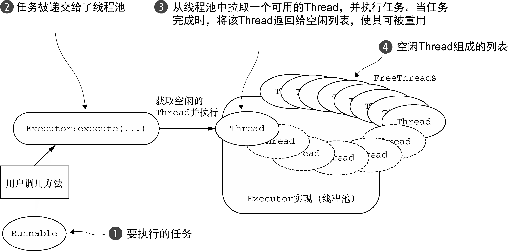

### 线程池模型概述

基本的线程池化模式可以描述为：

从池的空闲线程列表中选择一个Thread，并且指派它去运行一个已提交的任务（一个Runnable的实现）；
当任务完成时，将该Thread返回给该列表，使其可被重用。


### 反观netty中线程模型使用

1. EventLoop接口 

运行任务来处理在连接的生命周期内发生的事件是任何网络框架的基本功能。与之相应的编程上的构造通常被称为事件循环——一个Netty使用了interface io.netty.channel. EventLoop来适配的术语。

一段代码表示,事件循环的基本思想，其中每个任务都是一个Runnable的实例

```java
while (!terminated) {
　List<Runnable> readyEvents = blockUntilEventsReady();　  // 阻塞，直到有事件已经就绪可被运行
　 for (Runnable ev: readyEvents) {
　　　ev.run();　//   循环遍历，并处理所有的事件
　 }
}
```

> netty 中EventLoop和channel之间的交互状态的合并方式

Netty的EventLoop是协同设计的一部分，它采用了两个基本的API：并发和网络编程。首先，io.netty.util.concurrent包构建在JDK的java.util.concurrent包上，用来提供线程执行器。其次，io.netty.channel包中的类，为了与Channel的事件进行交互，扩展了这些接口/类。


在这个模型中，一个EventLoop将由一个永远都不会改变的Thread驱动，同时任务（Runnable或者Callable）可以直接提交给EventLoop实现，以立即执行或者调度执行。

根据配置和可用核心的不同，可能会创建多个EventLoop实例用以优化资源的使用，并且单个EventLoop可能会被指派用于服务多个Channel。

在Netty 4中，所有的I/O操作和事件都由已经被分配给了EventLoop的那个Thread来处理

