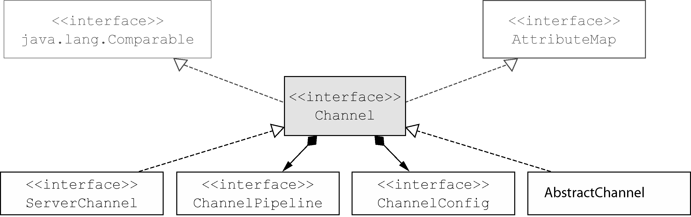

传输API的核心是interfaceChannel，它被用于所有的I/O操作。Channel类的层次结构如图

每个Channel都将会被分配一个ChannelPipeline和ChannelConfig。ChannelConfig包含了该Channel的所有配置设置，并且支持热更新。由于特定的传输可能具有独特的设置，所以它可能会实现一个ChannelConfig的子类型。（请参考ChannelConfig实现对应的Javadoc。）

由于Channel是独一无二的，所以为了保证顺序将Channel声明为java.lang.Comparable的一个子接口。因此，如果两个不同的Channel实例都返回了相同的散列码，那么AbstractChannel中的compareTo()方法的实现将会抛出一个Error。

ChannelPipeline持有所有将应用于入站和出站数据以及事件的ChannelHandler实例，这些ChannelHandler实现了应用程序用于处理状态变化以及数据处理的逻辑。

ChannelHandler的典型用途包括：

- 将数据从一种格式转换为另一种格式；
- 提供异常的通知；
- 提供Channel变为活动的或者非活动的通知；
- 提供当Channel注册到EventLoop或者从EventLoop注销时的通知；
- 提供有关用户自定义事件的通知

### channel 的方法

|方法名|描述|
|---|---|
|eventLoop|返回分配给Channel的EventLoop|
|pipeline|返回分配给Channel的ChannelPipeline|
|isActive|如果Channel是活动的，则返回true。活动的意义可能依赖于底层的传输。例如，一个Socket传输一旦连接到了远程节点便是活动的，而一个Datagram传输一旦被打开便是活动的|
|localAddress|返回本地的SocketAddress|
|remoteAddress|返回远程的SocketAddress|
|write|将数据写到远程节点。这个数据将被传递给ChannelPipeline，并且排队直到它被冲刷|
|flush|将之前已写的数据冲刷到底层传输，如一个Socket|
|writeAndFlush|一个简便的方法，等同于调用write()并接着调用flush()|