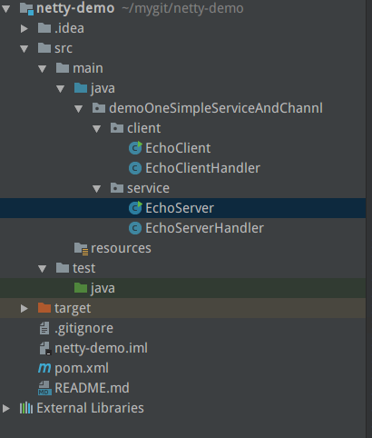

## netty高性能网络框架-一个基本的demo

最近想要学习netty 实现一个自己的rpc调用框架，作为开篇，先写一个小小的demo作为开始

### 一.首先展示这个demo的目录结构



EchoClient 和 EchoServer 分别表示 客户端和服务端的运行程序，对应的Handler 数据调用的时候相关的操作方法

### 二.代码
E
- choClient.class

```java
public class EchoClient {
    private final String host;
    private final int port;
    public EchoClient(String host, int port) {
        this.host = host;
        this.port = port;
    }
    public static void main(String[] args) throws Exception {
        new EchoClient("127.0.0.1",3330).start();
    }
    public void start() throws Exception{
        EventLoopGroup group = new NioEventLoopGroup();
        try {
            Bootstrap bootstrap = new Bootstrap();
            bootstrap.group(group)
                    .channel(NioSocketChannel.class)
                    .remoteAddress(new InetSocketAddress(host,port))
                    .handler(new ChannelInitializer<SocketChannel>() {
                        protected void initChannel(SocketChannel ch) throws Exception {
                            ch.pipeline().addLast(new EchoClientHandler());
                        }
                    });
            ChannelFuture future = bootstrap.connect().sync();
            future.channel().closeFuture().sync();
        } finally {
            group.shutdownGracefully().sync();
        }
    }
}
```

- EchoClientHandler.class

```java
public class EchoClientHandler extends SimpleChannelInboundHandler<ByteBuf> {
    protected void channelRead0(ChannelHandlerContext ctx, ByteBuf msg) throws Exception {
        System.out.println("client received: "+ msg.toString(CharsetUtil.UTF_8));
    }
    @Override
    public void channelActive(ChannelHandlerContext ctx) throws Exception {
        ctx.writeAndFlush(Unpooled.copiedBuffer("Netty rocks!",CharsetUtil.UTF_8));
    }
    @Override
    public void exceptionCaught(ChannelHandlerContext ctx, Throwable cause) throws Exception {
        cause.printStackTrace();
        ctx.close();
    }
}
```

- EchoServer.class

```java
public class EchoServer {
    private final int port;//帮顶相关的接口
    public EchoServer(int port) {
        this.port = port;
    }
    public static void main(String[] args) throws Exception {
        new EchoServer(3330).start();
    }
    public void start() throws Exception {
        final EchoServerHandler serverHandler = new EchoServerHandler();
        EventLoopGroup group = new NioEventLoopGroup();
        try {
            ServerBootstrap b = new ServerBootstrap();
            b.group(group).channel(NioServerSocketChannel.class)
                    .localAddress(new InetSocketAddress(port))
                    .childHandler(new ChannelInitializer<SocketChannel>() {
                        @Override
                        protected void initChannel(SocketChannel ch) throws Exception {
                            ch.pipeline().addLast(serverHandler);
                        }
                    });
            ChannelFuture f = b.bind().sync();
            f.channel().closeFuture().sync();
        } finally {
            group.shutdownGracefully().sync();
        }
    }
}
```

- EchoServerHandler.class

```java
@ChannelHandler.Sharable//表示一个ChannelHandler 可以被多个Channel安全的共享
public class EchoServerHandler extends ChannelInboundHandlerAdapter{
    @Override
    public void channelRead(ChannelHandlerContext ctx, Object msg) throws Exception {
        ByteBuf in= (ByteBuf) msg;
        System.out.println("server received: " + in.toString(CharsetUtil.UTF_8));
        ctx.write(in);//表示相关的写法写给发送这而不冲刷相关的消息
    }
    @Override
    public void channelReadComplete(ChannelHandlerContext ctx) throws Exception {
        //将未觉消息冲刷到远程节点，并且关闭该Channel
        ctx.writeAndFlush(Unpooled.EMPTY_BUFFER).addListener(ChannelFutureListener.CLOSE);
    }
    @Override
    public void exceptionCaught(ChannelHandlerContext ctx, Throwable cause) throws Exception {
        cause.printStackTrace();
        ctx.close();
    }
}
```