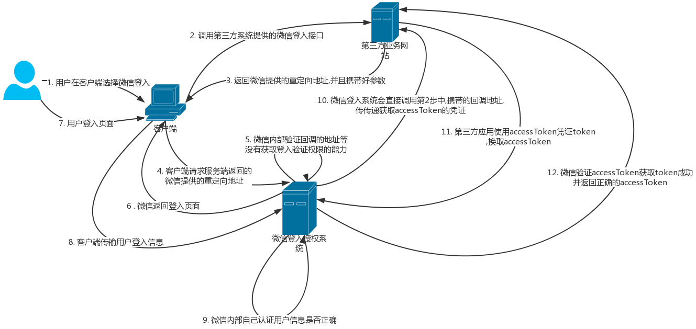

oAuth2.0 是一个广泛应用的认证授权方法

在整个oAuth2.0的认证有以下的参与者

- (1)Third-party application：第三方应用程序,称"客户端"(client)
- (2)HTTP service：HTTP服务提供商,简称"服务提供商"
- (3)Resource Owner：资源所有者,称"用户"(user).
- (4)User Agent：用户代理,本文中就是指浏览器.
- (5)Authorization server：认证服务器,即服务提供商专门用来处理认证的服务器.
- (6)Resource server：资源服务器,即服务提供商存放用户生成的资源的服务器.它与认证服务器,可以是同一台服务器,也可以是不同的服务器.

oAuth2.0的官方流程是这样的

- (A)用户打开客户端以后,客户端要求用户给予授权.
- (B)用户同意给予客户端授权.
- (C)客户端使用上一步获得的授权openToken,向认证服务器申请令牌accesssToken.
- (D)认证服务器对客户端进行认证以后,确认无误,同意发放令牌accesssToken.
- (E)客户端使用令牌,向资源服务器申请获取资源.
- (F)资源服务器确认令牌无误,同意向客户端开放资源.

其实这个登入流程的核心就是如何获取这个accessToken,这里列一个比较详细的授权流程,做一个整理

这里说明一些关键步骤

- 第三步 : 我们返回授权服务提供的一个接口,这里重点是这个接口中的参数,我们需要这几个重要的参数

1. 地址唯一标识 : 这个是关联授权地址的唯一id
2. 授权地址 : 这个地址是表明授权平台在认证通过后,将认证的accessToken获取code或者accessToken,发送到哪里的地址
3. status : 传入一个认证随机数,防止csfr攻击,这种方法需要第三方服务器自己做status校验

注意:这里要进行第一次权限校验,查看这个域名有没有权限进行认证.授权系统应该提供权限配置的功能页面

- 第十步 : 微信回传accessToken获取code

其实本质上授权系统在这一步就可以返回accessToken,但是微信考虑到,第三步回传的调用地址可能会**被篡改或code被偷取**(比如没有使用https加密),所以这里在规范的Oauth2.0 认证体系外又添加一个流程

但是还有一种情况没有考虑到,如果地址没有被篡改,但是第三方认证系统的DNS被劫持的话,accessToken还是会被非法获取到

所以,这一步还要再增加一步验证,可以参考https的验证方法,授权系统可以再授权的域中发放密钥文件,被授权的系统必须在授权系统系统中下载授权文件,放在自己的文件目录中,并且被授权系统必须保证这个文件不能被其他人非法获得. 这样授权系统在发放code的时候会先认证有没有这个文件,如果请求到了这个件,就认为这个系统没有被dns劫持

注意一点,这里的会用到重定向地址返回第三方系统的用户登入界面(返回了浏览器),本质上登入和注册需要的只是用户的信息,当使用了认证系统提供的code时候,后端皆可使用accessToken换取接口获取用户新消息了,更加方便的实现集成.(这里回调地址使用的是浏览器的原因是方便第三方登入系统集成,这样就没有必要使用长连接保证code和用户的一一对应和http协议的前端推送)

- 第十一步 : 这一步其实是第十步的进一步解释

我们之前说的第十部的时候已经解决的DNS劫持的问题了,接下来要解决就是code被暴力破解或者回调url被篡改的问题

这里使用这种方法保证,被认证系统要保证所有的被认证认证系统都拥有一个系统唯一id和对应的唯一密码,被认证系统有一定要保证密码不能泄露出去

当用户在使用code换取accessToken的过程中,要带上这个被认证系统的唯一id和对应的密码,并且相互之间的交互必须使用HTTPS加密,认证服务器在进行认证的时候需要校验id和密码是否匹配,code和Id时候匹配,如果通过,证明验证合法,这样就保证用户信息不泄露

