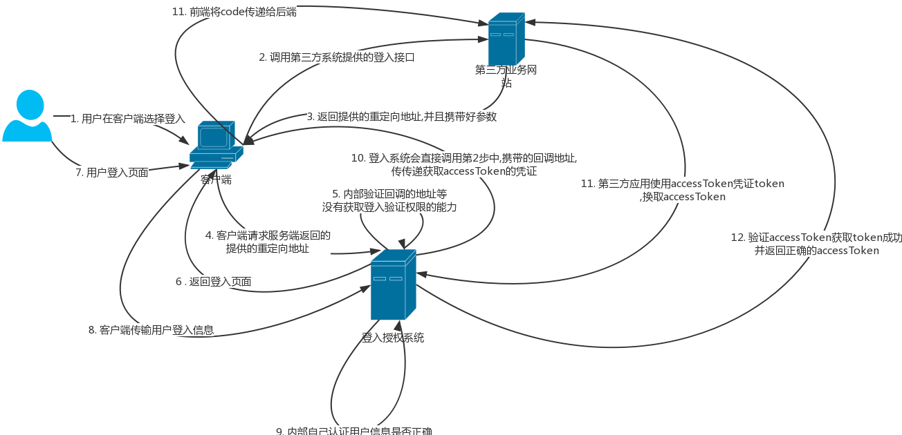

oAuth2.0 是一个广泛应用的认证授权方法,我最开始接触的时候是在微信登入授权上

在整个oAuth2.0的认证有以下的参与者

- (1)Third-party application：第三方应用程序,称"客户端"(client)
- (2)HTTP service：HTTP服务提供商,简称"服务提供商"
- (3)Resource Owner：资源所有者,称"用户"(user).
- (4)User Agent：用户代理,本文中就是指浏览器.
- (5)Authorization server：认证服务器,即服务提供商专门用来处理认证的服务器.
- (6)Resource server：资源服务器,即服务提供商存放用户生成的资源的服务器.它与认证服务器,可以是同一台服务器,也可以是不同的服务器.

oAuth2.0的官方流程是这样的

- (A)用户打开客户端以后,客户端要求用户给予授权.
- (B)用户同意给予客户端授权.
- (C)客户端使用上一步获得的授权openToken,向认证服务器申请令牌accesssToken.
- (D)认证服务器对客户端进行认证以后,确认无误,同意发放令牌accesssToken.
- (E)客户端使用令牌,向资源服务器申请获取资源.
- (F)资源服务器确认令牌无误,同意向客户端开放资源.

其实这个登入流程的核心就是如何获取这个accessToken,这里列一个比较详细的授权流程,做一个整理

这里说明一些关键步骤

- 第三步 : 我们返回授权服务提供的一个接口,这里重点是这个接口中的参数,我们需要这几个重要的参数

1. 地址唯一标识 : 这个是关联授权地址的唯一id
2. 授权地址 : 这个地址是表明授权平台在认证通过后,将认证的accessToken获取code或者accessToken,发送到哪里的地址
3. status : 传入一个认证随机数,防止csfr攻击,这种方法需要第三方服务器自己做status校验

注意:这里要进行第一次权限校验,查看这个域名有没有权限进行认证.

