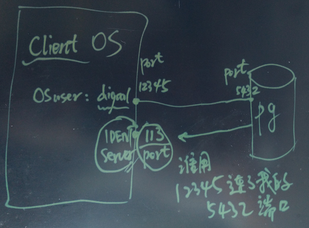
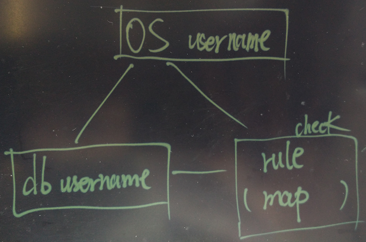

## postgresql学习记录(二)-postgresql用户权限解析

PostgreSQL支持的认证方法非常多，除了自身的密码认证以外，还支持很多其他认证服务。

``` 
trust
md5
password
GSSAPI
SSPI 
Ident
Peer
LDAP
RADIUS 
PAM
Certificate 
BSD
```

详见 https://www.postgresql.org/docs/9.6/static/auth-methods.html
这里主要介绍一下ident和peer相关的坑
ident 认证，客户端和数据库建立TCP会话后（假设会话的连接信息是client_ip:12345 <-> db_ip:5432），数据库通过ident协议询问客户端所在IP地址的ident server (默认是113监听端口)，询问内容：使用client_ip:12345端口连接db_ip:5432的操作系统用户是谁？



如图:


在获取到客户端的OS用户名之后，PostgreSQL会通过pg_hba.conf中配置的map名与pg_ident.conf中配置的映射关系，以及客户端提供的数据库用户名，判断是否允许登陆数据库。
如图



这里的peer相关的东西解释了为什么在上一篇中说使用linux的同名用户可以登入postgresql数据库
