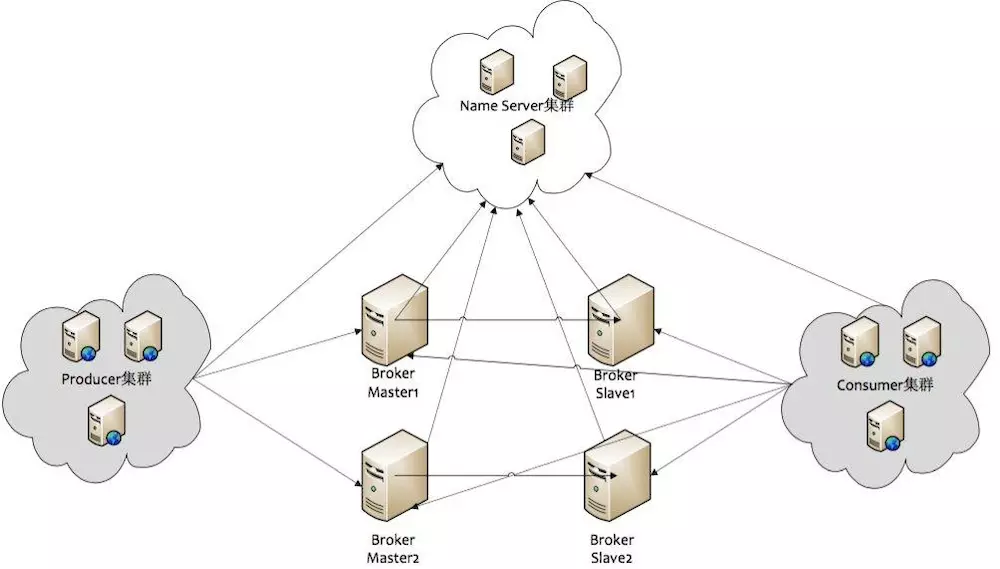
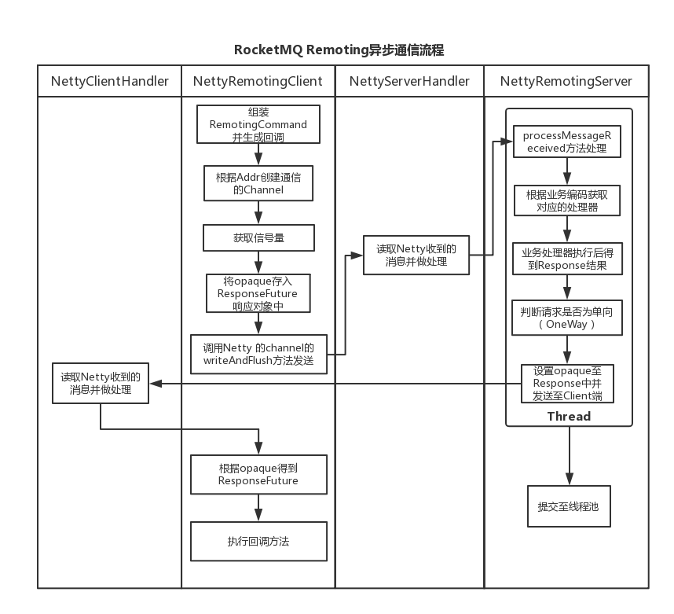

# 一.rocketmq模块架构



rocketMQ中的几个重要的角色

(1)NameServer:在MQ集群中做的是做命名服务，更新和路由发现 broker服务；
(2)Broker-Master:broker 消息主机服务器；
(3)Broker-Slave:broker 消息从机服务器；
(4)Producer:消息生产者；
(5)Consumer:消息消费者；

#  二. rocketmq 通信的过程和方法

RocketMQ集群的一部分通信如下:
 (1)Broker启动后需要完成一次将自己注册至NameServer的操作；随后每隔30s时间定期向NameServer上报Topic路由信息；
 (2)消息生产者Producer作为客户端发送消息时候，需要根据Msg的Topic从本地缓存的TopicPublishInfoTable获取路由信息。如果没有则更新路由信息会从NameServer上重新拉取；
 (3)消息生产者Producer根据(2)中获取的路由信息选择一个队列(MessageQueue)进行消息发送；Broker作为消息的接收者收消息并落盘存储；

从上面(1)~(3)中可以看出在消息生产者, Broker和NameServer之间都会发生通信(这里只说了MQ的部分通信)，因此如何设计一个良好的网络通信模块在MQ中至关重要，它将决定RocketMQ集群整体的消息传输能力与最终的性能。

rocketmq-remoting 模块是 RocketMQ消息队列中负责网络通信的模块，它几乎被其他所有需要网络通信的模块(诸如rocketmq-client、rocketmq-server、rocketmq-namesrv)所依赖和引用。为了实现客户端与服务器之间高效的数据请求与接收，RocketMQ消息队列自定义了通信协议并在Netty的基础之上扩展了通信模块。

# 三. 消息的协议设计与编码解码

在Client和Server之间完成一次消息发送时，需要对发送的消息进行一个协议约定，因此就有必要自定义RocketMQ的消息协议。同时，为了高效地在网络中传输消息和对收到的消息读取，就需要对消息进行编解码。

在RocketMQ中，RemotingCommand这个类在消息传输过程中对所有数据内容的封装，不但包含了所有的数据结构，还包含了编码解码操作。

RemotingCommand类的部分成员变量如下:

|Header字段|类型|Request说明|Response说明|
|-|-|-|-|
|code|int|请求操作码，应答方根据不同的请求码进行不同的业务处理|应答响应码。0表示成功，非0则表示各种错误|
|language|LanguageCode|请求方实现的语言|应答方实现的语言|
|version|int|请求方程序的版本|应答方程序的版本|
|opaque|int|相当于reqeustId，在同一个连接上的不同请求标识码，与响应消息中的相对应|应答不做修改直接返回|
|flag|int|区分是普通RPC还是onewayRPC得标志|区分是普通RPC还是onewayRPC得标志|
|remark|String|传输自定义文本信息|传输自定义文本信息|
|extFields|HashMap<String,String>|请求自定义扩展信息|响应自定义扩展信息|

这里展示下Broker向NameServer发送一次心跳注册的报文:

```
[
code=103,//这里的103对应的code就是broker向nameserver注册自己的消息
language=JAVA,
version=137,
opaque=58,//这个就是requestId
flag(B)=0,
remark=null,
extFields={
    brokerId=0,
    clusterName=DefaultCluster,
    brokerAddr=ip1: 10911,
    haServerAddr=ip1: 10912,
    brokerName=LAPTOP-SMF2CKDN
},
serializeTypeCurrentRPC=JSON
```

下面来看下RocketMQ通信协议的格式


 可见传输内容主要可以分为以下4部分:
 (1)消息长度:总长度，四个字节存储，占用一个int类型；
 (2)序列化类型&消息头长度:同样占用一个int类型，第一个字节表示序列化类型，后面三个字节表示消息头长度；
 (3)消息头数据:经过序列化后的消息头数据；
 (4)消息主体数据:消息主体的二进制字节数据内容；
 消息的编码和解码分别在RemotingCommand类的encode和decode方法中完成.

# 四. 消息通信方式和通信流程

在RocketMQ消息队列中支持通信的方式主要有以下三种:
 (1)同步(sync)
 (2)异步(async)
 (3)单向(oneway)
 其中“同步”通信模式相对简单，一般用在发送心跳包场景下，无需关注其Response。本文将主要介绍RocketMQ的异步通信流程(限于篇幅，读者可以按照同样的模式进行分析同步通信流程)

 

# 五. rocketMq消息发送



对于上图中几个角色的说明:
- (1)NameServer:RocketMQ集群的命名服务器(也可以说是注册中心)，它本身是无状态的(实际情况下可能存在每个NameServer实例上的数据有短暂的不一致现象，但是通过定时更新，在大部分情况下都是一致的)，用于管理集群的元数据( 例如，KV配置、Topic、Broker的注册信息)。
- (2)Broker(Master):RocketMQ消息代理服务器主节点，起到串联Producer的消息发送和Consumer的消息消费，和将消息的落盘存储的作用；
- (3)Broker(Slave):RocketMQ消息代理服务器备份节点，主要是通过同步/异步的方式将主节点的消息同步过来进行备份，为RocketMQ集群的高可用性提供保障；
- (4)Producer(消息生产者):在这里为普通消息的生产者，主要基于RocketMQ-Client模块将消息发送至RocketMQ的主节点。
 对于上面图中几条通信链路的关系:
- - (1)Producer与NamerServer:每一个Producer会与NameServer集群中的一个实例建立TCP连接，从这个NameServer实例上拉取Topic路由信息；
- - (2)Producer和Broker:Producer会和它要发送的topic相关联的Master的Broker代理服务器建立TCP连接，用于发送消息以及定时的心跳信息；
- - (3)Broker和NamerServer:Broker(Master or Slave)均会和每一个NameServer实例来建立TCP连接。Broker在启动的时候会注册自己配置的Topic信息到NameServer集群的每一台机器中。即每一个NameServer均有该broker的Topic路由配置信息。其中，Master与Master之间无连接，Master与Slave之间有连接；

# 六. rocketMQ  消息消费

### MQ中Pull和Push的两种消费方式

对于任何一款消息中间件而言，消费者客户端一般有两种方式从消息中间件获取消息并消费：
（1）Push方式：由消息中间件（MQ消息服务器代理）主动地将消息推送给消费者；采用Push方式，可以尽可能实时地将消息发送给消费者进行消费。但是，在消费者的处理消息的能力较弱的时候(比如，消费者端的业务系统处理一条消息的流程比较复杂，其中的调用链路比较多导致消费时间比较久。概括起来地说就是“慢消费问题”)，而MQ不断地向消费者Push消息，消费者端的缓冲区可能会溢出，导致异常；
（2）Pull方式：由消费者客户端主动向消息中间件（MQ消息服务器代理）拉取消息；采用Pull方式，如何设置Pull消息的频率需要重点去考虑，举个例子来说，可能1分钟内连续来了1000条消息，然后2小时内没有新消息产生（概括起来说就是“消息延迟与忙等待”）。如果每次Pull的时间间隔比较久，会增加消息的延迟，即消息到达消费者的时间加长，MQ中消息的堆积量变大；若每次Pull的时间间隔较短，但是在一段时间内MQ中并没有任何消息可以消费，那么会产生很多无效的Pull请求的RPC开销，影响MQ整体的网络性能；


