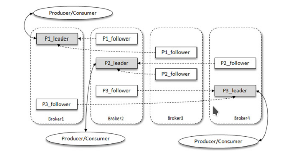

# kafka 基本概念

1. Producer：生产者，也就是发送消息的一方。生产者负责创建消息，然后将其投递到Kafka中
2. Consumer：消费者，也就是接收消息的一方。消费者连接到Kafka上并接收消息，进而进行相应的业务逻辑处理。
3. Broker：服务代理节点。对于Kafka而言，Broker可以简单地看作一个独立的Kafka服务节点或Kafka服务实例。大多数情况下也可以将Broker看作一台Kafka服务器，前提是这台服务器上只部署了一个Kafka实例。一个或多个Broker组成了一个Kafka集群。一般而言，我们更习惯使用首字母小写的broker来表示服务代理节点。
4. Topic: 服务主题 ， Kafka中的消息以主题为单位进行归类，生产者负责将消息发送到特定的主题（发送到Kafka集群中的每一条消息都要指定一个主题），而消费者负责订阅主题并进行消费。
5. Partition：一个topic中的主题可能会有多个分区 ， 并且不同的分区可能并不会在同一个broker中，同一主题下的不同分区包含的消息是不同的，分区在存储层面可以看作一个可追加的日志（Log）文件，消息在被追加到分区日志文件的时候都会分配一个特定的偏移量（offset）。offset是消息在分区中的唯一标识，Kafka通过它来保证消息在分区内的顺序性，不过offset并不跨越分区，也就是说，Kafka保证的是分区有序而不是主题有序。
6. Replica和leader&follow副本：kafka针对分区有多副本机制实现高可用，并且保证副本存放在不同的broker中

注意点：
1. kafka消费者使用pull模式拉取 ？长轮询？
2. 


## kafka基本架构系统架构



> 名词概念

1. AR（Assigned Replicas） ： kafka副本系统统称
2. ISR（In-Sync Replicas）： 与leader副本保持同步的副本
3. OSR（Out-of-Sync Replicas）

leader副本负责维护和跟踪ISR和OSR集合的follower副本的滞后状态，当follower副本落后太多或失效时，leader副本会把它从ISR集合中剔除。如果OSR集合中有follower副本“追上”了leader副本，那么leader副本会把它从OSR集合转移至ISR集合

默认情况下，当leader副本发生故障时，只有在ISR集合中的副本才有资格被选举为新的leader，而在OSR集合中的副本则没有任何机会（不过这个原则也可以通过修改相应的参数配置来改变）

4. LEO ： LEO是Log End Offset的缩写，它标识当前日志文件中下一条待写入消息的offset
5. HW ： HW是High Watermark的缩写，俗称高水位，它标识了一个特定的消息偏移量（offset），消费者只能拉取到这个offset之前的消息。


注意： LEO和HW 都描述的是下一个能插入或者能读入的位置，而不是当前位置

LEO位置的确定方法是每一个副本当前能插入的下一个问题，HW的位置是leader通过同步当前所有副本中最小的LEO来决定HW

# kafka producer

## KafkaProducer


## 创建发送消息对象ProducerRecord

> ? 暂时省略

## 发送消息三种主要模式

发后即忘（fire-and-forget）、同步（sync）及异步（async）


1. fire-and0forget：发后即忘，它只管往Kafka中发送消息而并不关心消息是否正确到达
2. sync：使用send方法 阻塞等待Kafka的响应 ,返回一个Future类，直到消息发送成功，或者发生异常。如果发生异常，那么就需要捕获异常并交由外层逻辑处理
3. async:一般是在send（）方法里指定一个Callback的回调函数，Kafka在返回响应时调用该函数来实现异步的发送确认

> 注意： 使用producer之后要调用close方法来关闭请求

## kafka producer异常

KafkaProducer中一般会发生两种类型的异常：可重试的异常和不可重试的异常。
常见的可重试异常有：NetworkException、LeaderNotAvailableException、UnknownTopicOrPartitionException、NotEnoughReplicasException、NotCoordinatorException 等。比如NetworkException 表示网络异常，这个有可能是由于网络瞬时故障而导致的异常，可以通过重试解决；又比如LeaderNotAvailableException表示分区的leader副本不可用，这个异常通常发生在leader副本下线而新的 leader 副本选举完成之前，重试之后可以重新恢复。

不可重试的异常，比如RecordTooLargeException异常，暗示了所发送的消息太大，KafkaProducer对此不会进行任何重试，直接抛出异常。

对于可重试的异常，如果配置了 retries 参数，那么只要在规定的重试次数内自行恢复了，就不会抛出异常。retries参数的默认值为0，配置方式参考如下：

```java
props.put(ProductConfig.RESERVES_CONFIG,10);
```

示例中配置了10次重试。如果重试了10次之后还没有恢复，那么仍会抛出异常，进而发送的外层逻辑就要处理这些异常了

## producer发往 broker的过程

消息在通过send（）方法发往broker的过程中，有可能需要经过拦截器（Interceptor）、序列化器（Serializer）和分区器（Partitioner）的一系列作用之后才能被真正地发往 broker

1. 分区器: Partitioner-用于确定它发往的分区，如果消息ProducerRecord中指定了partition字段，那么就不需要分区器的作用，因为partition代表的就是所要发往的分区号

Kafka中提供的默认分区器是org.apache.kafka.clients.producer.internals.DefaultPartitioner，它实现了org.apache.kafka.clients.producer.Partitioner接口，这个接口中定义了2个方法

```java
public class DefaultPartitioner implements Partitioner {
    private final StickyPartitionCache stickyPartitionCache = new StickyPartitionCache();
    public void configure(Map<String, ?> configs) {}
    /**
     * Compute the partition for the given record.
     *
     * @param topic The topic name
     * @param key The key to partition on (or null if no key)
     * @param keyBytes serialized key to partition on (or null if no key)
     * @param value The value to partition on or null
     * @param valueBytes serialized value to partition on or null
     * @param cluster The current cluster metadata
     */
    public int partition(String topic, Object key, byte[] keyBytes, Object value, byte[] valueBytes, Cluster cluster) {
        if (keyBytes == null) {
            return stickyPartitionCache.partition(topic, cluster);
        } 
        List<PartitionInfo> partitions = cluster.partitionsForTopic(topic);
        int numPartitions = partitions.size();
        // hash the keyBytes to choose a partition
        return Utils.toPositive(Utils.murmur2(keyBytes)) % numPartitions;
    }
    public void close() {}
    /**
     * If a batch completed for the current sticky partition, change the sticky partition. 
     * Alternately, if no sticky partition has been determined, set one.
     */
    public void onNewBatch(String topic, Cluster cluster, int prevPartition) {
        stickyPartitionCache.nextPartition(topic, cluster, prevPartition);
    }
}
```

其中partition（）方法用来计算分区号，返回值为int类型。partition（）方法中的参数分别表示主题、键、序列化后的键、值、序列化后的值，以及集群的元数据信息，通过这些信息可以实现功能丰富的分区器。close（）方法在关闭分区器的时候用来回收一些资源。

在默认分区器 DefaultPartitioner 的实现中，close（）是空方法，而在 partition（）方法中定义了主要的分区分配逻辑。如果 key 不为 null，那么默认的分区器会对 key 进行哈希（采用MurmurHash2算法，具备高运算性能及低碰撞率），最终根据得到的哈希值来计算分区号，拥有相同key的消息会被写入同一个分区。如果key为null，那么消息将会以轮询的方式发往主题内的各个可用分区。

> 注意：如果 key 不为 null，那么计算得到的分区号会是所有分区中的任意一个；如果 key为null，那么计算得到的分区号仅为可用分区中的任意一个，注意两者之间的差别。

在不改变主题分区数量的情况下，key与分区之间的映射可以保持不变。不过，一旦主题中增加了分区，那么就难以保证key与分区之间的映射关系了。

> 自定义分区器实现 - 和default方法类似，只要自己定义Partitioner重写一下里面的接口实现即可

这个自定义分区器的实现比较简单，读者也可以根据自身业务的需求来灵活实现分配分区的计算方式，比如一般大型电商都有多个仓库，可以将仓库的名称或ID作为key来灵活地记录商品信息。

2. 序列化器：Serializer 用于指定消息的序列化方法

kafka支持自定义的序列化和反序列化，只需要实现对应的接口就可以了org.apache.kafka.common.serialization.Serializer

> 注意：生产者和消费者对应的序列化协议必须要一致


3. 生产者拦截器

生产者拦截器既可以用来在消息发送前做一些准备工作，比如按照某个规则过滤不符合要求的消息、修改消息的内容等，也可以用来在发送回调逻辑前做一些定制化的需求，比如统计类工作。

生产者拦截器的使用也很方便，主要是自定义实现 org.apache.kafka.clients.producer.ProducerInterceptor接口

```java
package org.apache.kafka.clients.producer;

import org.apache.kafka.common.Configurable;

public interface ProducerInterceptor<K, V> extends Configurable {
    public ProducerRecord<K, V> onSend(ProducerRecord<K, V> record);
    public void onAcknowledgement(RecordMetadata metadata, Exception exception);
    public void close();
}
```

1. onSend（）方法 ：KafkaProducer在将消息序列化和计算分区之前会调用生产者拦截器的onSend（）方法来对消息进行相应的定制化操作。一般来说最好不要修改消息 ProducerRecord 的 topic、key 和partition 等信息，如果要修改，则需确保对其有准确的判断，否则会与预想的效果出现偏差。比如修改key不仅会影响分区的计算，同样会影响broker端日志压缩（Log Compaction）的功能。

2. onAcknowledgement（）： KafkaProducer 会在消息被应答（Acknowledgement）之前或消息发送失败时调用生产者拦截器的onAcknowledgement（）方法，优先于用户设定的 Callback 之前执行。这个方法运行在Producer 的 I/O 线程中，所以这个方法中实现的代码逻辑越简单越好，否则会影响消息的发送速度。

3. close（）方法 ：主要用于在关闭拦截器时执行一些资源的清理工作。在这 3 个方法中抛出的异常都会被捕获并记录到日志中，但并不会再向上传递。

> 注意： KafkaProducer中不仅可以指定一个拦截器，还可以指定多个拦截器以形成拦截链

## kafka producer架构图


整个生产者客户端由两个线程协调运行，这两个线程分别为主线程和Sender线程（发送线程）。

- 在主线程中由KafkaProducer创建消息，然后通过可能的拦截器、序列化器和分区器的作用之后缓存到消息累加器（RecordAccumulator，也称为消息收集器）中。

RecordAccumulator 主要用来缓存消息以便 Sender 线程可以批量发送，进而减少网络传输的资源消耗以提升性能。RecordAccumulator 缓存的大小可以通过生产者客户端参数buffer.memory 配置，默认值为 33554432B，即 32MB。如果生产者发送消息的速度超过发送到服务器的速度，则会导致生产者空间不足，这个时候KafkaProducer的send（）方法调用要么被阻塞，要么抛出异常，这个取决于参数max.block.ms的配置，此参数的默认值为60000，即60秒。

在 RecordAccumulator 的内部为每个分区都维护了一个双端队列，队列中的内容就是ProducerBatch，即 Deque＜ProducerBatch＞。写入追加到尾部，读取从头部读取ProducerBatch中可以包含一至多个 ProducerRecord。通俗地说，ProducerRecord 是生产者中创建的消息，而ProducerBatch是指一个消息批次，ProducerRecord会被包含在ProducerBatch中，这样可以使字节的使用更加紧凑。与此同时，将较小的ProducerRecord拼凑成一个较大的ProducerBatch，也可以减少网络请求的次数以提升整体的吞吐量


消息在网络上都是以字节（Byte）的形式传输的，在发送之前需要创建一块内存区域来保存对应的消息。在Kafka生产者客户端中，通过java.io.ByteBuffer实现消息内存的创建和释放。不过频繁的创建和释放是比较耗费资源的，在RecordAccumulator的内部还有一个BufferPool，它主要用来实现ByteBuffer的复用，以实现缓存的高效利用。不过BufferPool只针对特定大小的ByteBuffer进行管理，而其他大小的ByteBuffer不会缓存进BufferPool中，这个特定的大小由batch.size参数来指定，默认值为16384B，即16KB。

我们可以适当地调大batch.size参数以便多缓存一些消息。ProducerBatch的大小和batch.size参数也有着密切的关系。当一条消息（ProducerRecord）流入RecordAccumulator时，会先寻找与消息分区所对应的双端队列（如果没有则新建），再从这个双端队列的尾部获取一个 ProducerBatch（如果没有则新建），查看 ProducerBatch 中是否还可以写入这个 ProducerRecord，如果可以则写入，如果不可以则需要创建一个新的ProducerBatch。在新建ProducerBatch时评估这条消息的大小是否超过batch.size参数的大小，如果不超过，那么就以 batch.size参数的大小来创建 ProducerBatch，这样在使用完这段内存区域之后，可以通过BufferPool 的管理来进行复用；如果超过，那么就以评估的大小来创建ProducerBatch，这段内存区域不会被复用。

- Sender 线程负责从RecordAccumulator中获取消息并将其发送到Kafka中

Sender 从 RecordAccumulator 中获取缓存的消息之后，会进一步将原本＜分区，Deque＜ProducerBatch＞＞的保存形式转变成＜Node，List＜ ProducerBatch＞的形式，其中Node表示Kafka集群的broker节点。对于网络连接来说，生产者客户端是与具体的broker节点建立的连接，也就是向具体的 broker 节点发送消息，而并不关心消息属于哪一个分区；而对于 KafkaProducer的应用逻辑而言，我们只关注向哪个分区中发送哪些消息，所以在这里需要做一个应用逻辑层面到网络I/O层面的转换。

在转换成＜Node，List＜ProducerBatch＞＞的形式之后，Sender 还会进一步封装成＜Node，Request＞的形式，这样就可以将Request请求发往各个Node了，这里的Request是指Kafka的各种协议请求，对于消息发送而言就是指具体的ProduceRequest

> Sender中的InFlightRequests集合

请求在从Sender线程发往Kafka之前还会保存到InFlightRequests中，InFlightRequests保存对象的具体形式为 Map＜NodeId，Deque＜Request＞＞，它的主要作用是缓存了已经发出去但还没有收到响应的请求（NodeId 是一个 String 类型，表示节点的 id 编号）。

与此同时，InFlightRequests还提供了许多管理类的方法，并且通过配置参数还可以限制每个连接（也就是客户端与Node之间的连接）最多缓存的请求数。这个配置参数为max.in.flight.requests.per.connection，默认值为 5，即每个连接最多只能缓存 5 个未响应的请求，超过该数值之后就不能再向这个连接发送更多的请求了，除非有缓存的请求收到了响应（Response）。通过比较Deque＜Request＞的size与这个参数的大小来判断对应的Node中是否已经堆积了很多未响应的消息，如果真是如此，那么说明这个 Node 节点负载较大或网络连接有问题，再继续向其发送请求会增大请求超时的可能。    

InFlightRequests还可以获得leastLoadedNode，即所有Node中负载最小的那一个。这里的负载最小是通过每个Node在InFlightRequests中还未确认的请求决定的，未确认的请求越多则认为负载越大

选择leastLoadedNode发送请求可以使它能够尽快发出，避免因网络拥塞等异常而影响整体的进度。leastLoadedNode的概念可以用于多个应用场合，比如元数据请求、消费者组播协议的交互。


# kafka 元数据

KafkaProducer要将此消息追加到指定主题的某个分区所对应的leader副本之前，首先需要知道主题的分区数量，然后经过计算得出（或者直接指定）目标分区，之后KafkaProducer需要知道目标分区的leader副本所在的broker 节点的地址、端口等信息才能建立连接，最终才能将消息发送到 Kafka，在这一过程中所需要的信息都属于元数据信息。

元数据是指Kafka集群的元数据，这些元数据具体记录了集群中有哪些主题，这些主题有哪些分区，每个分区的leader副本分配在哪个节点上，follower副本分配在哪些节点上，哪些副本在AR、ISR等集合中，集群中有哪些节点，控制器节点又是哪一个等信息。

当客户端中没有需要使用的元数据信息时，比如没有指定的主题信息，或者超过metadata.max.age.ms 时间没有更新元数据都会引起元数据的更新操作。客户端参数metadata.max.age.ms的默认值为300000，即5分钟。元数据的更新操作是在客户端内部进行的，对客户端的外部使用者不可见。当需要更新元数据时，会先挑选出leastLoadedNode，然后向这个Node发送MetadataRequest请求来获取具体的元数据信息。这个更新操作是由Sender线程发起的，在创建完MetadataRequest之后同样会存入InFlightRequests，之后的步骤就和发送消息时的类似。元数据虽然由Sender线程负责更新，但是主线程也需要读取这些信息，这里的数据同步通过synchronized和final关键字来保障。

