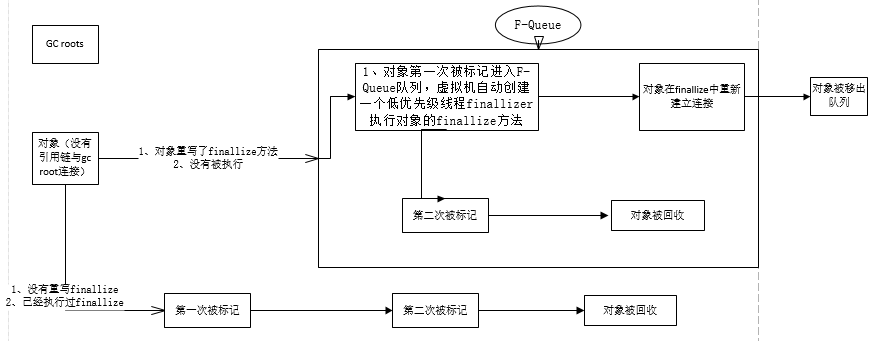

先说结论,主观上,我们都觉得jvm貌似是在确认对象不达的时候进行回收的
> 问题就在这个不可达上面 , 官方的解释是 可达对象 (reachable object) 是可以从任何活动线程的任何潜在的持续访问中的任何对象；java 编译器或代码生成器可能会对不再访问的对象提前置为 null，使得对象可以被提前回收

也就是说对象的回收时机是可以在函数执行完成之前就触发的

```java
public class JavaGCTestMain {
    @Override
    protected void finalize() {
        System.out.println(this + " was finalized!");
    }

    public static void main(String[] args) {
        JavaGCTestMain a = new JavaGCTestMain();
        System.out.println("Created " + a);
        for (int i = 0; i < 1_000_000_000; i++) {
            //制定一定的时间间隔触发gc
            if (i % 1_000_00 == 0) {
                System.gc();
            }
        }
        System.out.println("done.");
    }
}
```

运行之后你会发现输出的数据是这样的

```
Created org.mekweg.TestMain@4554617c
org.mekweg.TestMain@4554617c was finalized!
```

程序函数在没有被执行完之前就被gc回收了

# 这样引入一个复杂的场景比如多线程环境gc是否还是有问题的

ps: 这个情况其实是最近遇到的一个线程池莫名其妙被kill的问题引申出来的

先贴一段代码

```java
public class ThreadBugTest {
    public static void main(String[] args) {
        ThreadBugTest threadBugTest = new ThreadBugTest();
        for (int i = 0; i < 8; i++) {
            new Thread(new Runnable() {
                @Override
                public void run() {
                    while (true) {
                        threadBugTest.run();
                    }
                }
            }).start();
        }
        new Thread(new Runnable() {
            @Override
            public void run() {
                while (true) {
                    System.gc();
                }
            }
        }).start();
    }

    public void run(){
        Executor future = ExecutorWrapper.create();
        future.execute();
    }
    //实际运行的类
    static class Executor{
        private AtomicBoolean ctl = new AtomicBoolean(false);
        public void execute() {
            // 启动一个新线程，模拟 ThreadPoolExecutor.execute
            new Thread(new Runnable() {
                @Override
                public void run() {}
            }).start();
            // 模拟 ThreadPoolExecutor，启动新建线程后，循环检查线程池状态，验证是否会在 finalize 中 shutdown
            // 如果线程池被提前 shutdown，则抛出异常
            for (int i = 0; i < 1_000_000; i++) {
                if(ctl.get()){
                    System.out.println(FinalizedTest.finalizedTest);
                    throw new RuntimeException("reject!!!["+ctl.get()+"]");
                }
            }
        }

        public void shutdown() {
            ctl.compareAndSet(false,true);
        }

        //如果被回收,触发shutdown
        @Override
        protected void finalize() throws Throwable {
            this.shutdown();
        }
    }

    static class ExecutorWrapper {

        public static Executor create(){
            return new FinalizableDelegatedTExecutorService(new Executor());
        }

        static class FinalizableDelegatedTExecutorService extends Executor {
            private Executor e;
            FinalizableDelegatedTExecutorService(Executor executor) {
                this.e = executor;
            }
            @Override
            public void execute() {
                e.execute();
            }

            @Override
            public void shutdown() {
                e.shutdown();
            }
            //调用引入类
            @Override
            protected void finalize() throws Throwable {
                this.shutdown();
            }
        }
    }
}
```

执行一下我们上面的函数你会发现一个问题 Executor 对象这个创建线程的玩意竟然被回收了.....

```
org.mekweg.test.FinalizedTest@6b1c8f31
Exception in thread "Thread-0" java.lang.RuntimeException: reject!!![true]
	at org.mekweg.test.TThreadPoolExecutor.execute(TThreadPoolExecutor.java:24)
	at org.mekweg.test.Executors$DelegatedTExecutorService.execute(Executors.java:34)
	at org.mekweg.test.FinalizedTest$1.run(FinalizedTest.java:15)
	at java.lang.Thread.run(Thread.java:748)
```

这个问题映射到java jdk的问题上的话就是在jdk1.8 使用的时候会有线程池莫名其妙关闭的问题 , 贴一下代码

```java
public static ExecutorService newSingleThreadExecutor() {
    return new FinalizableDelegatedExecutorService
            (new ThreadPoolExecutor(1, 1,
                    0L, TimeUnit.MILLISECONDS,
                    new LinkedBlockingQueue<Runnable>()));
}

static class FinalizableDelegatedExecutorService
    extends DelegatedExecutorService {
    FinalizableDelegatedExecutorService(ExecutorService executor) {
        super(executor);
    }
    protected void finalize() {
        super.shutdown();
    }
}
```

看上面的代码有一个 finalize方法,他调用了shutdown(); ---  所以我们用一开始的代码来模拟这个jdk的bug

这里对这里面的对象进行一次可达性分析

> 先说一下java gc 的可达性分析的流程吧... ...

在Java中采取了 可达性分析法。该方法的基本思想是通过一系列的“GC Roots”对象作为起点进行搜索，如果在“GC Roots”和一个对象之间没有可达路径，则称该对象是不可达的，不过要注意的是被判定为不可达的对象不一定就会成为可回收对象。被判定为不可达的对象要成为可回收对象必须至少经历两次标记过程，如果在这两次标记过程中仍然没有逃脱成为可回收对象的可能性，则基本上就真的成为可回收对象了。

此算法的核心思想：通过一系列称为“GC Roots”的对象作为起始点，从这些节点开始向下搜索，搜索走过的路径称为“引用链”，当一个对象到 GC Roots 没有任何的引用链相连时(从 GC Roots 到这个对象不可达)时，证明此对象不可用。

在Java语言中，可作为GC Roots的对象包含以下几种：

1. 虚拟机栈(栈帧中的本地变量表)中引用的对象。(可以理解为:引用栈帧中的本地变量表的所有对象)
2. 方法区中静态属性引用的对象(可以理解为:引用方法区该静态属性的所有对象)
3. 方法区中常量引用的对象(可以理解为:引用方法区中常量的所有对象)
4. 本地方法栈中(Native方法)引用的对象(可以理解为:引用Native方法的所有对象)

可以理解为:
- (1)首先第一种是虚拟机栈(线程栈)中的引用的对象，我们在程序中正常创建一个对象，对象会在堆上开辟一块空间，同时会将这块空间的地址作为引用保存到虚拟机栈中，如果对象生命周期结束了，那么引用就会从虚拟机栈中出栈，因此如果在虚拟机栈中有引用，就说明这个对象还是有用的，这种情况是最常见的。

- (2)第二种是我们在类中定义了全局的静态的对象，也就是使用了static关键字，由于虚拟机栈是线程私有的，所以这种对象的引用会保存在共有的方法区中，显然将方法区中的静态引用作为GC Roots是必须的。

- (3)第三种便是常量引用，就是使用了static final关键字，由于这种引用初始化之后不会修改，所以方法区常量池里的引用的对象也应该作为GC Roots。最后一种是在使用JNI技术时，有时候单纯的Java代码并不能满足我们的需求，我们可能需要在Java中调用C或C++的代码，因此会使用native方法，JVM内存中专门有一块本地方法栈，用来保存这些对象的引用，所以本地方法栈中引用的对象也会被作为GC Roots。

finalize()方法最终判定对象是否存活:

即使在可达性分析算法中不可达的对象，也并非是“非死不可”的，这时候它们暂时处于“缓刑”阶段，要真正宣告一个对象死亡，至少要经历再次标记过程。
标记的前提是对象在进行可达性分析后发现没有与GC Roots相连接的引用链。

1).第一次标记并进行一次筛选。
筛选的条件是此对象是否有必要执行finalize()方法。
当对象没有覆盖finalize方法，或者finzlize方法已经被虚拟机调用过，虚拟机将这两种情况都视为“没有必要执行”，对象被回收。

2).第二次标记
如果这个对象被判定为有必要执行finalize（）方法，那么这个对象将会被放置在一个名为：F-Queue的队列之中，并在稍后由一条虚拟机自动建立的、低优先级的Finalizer线程去执行。这里所谓的“执行”是指虚拟机会触发这个方法，但并不承诺会等待它运行结束。这样做的原因是，如果一个对象finalize（）方法中执行缓慢，或者发生死循环（更极端的情况），将很可能会导致F-Queue队列中的其他对象永久处于等待状态，甚至导致整个内存回收系统崩溃。
Finalize（）方法是对象脱逃死亡命运的最后一次机会，稍后GC将对F-Queue中的对象进行第二次小规模标记，如果对象要在finalize（）中成功拯救自己----只要重新与引用链上的任何的一个对象建立关联即可，譬如把自己赋值给某个类变量或对象的成员变量，那在第二次标记时它将移除出“即将回收”的集合。如果对象这时候还没逃脱，那基本上它就真的被回收了。



# 再来分析上面的问题

匹配gc算法的(1)号情况 GC routs 将会以虚拟机栈引用的对象为根... ... 看main函数中的创建方法

```java
threadBugTest.run();
```

会发现这一行对所有的对象来说都是没有引用的,也就是说在触发下一次gc的时候将会被回收,执行其中的finilly函数....

反观jdk的代码,和我们的类似,newSingleThreadExecutor方法直接return一个新的对象,如果这个对象和我们例子中用法类似将会导致类似的问题

# 问题来了,其实我们并不想结束这个Executor如何解决

1. 直接强制引用就行了

修改代码

```java
public static void main(String[] args) {
    Executors.newSingleThreadExecutor()
    ThreadBugTest threadBugTest = new ThreadBugTest();
    for (int i = 0; i < 8; i++) {
        new Thread(new Runnable() {
            @Override
            public void run() {
                List<Executor> list = new ArrayList<>();
                while (true) {
                    list.add(threadBugTest.run());
                }
                //list.clean();
            }
        }).start();
    }
    new Thread(new Runnable() {
        @Override
        public void run() {
            while (true) {
                System.gc();
            }
        }
    }).start();
}

public Executor run(){
    Executor future = ExecutorWrapper.create();
    future.execute();
    return future;
}
```

将每次new出的对象进行缓存,就能保证不会被可达性分析命中,从而保证常驻

2. java9+使用Reference.reachabilityFence(this);保证try finally中的对象强可达

```java
public void execute(Runnable command) {
    try {
        e.execute(command);
    } finally { 
        reachabilityFence(this); 
    }
}
```

这个方法保证了只有在调用了reachabilityFence之后,java的gc才能回收这个class -- 估计是javajdk的一些特殊的编译逻辑保证了这个特性........

比如这个代码在java11中就不会出问题了

```java
public static void main(String[] args) {
    JavaGCTestMain a = new JavaGCTestMain();
    System.out.println("Created " + a);
    for (int i = 0; i < 1_000_000_000; i++) {
        //制定一定的时间间隔触发gc
        if (i % 1_000_00 == 0) {
            System.gc();
        }
    }
    Reference.reachabilityFence(a);
    System.out.println("done.");
}
```

不过这个问题貌似在java11 中解决了,相同的代码在java11中没有bug 一脸蒙蔽 , 其实本质上还是jvm的bug jvm没有考虑到这种应用情况

[](https://www.infoq.cn/article/BAMG55WHQt1iYrNSBRRh)


> 其实就是jvm的一个bug , 可以实用强制引用规避...... 写代码的时候不要使用finilly
