本质上是让分布在不同计算机上的程序具有“团队精神”，换句话说就是让程序通过协作共同去达成一个业务目标

# 分布式互斥

对于同一共享资源，一个程序正在使用的时候也不希望被其他程序打扰。这，就要求同一时刻只能有一个程序能够访问这种资源。

在分布式系统里，这种排他性的资源访问方式，叫作分布式互斥（Distributed Mutual Exclusion），而这种被互斥访问的共享资源就叫作临界资源（Critical Resource）。

## 如何才能让分布式系统里的程序互斥地访问临界资源?三种算法-> 集中式算法 , 分布式算法 , 令牌环算法

### 集中式算法

我们引入一个协调者程序，得到一个分布式互斥算法。每个程序在需要访问临界资源时，先给协调者发送一个请求。如果当前没有程序使用这个资源，协调者直接授权请求程序访问；否则，按照先来后到的顺序为请求程序“排一个号”。如果有程序使用完资源，则通知协调者，协调者从“排号”的队列里取出排在最前面的请求，并给它发送授权消息。拿到授权消息的程序，可以直接去访问临界资源。

这个互斥算法，就是我们所说的集中式算法，也可以叫做中央服务器算法。之所以这么称呼，是因为协调者代表着集中程序或中央服务器。

集中式算法的示意图如下所示：

从上述流程可以看出，一个程序完成一次临界资源访问，需要如下几个流程和消息交互：

1. 向协调者发送请求授权信息，1 次消息交互；
2. 协调者向程序发放授权信息，1 次消息交互；
3. 程序使用完临界资源后，向协调者发送释放授权，1 次消息交互

不难看出，集中式算法的优点在于直观、简单、信息交互量少、易于实现，并且所有程序只需和协调者通信，程序之间无需通信。但是，这个算法的问题也出在了协调者身上

- 一方面，协调者会成为系统的性能瓶颈。想象一下，如果有 100 个程序要访问临界资源，那么协调者要处理 100*3=300 条消息。也就是说，协调者处理的消息数量会随着需要访问临界资源的程序数量线性增加。
- 另一方面，容易引发单点故障问题。协调者故障，会导致所有的程序均无法访问临界资源，导致整个系统不可用。

因此，在使用集中式算法的时候，一定要选择性能好、可靠性高的服务器来运行协调者。

### 分布式算法

当一个程序要访问临界资源时，先向系统中的其他程序发送一条请求消息，在接收到所有程序返回的同意消息后，才可以访问临界资源。其中，请求消息需要包含所请求的资源、请求者的 ID，以及发起请求的时间。

类似民主协商,在分布式领域中，我们称之为分布式算法，或者使用组播和逻辑时钟的算法。

一个程序完成一次临界资源的访问，需要进行如下的信息交互：

- 向其他 n-1 个程序发送访问临界资源的请求，总共需要 n-1 次消息交互；
- 需要接收到其他 n-1 个程序回复的同意消息，方可访问资源，总共需要 n-1 次消息交互。

可以看出，一个程序要成功访问临界资源，至少需要 2*(n-1) 次消息交互。假设，现在系统中的 n 个程序都要访问临界资源，则会同时产生 2n(n-1) 条消息。总结来说，在大型系统中使用分布式算法，消息数量会随着需要访问临界资源的程序数量呈指数级增加，容易导致高昂的“沟通成本”。

从上述分析不难看出，分布式算法根据“先到先得”以及“投票全票通过”的机制，让每个程序按时间顺序公平地访问资源，简单粗暴、易于实现。但，这个算法可用性很低，主要包括两个方面的原因：

- 当系统内需要访问临界资源的程序增多时，容易产生“信令风暴”，也就是程序收到的请求完全超过了自己的处理能力，而导致自己正常的业务无法开展。
- 一旦某一程序发生故障，无法发送同意消息，那么其他程序均处在等待回复的状态中，使得整个系统处于停滞状态，导致整个系统不可用。所以，相对于集中式算法的协调者故障，分布式算法的可用性更低。

> 针对可用性低的一种改进办法是，如果检测到一个程序故障，则直接忽略这个程序，无需再等待它的同意消息。这就好比在自助餐厅，一个人离开餐厅了，那你在使用咖啡机前，也无需征得他的同意。但这样的话，每个程序都需要对其他程序进行故障检测，这无疑带来了更大的复杂性。

因此，分布式算法适合节点数目少且变动不频繁的系统，且由于每个程序均需通信交互，因此适合 P2P 结构的系统。比如，运行在局域网中的分布式文件系统，具有 P2P 结构的系统等。

> 那么，在我们工作中，什么样的场景适合采用分布式算法呢？

Hadoop 是我们非常熟悉的分布式系统，其中的分布式文件系统 HDFS 的文件修改就是一个典型的应用分布式算法的场景。

如下图所示，处于同一个局域网内的计算机 1、2、3 中都有同一份文件的备份信息，且它们可以相互通信。这个共享文件，就是临界资源。当计算机 1 想要修改共享的文件时，需要进行如下操作：

1. 计算机 1 向计算机 2、3 发送文件修改请求；
2. 计算机 2、3 发现自己不需要使用资源，因此同意计算机 1 的请求；
3. 计算机 1 收到其他所有计算机的同意消息后，开始修改该文件；
4. 计算机 1 修改完成后，向计算机 2、3 发送文件修改完成的消息，并发送修改后的文件数据；
5. 计算机 2 和 3 收到计算机 1 的新文件数据后，更新本地的备份文件

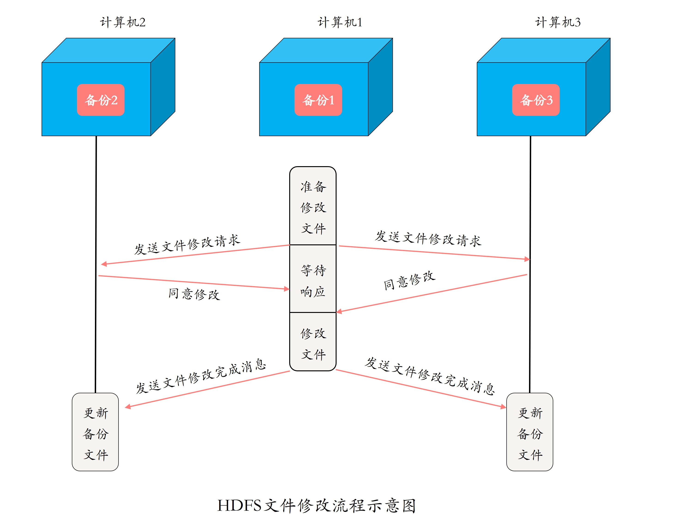

> 归纳一下：分布式算法是一个“先到先得”和“投票全票通过”的公平访问机制，但通信成本较高，可用性也比集中式算法低，适用于临界资源使用频度较低，且系统规模较小的场景。

### 令牌环算法

所有程序构成一个环结构，令牌按照顺时针（或逆时针）方向在程序之间传递，收到令牌的程序有权访问临界资源，访问完成后将令牌传送到下一个程序；若该程序不需要访问临界资源，则直接把令牌传送给下一个程序。

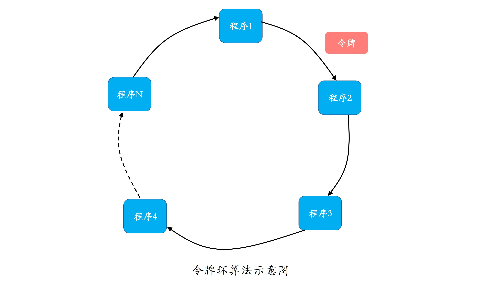

因为在使用临界资源前，不需要像分布式算法那样挨个征求其他程序的意见了，所以相对而言，在令牌环算法里单个程序具有更高的通信效率。同时，在一个周期内，每个程序都能访问到临界资源，因此令牌环算法的公平性很好。

但是，不管环中的程序是否想要访问资源，都需要接收并传递令牌，所以也会带来一些无效通信。假设系统中有 100 个程序，那么程序 1 访问完资源后，即使其它 99 个程序不需要访问，也必须要等令牌在其他 99 个程序传递完后，才能重新访问资源，这就降低了系统的实时性。

> 小结一下：令牌环算法的公平性高，在改进单点故障后，稳定性也很高，适用于系统规模较小，并且系统中每个程序使用临界资源的频率高且使用时间比较短的场景。

## 有适合大规模系统中的分布式互斥算法吗?

可以看到，上面提到的集中式、分布式和令牌环 3 个互斥算法，都不适用于规模过大、节点数量过多的系统。那么，什么样的互斥算法适用于大规模系统呢？

由于大规模系统的复杂性，我们很自然地想到要用一个相对复杂的互斥算法。时下有一个很流行的互斥算法，两层结构的分布式令牌环算法，把整个广域网系统中的节点组织成两层结构，可以用于节点数量较多的系统，或者是广域网系统。

我们知道，广域网由多个局域网组成，因此在该算法中，局域网是较低的层次，广域网是较高的层次。每个局域网中包含若干个局部进程和一个协调进程。局部进程在逻辑上组成一个环形结构，在每个环形结构上有一个局部令牌 T 在局部进程间传递。局域网与局域网之间通过各自的协调进程进行通信，这些协调进程同样组成一个环结构，这个环就是广域网中的全局环。在这个全局环上，有一个全局令牌在多个协调进程间传递。总结

> 本质上可以实用集中式算法+令牌环算法组合来实现大规模互斥

集中式算法：可参照redis集群通信模式，通过hash key将大量的请求分散到不同的master,以处理大量请求,每个master由小集群主从节点来保障单点故障
分布式算法：分布式算法可在集群中过半数同意就识为其同意，降低通信数，如分布式选举场景
令牌环算法：可根据参与者使用频率列出权重，结合平滑加权轮询算法选出下一个参与者

# 分布式选举

提出一个问题对于一个集群来说，多个节点到底是怎么协同，怎么管理的呢。比如，数据库集群，如何保证写入的数据在每个节点上都一致呢?

也许你会说，这还不简单，选一个“领导”来负责调度和管理其他节点就可以了啊。这个想法一点儿也没错。这个“领导”，在分布式中叫做主节点，而选“领导”的过程在分布式领域中叫作分布式选举。然后，你可能还会问，怎么选主呢?

## 为什么进行分布式选举

主节点，在一个分布式集群中负责对其他节点的协调和管理，也就是说，其他节点都必须听从主节点的安排。

主节点的存在，就可以保证其他节点的有序运行，以及数据库集群中的写入数据在每个节点上的一致性。这里的一致性是指，数据在每个集群节点中都是一样的，不存在不同的情况。

当然，如果主故障了，集群就会天下大乱，就好比一个国家的皇帝驾崩了，国家大乱一样。比如，数据库集群中主节点故障后，可能导致每个节点上的数据会不一致。

这，就应了那句话“国不可一日无君”，对应到分布式系统中就是“集群不可一刻无主”。总结来说，选举的作用就是选出一个主节点，由它来协调和管理其他节点，以保证集群有序运行和节点间数据的一致性。

## 分布式选举算法

目前常见的选主方法有基于序号选举的算法（ 比如，Bully 算法）、多数派算法（比如，Raft 算法、ZAB 算法）等

### Bully 算法

Bully 算法是一种霸道的集群选主算法，为什么说是霸道呢？因为它的选举原则是“长者”为大，即在所有活着的节点中，选取 ID 最大的节点作为主节点。

在 Bully 算法中，节点的角色有两种：普通节点和主节点。初始化时，所有节点都是平等的，都是普通节点，并且都有成为主的权利。但是，当选主成功后，有且仅有一个节点成为主节点，其他所有节点都是普通节点。当且仅当主节点故障或与其他节点失去联系后，才会重新选主。

Bully 算法在选举过程中，需要用到以下 3 种消息：

- Election 消息，用于发起选举；
- Alive 消息，对 Election 消息的应答；
- Victory 消息，竞选成功的主节点向其他节点发送的宣誓主权的消息。

Bully 算法选举的原则是“长者为大”，意味着它的假设条件是，集群中每个节点均知道其他节点的 ID。在此前提下，其具体的选举过程是：

1. 集群中每个节点判断自己的 ID 是否为当前活着的节点中 ID 最大的，如果是，则直接向其他节点发送 Victory 消息，宣誓自己的主权；
2. 如果自己不是当前活着的节点中 ID 最大的，则向比自己 ID 大的所有节点发送 Election 消息，并等待其他节点的回复；
3. 若在给定的时间范围内，本节点没有收到其他节点回复的 Alive 消息，则认为自己成为主节点，并向其他节点发送 Victory 消息，宣誓自己成为主节点；若接收到来自比自己 ID 大的节点的 Alive 消息，则等待其他节点发送 Victory 消息；
4. 若本节点收到比自己 ID 小的节点发送的 Election 消息，则回复一个 Alive 消息，告知其他节点，我比你大，重新选举。

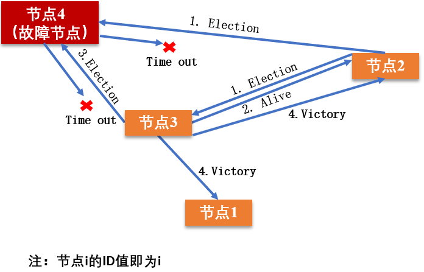

> 其实Victory可以理解成一种特殊的Election

目前已经有很多开源软件采用了 Bully 算法进行选主，比如 MongoDB 的副本集故障转移功能。MongoDB 的分布式选举中，采用节点的最后操作时间戳来表示 ID，时间戳最新的节点其 ID 最大，也就是说时间戳最新的、活着的节点是主节点。

> 小结一下。Bully 算法的选择特别霸道和简单，谁活着且谁的 ID 最大谁就是主节点，其他节点必须无条件服从。这种算法的优点是，选举速度快、算法复杂度低、简单易实现。

但这种算法的缺点在于，需要每个节点有全局的节点信息，因此额外信息存储较多；其次，任意一个比当前主节点 ID 大的新节点或节点故障后恢复加入集群的时候，都可能会触发重新选举，成为新的主节点，如果该节点频繁退出、加入集群，就会导致频繁切主。

### Raft 算法

Raft 算法是典型的多数派投票选举算法，其选举机制与我们日常生活中的民主投票机制类似，核心思想是“少数服从多数”。也就是说，Raft 算法中，获得投票最多的节点成为主。

采用 Raft 算法选举，集群节点的角色有 3 种：

1. 初始化时，所有节点均为 Follower 状态。
2. 开始选主时，所有节点的状态由 Follower 转化为 Candidate，并向其他节点发送选举请求。
3. 其他节点根据接收到的选举请求的先后顺序，回复是否同意成为主。这里需要注意的是，在每一轮选举中，一个节点只能投出一张票。
4. 若发起选举请求的节点获得超过一半的投票，则成为主节点，其状态转化为 Leader，其他节点的状态则由 Candidate 降为 Follower。Leader 节点与 Follower 节点之间会定期发送心跳包，以检测主节点是否活着。
5. 当 Leader 节点的任期到了，即发现其他服务器开始下一轮选主周期时，Leader 节点的状态由 Leader 降级为 Follower，进入新一轮选主。

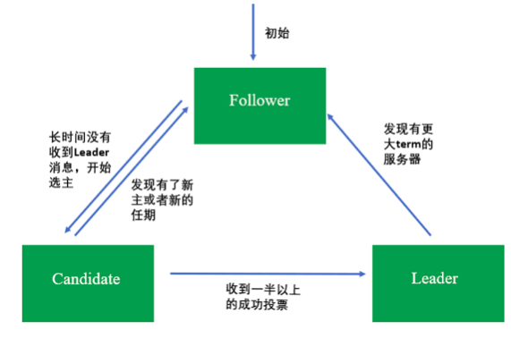

请注意，每一轮选举，每个节点只能投一次票。这种选举就类似人大代表选举，正常情况下每个人大代表都有一定的任期，任期到后会触发重新选举，且投票者只能将自己手里唯一的票投给其中一个候选者。对应到 Raft 算法中，选主是周期进行的，包括选主和任值两个时间段，选主阶段对应投票阶段，任值阶段对应节点成为主之后的任期。但也有例外的时候，如果主节点故障，会立马发起选举，重新选出一个主节点。

Google 开源的 Kubernetes，擅长容器管理与调度，为了保证可靠性，通常会部署 3 个节点用于数据备份。这 3 个节点中，有一个会被选为主，其他节点作为备。Kubernetes 的选主采用的是开源的 etcd 组件。而，etcd 的集群管理器 etcds，是一个高可用、强一致性的服务发现存储仓库，就是采用了 Raft 算法来实现选主和一致性的。

> 小结一下。Raft 算法具有选举速度快、算法复杂度低、易于实现的优点；缺点是，它要求系统内每个节点都可以相互通信，且需要获得过半的投票数才能选主成功，因此通信量大。该算法选举稳定性比 Bully 算法好，这是因为当有新节点加入或节点故障恢复后，会触发选主，但不一定会真正切主，除非新节点或故障后恢复的节点获得投票数过半，才会导致切主。

### ZAB 算法

ZAB（ZooKeeper Atomic Broadcast）选举算法是为 ZooKeeper 实现分布式协调功能而设计的。相较于 Raft 算法的投票机制，ZAB 算法增加了通过节点 ID 和数据 ID 作为参考进行选主，节点 ID 和数据 ID 越大，表示数据越新，优先成为主。相比较于 Raft 算法，ZAB 算法尽可能保证数据的最新性。所以，ZAB 算法可以说是对 Raft 算法的改进。

使用 ZAB 算法选举时，集群中每个节点拥有 3 种角色：

- Leader，主节点；
- Follower，跟随者节点；
- Observer，观察者，无投票权。

选举过程中，集群中的节点拥有 4 个状态：

- Looking 状态，即选举状态。当节点处于该状态时，它会认为当前集群中没有 Leader，因此自己进入选举状态。
- Leading 状态，即领导者状态，表示已经选出主，且当前节点为 Leader。
- Following 状态，即跟随者状态，集群中已经选出主后，其他非主节点状态更新为 Following，表示对 Leader 的追随。
- Observing 状态，即观察者状态，表示当前节点为 Observer，持观望态度，没有投票权和选举权。

投票过程中，每个节点都有一个唯一的三元组 (server_id, server_zxID, epoch)，其中 server_id 表示本节点的唯一 ID；server_zxID 表示本节点存放的数据 ID，数据 ID 越大表示数据越新，选举权重越大；epoch 表示当前选取轮数，一般用逻辑时钟表示。

ZAB 选举算法的核心是“少数服从多数，ID 大的节点优先成为主”，因此选举过程中通过 (vote_id, vote_zxID) 来表明投票给哪个节点，其中 vote_id 表示被投票节点的 ID，vote_zxID 表示被投票节点的服务器 zxID。ZAB 算法选主的原则是：server_zxID 最大者成为 Leader；若 server_zxID 相同，则 server_id 最大者成为 Leader。

接下来，我以 3 个 Server 的集群为例，此处每个 Server 代表一个节点，与你介绍 ZAB 选主的过程。

第一步：当系统刚启动时，3 个服务器当前投票均为第一轮投票，即 epoch=1，且 zxID 均为 0。此时每个服务器都推选自己，并将选票信息 ***<epoch, vote_id, vote_zxID>*** 广播出去。

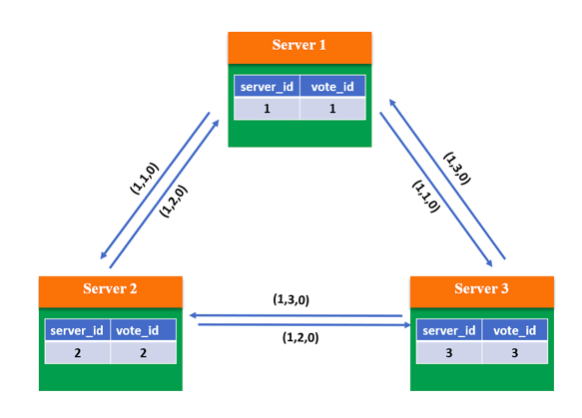

第二步：根据判断规则，由于 3 个 Server 的 epoch、zxID 都相同，因此比较 server_id，较大者即为推选对象，因此 Server 1 和 Server 2 将 vote_id 改为 3，更新自己的投票箱并重新广播自己的投票。

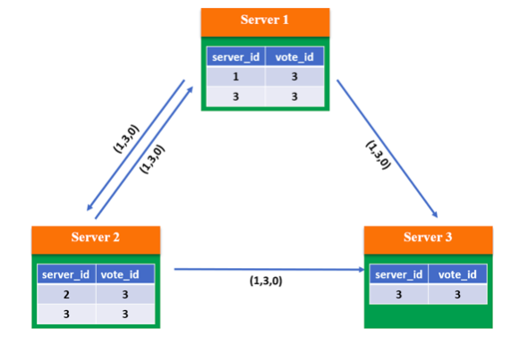

第三步：此时系统内所有服务器都推选了 Server 3，因此 Server 3 当选 Leader，处于 Leading 状态，向其他服务器发送心跳包并维护连接；Server1 和 Server2 处于 Following 状态。

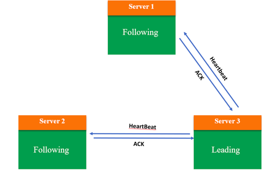

小结一下。ZAB 算法性能高，对系统无特殊要求，采用广播方式发送信息，若节点中有 n 个节点，每个节点同时广播，则集群中信息量为 n*(n-1) 个消息，容易出现广播风暴；且除了投票，还增加了对比节点 ID 和数据 ID，这就意味着还需要知道所有节点的 ID 和数据 ID，所以选举时间相对较长。但该算法选举稳定性比较好，当有新节点加入或节点故障恢复后，会触发选主，但不一定会真正切主，除非新节点或故障后恢复的节点数据 ID 和节点 ID 最大，且获得投票数过半，才会导致切主。

### 三种选举算法的对比分析

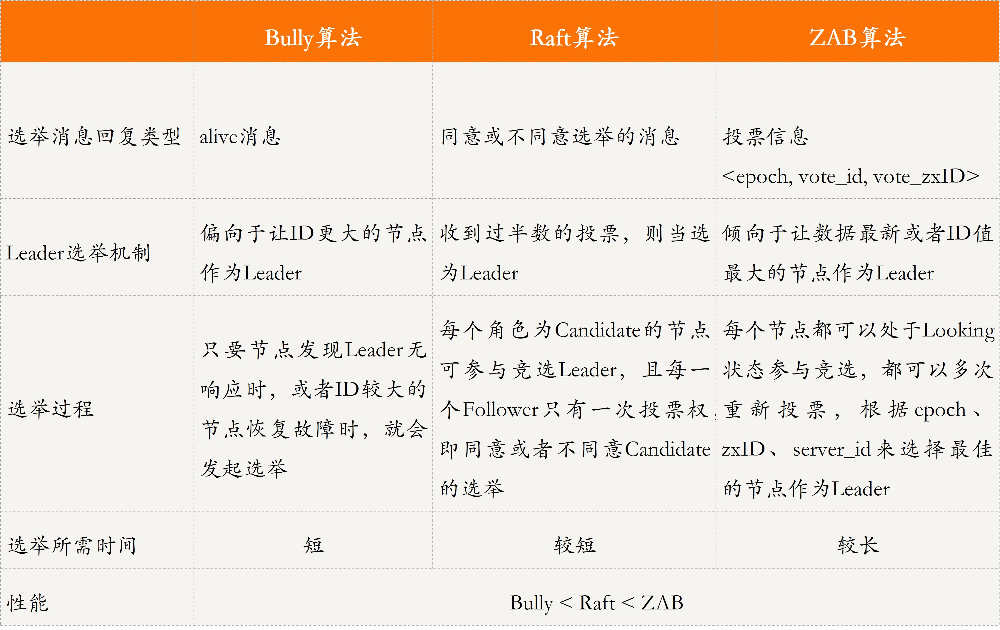

## 引申

> 知识扩展：为什么“多数派”选主算法通常采用奇数节点，而不是偶数节点呢？

多数派选主算法的核心是少数服从多数，获得投票多的节点胜出。想象一下，如果现在采用偶数节点集群，当两个节点均获得一半投票时，到底应该选谁为主呢？

答案是，在这种情况下，无法选出主，必须重新投票选举。但即使重新投票选举，两个节点拥有相同投票数的概率也会很大。因此，多数派选主算法通常采用奇数节点。

这，也是大家通常看到 ZooKeeper、 etcd、Kubernetes 等开源软件选主均采用奇数节点的一个关键原因。

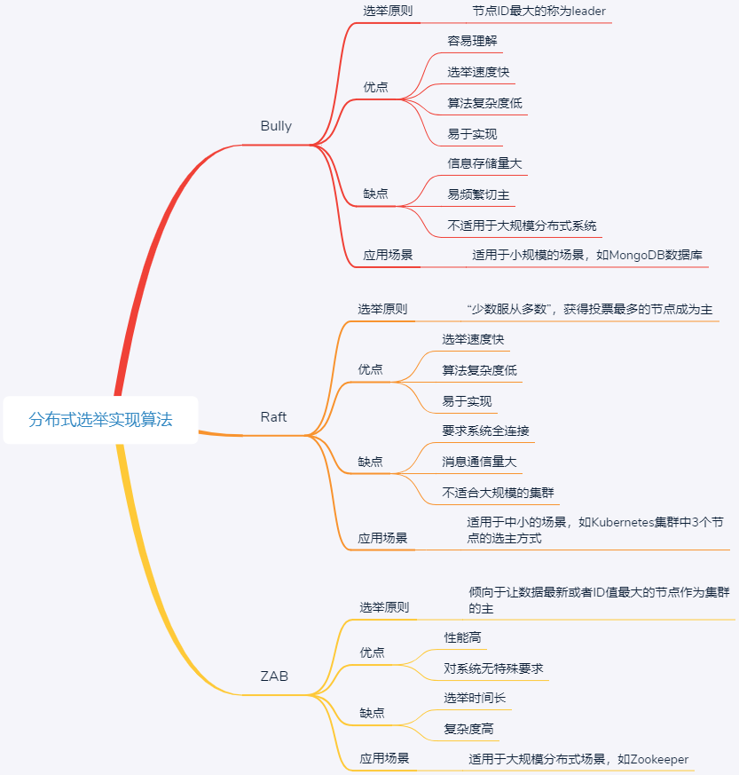

# 分布式共识

从本质上看，分布式选举问题，其实就是传统的分布式共识方法，主要是基于多数投票策略实现的。基于多数投票策略的分布式选举方法，如果用于分布式在线记账一致性问题中，那么记账权通常会完全掌握到主节点的手里，这使得主节点非常容易造假，且存在性能瓶颈

分布式共识就是在多个节点均可独自操作或记录的情况下，使得所有节点针对某个状态达成一致的过程。通过共识机制，我们可以使得分布式系统中的多个节点的数据达成一致。

分布式共识技术，就是区块链技术共识机制的核心

## 知识扩展：一致性与共识的区别是什么？

一致性是指，分布式系统中的多个节点之间，给定一系列的操作，在约定协议的保障下，对外界呈现的数据或状态是一致的。

共识是指，分布式系统中多个节点之间，彼此对某个状态达成一致结果的过程。

也就是说，一致性强调的是结果，共识强调的是达成一致的过程，共识算法是保障系统满足不同程度一致性的核心技术。

# 分布式事务

> 分布式事务，就是在分布式系统中运行的事务，由多个本地事务组合而成

电商处理订单问题，就是典型的分布式事务

要深入理解分布式事务，我们首先需要了解它的特征。分布式事务是多个事务的组合，那么事务的特征 ACID，也是分布式事务的基本特征，其中 ACID 具体含义如下

- 原子性（Atomicity），即事务最终的状态只有两种，全部执行成功和全部不执行。若处理事务的任何一项操作不成功，就会导致整个事务失败。一旦操作失败，所有操作都会被取消（即回滚），使得事务仿佛没有被执行过一样。
- 一致性（Consistency），是指事务操作前和操作后，数据的完整性保持一致或满足完整性约束。比如，用户 A 和用户 B 在银行分别有 800 元和 600 元，总共 1400 元，用户 A 给用户 B 转账 200 元，分为两个步骤，从 A 的账户扣除 200 元和对 B 的账户增加 200 元 ; 一致性就是要求上述步骤操作后，最后的结果是用户 A 还有 600 元，用户 B 有 800 元，总共 1400 元，而不会出现用户 A 扣除了 200 元，但用户 B 未增加的情况 (该情况，用户 A 和 B 均为 600 元，总共 1200 元)。
- 隔离性（Isolation），是指当系统内有多个事务并发执行时，多个事务不会相互干扰，即一个事务内部的操作及使用的数据，对其他并发事务是隔离的。
- 持久性（Durability），也被称为永久性，是指一个事务完成了，那么它对数据库所做的更新就被永久保存下来了。即使发生系统崩溃或宕机等故障，只要数据库能够重新被访问，那么一定能够将其恢复到事务完成时的状态。

## 如何实现分布式事务

实现分布式事务有以下 3 种基本方法：

- 基于 XA 协议的二阶段提交协议方法
- 三阶段提交协议方法
- 基于消息的最终一致性方法

> 其中，基于 XA 协议的二阶段提交协议方法和三阶段提交协议方法，采用了强一致性，遵从 ACID，基于消息的最终一致性方法，采用了最终一致性，遵从 BASE 理论

## 基于 XA 协议的二阶段提交方法

XA 是一个分布式事务协议，规定了事务管理器和资源管理器接口。因此，XA 协议可以分为两部分，即事务管理器和本地资源管理器。

XA 实现分布式事务的原理，就类似于我在第 3 篇文章中与你介绍的集中式算法：事务管理器作为协调者，负责各个本地资源的提交和回滚；而资源管理器就是分布式事务的参与者，通常由数据库实现，比如 Oracle、DB2 等商业数据库都实现了 XA 接口。

基于 XA 协议的二阶段提交方法中，二阶段提交协议（The two-phase commit protocol，2PC），用于保证分布式系统中事务提交时的数据一致性，是 XA 在全局事务中用于协调多个资源的机制。

为了保证它们的一致性，我们需要引入一个协调者来管理所有的节点，并确保这些节点正确提交操作结果，若提交失败则放弃事务。接下来，我们看看两阶段提交协议的具体过程。

> 两阶段提交协议的执行过程，分为投票（voting）和提交（commit）两个阶段。

-  投票为第一阶段，协调者（Coordinator，即事务管理器）会向事务的参与者（Cohort，即本地资源管理器）发起执行操作的 CanCommit 请求，并等待参与者的响应。参与者接收到请求后，会执行请求中的事务操作，记录日志信息但不提交，待参与者执行成功，则向协调者发送“Yes”消息，表示同意操作；若不成功，则发送“No”消息，表示终止操作。

当所有的参与者都返回了操作结果（Yes 或 No 消息）后，系统进入了提交阶段。在提交阶段，协调者会根据所有参与者返回的信息向参与者发送 DoCommit 或 DoAbort 指令：

- 若协调者收到的都是“Yes”消息，则向参与者发送“DoCommit”消息，参与者会完成剩余的操作并释放资源，然后向协调者返回“HaveCommitted”消息；
- 如果协调者收到的消息中包含“No”消息，则向所有参与者发送“DoAbort”消息，此时发送“Yes”的参与者则会根据之前执行操作时的回滚日志对操作进行回滚，然后所有参与者会向协调者发送“HaveCommitted”消息；
- 协调者接收到“HaveCommitted”消息，就意味着整个事务结束了

> 必须保证对于单个机器的回滚操作是可以实现的无故障的

 二阶段提交的算法思路可以概括为：协调者下发请求事务操作，参与者将操作结果通知协调者，协调者根据所有参与者的反馈结果决定各参与者是要提交操作还是撤销操作。

虽然基于 XA 的二阶段提交算法基本满足了事务的 ACID 特性，但依然有些不足 

- 同步阻塞问题：二阶段提交算法在执行过程中，所有参与节点都是事务阻塞型的。也就是说，当本地资源管理器占有临界资源时，其他资源管理器如果要访问同一临界资源，会处于阻塞状态。
- 单点故障问题：基于 XA 的二阶段提交算法类似于集中式算法，一旦事务管理器发生故障，整个系统都处于停滞状态。尤其是在提交阶段，一旦事务管理器发生故障，资源管理器会由于等待管理器的消息，而一直锁定事务资源，导致整个系统被阻塞。
- 数据不一致问题：在提交阶段，当协调者向参与者发送 DoCommit 请求之后，如果发生了局部网络异常，或者在发送提交请求的过程中协调者发生了故障，就会导致只有一部分参与者接收到了提交请求并执行提交操作，但其他未接到提交请求的那部分参与者则无法执行事务提交。于是整个分布式系统便出现了数据不一致的问题。

## 三阶段提交方法

三阶段提交协议（Three-phase commit protocol，3PC），是对二阶段提交（2PC）的改进。为了解决两阶段提交的同步阻塞和数据不一致问题，三阶段提交引入了超时机制和准备阶段。

- 同时在协调者和参与者中引入超时机制。如果协调者或参与者在规定的时间内没有接收到来自其他节点的响应，就会根据当前的状态选择提交或者终止整个事务。
- 在第一阶段和第二阶段中间引入了一个准备阶段，也就是在提交阶段之前，加入了一个预提交阶段。在预提交阶段排除一些不一致的情况，保证在最后提交之前各参与节点的状态是一致的。

也就是说，除了引入超时机制之外，3PC 把 2PC 的提交阶段一分为二，这样三阶段提交协议就有 CanCommit、PreCommit、DoCommit 三个阶段。

### 第一，CanCommit 阶段。

CanCommit 阶段与 2PC 的投票阶段类似：协调者向参与者发送请求操作（CanCommit 请求），询问参与者是否可以执行事务提交操作，然后等待参与者的响应；参与者收到 CanCommit 请求之后，回复 Yes，表示可以顺利执行事务；否则回复 No。
CanCommit 阶段不同节点之间的事务请求成功和失败的流程，如下所示。

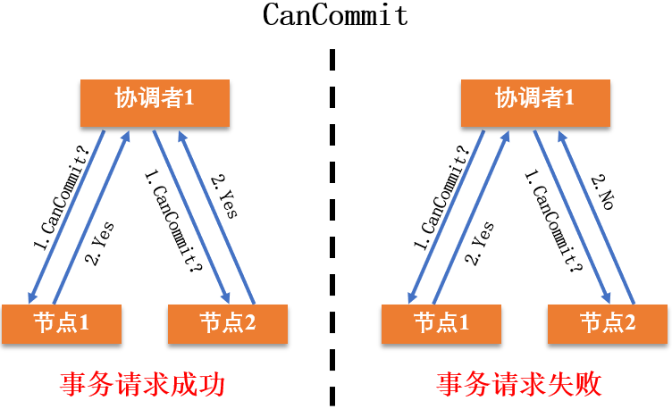

### 第二，PreCommit 阶段。

协调者根据参与者的回复情况，来决定是否可以进行 PreCommit 操作。

- 如果所有参与者回复的都是“Yes”，那么协调者就会执行事务的预执行：
- - 发送预提交请求。协调者向参与者发送 PreCommit 请求，进入预提交阶段。
- - 事务预提交。参与者接收到 PreCommit 请求后执行事务操作，并将 Undo 和 Redo 信息记录到事务日志中。
- - 响应反馈。如果参与者成功执行了事务操作，则返回 ACK 响应，同时开始等待最终指令。

- 假如任何一个参与者向协调者发送了“No”消息，或者等待超时之后，协调者都没有收到参与者的响应，就执行中断事务的操作：
- - 发送中断请求。协调者向所有参与者发送“Abort”消息。
- - 中断事务。参与者收到“Abort”消息之后，或超时后仍未收到协调者的消息，执行事务的中断操作。

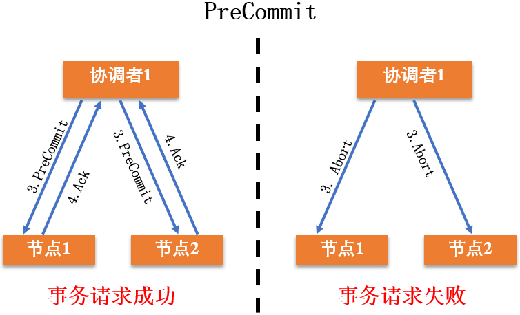

### 第三，DoCommit 阶段。

DoCmmit 阶段进行真正的事务提交，根据 PreCommit 阶段协调者发送的消息，进入执行提交阶段或事务中断阶段。

- 执行提交阶段：
- - 发送提交请求。协调者接收到所有参与者发送的 Ack 响应，从预提交状态进入到提交状态，并向所有参与者发送 DoCommit 消息。
- - 事务提交。参与者接收到 DoCommit 消息之后，正式提交事务。完成事务提交之后，释放所有锁住的资源。
- - 响应反馈。参与者提交完事务之后，向协调者发送 Ack 响应。
- - 完成事务。协调者接收到所有参与者的 Ack 响应之后，完成事务。

- 事务中断阶段：

- - 发送中断请求。协调者向所有参与者发送 Abort 请求。
- - 事务回滚。参与者接收到 Abort 消息之后，利用其在 PreCommit 阶段记录的 Undo 信息执行事务的回滚操作，并释放所有锁住的资源。
- - 反馈结果。参与者完成事务回滚之后，向协调者发送 Ack 消息。
- - 中断事务。协调者接收到参与者反馈的 Ack 消息之后，执行事务的中断，并结束事务。

执行阶段不同节点上事务执行成功和失败 (事务中断) 的流程，如下所示。

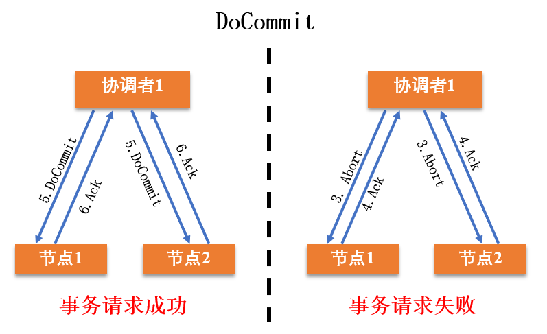

在 DoCommit 阶段，当参与者向协调者发送 Ack 消息后，如果长时间没有得到协调者的响应，在默认情况下，参与者会自动将超时的事务进行提交，不会像两阶段提交那样被阻塞住。

## 基于分布式消息的最终一致性方案

2PC 和 3PC 这两种方法，有两个共同的缺点，一是都需要锁定资源，降低系统性能；二是，没有解决数据不一致的问题。因此，便有了通过分布式消息来确保事务最终一致性的方案。

在 eBay 的分布式系统架构中，架构师解决一致性问题的核心思想就是：将需要分布式处理的事务通过消息或者日志的方式异步执行，消息或日志可以存到本地文件、数据库或消息队列中，再通过业务规则进行失败重试。这个案例，就是使用基于分布式消息的最终一致性方案解决了分布式事务的问题。

基于分布式消息的最终一致性方案的事务处理，引入了一个消息中间件（Message Queue，MQ），用于在多个应用之间进行消息传递。基于消息中间件协商多个节点分布式事务执行操作的示意图，如下所示。

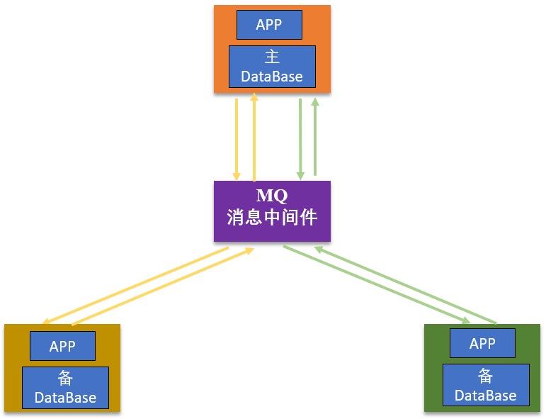

## 刚性事务与柔性事务

在讨论事务的时候，我们经常会提到刚性事务与柔性事务，但却很难区分这两种事务。所以，今天的知识扩展内容，我就来和你说说什么是刚性事务、柔性事务，以及两者之间有何区别？

- 刚性事务，遵循 ACID 原则，具有强一致性。比如，数据库事务。
- 柔性事务，其实就是根据不同的业务场景使用不同的方法实现最终一致性，也就是说我们可以根据业务的特性做部分取舍，容忍一定时间内的数据不一致。

总结来讲，与刚性事务不同，柔性事务允许一定时间内，不同节点的数据不一致，但要求最终一致。而柔性事务的最终一致性，遵循的是 BASE 理论。

### BASE 理论 

BASE 理论包括基本可用（Basically Available）、柔性状态（Soft State）和最终一致性（Eventual Consistency）。

- 基本可用：分布式系统出现故障的时候，允许损失一部分功能的可用性。比如，某些电商 618 大促的时候，会对一些非核心链路的功能进行降级处理。
- 柔性状态：在柔性事务中，允许系统存在中间状态，且这个中间状态不会影响系统整体可用性。比如，数据库读写分离，写库同步到读库（主库同步到从库）会有一个延时，其实就是一种柔性状态。
- 最终一致性：事务在操作过程中可能会由于同步延迟等问题导致不一致，但最终状态下，数据都是一致的。

可见，BASE 理论为了支持大型分布式系统，通过牺牲强一致性，保证最终一致性，来获得高可用性，是对 ACID 原则的弱化。具体到今天的三种分布式事务实现方式，二阶段提交、三阶段提交方法，遵循的是 ACID 原则，而消息最终一致性方案遵循的就是 BASE 理论。

# 分布式锁

锁是实现多线程同时访问同一共享资源，保证同一时刻只有一个线程可访问共享资源所做的一种标记

与普通锁不同的是，分布式锁是指分布式环境下，系统部署在多个机器中，实现多进程分布式互斥的一种锁。为了保证多个进程能看到锁，锁被存在公共存储（比如 Redis、Memcache、数据库等三方存储中），以实现多个进程并发访问同一个临界资源，同一时刻只有一个进程可访问共享资源，确保数据的一致性。

## 分布式锁的三种实现方法及对比

接下来，我带你看看实现分布式锁的 3 种主流方法，即：

- 基于数据库实现分布式锁，这里的数据库指的是关系型数据库；
- 基于缓存实现分布式锁；
- 基于 ZooKeeper 实现分布式锁。

### 基于数据库实现分布式锁

当我们要锁住某个资源时，就在该表中增加一条记录，想要释放锁的时候就删除这条记录。

基于数据库实现的分布式锁，是最容易理解的。但是，因为数据库需要落到硬盘上，频繁读取数据库会导致 IO 开销大，因此这种分布式锁适用于并发量低，对性能要求低的场景。

基于数据库实现的分布式锁比较简易，绝招在于创建一张锁表，为申请者在锁表里建立一条记录，记录建立成功则获得锁，消除记录则释放锁。该方法依赖于数据库，主要有两个缺点：

- 单点故障问题。一旦数据库不可用，会导致整个系统崩溃。
- 死锁问题。数据库中的数据没有失效时间，获取了锁的服务如果崩溃了 , 没有修改数据库表中的信息将会导致异常 -> 可以使用超时时间进行判断

### 基于缓存实现分布式锁

Redis 通常可以使用 setnx(key, value) 函数来实现分布式锁。key 和 value 就是基于缓存的分布式锁的两个属性，其中 key 表示锁 id，value = currentTime + timeOut，表示当前时间 + 超时时间。也就是说，某个进程获得 key 这把锁后，如果在 value 的时间内未释放锁，系统就会主动释放锁。

setnx 函数的返回值有 0 和 1：

- 返回 1，说明该服务器获得锁，setnx 将 key 对应的 value 设置为当前时间 + 锁的有效时间。
- 返回 0，说明其他服务器已经获得了锁，进程不能进入临界区。该服务器可以不断尝试 setnx 操作，以获得锁。

相对于基于数据库实现分布式锁的方案来说，基于缓存实现的分布式锁的优势表现在以下几个方面：

- 性能更好。数据被存放在内存，而不是磁盘，避免了频繁的 IO 操作。
- 很多缓存可以跨集群部署，避免了单点故障问题。
- 多缓存服务都提供了可以用来实现分布式锁的方法，比如 Redis 的 setnx 方法等。
- 可以直接设置超时时间来控制锁的释放，因为这些缓存服务器一般支持自动删除过期数据。

这个方案的不足是，通过超时时间来控制锁的失效时间，并不是十分靠谱，因为一个进程执行时间可能比较长，或受系统进程做内存回收等影响，导致时间超时，从而不正确地释放了锁。

### 基于 ZooKeeper 实现分布式锁

ZooKeeper 基于树形数据存储结构实现分布式锁，来解决多个进程同时访问同一临界资源时，数据的一致性问题。ZooKeeper 的树形数据存储结构主要由 4 种节点构成：

- 持久节点。这是默认的节点类型，一直存在于 ZooKeeper 中。
- 持久顺序节点。也就是说，在创建节点时，ZooKeeper 根据节点创建的时间顺序对节点进行编号。
- 临时节点。与持久节点不同，当客户端与 ZooKeeper 断开连接后，该进程创建的临时节点就会被删除。
- 临时顺序节点，就是按时间顺序编号的临时节点。

### 根据它们的特征，ZooKeeper 基于临时顺序节点实现了分布锁。

还是以电商售卖吹风机的场景为例。假设用户 A、B、C 同时在 11 月 11 日的零点整提交了购买吹风机的请求，ZooKeeper 会采用如下方法来实现分布式锁：

1. 在与该方法对应的持久节点 shared_lock 的目录下，为每个进程创建一个临时顺序节点。如下图所示，吹风机就是一个拥有 shared_lock 的目录，当有人买吹风机时，会为他创建一个临时顺序节点。
2. 每个进程获取 shared_lock 目录下的所有临时节点列表，注册子节点变更的 Watcher，并监听节点。
3. 每个节点确定自己的编号是否是 shared_lock 下所有子节点中最小的，若最小，则获得锁。例如，用户 A 的订单最先到服务器，因此创建了编号为 1 的临时顺序节点 LockNode1。该节点的编号是持久节点目录下最小的，因此获取到分布式锁，可以访问临界资源，从而可以购买吹风机。
4. 若本进程对应的临时节点编号不是最小的，则分为两种情况： a. 本进程为读请求，如果比自己序号小的节点中有写请求，则等待； b. 本进程为写请求，如果比自己序号小的节点中有读请求，则等待。

例如，用户 B 也想要买吹风机，但在他之前，用户 C 想看看吹风机的库存量。因此，用户 B 只能等用户 A 买完吹风机、用户 C 查询完库存量后，才能购买吹风机。

可以看到，使用 ZooKeeper 可以完美解决设计分布式锁时遇到的各种问题，比如单点故障、不可重入、死锁等问题。虽然 ZooKeeper 实现的分布式锁，几乎能涵盖所有分布式锁的特性，且易于实现，但需要频繁地添加和删除节点，所以性能不如基于缓存实现的分布式锁。

值得注意的是，这里的实现复杂性，是针对同样的分布式锁的实现复杂性，与之前提到的基于数据库的实现非常简易不一样。基于数据库实现的分布式锁存在单点故障和死锁问题，仅仅利用数据库技术去解决单点故障和死锁问题，是非常复杂的。而 ZooKeeper 已定义相关的功能组件，因此可以很轻易地解决设计分布式锁时遇到的各种问题。所以说，要实现一个完整的、无任何缺陷的分布式锁，ZooKeeper 是一个最简单的选择。

从上述分析可看出，为了确保分布式锁的可用性，我们在设计时应考虑到以下几点：

- 互斥性，即在分布式系统环境下，分布式锁应该能保证一个资源或一个方法在同一时间只能被一个机器的一个线程或进程操作。
- 具备锁失效机制，防止死锁。即使有一个进程在持有锁的期间因为崩溃而没有主动解锁，也能保证后续其他进程可以获得锁。
- 可重入性，即进程未释放锁时，可以多次访问临界资源。
- 有高可用的获取锁和释放锁的功能，且性能要好。

### 如何解决分布式锁的羊群效应问题？

在分布式锁问题中，会经常遇到羊群效应。所谓羊群效应，就是在整个分布式锁的竞争过程中，大量的“Watcher 通知”和“子节点列表的获取”操作重复运行，并且大多数节点的运行结果都是判断出自己当前并不是编号最小的节点，继续等待下一次通知，而不是执行业务逻辑。

这，就会对 ZooKeeper 服务器造成巨大的性能影响和网络冲击。更甚的是，如果同一时间多个节点对应的客户端完成事务或事务中断引起节点消失，ZooKeeper 服务器就会在短时间内向其他客户端发送大量的事件通知。

那如何解决这个问题呢？具体方法可以分为以下三步。

1. 在与该方法对应的持久节点的目录下，为每个进程创建一个临时顺序节点。
2. 每个进程获取所有临时节点列表，对比自己的编号是否最小，若最小，则获得锁。
3. 若本进程对应的临时节点编号不是最小的，则继续判断：
- - 若本进程为读请求，则向比自己序号小的最后一个写请求节点注册 watch 监听，当监听到该节点释放锁后，则获取锁；
- - 若本进程为写请求，则向比自己序号小的最后一个请求节点注册 watch 监听，当监听到该节点释放锁后，获取锁。
