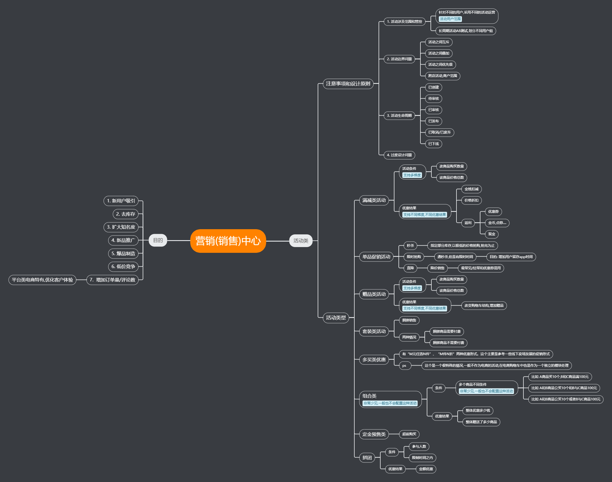
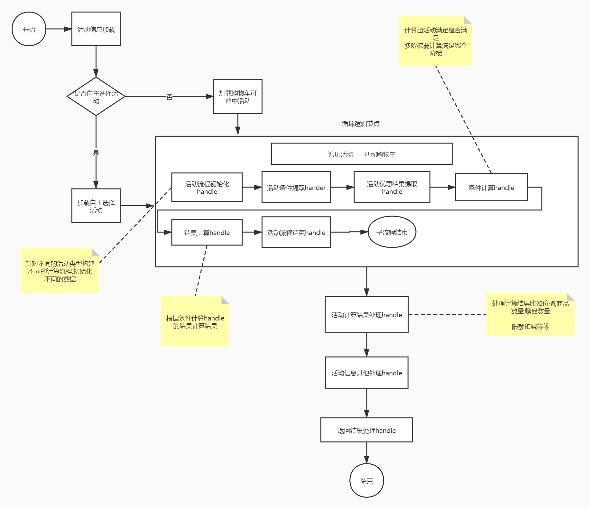

# 营销系统构建开发的核心的思路 -> 去设计模式,规则化

## 为什么要去设计模式? -> 设计模式很优秀,但是设计模式是有极限的.

设计模式的时候,需要对系统的扩展点有充分的了解才能真正的将设计模式设计好 , 但是作为互联网的营销业务,存在变化快,玩法多,规则复杂,存在特殊等情况 , 导致我们很难真正的预估扩展点到底在哪里 , 导致系统过度设计 , 增加许多复杂逻辑

> 设计模式是写框架的技术,并不是写业务的技术

## 为什么要规则化?

> 其实是一种想法 , 将复杂的业务逻辑简化成一种规则 , 一种流程 

> ps : 这个东西比较抽象 , 需要经历一定的业务复杂度才能正真的理解

# 如何用流程化和规则化来设计营销中心

## 1. 营销中心规则梳理

通过上面的各种活动的形式,我们的活动计算逻辑(不包括用户维度限制)可以抽象一个这种模型

1. 将所有的活动的优惠结果想象成一种结论 , 包括
- - 对活动对应的商品单品的金额影响
- - 对活动对应的商品组合的金额影响
- - 对整个订单的金额影响
- - 对活动对应的商品单品的附属商品的影响
- - 对活动对应的商品组合的附属商品的影响
- - 对活动对应整个订单的附属商品的影响

2. 将所有的活动条件想象成一种规则包括

- - (1) 单商品,多梯度,价格限制
- - (2) 单商品,多梯度,数量限制
- - (3) 任意数量 (1) (2) 逻辑运算

> 抽象成这样, 一个活动的计算流程就会简化成由活动条件到优惠结果或者说规则到结论的一种映射

## 2. 营销活动类具体的计算流程应该怎么做

> 本质上就是将各个部分分解

> 其中每一个handle都可以做水平扩展 , 最大限度的保证逻辑的清晰

# 这套系统的设计哲学

营销本身很复杂 , 所以我们就抛开复杂的营销的活动 , 用基本的模型去抽象匹配它 , 这样我们就能简化计算逻辑 , 实现更灵活 , 更以扩展的营销系统