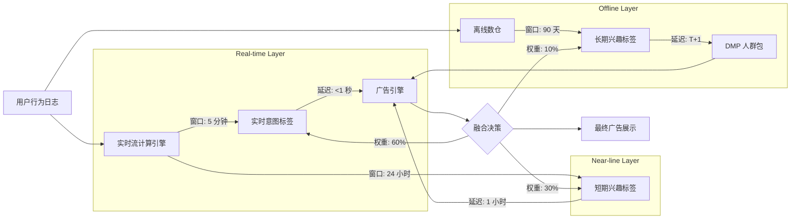
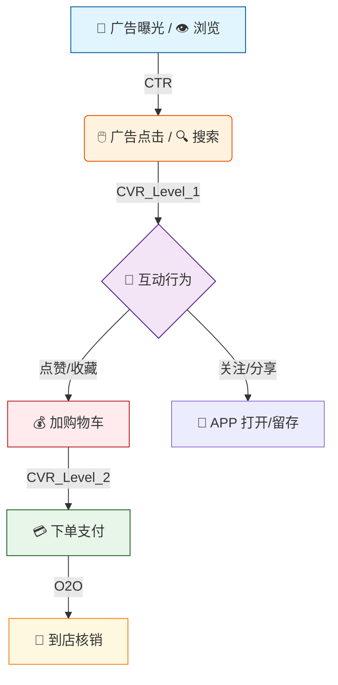
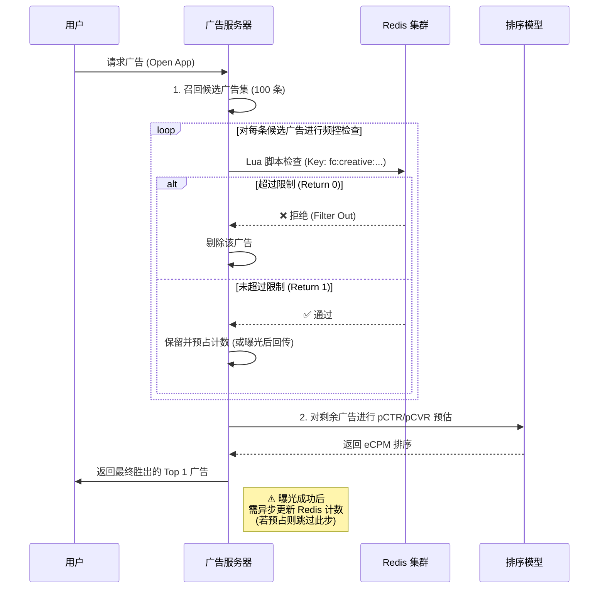
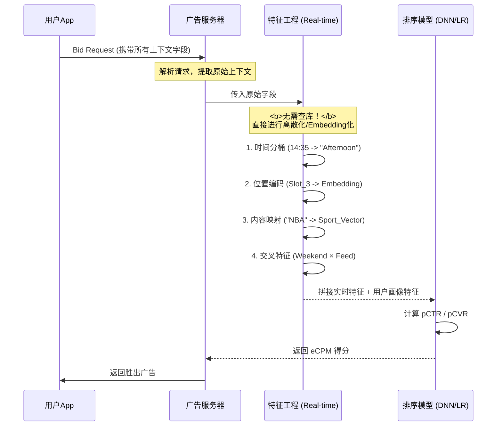
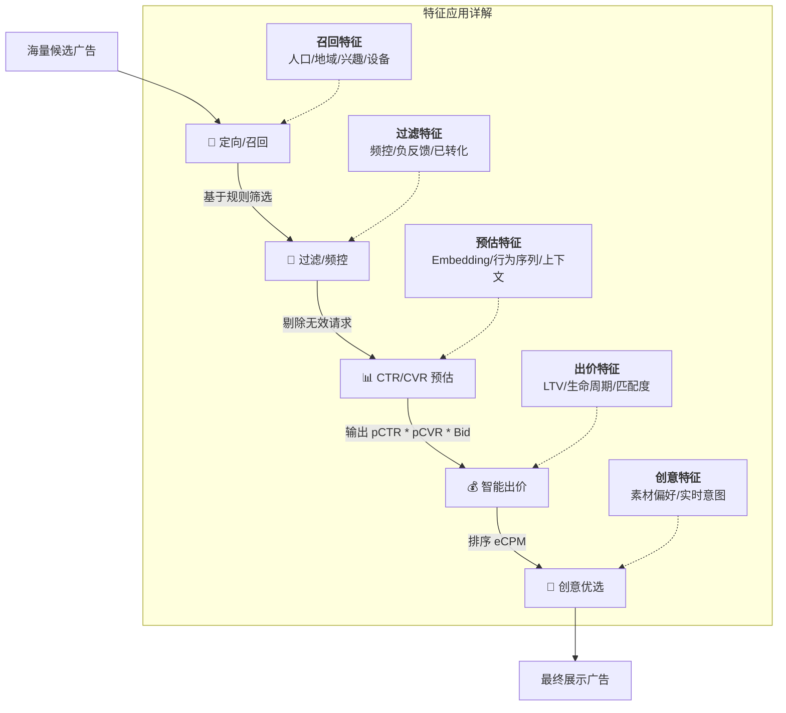

Now I have enough material to give you a thorough answer. "上下文解析"在生产环境中并不是一个单体模块，而是由多个并行或串行的子系统协作完成的。我按照实际的数据流来拆解。

---

## 一、原始请求里到底带了什么

理解上下文解析的第一步，是搞清楚一次广告请求的原始载体长什么样。在程序化广告（RTB）场景下，这个载体就是 **OpenRTB BidRequest**——它是 IAB 定义的行业标准协议，几乎所有主流 Ad Exchange（Google AdX、Xandr、Index Exchange 等）都遵循。一次 RTB 交易始于 Exchange 向 Bidder 发送一个 bid request，它由顶层的 BidRequest 对象、至少一个 impression 对象组成，并可选地包含提供展示上下文的附加对象。

一个真实的 BidRequest JSON 大概长这样（来自公开的 OpenRTB 示例）：

```json
{
  "id": "d4b5c697-...",
  "imp": [{ "id": "1", "banner": {"w": 300, "h": 250}, "bidfloor": 0.5 }],
  "site": {
    "id": "12345",
    "domain": "sitedomain.com",
    "cat": ["IAB25-3"],
    "page": "https://sitedomain.com/page",
    "keywords": "lifestyle, humour"
  },
  "device": {
    "ua": "Mozilla/5.0 (iPhone; CPU iPhone OS 8_1_2 ...) ...",
    "ip": "8.8.8.8",
    "geo": {"lat": 0, "lon": 0, "country": "USA", "region": "CA", "city": "Mountain View"},
    "make": "Apple", "model": "iphone", "os": "iOS", "osv": "8",
    "connectiontype": 2,
    "ifa": "03F..."
  },
  "user": { "id": "57592f...", "buyeruid": "..." }
}
```

可以看到，BidRequest 里包含了 device 对象（UA 字符串、IP、设备型号、OS 版本、连接类型）、geo 对象（国家/地区/城市/经纬度）、site 或 app 对象（域名、页面 URL、IAB 内容分类、关键词），以及 user 对象（用户 ID、buyer UID）。

**上下文解析的任务，就是把这些半结构化的原始字段，解析、补全、映射成下游模型和定向系统能直接使用的标准化特征。**

---

## 二、五条并行的解析子链路

在生产环境中，为了把总延迟控制在个位数毫秒以内，这些子任务通常是**并行**执行的：

### 2.1 设备解析（Device Parsing）

**输入**：User-Agent 字符串 + 可选的 Client Hints（SUA 对象）

**做什么**：从 UA 字符串中提取操作系统（iOS/Android/Windows）、浏览器（Chrome/Safari）、设备型号、是否移动端等信息。业界通用的做法是在服务端解析 UA 字符串，使用正则表达式和 UA 解析库的组合来提取设备型号、操作系统及版本、浏览器及版本、平台类型等信息。

**生产案例**：

Google 的 Authorized Buyers 在 BidRequest 中同时传递传统的 `device.ua` 字符串和结构化的 `device.sua` 对象。其 proto 定义中包含了 `hardware_version`（如 iPhone12,1）、`limit_ad_tracking` 标志位，以及 App Tracking Transparency 状态等字段。之所以引入 SUA，是因为传统 UA 字符串在隐私趋势下被逐步冻结（Chrome 的 User-Agent Reduction），结构化数据是更可靠的替代。

在自有媒体（如抖音、微信朋友圈）场景中，客户端 SDK 会直接上报设备信息，不需要解析 UA 字符串——设备型号、OS 版本、屏幕分辨率、OAID/IDFA 等数据在 SDK 层就已经结构化了。

### 2.2 地理位置解析（Geo Resolution）

**输入**：IP 地址（必选）+ GPS 经纬度（可选，App 场景较多）

**做什么**：将 IP 地址映射为国家、省/州、城市、邮编、运营商（ISP）、连接类型等。

**生产案例**：

行业里的事实标准是 **MaxMind GeoIP**。MaxMind 的 GeoIP 数据可用于个性化地域内容和广告、分析流量、防止网络地理定位问题，数据有多种格式可供集成，包括可下载的本地数据库和通过 API 访问的 Web 服务。MaxMind 基本上创建了 IP 地理定位行业，仍然是其他服务对标的黄金标准，拥有超过 20 年的持续数据库优化，覆盖 99.9999% 的活跃 IP 地址。

在实际部署中，高 QPS 的广告系统会将 MaxMind 数据库（MMDB 格式）加载到本地内存，做纯内存查询，单次查询延迟在亚毫秒级。在 Google 的 OpenRTB 实现中，粗粒度的设备地理位置信息是基于广告请求来源 IP 地址近似估算的，经纬度代表一个圆的中心点，accuracy 字段表示其半径。

对于 App 场景，如果用户授权了 GPS 权限，客户端会上报精确的经纬度，精度可达几十米级。这时系统会优先使用 GPS 数据而非 IP 推断。

### 2.3 用户 ID 映射（Identity Resolution）

**输入**：请求中携带的各种 ID（Cookie ID、IDFA、OAID、设备指纹等）

**做什么**：将这些异构 ID 统一映射到系统内部的唯一用户标识（Unified ID），以便后续检索用户画像。

**生产案例**：

OpenRTB 的 User 对象中，`buyeruid` 是 Exchange 为买方映射的用户 ID，除非买卖双方有事先约定，否则这个值通常来自 ID 同步（Cookie Sync）过程。

在国内平台（如巨量引擎、腾讯广告）上，这一步更多是 OAID/CAID/手机号哈希等多 ID 的归一化。跨设备、跨 App 的 ID 打通（ID Graph）是这一步最复杂的部分——需要维护一张大规模的映射表来关联同一个人在不同设备和 App 上的 ID。

### 2.4 页面/内容语义解析（Content Classification）

**输入**：页面 URL、域名、页面关键词、页面正文（部分场景）

**做什么**：判断广告将要出现在什么类型的内容旁边——这既服务于定向投放（如投放到体育类页面），也服务于品牌安全（如避免出现在暴力内容旁边）。

**生产案例**：

这个领域有两层做法：

**第一层：Exchange 侧的标准分类。** 在 OpenRTB 中，Publisher 会在 `site.cat` 字段中声明页面的 IAB 内容分类（如 `IAB25-3` = 时尚）。但这个分类是 Publisher 自己打的，粒度粗、更新慢，可信度有限。

**第二层：第三方验证公司的深度分析。** 这是目前行业的主流做法。IAS 使用先进的上下文技术、机器学习和多媒体分类来实时评估内容，其专利的认知语义技术使用 NLP 来动态理解上下文的细微差别，包括情感和情绪分析。DoubleVerify 的 Universal Content Intelligence 引擎利用 AI 技术分析视频、图片、音频、语音、文本和链接，将信息分类到超过 100 个类别中供品牌选择屏蔽。

在 IAS 的实际运营中，关键词仅占买方开放网络流量中被屏蔽或标记的展示的 0.25%，绝大部分分类决策已经由 AI 驱动的全页面上下文分析完成。

在自有媒体平台上（如抖音信息流），内容语义分析更为深入——系统在内容发布阶段就已经用 NLP/CV 模型完成了文本分类、视频标签提取、情感分析等，这些标签直接存入内容索引，广告请求时只需查表，不需要实时分析。字节跳动的系统建立在内容分析和用户标签挖掘的基础之上，需要对内容和用户都进行标签提取，内容分析包括文本分析、图像分析和视频分析。

### 2.5 网络环境与隐私信号解析

**输入**：连接类型、隐私相关字段（GDPR consent string、CCPA 信号、ATT 状态等）

**做什么**：判断用户的网络环境（WiFi/4G/5G 影响素材选择——弱网环境下不应投放大尺寸视频广告），以及解析隐私合规信号以决定哪些定向能力可用。

Google 的 BidRequest 中包含了 `NonPersonalizedAdsReason` 枚举，标识广告不应做个性化投放的原因（如 Publisher 声明、用户隐私偏好等），以及 `limit_ad_tracking` 和 `app_tracking_authorization_status` 字段。

这些信号直接决定了下游的"定向过滤"环节能使用什么粒度的定向能力——如果用户处于 GDPR 严格限制下或 iOS ATT 拒绝追踪，系统只能使用上下文定向，不能使用行为定向。

---

## 三、解析结果怎么输出

所有子链路的解析结果最终汇聚成一个**标准化的 Feature Map**，类似：

```
request_features = {
  device_os: "iOS",
  device_model: "iPhone14,2",
  screen_size: "1170x2532",
  connection: "WiFi",
  geo_country: "CN",
  geo_province: "guangdong",
  geo_city: "shenzhen",
  geo_source: "GPS",          // GPS vs IP推断
  unified_user_id: "u_abc123",
  page_category: ["IAB19-6", "IAB19-18"],   // 科技-手机
  page_sentiment: "positive",
  brand_safety_level: "safe",
  privacy_mode: "full_targeting",  // vs limited vs contextual_only
  network_carrier: "China Mobile",
  time_of_day: 14,
  day_of_week: 5,
  ...
}
```

这个 Feature Map 会被后续的每一个环节消费：定向过滤用它匹配广告主的投放条件，召回用它做向量化检索的 query 构建，粗排/精排用它作为模型输入特征的一部分。

---

## 四、工程上的关键约束

整个上下文解析环节在生产中面临一个硬约束：**总延迟不能超过 5~10ms**。因为整条广告链路的端到端预算通常在 50~100ms 以内，留给上下文解析的窗口极其有限。

所以你会看到几个共性的工程选择：MaxMind 数据库加载到本地内存而非远程调用；UA 解析用预编译的正则引擎；页面语义分类在内容发布时预计算而非请求时实时分析；多个子链路并行执行而非串行瀑布。这些设计都是为了在极短时间内把原始请求翻译成模型和业务规则能理解的标准化语言。


### 📍 地理位置与场景层 — 从“实时定位”到“生活轨迹”

> **💡 核心逻辑**：该层级数据通过**实时信号**（竞价请求）与**离线挖掘**（历史轨迹聚类）相结合，将离散的经纬度坐标转化为用户的**居住地、工作地、当前场景及流动状态**。

| 字段 | 示例值 | 业务含义与生产来源解析 |
| :--- | :--- | :--- |
| **home_city** | `110100` | **常驻城市代码**。🔹 **来源**：离线聚类。提取用户历史GPS打点，筛选 **夜间 (22:00-07:00)** 高频出现的位置进行聚类，映射为城市ID。 |
| **home_district** | `110105` | **常驻区县代码**（如：朝阳区）。🔹 **来源**：同上，基于夜间聚类中心的行政区划映射。用于精细化本地生活投放。 |
| **home_geohash** | `wx4g0e` | **常驻位置 GeoHash**。🔹 **来源**：夜间聚类中心点的 GeoHash 编码（精度约 ~1km）。用于LBS围栏匹配和附近推荐。 |
| **work_city** | `110100` | **工作城市代码**。🔹 **来源**：离线聚类。筛选 **工作日白天 (09:00-18:00)** 且非夜间居住地的高频位置，映射为城市ID。 |
| **work_district** | `110108` | **工作区县代码**（如：海淀区）。🔹 **来源**：同上，基于工作日白天聚类中心的行政区划映射。用于写字楼商圈定向。 |
| **work_geohash** | `wx4ex2` | **工作位置 GeoHash**。🔹 **来源**：工作日白天聚类中心点的 GeoHash 编码。 |
| **province_id** | `11` | **省份ID**。🔹 **来源**：由 `home_city` 或 `realtime` 位置反查静态行政区划表得出。 |
| **city_tier** | `1` | **城市等级**。🔹 **来源**：静态映射表。`1`=一线, `2`=新一线, `3`=二线... 用于区分市场下沉策略。 |
| **realtime_lat** | `39.9042` | **实时纬度**。🔹 **来源**：**实时信号**。直接从 Ad Bid Request 中的 `device.geo` 字段获取（源自 GPS 或 IP 解析）。 |
| **realtime_lon** | `116.4074` | **实时经度**。🔹 **来源**：同上，实时竞价请求携带。 |
| **realtime_poi** | `商圈/写字楼` | **实时 POI 类型**。🔹 **来源**：将 `realtime_lat/lon` 与地图 POI 数据库碰撞，识别当前所在的具体兴趣点类型（如：购物中心、机场、住宅区）。 |
| **scene_type** | `3` | **当前场景标签**。🔹 **来源**：规则引擎 + 模型推断。`1`=家 (匹配 home_geohash)`2`=公司 (匹配 work_geohash)`3`=通勤 (两点之间移动)`4`=商圈 (POI匹配)`5`=旅行 (异地非常驻) |
| **mobility_type** | `2` | **流动性/人口属性**。🔹 **来源**：基于近期轨迹分析。`1`=本地居民 (长期在本地)`2`=常驻外来 (长期在非户籍地)`3`=出差/旅游 (短期异地) |
| **visited_cities** | `[310100, 440100]` | **最近访问城市列表**。🔹 **来源**：滑动时间窗口统计（如近30天），记录用户产生过有效定位的城市ID集合。用于跨城营销（如酒店、机票）。 |

---

#### 🏭 数据生产流水线详解

1.  **实时层 (Real-time Stream)**
    *   **输入**：每次广告竞价请求 (Bid Request) 携带的 `device.geo` (GPS/IP)。
    *   **处理**：
        *   解析经纬度。
        *   即时碰撞 POI 库 $\rightarrow$ 生成 `realtime_poi`。
        *   对比常驻位置库 $\rightarrow$ 生成 `scene_type` (是在家？在公司？还是在路上？)。

2.  **离线层 (Offline Batch - T+1)**
    *   **输入**：过去 30-90 天的全量历史 GPS 打点日志。
    *   **算法**：**DBSCAN 聚类算法** (基于密度的空间聚类)。
        *   **步骤 1 (过滤)**：按时间段切分数据（夜间包 vs 工作日白天包）。
        *   **步骤 2 (聚类)**：寻找高密度点群，去除噪点（偶尔去一次的餐馆不算家）。
        *   **步骤 3 (标识)**：
            *   夜间簇中心 $\rightarrow$ **Home**。
            *   日间簇中心 $\rightarrow$ **Work**。
        *   **步骤 4 (映射)**：将中心点坐标逆地理编码 (Reverse Geocoding) 为 城市/区县/GeoHash。

3.  **静态层 (Static Mapping)**
    *   **内容**：行政区划代码表、城市分级表（一线/新一线定义）。
    *   **作用**：将计算出的坐标或ID转化为业务可理解的标签（如 `city_tier`）。

#### 💡 应用场景示例
*   **通勤场景 (`scene_type=3`)**：在早晚高峰推送音频APP、新闻资讯或早餐优惠券。
*   **差旅场景 (`mobility_type=3`)**：检测到用户出现在异地且非常驻地，立即推送当地酒店、租车或美食攻略。
*   **商圈引流 (`realtime_poi=商圈`)**：当用户进入特定购物中心范围，推送该商场内的店铺优惠券（电子围栏技术）。
*   **本地化运营 (`home_district`)**：针对“朝阳区”用户推送北京本地的社保政策、社区活动或区域限定商品。

### 📱 设备属性与终端环境层 — 硬件画像与消费潜力

> **💡 核心洞察**：设备数据是用户画像中**最稳定、最客观**的维度。
> 1.  **消费能力锚点**：`device_price`（设备价格）是判断用户购买力的强特征（如：iPhone Pro 系列用户 vs 千元机用户，广告出价策略截然不同）。
> 2.  **兴趣金矿**：`app_list`（已安装应用列表）能直接反映用户的深层兴趣（如：安装“雪球”=理财意向），但受限于 iOS/Android 新版系统的隐私政策，获取难度日益增加。

| 字段 | 示例值 | 业务含义与数据来源解析 |
| :--- | :--- | :--- |
| **os_type** | `2` | **操作系统类型**。`1`=iOS, `2`=Android。🔹 **来源**：User-Agent 解析或 SDK 上报。用于区分投放素材（iOS 通常高价值，Android 覆盖广）。 |
| **os_version** | `"12"` | **系统版本号**。🔹 **来源**：SDK 上报。用于判断设备新旧程度及是否支持最新广告技术（如 SKAdNetwork）。 |
| **device_brand** | `"Apple"` | **设备品牌**。🔹 **来源**：User-Agent 或 Device Model 映射表。 |
| **device_model** | `"iPhone 14 Pro"` | **具体设备型号**。🔹 **来源**：SDK 上报。是计算设备价格的基础。 |
| **device_price** | `8999` | **设备官方首发价/当前估价 (元)**。🔹 **来源**：通过 `device_model` 匹配静态价格库。⚠️ **核心价值**：**消费能力的强代理变量**。高价机用户通常对价格不敏感，适合推高客单价商品；低价机用户对促销敏感。 |
| **price_bucket** | `4` | **设备价格分层**。`1`=<1k, `2`=1-2k, `3`=2-4k, `4`=4-6k, `5`=6k+。🔹 **用途**：将连续价格离散化，便于快速分群和规则引擎匹配。 |
| **screen_size** | `"6.1"` | **屏幕尺寸 (英寸)**。🔹 **来源**：型号映射。用于决定广告创意素材的适配比例（全屏视频 vs 小图）。 |
| **screen_res** | `"1179x2556"` | **屏幕分辨率**。🔹 **来源**：SDK 上报。用于提供高清素材，避免模糊影响点击率。 |
| **carrier** | `46000` | **运营商代码 (MCC+MNC)**。🔹 **来源**：SIM 卡信息读取。`46000`=中国移动。用于运营商定向活动（如“移动用户专属流量包”）。 |
| **carrier_name** | `"中国移动"` | **运营商名称**。🔹 **来源**：代码转译。 |
| **conn_type** | `6` | **网络连接类型**。`2`=WiFi, `4`=3G, `6`=4G, `7`=5G。🔹 **来源**：实时网络状态。💡 **策略**：WiFi 环境下可推送大体积视频/互动广告；4G/5G 下需注意流量消耗，优先加载轻量素材。 |
| **language** | `"zh-CN"` | **系统语言**。🔹 **来源**：SDK 上报。用于国际化业务的语言定向。 |
| **timezone** | `"GMT+8"` | **时区**。🔹 **来源**：系统设置。用于校准广告投放时间，避免半夜打扰用户。 |
| **battery_level** | `75` | **剩余电量 (%)**。🔹 **来源**：部分 SDK 提供（需权限）。💡 **策略**：低电量（<20%）时避免推送高耗电的互动广告或长视频，以免引起用户反感。 |
| **storage_free** | `32` | **剩余存储空间 (GB)**。🔹 **来源**：部分 SDK 提供。💡 **策略**：空间不足时，避免推送大型游戏安装包（APK/IPA），转化率极低。 |
| **is_rooted** | `false` | **是否 Root/越狱**。🔹 **来源**：安全检测 SDK。⚠️ **风控**：越狱/Root 设备通常被视为**高风险设备**（易作弊、易被黑产控制），广告主常选择屏蔽此类流量。 |
| **user_agent** | `"Mozilla/5.0.."` | **原始 UA 字符串**。🔹 **来源**：HTTP 请求头。包含最原始的设备和浏览器信息，用于兜底解析。 |
| **app_list** | `[com.taobao, ...]` | **已安装 APP 列表**。🔹 **来源**：Android (旧版本可全量获取，新版需授权); iOS (基本不可获取)。🔸 **金矿价值**：- 装“得到/知乎” $\rightarrow$ **知识付费/高知**- 装“雪球/自选股” $\rightarrow$ **金融理财**- 装“小红书+美图” $\rightarrow$ **美妆时尚**⚠️ **现状**：随着隐私保护升级，该字段获取越来越难，逐渐被“兴趣标签”替代。 |
| **app_list_hash** | `"a3f2b1c8..."` | **APP 列表哈希值**。🔹 **来源**：对 `app_list` 进行加密 Hash。💡 **用途**：在保护用户隐私（不泄露具体安装了什么）的前提下，用于**去重**或**碰撞匹配**（例如：广告主上传自己的目标用户 APP 列表 Hash，平台计算交集）。 |

---

#### 🛠 数据应用策略总结

1.  **高价值人群筛选**：
    *   组合条件：`os_type=iOS` AND `price_bucket >= 4` AND `app_list` 含金融类应用 $\rightarrow$ **高净值理财潜客**。
2.  **创意动态适配**：
    *   若 `conn_type`=WiFi 且 `screen_res` 高 $\rightarrow$ 下发 **4K 高清视频素材**。
    *   若 `conn_type`=4G 且 `battery_level` < 20% $\rightarrow$ 下发 **静态大图或纯文字链**，节省用户资源。
3.  **反作弊风控**：
    *   若 `is_rooted`=true 或 `device_model` 为罕见模拟器特征 $\rightarrow$ **降低出价或直接过滤**，防止广告预算被机器刷走。
4.  **隐私合规趋势**：
    *   由于 `app_list` 获取受限，行业正转向**联邦学习**或**隐私计算**，在不交换原始列表的情况下完成兴趣匹配。


### ⏳ 用户兴趣的时间维度体系 — 从“长期画像”到“瞬时意图”

> **💡 核心逻辑**：用户的兴趣是**动态衰减**的。广告系统必须同时捕捉用户的**稳定属性**（长期）、**近期关注**（短期）和**即时需求**（实时），才能在不同场景下实现最优匹配。
>
> **🏆 价值公式**：**实时意图 (秒杀级) >> 短期兴趣 (天级) >> 长期兴趣 (月级)**
> *   *长期兴趣决定“能不能投”*（定向圈选）
> *   *短期兴趣决定“投什么类目”*（策略调整）
> *   *实时意图决定“此刻必中”*（精准转化）

---

#### 📊 三层兴趣体系对比全景表

| 维度 | **🕰️ 长期兴趣 (Long-term)** | **⚡ 短期兴趣 (Short-term)** | **🔥 实时意图 (Real-time Intent)** |
| :--- | :--- | :--- | :--- |
| **定义** | 用户的**稳定画像**与固有偏好 | 用户近期的**关注焦点**与浏览趋势 | 用户当下的**即时需求**与决策信号 |
| **时间窗口** | `30天` ~ `180天` (甚至更久) | `1天` ~ `7天` | `当前Session` / `最近几分钟` |
| **更新频率** | **T+1** (离线批量计算) | **小时级** / 准实时 (微批处理) | **毫秒级** (实时流处理) |
| **典型特征示例** | • “体育爱好者”• “汽车潜在人群”• “0-3岁母婴妈妈”• “数码发烧友” | • “最近在看 SUV 车型”• “正在比较 iPhone 15 价格”• “周末在搜周边民宿”• “关注了某品牌新品发布” | • “刚搜索：北京到三亚机票”• “刚点击：某楼盘预约按钮”• “正在浏览：某款口红详情页”• “购物车结算页停留” |
| **核心算法** | • **TF-IDF** (词频统计)• **LDA** (主题模型)• **行为加权统计** (长周期衰减) | • **近期行为加权** (时间越近权重越高)• **Session 序列分析**• **滑动窗口聚合** | • **实时流计算** (Flink/Spark Streaming)• **搜索词 NLP 解析**• **即时行为序列匹配** |
| **主要用途** | **圈定大盘人群**(DMP 定向包、Lookalike 种子扩展) | **优化广告相关性**(动态创意、类目重定向 Retargeting) | **捕获高转化瞬间**(搜索广告、即时竞价、最后一英里转化) |
| **数据稳定性** | 🟢 **高** (不易突变，代表基本盘) | 🟡 **中** (随热点和需求波动) | 🔴 **低** (稍纵即逝，转瞬即变) |
| **商业价值** | **基础门槛**确保广告不投错人 | **提效关键**提升点击率 (CTR) | **转化之王**极大提升转化率 (CVR) |

---

#### 🔄 兴趣演化生命周期示例：以“购车”为例

为了更直观地理解，我们看一个用户从**产生念头**到**完成购买**的兴趣流转过程：

| 阶段 | 时间轴 | 用户行为 | 命中兴趣标签 | 广告策略 |
| :--- | :--- | :--- | :--- | :--- |
| **萌芽期** | 过去 3 个月 | 偶尔浏览汽车新闻，关注体育频道（男性） | **长期兴趣**：`#汽车潜在人群` `#男性` `#体育` | **广撒网**：推送品牌形象广告，测试反应，出价较低。 |
| **关注期** | 过去 3 天 | 密集搜索“30万 SUV 推荐”，对比特斯拉 Model Y 和 比亚迪唐 | **短期兴趣**：`#SUV 选购` `#新能源车对比` `#30 万价位` | **精准种草**：推送评测视频、竞品对比参数、试驾邀请，出价中等。 |
| **决策期** | **当前 5 分钟** | 在地图 APP 搜索“特斯拉体验店”，并在官网点击“预约试驾” | **实时意图**：`#搜索: 特斯拉体验店` `#行为: 预约试驾` | **临门一脚**：1. **立即**推送附近门店优惠券。2. 推送“限时免息”政策。3. **最高出价**，确保广告首位展示。 |
| **衰退期** | 购车后 1 个月 | 不再浏览购车信息，开始看“汽车脚垫”、“儿童座椅” | **兴趣转移**：`#汽车用品` `#母婴` (新长期兴趣生成) | **策略切换**：停止推整车广告，转为推后市场服务（保养、配件）。 |

---

#### 🛠 技术架构与数据流向



#### 💡 关键洞察与策略建议

1.  **权重动态分配**：
    *   在竞价排序公式中，**实时意图**的权重应占据绝对主导（如 60%-70%）。如果用户刚刚搜索了“机票”，哪怕他长期标签是“宅男”，此刻也应优先推送旅游广告。
2.  **负向反馈机制**：
    *   一旦检测到**转化完成**（如已购买机票），必须**立即**将该实时意图标记为“已完成”，并在短期内屏蔽同类广告，避免浪费预算并引起用户反感。
3.  **冷启动补充**：
    *   对于新用户（无实时/短期数据），**长期兴趣**（基于设备、地域、初始行为推断）是唯一可用的定向依据，此时需依赖 Lookalike 技术进行泛化投放。
4.  **隐私与合规**：
    *   实时意图数据极其敏感（暴露用户当下行踪和想法），在存储和使用时需严格脱敏，且保留时间应最短（如仅保留 24 小时用于归因，随后销毁或聚合）。

    ------


### 🧬 用户行为序列 — 深度推荐模型的“燃料”

> **💡 核心定位**：
> 行为序列是 **DIN (Deep Interest Network)**、**DIEN (Deep Interest Evolution Network)**、**SIM (Search-based Interest Model)** 等深度学习模型的**核心输入**。
> *   **传统模型**看“统计特征”（如：过去7天点击了5次美妆）。
> *   **深度序列模型**看“演化逻辑”（如：先搜防晒 $\rightarrow$ 看兰蔻 $\rightarrow$ 比价SK2 $\rightarrow$ 加购 $\rightarrow$ 最终买了雅诗兰黛 $\rightarrow$ **推断：对高端护肤有强意向，但对价格敏感，且品牌忠诚度不高**）。

---

#### 1. 📝 原始数据样例：一个用户的“美妆+生活”轨迹

这是一个经过清洗和结构化的用户最近行为流（按时间戳 `ts` 排序）：

| 序号 | 时间 (TS) | 行为类型 (`type`) | 关键对象 (`item/query/ad`) | 辅助信息 (`context`) | 业务含义解读 |
| :--- | :--- | :--- | :--- | :--- | :--- |
| 1 | `...510400` | 🔍 **搜索** | `"防晒霜推荐"` | 类目: `2003`(美妆) | **需求萌芽**：用户产生明确防晒需求，处于信息收集阶段。 |
| 2 | `...510500` | 👁️ **浏览** | `"兰蔻小黑瓶"` | 时长: `45s`, 来源: `小红书` | **种草阶段**：被内容社区种草，停留时间中等，产生初步兴趣。 |
| 3 | `...510800` | 🖱️ **广告点击** | `AdID:88123` (欧莱雅) | 创意: `视频` | **被动触达**：被视频广告吸引，进入品牌对比池（欧莱雅 vs 兰蔻）。 |
| 4 | `...511200` | 👁️ **浏览** | `"SK2神仙水"` | 时长: `120s`, 来源: `淘宝` | **深度比较**：在电商平台长时间浏览竞品，意向度显著提升。 |
| 5 | `...511300` | 🛒 **加购** | `"SK2神仙水 230ml"` | 价格: `¥1590` | **高意向信号**：产生购买冲动，但尚未支付，处于犹豫期。 |
| 6 | `...520000` | 🔍 **搜索** | `"SK2 双12 优惠"` | 类目: `2003` | **价格敏感**：搜索优惠词，表明价格是影响转化的关键阻碍。 |
| 7 | `...530000` | 💰 **成交** | `"雅诗兰黛眼霜"` | 价格: `¥520`, 渠道: `京东` | **转化/替代**：最终未买SK2，而是购买了同档次但不同品的雅诗兰黛（可能是凑单或促销驱动）。 |
| 8 | `...540000` | 📱 **打开APP** | `"美团"` | - | **场景切换**：美妆购物结束，生活场景开启。 |
| 9 | `...540100` | 👁️ **浏览** | `"附近火锅店"` | 时长: `30s`, 类目: `5001`(餐饮) | **新需求产生**：兴趣瞬间从“美妆”跳转到“本地生活”，模型需即时捕捉此变化。 |

---

#### 2. 💾 存储与工程架构策略

为了兼顾**实时推理的低延迟**与**离线训练的全量性**，采用分层存储策略：

| 存储层级 | 技术选型 | 数据范围 | 更新机制 | 用途 |
| :--- | :--- | :--- | :--- | :--- |
| **热数据层**(在线推理) | **Redis / Tair**(或内存数组) | **最近 50 ~ 200 条**关键行为 | **实时写入**(毫秒级) | 喂给 **DIN/DIEN** 模型进行实时预测。只保留 ID 序列，去除冗余文本。 |
| **冷数据层**(离线训练) | **HBase / HDFS**(Data Lake) | **全量历史行为**(1年+) | **T+1 批量归档** | 用于训练深度模型、挖掘长周期兴趣、生成负样本。 |
| **特征工程层** | **Feature Store** | **ID 化映射** | 实时/准实时 | 将原始文本转化为模型可理解的 Embedding ID。 |

**🔧 关键处理逻辑：ID 化 (Tokenization)**
模型不直接处理字符串，而是将其映射为稀疏 ID：
*   **原始**：`"SK2神仙水"`
*   **处理后**：`item_id: 102938`, `cate_id: 2003`, `brand_id: 556`
*   **输入向量**：`[102938, 2003, 556, ...]` $\rightarrow$ Embedding Lookup $\rightarrow$ 稠密向量

---

#### 3. 🧠 深度模型如何利用这个序列？

这个序列不仅仅是记录，它是模型理解用户**兴趣演化**的剧本：

1.  **注意力机制 (Attention - DIN)**：
    *   当候选广告是 **“SK2”** 时，模型会给予序列中 `浏览SK2`、`加购SK2`、`搜索SK2优惠` 极高的权重。
    *   当候选广告是 **“火锅”** 时，模型会忽略前面的美妆行为，仅关注最后的 `打开美团` 和 `浏览火锅店`。
    *   *作用：解决“用户兴趣多样性”问题。*

2.  **兴趣演化 (Evolution - DIEN)**：
    *   模型捕捉到：`搜索` $\rightarrow$ `浏览` $\rightarrow$ `加购` $\rightarrow$ `搜索优惠` $\rightarrow$ `购买竞品`。
    *   **推断**：用户对 SK2 有强兴趣，但因价格犹豫，最终被雅诗兰黛的促销截胡。
    *   **策略**：下次再推 SK2 时，必须搭配“优惠券”或“降价”素材，否则转化率极低。
    *   *作用：解决“兴趣随时间动态变化”的问题。*

3.  **长短期记忆 (SIM)**：
    *   从全量历史中检索出与当前候选广告相关的“关键片段”（比如用户去年双11也买过雅诗兰黛）。
    *   *作用：解决“超长序列计算效率”与“长周期依赖”问题。*

#### ⚡ 总结：从数据到智能

*   **输入**：杂乱的行为日志 (Search, View, Click...)
*   **处理**：ID化 + 时间排序 + 分层存储
*   **模型**：DIN/DIEN 提取**兴趣权重**与**演化趋势**
*   **输出**：`P(Click | User_Sequence, Ad_Candidate)` —— **精准预估点击率/转化率**

这种基于序列的建模方式，让广告系统从**“猜用户是谁”**（静态画像）进化到了**“懂用户此刻想要什么”**（动态意图）。


### 🎯 用户全链路行为图谱 — 从“触达”到“转化”的完整闭环

> **💡 核心价值**：
> 不同的行为类型代表了用户**意向强度（Intent Strength）**的逐级跃迁。
> *   **浅层行为**（浏览、曝光）：用于扩大漏斗开口，训练模型的广泛兴趣。
> *   **中层行为**（互动、搜索）：用于确认兴趣方向，优化推荐相关性。
> *   **深层行为**（交易、转化）：用于计算 ROI，直接驱动商业变现。
> *   **环境行为**（APP、位置、社交）：用于丰富用户画像上下文，辅助归因分析。

---

#### 📊 行为分类与意向强度矩阵

| 行为大类 | 细分行为枚举 | 意向强度 | 数据价值与模型应用 | 典型业务场景 |
| :--- | :--- | :---: | :--- | :--- |
| **👁️ 浏览行为**(Exposure) | • 页面浏览 (PV)• 内容阅读 (停留时长)• 视频观看 (完播率/进度)• 商品详情页浏览 | 🟢 **低** | **兴趣发现**：构建用户基础兴趣标签；作为负样本（曝光未点击）训练 CTR 模型；视频完播率是强于普通 PV 的特征。 | 信息流推荐、首页猜你喜欢、内容分发。 |
| **🔍 搜索行为**(Search) | • 输入搜索关键词• 搜索结果页点击• 搜索无结果 (Zero Results) | 🟡 **中** | **显性意图**：关键词是最高置信度的兴趣表达；“搜索无结果”可指导选品或内容补充；搜索后点击是极强的正反馈。 | 电商搜索广告、SEO 优化、长尾需求挖掘。 |
| **🤝 互动行为**(Engagement) | • 点赞 / 喜欢• 收藏 / 加入书架• 评论 / 弹幕• 分享 / 转发• 关注账号/店铺 | 🟠 **中高** | **情感认同**：“收藏”和“加购”是购买前的强信号；“分享”代表社交背书，可用于裂变；“关注”意味着长期留存意愿。 | 社区运营、私域流量沉淀、病毒式营销。 |
| **💰 交易行为**(Conversion) | • 加入购物车• 提交订单• 完成支付• 申请退款/售后 | 🔴 **极高** | **商业闭环**：直接计算 GMV 和 ROI；“加购未支付”是重定向 (Retargeting) 的最佳时机；“退款”需作为负向特征剔除高价值标签。 | 效果广告投放、促销召回、复购预测。 |
| **📱 APP 行为**(App Usage) | • APP 安装 / 激活• APP 打开 (DAU)• APP 卸载• 使用时长 / 频次 | 🟡 **中** | **生命周期管理**：“安装”是归因终点；“卸载”是流失预警；使用时长反映产品粘性，用于 LTV 预测。 | 渠道归因 (MMP)、流失用户召回、活跃度提升。 |
| **📢 广告行为**(Ad Specific) | • 广告曝光 (Impression)• 广告点击 (Click)• 广告转化 (Conversion)• 广告跳过 / 关闭 | 🟠 **动态** | **效果评估**：计算 CTR, CVR, eCPM；“跳过/关闭”是强烈的负反馈，需降低此类素材权重；用于反作弊识别。 | 程序化广告竞价、创意素材优选、频控策略。 |
| **📍 位置行为**(Location) | • 到店核销• LBS 签到• 出行轨迹 (常驻地/工作地) | 🟠 **高**(特定场景) | **O2O 连接**：验证线上广告对线下实体的引流效果；基于地理位置的围栏推送 (Geo-fencing)；判断用户消费层级（如常去高端商圈）。 | 本地生活服务、门店引流、区域化运营。 |
| **💬 社交行为**(Social) | • 发帖 / 动态• 私信 / IM 聊天• 加好友 / 建立关系• 加入群组 | 🟡 **中** | **关系链挖掘**：构建社交图谱 (Graph)；利用 KOL/KOC 影响力进行 Lookalike 扩展；群组成员属性往往高度相似。 | 社交电商、社群运营、口碑营销。 |

---

#### 📈 行为漏斗与转化路径分析

将上述行为串联，形成典型的**用户转化漏斗**：



#### 🛠 数据处理关键点

1.  **权重分配 (Weighting)**：
    在计算用户兴趣分或训练模型时，不同行为赋予不同权重：
    *   `浏览` = 1 分
    *   `点击` = 3 分
    *   `互动 (点赞/收藏)` = 5 分
    *   `加购` = 8 分
    *   `支付` = 10 分
    *   *(注：具体分值需根据业务实际情况调整)*

2.  **时间衰减 (Time Decay)**：
    行为的价值随时间流逝而降低。
    *   公式示例：$Score = Weight \times e^{-\lambda \Delta t}$
    *   昨天的“加购”比上个月的“加购”价值高得多。

3.  **负反馈处理 (Negative Feedback)**：
    *   **显性负反馈**：点击“不感兴趣”、关闭广告、退款。需立即降低相关物品推荐权重，甚至短期屏蔽。
    *   **隐性负反馈**：曝光后快速滑过（<0.5 秒）、搜索后无点击。需作为难负样本 (Hard Negative) 加入训练。

4.  **序列建模 (Sequence Modeling)**：
    不仅看单点行为，更看**行为组合**。
    *   *例*：`搜索` $\rightarrow$ `浏览` $\rightarrow$ `加购` $\rightarrow$ `支付` (标准转化路径)
    *   *例*：`浏览` $\rightarrow$ `加购` $\rightarrow$ `退款` (价格或质量敏感型用户)
    *   *例*：`广告点击` $\rightarrow$ `跳出` (落地页体验差或素材误导)

通过这套体系，可以将杂乱的用户操作转化为结构化的**决策信号**，驱动推荐系统和广告引擎实现精准匹配。


### 💰 用户消费能力与价格敏感度画像体系

> **💡 核心逻辑**：
> 消费能力是广告变现（eCPM）和商品推荐（GMV）的**基石特征**。
> *   **硬指标**：设备价格、房产/车辆资产（高置信度，直接映射）。
> *   **软指标**：客单价、品牌偏好、促销依赖度（需模型综合推断）。
> *   **应用**：高消费人群推奢侈品/高端服务；价格敏感人群推性价比/优惠券活动。

---

#### 📊 消费特征字段详解与推断逻辑表

| 字段名 (Field) | 示例值 | 数据含义/枚举定义 | 🏭 生产环境推断逻辑 (Inference Logic) | 特征重要性 |
| :--- | :---: | :--- | :--- | :---: |
| **`device_price_lv`**(设备价位) | `4` | **手机价位等级**1=低端 (<1k)2=中低 (1k-2k)3=中端 (2k-4k)4=中高 (4k-6k)5=高端 (>6k) | **规则映射 (最强单特征)**：1. 获取用户设备型号 (User-Agent/DeviceID)。2. 匹配 `机型 - 发布价/当前二手价` 映射表。3. 若多设备，取最高价位或加权平均。*(注：iPhone Pro 系列通常直接标记为 5)* | ⭐⭐⭐⭐⭐(最稳定、最难造假) |
| **`consume_level`**(消费水平) | `3` | **综合消费能力档位**1=低 · 2=中低 · **3=中** · 4=中高 · 5=高 | **多模态融合模型**：1. **输入**：设备价位 + 历史客单价 + 月支出 + 资产标签。2. **算法**：使用 XGBoost/LightGBM 回归模型预测得分，再分桶 (Binning)。3. **修正**：结合浏览内容层级（如常看豪宅/豪车内容加分）。 | ⭐⭐⭐⭐⭐(核心定向依据) |
| **`avg_order_price`**(平均客单价) | `280.5` | **历史平均订单金额**(单位：元) | **统计聚合**：1. 提取过去 90 天已支付订单金额。2. 计算加权平均（近期订单权重更高）。3. 剔除异常值（如代付、极低价引流款、极高价特殊品）。 | ⭐⭐⭐⭐ |
| **`monthly_spend`**(月消费档位) | `3` | **月度总支出等级**反映现金流充裕度 | **时间窗口聚合**：1. 统计近 30 天全平台/全站支付总额。2. 根据业务分布进行分位点切分 (Percentile Binning)。3. 结合信贷额度使用率进行修正。 | ⭐⭐⭐⭐ |
| **`price_sensitive`**(价格敏感度) | `0.35` | **敏感得分 (0~1)**0=完全不敏感 (土豪)1=极度敏感 (羊毛党) | **行为序列分析**：1. **搜索词**：频繁搜“便宜”、“打折”、“平替”、“领券” $\rightarrow$ 高分。2. **购买时机**：仅在双11/大促期间下单，平时只逛不买 $\rightarrow$ 高分。3. **比价行为**：同一商品浏览多个店铺/平台 $\rightarrow$ 高分。4. **模型**：逻辑回归或分类模型输出概率。 | ⭐⭐⭐⭐ |
| **`coupon_prefer`**(优惠券偏好) | `0.72` | **优惠依赖度 (0~1)**越高越依赖优惠券成交 | **转化率对比**：1. 计算 `有券下单转化率` vs `无券下单转化率` 的差值。2. 统计订单中使用了优惠券的比例。3. 若用户无券几乎不下单，则标记为高偏好。 | ⭐⭐⭐ |
| **`brand_prefer`**(品牌偏好) | `"mid-hi"` | **品牌档次偏好**`low` (白牌/拼多多)`mid` (大众品牌)`mid-hi` (轻奢/一线)`luxury` (顶奢) | **购物篮分析**：1. 提取用户购买/收藏/加购的品牌列表。2. 匹配 `品牌 - 档次` 知识库 (如：爱马仕=Luxury, 优衣库=Mid)。3. 计算加权众数或平均档次得分。 | ⭐⭐⭐⭐ |
| **`pay_method`**(支付方式) | `[1, 3]` | **常用支付工具**1=支付宝 · 2=微信3=信用卡 · 4=花呗/白条 | **交易日志统计**：1. 统计近半年支付渠道频次。2. **信用卡/分期**高频 $\rightarrow$ 暗示高消费力或现金流管理意识强。3. **货到付款/余额支付** $\rightarrow$ 特定人群特征。 | ⭐⭐ |
| **`has_car`**(有车一族) | `1` | **资产标签**0=无 · 1=有 · -1=未知 | **APP 安装与 LBS 推断**：1. **APP 列表**：安装“加油类”(易捷/团油)、“停车类”、“车企官方 APP”、“ETC 服务”。2. **LBS 轨迹**：规律性出现在地下车库、加油站、4S 店。3. **搜索行为**：搜索违章查询、车险报价。 | ⭐⭐⭐ |
| **`has_house`**(有房一族) | `-1` | **资产标签**0=无/租 · 1=有 · -1=未知 | **隐性特征挖掘**：1. **APP 列表**：装修类 (土巴兔)、物业类 (邻里邦)、智能家居高频使用。2. **LBS 轨迹**：夜间常驻小区固定且时长超过 1 年 (排除短租)。3. **收货地址**：同一地址长期稳定，且该地址为住宅区。*(注：此标签推断难度大，置信度通常低于车标)* | ⭐⭐⭐ |

---

#### 🧠 特征工程最佳实践

1.  **设备价位的“锚定效应”**
    *   在所有特征中，`device_price_lv` 是**噪声最小、覆盖最广、更新最及时**的特征。
    *   *策略*：当其他消费数据缺失（如新用户）时，直接用手机价位作为消费能力的**先验概率 (Prior)**。例如：使用 iPhone 15 Pro Max 的用户，默认 `consume_level` 至少为 4。

2.  **价格敏感度的动态计算**
    *   敏感度不是固定的。一个平时买奢侈品的人，在买纸巾时可能极度敏感。
    *   *策略*：构建**分品类敏感度标签**。
        *   `price_sensitive_category_electronics` = 0.8 (买手机必等降价)
        *   `price_sensitive_category_luxury` = 0.1 (买包不看价格)

3.  **资产标签的置信度分级**
    *   `has_car` 和 `has_house` 容易误判。
    *   *策略*：不要只存 `0/1`，建议存储 **置信度分数 (0.0 ~ 1.0)**。
        *   例：`has_car_score: 0.95` (安装了 3 个加油 APP + 每周去加油站)
        *   例：`has_car_score: 0.40` (仅浏览过一次汽车之家)
    *   在广告投放时，设置阈值（如 >0.8）才视为“有车人群”。

4.  **实时性与离线更新结合**
    *   **设备/资产类**：T+1 离线更新即可（变化慢）。
    *   **敏感度/优惠券偏好**：建议准实时更新。如果用户刚才连续搜索了 5 次“优惠券”，其 `price_sensitive` 分值应立即调高，后续推荐立即切换为“特价专区”。

#### 🚀 应用场景示例

*   **场景 A：高端护肤品新品发布**
    *   **筛选条件**：`device_price_lv` >= 4 AND `brand_prefer` IN ('mid-hi', 'luxury') AND `price_sensitive` < 0.4
    *   **创意策略**：强调成分、科技、尊贵感，**不展示**折扣信息。

*   **场景 B：电商大促清仓活动**
    *   **筛选条件**：`coupon_prefer` > 0.6 OR `price_sensitive` > 0.7
    *   **创意策略**：大字报风格，突出“五折”、“限时抢”、“券后价”，利用损失厌恶心理促单。

*   **场景 C：汽车后市场服务（洗车/保养）**
    *   **筛选条件**：`has_car_score` > 0.8
    *   **创意策略**：基于 LBS 推送附近 3 公里内的门店，提供“首单免费”吸引体验。


### 🌐 用户社交关系与影响力画像体系

> **💡 核心定位**：
> 社交数据是**平台自有数据的“护城河”**。
> *   **数据壁垒**：微信、抖音、微博等封闭生态内，社交关系链（好友数、社群）和互动数据（影响力）通常**不对外部第三方 DSP 开放**。
> *   **核心价值**：
>     1.  **原生社交广告**：朋友圈/信息流广告的精准定向（如：只投给“高影响力人群”）。
>     2.  **Lookalike 种子扩展**：利用 KOL 或高活跃用户的社交图谱，寻找相似潜客。
>     3.  **裂变营销 (Viral)**：识别高 `referral_value` 用户，作为“种子用户”进行邀请奖励活动。

---

#### 📊 社交特征字段详解与应用矩阵

| 字段名 (Field) | 示例值 | 数据含义/计算逻辑 | 🏭 数据来源与获取限制 | 🚀 核心应用场景 |
| :--- | :---: | :--- | :--- | :--- |
| **`social_active`**(社交活跃度) | `3` | **活跃等级 (1~5)**1=潜水党 · 3=普通用户 · 5=话痨/刷屏*基于发帖频次、评论数、在线时长综合打分* | **平台内部日志**(第三方无法获取真实频次，只能靠归因反推) | **内容分发**：高活跃用户优先推送争议性/话题性内容以引发讨论。**广告频控**：对低活跃用户减少打扰，避免流失。 |
| **`influence_score`**(影响力得分) | `0.15` | **归一化影响力 (0~1)**计算公式：`(粉丝数权重 + 互动率权重 + 转发扩散力)`*注：互动率比粉丝数更重要* | **平台Graph计算**(需全量社交图谱，第三方仅能看到点击后的浅层数据) | **KOC 挖掘**：寻找粉丝不多但互动极高的“关键意见消费者”。**品牌背书**：让高影响力用户试用新品，生成口碑素材。 |
| **`kol_flag`**(达人标识) | `false` | **布尔值**`true`: 认证达人/KOL/大V`false`: 普通用户 | **认证数据库**(平台官方认证列表) | **定向投放**：• B2B 广告：专门投给行业 KOL。• .exclude：某些大众消费品可排除 KOL（避免无效曝光浪费预算）。 |
| **`community_tags`**(社群标签) | `[12, 45]` | **所属圈子 ID 列表**例：`[12: 宝妈群, 45: 数码发烧友, 89: 本地租房]` | **群组关系链**(极度隐私，完全封闭) | **圈层营销**：针对特定社群（如“考研群”）推送相关课程。**事件引爆**：在特定圈子内制造话题，实现定点爆破。 |
| **`friend_count`**(好友数量) | `256` | **一度人脉数量**反映社交广度 | **关系链数据库**(第三方完全不可见) | **Lookalike 种子**：好友数适中的用户通常更具代表性；好友数极多者可能是营销号，需清洗。 |
| **`referral_value`**(裂变价值) | `0.4` | **邀请转化潜力 (0~1)**预测该用户邀请好友后，好友的**注册/付费转化率** | **归因模型推导**(基于历史邀请行为 + 被邀请人质量) | **增长黑客 (Growth)**：在“老带新”活动中，优先向高分用户发送高额奖励邀请码。**ROI 最大化**：只补贴那些能带来高质量新客的用户。 |

---

#### 🛡️ 数据壁垒与可用性分析

这是社交数据最显著的特征：**极强的封闭性**。

| 数据持有方 | 数据可见度 | 典型应用模式 | 局限性 |
| :--- | :--- | :--- | :--- |
| **超级 APP 平台**(微信/抖音/微博) | ✅ **全量可见**(拥有完整 Graph 和互动日志) | • 朋友圈/信息流原生广告• 平台内 Lookalike 扩展• 站内裂变活动 | 数据不出域，只能在平台内使用。 |
| **第三方 DSP/广告公司** | ❌ **基本不可见**(仅能通过 SDK 回传少量事件) | • **间接推断**：通过“点击广告后是否分享”行为，反推社交意愿。• **设备指纹关联**：若同一设备登录多个社交账号，尝试构建模糊画像（合规风险高）。 | 无法直接定向“好友数>500”或“某社群成员”。主要依赖平台提供的**DMP 包**进行黑盒投放。 |
| **品牌方 (私域)** | ⚠️ **部分可见**(仅限 own 的社群/会员) | • 企业微信好友数• 品牌社群活跃度• 会员推荐记录 | 数据孤岛，仅限于品牌自己的私域池，无法跨平台。 |

---

#### 🧠 社交数据的三大高阶玩法

##### 1. 🎯 基于“影响力”的分层投放策略
不要对所有用户一视同仁，根据 `influence_score` 制定差异化策略：
*   **高影响力人群 (Top 5%)**：
    *   **策略**：投放**品牌形象广告**、新品首发体验。
    *   **目标**：不求直接转化，求**曝光后的二次传播**（他们转发一条抵普通人一百条）。
    *   **出价**：高 eCPM，争夺注意力。
*   **中腰部用户 (KOC)**：
    *   **策略**：投放**种草内容**、评测视频。
    *   **目标**：利用其真实的互动率，建立信任背书。
*   **普通大众**：
    *   **策略**：投放**效果广告**、促销信息。
    *   **目标**：直接转化 (CPA/ROI)。

##### 2. 🌱 Lookalike 社交图谱扩展
利用 `community_tags` 和 `friend_count` 进行种子扩展：
*   **步骤**：
    1.  选取一批已转化的优质用户作为种子。
    2.  提取他们的 `community_tags`（如都集中在“健身圈”）。
    3.  在平台内部查找**同样属于这些社群**但未转化的用户。
    4.  或者查找种子的**二度好友**（朋友的朋友），因为社交同质性原理，他们的兴趣高度相似。
*   **优势**：比基于兴趣标签的 Lookalike 更精准，转化率通常更高。

##### 3. 💥 裂变活动的“种子筛选”
在运行“邀请好友得红包”活动时，盲目群发效率极低。
*   **优化方案**：
    *   筛选 `referral_value` > 0.6 且 `social_active` >= 4 的用户。
    *   给予这部分用户**双倍奖励**或**专属海报**。
    *   **逻辑**：一个高裂变价值的用户带来的新客 LTV（生命周期价值），远高于发给 100 个“死粉”用户的成本。

#### ⚠️ 隐私与合规警示

*   **最小化原则**：即使是平台内部，也应仅使用标签化后的分数（如 `influence_score`），避免直接在业务层暴露原始好友列表。
*   **第三方限制**：外部开发者严禁尝试爬取或诱导用户授权获取好友列表（如微信早已关闭此类 API），违规将导致封禁。
*   **数据隔离**：社交关系数据必须与交易数据在逻辑上隔离，防止通过交叉分析推断出用户的具体社会关系网。

---

#### 📝 总结：社交数据的应用公式

$$ \text{营销效果} = (\text{内容质量}) \times (\text{ influencer\_score} \times \text{社交系数}) + (\text{referral\_value} \times \text{激励力度}) $$

*   对于**品牌广告**：最大化 `influence_score` 的权重。
*   对于**增长获客**：最大化 `referral_value` 的权重。
*   对于**第三方广告主**：承认数据盲区，善用平台提供的**“社交兴趣包”**进行黑盒投放，而非试图自建社交画像。


### 📡 广告反馈特征体系 — 实时出价 (Bidding) 的“导航仪”

> **💡 核心定位**：
> 这部分特征是广告引擎（RTB/DSP）在**毫秒级竞价**时最依赖的输入。
> *   **历史效果**：决定基础出价（eCPM = bid * pCTR * pCVR）。
> *   **频控计数**：决定**是否参与竞价**（熔断机制，防止骚扰用户）。
> *   **偏好与负反馈**：决定**创意排序**和**过滤策略**。
> *   **DMP 人群包**：决定**定向匹配度**和**重定向溢价**。

---

#### 📊 广告反馈特征全景表

| 特征类别 | 字段名 (Key) | 示例值 | 数据含义与工程逻辑 | 🚀 决策应用 (Action) |
| :--- | :--- | :--- | :--- | :--- |
| **📈 历史效果统计**(Global Stats) | `imp_count_7d``click_count_7d``conv_count_7d` | `156``8``2` | **滑动窗口计数**：统计最近 7 天的曝光/点击/转化绝对值。*用途：计算分母，评估样本量是否充足。* | **冷启动判断**：样本量过少时，使用全局平均率；样本量大时，信赖个体历史率。 |
| | `historical_ctr``historical_cvr` | `0.051``0.025` | **平滑后的转化率**：公式：$(Click + \alpha) / (Imp + \beta)$。避免分母为 0 或样本少时概率极端化。 | **核心出价因子**：$Bid_{final} = Bid_{base} \times CTR_{pred} \times CVR_{pred}$。直接决定出价高低。 |
| | `last_click_ts``last_convert_ts` | `170351..``170340..` | **时间戳**：记录最近一次关键行为的时间。 | **时间衰减**：距离现在越近，权重越高。若 `last_convert_ts` 很近，可能触发“转化去重”（不再投同类商品）。 |
| **🏷️ 品类维度统计**(Category Stats) | `cat_imp_map``cat_click_map``cat_ctr_map` | `{游戏:45, 电商:30}``{游戏:5, 电商:2}``{游戏:0.11, 电商:0.07}` | **分品类画像**：Map 结构，记录用户在特定垂直领域的表现。解决“用户只爱看游戏广告，对电商无感”的问题。 | **精细化出价**：当候选广告是“游戏”时，使用 `cat_ctr_map['游戏']` (0.11) 而非全局 CTR (0.051) 进行出价，大幅提升竞争力。 |
| **🛑 频控计数器**(Frequency Cap)*(极重要!)* | `freq_advertiser``freq_campaign``freq_creative` | `{adv_123: {1h:2, 24h:8}}``{camp_456: {24h:3}}``{crt_789: {24h:2}}` | **多级漏斗计数**：记录用户对**广告主/计划/创意**在**1h/6h/24h/7d**内的曝光次数。*数据结构：Nested Map 或 Redis Hash* | **竞价熔断 (Filter)**：若 `freq_advertiser[adv_123]['24h']` >= 设定阈值 (如 5)，**直接剔除**该广告，不参与出价。防止用户反感，保护用户体验。 |
| **❤️ 广告偏好**(Preference) | `prefer_ad_type``prefer_creative_style` | `[2, 3]` (信息流/视频)`[1, 3]` (促销/展示) | **显性/隐性偏好**：基于历史点击/完播行为聚类的标签列表。1=Banner, 2=Feed, 3=Video... | **创意重排序 (Re-ranking)**：优先展示用户偏好的“视频”或“促销风格”创意，提升 CTR。 |
| | `click_ad_ids_recent``convert_adv_ids` | `[88123, 77456]``[adv_10, adv_23]` | **近期行为序列/集合**：最近点击的广告 ID 列表；已转化过的广告主 ID 集合。 | **排重与交叉销售**：1. 若广告主在 `convert_adv_ids` 中，且商品相同 $\rightarrow$ **降权/过滤** (已买无需再推)。2. 若商品不同 $\rightarrow$ **推荐关联品** (Cross-sell)。 |
| | `negative_feedback` | `{adv_55: "close"}` | **负反馈记录**：用户主动点击“关闭”、“不感兴趣”或“举报”的记录。 | **强力黑名单**：命中即**永久或长期屏蔽**该广告主/创意，出价直接置为 0。 |
| **🎯 DMP 人群包**(Audience) | `crowd_packages` | `[1001, 2035, 3012]` | **命中标签集合**：1001=高价值, 2035=汽车意向, 3012=Retargeting 池。 | **定向匹配与溢价**：1. 广告主定向了 `2035` $\rightarrow$ **允许参与竞价**。2. 命中高价值包 $\rightarrow$ **出价系数上浮 20%**。 |
| | `retarget_advertisers` | `[adv_10]` | **重定向列表**：访问过落地页但未转化的广告主。 | **重定向策略 (Retargeting)**：对此类广告给予**最高优先级**和**高出价**，因为转化概率极高 (Warm Lead)。 |

---

**关键工程策略详解**

1.  **平滑技术 (Smoothing)**：
    *   **问题**：新用户或新广告 `imp_count` 很少，导致 `CTR = 1/1 = 100%`，虚高误导出价。
    *   **解决**：贝叶斯平滑或加权平均。
        $$ CTR_{smooth} = \frac{Clicks + \mu \cdot CTR_{global}}{Impressions + \mu} $$
        其中 $\mu$ 是置信度参数，样本越少，越趋向于全局平均值。

2.  **多层级频控 (Multi-level Frequency Capping)**：
    *   必须同时满足三个维度的限制：
        *   **广告主级**：防止同一个品牌（如耐克）全天轰炸用户。
        *   **计划级**：防止同一个营销活动过度曝光。
        *   **创意级**：防止用户看腻了同一张图/视频（创意疲劳 Creative Fatigue）。
    *   *实现*：通常使用 Redis 的 `INCR` + `EXPIRE` 原子操作，或者专门的计数器服务。


3.  **实时性与一致性**：
    *   `click_count_7d` 等统计值不需要强实时，可以 **准实时 (Near Real-time)** 更新（延迟秒级）。
    *   `freq_24h` 频控计数器必须 **强实时**，否则会导致超投。
    *   `last_convert_ts` 必须实时回传，避免用户刚买完手机，下一秒又收到手机广告（体验灾难）。

4.  **负反馈的“长尾效应”**：
    *   用户的“关闭”操作权重极大。一旦记录 `negative_feedback`，不仅当前广告被过滤，同广告主、同创意风格、甚至同类目的广告在接下来的一段时间内（如 7 天）都应被**降权处理**。

这套**广告反馈特征**是连接**用户意图**与**商业变现**的桥梁。
*   **没有它**：广告系统是盲目的，只能随机展示或仅靠静态画像猜测。
*   **有了它**：广告系统变成了“懂分寸”的管家——知道你喜欢什么（偏好），知道你买了什么（去重），知道你对谁反感（负反馈），并严格控制打扰你的次数（频控），从而在**用户体验**和**广告收入**之间找到最佳平衡点。


### 🛑 广告频控 (Frequency Capping) 体系设计

> **💡 核心目标**：
> 在**用户体验**（不被骚扰）与**广告效果**（避免疲劳导致 CTR 下跌）之间寻找最佳平衡点。
> *   **过度曝光** = 用户厌烦 + 预算浪费 + 品牌损伤。
> *   **曝光不足** = 触达不够 + 转化机会流失。
> *   **关键要求**：**强实时性**。必须在竞价前（Pre-bid）毫秒级完成检查，一旦超限立即熔断。

---

#### ⚖️ 多层级频控规则矩阵

频控不是单一维度的，而是从**微观创意**到**宏观行业**的立体防护网。

| 控制维度 (Dimension) | 典型规则示例 | 业务逻辑与目的 | 优先级 |
| :--- | :--- | :--- | :---: |
| **🎨 创意级 (Creative)***最细粒度* | **每用户 / 每天 ≤ 3 次** | **防止创意疲劳 (Creative Fatigue)**。同一张图/视频看多了会产生“横幅盲区”，CTR 断崖式下跌。 | 🔴 **P0 (最高)** |
| **📋 计划级 (Campaign)***活动粒度* | **每用户 / 每天 ≤ 5 次** | **控制营销活动节奏**。确保用户在一天内对该活动有印象，但不过度打扰。 | 🟠 **P1** |
| **🏢 广告主级 (Advertiser)***品牌粒度* | **每用户 / 每天 ≤ 8 次** | **品牌总曝光上限**。防止同一个品牌（如耐克）的所有广告铺天盖地，引起用户反感。 | 🟡 **P2** |
| **🏭 行业级 (Industry)***宏观粒度* | **每用户 / 每小时 ≤ 2 次**(如：游戏、金融) | **防止同类轰炸**。避免用户短时间内连续看到 5 个不同的游戏广告，产生“怎么全是游戏”的错觉。 | 🟢 **P3** |
| **🌐 全局级 (Global)***系统保护* | **每用户 / 每小时 ≤ 20 次**(所有广告总和) | **系统级防骚扰**。保护 APP 整体体验，防止广告加载过多影响页面性能或用户留存。 | 🔵 **基础** |

---

#### 🏗️ 技术实现架构：Redis 实时计数器

为了满足**毫秒级延迟**和**高并发**要求，工业界标准方案是基于 **Redis** 的原子操作。

##### 1. Key 的设计规范
采用分层命名空间，确保维度隔离和时间窗口隔离。

```text
Key 格式：fc:{dimension_type}:{dimension_id}:{user_id}:{time_window}
```

**示例 Keys：**
*   **创意级 (天)**: `fc:creative:crt_8899:uid_12345:day_20260306`
*   **计划级 (天)**: `fc:campaign:camp_5566:uid_12345:day_20260306`
*   **广告主级 (天)**: `fc:advertiser:adv_7788:uid_12345:day_20260306`
*   **行业级 (小时)**: `fc:industry:game:uid_12345:hour_14`

##### 2. 核心算法流程 (Lua 脚本保证原子性)

为了避免“读取 -> 判断 -> 写入”过程中的并发竞争条件 (Race Condition)，必须使用 **Lua 脚本** 将逻辑封装在 Redis 服务端执行。

**逻辑伪代码：**

```lua
-- 输入：KEYS[1]=计数器Key, ARGV[1]=上限阈值, ARGV[2]=过期时间(秒)
local key = KEYS[1]
local limit = tonumber(ARGV[1])
local ttl = tonumber(ARGV[2])

-- 1. 获取当前计数
local current = redis.call('GET', key)

-- 2. 如果不存在，初始化为 0
if not current then
    current = 0
else
    current = tonumber(current)
end

-- 3. 判断是否超限
if current >= limit then
    return 0 -- 返回 0 表示：拒绝 (Over Limit)
end

-- 4. 原子自增
local new_count = redis.call('INCR', key)

-- 5. 如果是第一次写入，设置过期时间 (TTL)
-- 注意：只有在 Key 不存在时 INCR 后才是 1，此时需设 TTL
if new_count == 1 then
    redis.call('EXPIRE', key, ttl)
end

return 1 -- 返回 1 表示：允许 (Pass)
```

##### 3. 滑动窗口 vs 固定窗口

| 方案 | 实现方式 | 优点 | 缺点 | 适用场景 |
| :--- | :--- | :--- | :--- | :--- |
| **固定窗口 (Fixed Window)** | `INCR` + `EXPIRE`(按自然小时/天切分) | 实现简单，性能极高，内存占用小。 | **临界问题**：在 10:59 和 11:01 各发生一次，虽间隔 2 分钟，但分别计入两个窗口，导致实际频率翻倍。 | **大多数通用场景**(对精度要求不极端苛刻) |
| **滑动窗口 (Sliding Window)** | `ZSET` (Sorted Set)记录每次曝光的时间戳 | **精准控制**：严格保证任意滚动时间片内不超过 N 次。 | 实现复杂，内存占用大 (需存时间戳)，性能略低。 | **高频/严苛场景**(如：每小时限 1 次的强干扰广告) |

*注：对于“每天 3 次”这种宽松限制，**固定窗口**完全够用且效率最高；对于“每小时 2 次”这种密集限制，若业务敏感，可考虑滑动窗口。*

---

#### ⚡ 实时竞价中的集成流程

频控检查必须发生在 **召回 (Recall)** 之后，**排序 (Ranking)** 之前。



#### 🚨 关键工程挑战与解决方案

1.  **计数时机：预占 (Pre-deduction) vs 后报 (Post-report)**
    *   **方案 A：曝光后上报 (Post-report)**
        *   *逻辑*：先展示广告，用户看到后，客户端/服务端异步发日志更新 Redis。
        *   *风险*：高并发下，可能在日志写入前，该用户又请求了一次，导致**超投 (Over-delivery)**。
        *   *适用*：对频控精度要求不严（如天级别限制）。
    *   **方案 B：竞价前预占 (Pre-deduction) —— 推荐**
        *   *逻辑*：在 Lua 脚本中，如果 `INCR` 成功（未超限），直接视为“已占用名额”。
        *   *补偿*：如果广告最终没展示成功（如网络中断），需要有一个**回滚机制**（较复杂，通常忽略少量误差，或通过定时任务校准）。
        *   *优势*：严格保证不超投。

2.  **缓存穿透与热点 Key**
    *   **问题**：超级头部广告（如双 11 主会场）对所有用户都投放，导致 Redis 中生成海量 Key，或单个 Key 被极高频访问。
    *   **解决**：
        *   **Key 分散**：确保 Key 中包含 `user_id`，天然分散压力。
        *   **本地缓存 (Local Cache)**：对于极热数据，可在广告服务器内存中做一层短时缓存（如 1 秒），减少 Redis IO。

3.  **跨地域一致性**
    *   **问题**：用户在北京刷新，然后在上海刷新，不同机房 Redis 数据可能不一致。
    *   **解决**：
        *   **单元化部署**：同一用户的请求始终路由到同一机房/Redis 集群。
        *   **多活同步**：使用 Redis Cluster 或中间件进行跨机房准实时同步（成本高，通常按用户 ID 哈希路由即可解决 99% 问题）。

#### 📝 总结

频控是广告系统的**“刹车片”**。
*   **没有频控**：短期收入可能微增，但长期会导致 CTR 崩盘、用户流失、广告主流失。
*   **优秀频控**：依靠 **Redis Lua 原子操作** 实现毫秒级拦截，通过 **多维度（创意/计划/行业）** 组合策略，精准控制曝光节奏，最大化广告的**边际效用**


### 🔄 用户生命周期 (User Lifecycle) 与价值管理体系

> **💡 核心定位**：
> 这是用户运营（CRM）、精细化营销和推荐系统的**“战略地图”**。
> *   **目的**：将用户从“流量”转化为“留量”，识别用户当前所处阶段，匹配差异化的运营策略（拉新、促活、留存、召回）。
> *   **核心价值**：最大化用户生命周期价值 (LTV)，降低流失率 (Churn Rate)。
> *   **关键模型**：RFM 模型 + 流失预测模型 + LTV 预测模型。

---

#### 📊 用户生命周期特征全景表

| 特征类别 | 字段名 (Field) | 示例值 | 数据含义与计算逻辑 | 🚀 运营策略应用 (Action) |
| :--- | :--- | :---: | :--- | :--- |
| **🎯 核心阶段**(Stage) | `lifecycle_stage` | `3` | **生命周期阶段枚举**：1=新客 (New)2=成长 (Growth)**3=成熟 (Mature)**4=沉默 (Silent)5=流失 (Churned)6=回流 (Returned)*基于活跃天数、最后活跃时间、消费频次规则判定* | **策略路由总开关**：• 新客 → 新手引导/首单优惠• 成熟 → 会员权益/交叉销售• 流失 → 强力召回/大额券 |
| **⏳ 时间维度**(Time) | `first_seen_date` | `20230315` | **注册/首次访问日期**用于计算用户“龄期”。 | **Cohorts 分析**：分析不同时期获客用户的留存表现，评估渠道质量。 |
| | `last_active_ts` | `170355..` | **最后一次活跃时间戳**精确到秒。 | **实时触发**：若用户刚活跃，立即推送“趁热打铁”的转化活动。 |
| | `days_since_last` | `2` | **距上次活跃天数 (Recency)**`(CurrentDate - LastActiveDate)` | **流失预警前置**：• <3天：正常活跃• 7-14天：进入沉默预警区• >30天：判定为流失风险 |
| **🔥 活跃度**(Activity) | `active_days_30d``active_days_7d` | `18``5` | **滑动窗口活跃天数**反映近期粘性。 | **分层运营**：• 30天活跃>20天：超级用户，邀请做 KOC• 7天活跃=0：重点监控对象 |
| **💰 价值维度**(Value) | `total_orders``total_spend` | `12``3680.5` | **历史累计贡献**订单数 & 总金额 (GMV)。 | **VIP 服务**：高累计消费用户自动升级会员等级，提供专属客服。 |
| | `predicted_ltv` | `256.8` | **预测生命周期价值**模型预测该用户未来还能贡献多少利润。 | **出价上限控制**：广告获取成本 (CAC) 不应超过 `predicted_ltv` 的 30%-50%。高 LTV 用户可承受更高的召回成本。 |
| **⚠️ 风险预警**(Risk) | `churn_prob` | `0.15` | **流失概率 (0~1)**由机器学习模型输出（基于活跃下降、投诉、竞品行为等）。 | **干预阈值**：• Prob > 0.8：发送“我们想你了”关怀短信 + 无门槛券• Prob > 0.5：推送高频刚需内容 |
| **🏷️ 分群标签**(Segmentation) | `rfm_segment` | `"211"` | **RFM 模型编码**R(近度) F(频度) M(额度) 的分位值。例：2=中等近期，1=低频，1=低额 | **精准画像**：• "111" (重要保持客户)：重点维护• "555" (重要发展客户)：引导升单• "155" (一般挽留客户)：促销激活 |
| | `activation_src` | `"sem"` | **获客来源渠道**SEM, SEO, Social, Direct, Referral... | **渠道归因**：分析不同渠道用户的生命周期长短，优化预算分配（如：SEM 来的用户 LTV 更高）。 |

---

#### 🧠 生命周期阶段判定逻辑 (State Machine)

`lifecycle_stage` 通常不是人工打标，而是通过**状态机**或**规则引擎**自动流转：

```mermaid
graph LR
    Start((新用户)) -->|首次注册/登录 | New[1. 新客期]
    New -->|完成首单/关键行为 | Growth[2. 成长期]
    Growth -->|高频消费/高活跃 | Mature[3. 成熟期]
    Mature -->|活跃下降/长时间未购 | Silent[4. 沉默期]
    Silent -->|超过阈值 (如60天) | Churned[5. 流失期]
    Churned -->|再次登录/下单 | Returned[6. 回流期]
    Returned -->|恢复活跃 | Mature
    
    style New fill:#e1f5fe
    style Growth fill:#fff9c4
    style Mature fill:#c8e6c9
    style Silent fill:#ffe0b2
    style Churned fill:#ffcdd2
    style Returned fill:#f3e5f5
```

*   **判定规则示例**：
    *   **新客**：`total_orders` == 0 且 `days_since_last` < 7
    *   **成熟**：`active_days_30d` > 15 且 `churn_prob` < 0.2
    *   **流失**：`days_since_last` > 90 (电商) 或 > 30 (工具类)

---

#### 🚀 分阶段运营策略矩阵

| 阶段 | 用户特征 | 核心目标 | 典型触达手段 | 关键指标 (KPI) |
| :--- | :--- | :--- | :--- | :--- |
| **1. 新客期**(New) | 好奇、试探、信任低 | **激活 (Activation)**完成“啊哈时刻” (Aha Moment) | • 新手大礼包• 引导式任务教程• 首单全额返/低价试用 | 转化率、首单完成率 |
| **2. 成长期**(Growth) | 开始产生依赖、尝试复购 | **留存 (Retention)**培养使用习惯 | • 签到打卡• 会员体系介绍• 个性化推荐 | 次月留存率、复购率 |
| **3. 成熟期**(Mature) | 高活跃、高贡献、稳定 | **变现 (Revenue)**挖掘最大价值 (LTV) | • 高价/新品推荐• 会员续费/升级• 邀请好友 (裂变) | ARPU、LTV、分享率 |
| **4. 沉默期**(Silent) | 活跃骤降、犹豫观望 | **唤醒 (Win-back)**防止滑向流失 | • “好久不见”关怀 Push• 限时回归优惠券• 爆款内容推送 | 唤醒率、回归活跃度 |
| **5. 流失期**(Churned) | 长期未动、已卸载/遗忘 | **召回 (Recall)**低成本尝试挽回 | • 短信/邮件营销 (EDM)• 超大额回归礼包• 电话回访 (高价值用户) | 召回 ROI、回流率 |
| **6. 回流期**(Returned) | 重新登录、试探性消费 | **再留存**避免二次流失 | • 专属回归身份标识• 连续登录奖励• 满意度调研 | 二次留存率 |

---

#### 💡 高级应用场景

1.  **基于 LTV 的动态出价 (Bid Shading)**
    *   在广告投放时，读取 `predicted_ltv`。
    *   若 `predicted_ltv` > 500元，系统自动将获客出价上限提高 30%，确保抢到高价值用户。
    *   若 `predicted_ltv` < 50元，降低出价或直接放弃，避免亏损。

2.  **RFM 自动化营销流**
    *   针对 `rfm_segment` = "高近期-低频次-高金额" 的用户（有钱但买得少）：
        *   **策略**：推送“多买多送”或“组合装优惠”，提升频次 (F)。
    *   针对 `rfm_segment` = "低近期-高频次-低金额" 的用户（以前常买便宜货，最近不来了）：
        *   **策略**：推送“限时特价”或“小额无门槛券”，快速激活。

3.  **流失预防 (Churn Prevention)**
    *   监控 `churn_prob` 的变化趋势。
    *   当某高价值用户的 `churn_prob` 从 0.1 突增至 0.6 时（可能发生了投诉或竞品挖角），**立即触发人工客服介入**，而不是等待其完全流失后再召回。

#### ⚙️ 数据更新频率建议

*   **实时/准实时**：`last_active_ts`, `days_since_last`, `lifecycle_stage` (状态变更需及时)。
*   **T+1 (每日)**：`active_days_30d`, `rfm_segment`, `total_orders`, `total_spend`。
*   **周期性 (每周/月)**：`predicted_ltv`, `churn_prob` (模型训练和预测成本高，无需实时)。

这套体系将原本扁平的用户列表，变成了立体的、动态的**资产地图**，让每一分运营预算都花在刀刃上。


### 🧠 用户 Embedding 向量体系 — 深度学习的“数字基因”

> **💡 核心定位**：
> Embedding 是将离散的用户行为（点击、浏览、购买）压缩为**连续稠密向量**的技术。
> *   **本质**：用户在高维语义空间中的“数学坐标”。距离越近，兴趣越相似。
> *   **价值**：解决了传统特征工程无法捕捉的**隐性关联**和**语义泛化**问题（例如：买了“尿布”的用户可能也对“啤酒”感兴趣，即使两者类别不同）。
> *   **应用场景**：从**粗排召回**到**精排特征**的全链路核心。

---

#### 📐 向量规格与存储概览

| 属性 | 规格详情 | 工程考量 |
| :--- | :--- | :--- |
| **维度 (Dimension)** | **64 / 128 / 256** (常见) | • **维度越高**：表达能力越强，但计算量呈平方级增长，存储占用大。• **维度越低**：检索快，但可能丢失细节信息。• *趋势*：随着硬件升级，主流正从 64 向 128/256 演进。 |
| **数据类型** | `float32` (标准) / `float16` (量化) | • `float32`：精度最高，训练推理标配。• `float16` / `int8`：**显存/内存节省 50%-75%**，用于大规模向量库检索，精度损失通常可忽略 (<1%)。 |
| **单用户存储大小** | **512 Bytes** (以 128 维 float32 为例) | 计算公式：$128 \times 4 \text{ Bytes} = 512 \text{ Bytes}$。对于 1 亿用户，仅需约 **50 GB** 内存，完全可放入 Redis 集群或单机内存数据库。 |
| **示例数据** | `[0.023, -0.156, 0.891, ..., -0.332]` | 归一化后的浮点数序列，通常满足 $\sum x_i^2 = 1$ (单位向量)，便于直接做点积计算余弦相似度。 |

---

#### 🚀 三大核心应用场景

Embedding 贯穿了广告/推荐系统的**漏斗全链路**：

| 应用环节 | 具体用途 | 技术实现逻辑 | 业务价值 |
| :--- | :--- | :--- | :--- |
| **1. 向量召回**(Vector Recall) | **快速筛选候选集** | **近似最近邻搜索 (ANN)**：计算 $Similarity(user\_emb, ad\_emb)$。使用 Faiss/Milvus 从亿级广告库中秒级捞出 Top-K 最相关广告。 | **解决冷启动与长尾**：不依赖精确 ID 匹配，能召回语义相似但未直接交互过的内容（泛化能力）。 |
| **2. 精排模型输入**(Ranking Feature) | **DNN 深层特征** | **拼接输入 (Concatenation)**：将 `user_emb` 直接作为 Deep Neural Network (DNN) 的第一层输入，与其他统计特征交叉。 | **捕捉非线性关系**：让模型自动学习用户向量与广告向量的高阶交互，提升 CTR/CVR 预估准确度。 |
| **3. 人群扩圈**(Lookalike) | **种子用户扩散** | **空间聚类/相似度搜索**：选取高价值种子用户（如已付费），在向量空间寻找距离最近的“邻居”用户进行投放。 | **低成本获客**：找到与高价值用户“长得像”的潜客，大幅提升转化率。 |

---

#### 🏭 生产流水线：从行为到向量

```mermaid
graph TD
    A[用户原始行为序列] --> B(特征工程)
    B -->|点击/停留/转化 | C{训练模型选择}
    
    C -->|双塔模型 DSSM | D[User Tower]
    C -->|图神经网络 GNN | E[Graph Embedding]
    C -->|矩阵分解 MF | F[Matrix Factorization]
    
    D & E & F --> G[输出: user_embedding (128维)]
    
    G --> H{更新策略}
    H -->|离线全量 | I[T+1 批量更新 Redis/向量库]
    H -->|在线增量 | J[流式学习/小时级更新]
    
    I & J --> K[服务层: 召回/排序/Lookalike]
```

**主流训练来源详解：**
1.  **双塔模型 (DSSM)**：
    *   **结构**：用户塔（输入行为序列）和 广告塔（输入广告特征）分别编码，通过对比学习（Contrastive Learning）拉近正样本距离，推远负样本。
    *   **优势**：解耦用户和广告，线上只需查表获取向量做点积，速度极快。
2.  **协同过滤 (Matrix Factorization)**：
    *   **结构**：分解 用户-物品 交互矩阵。
    *   **优势**：经典稳定，适合稀疏数据，但泛化能力弱于深度学习。
3.  **图嵌入 (Graph Embedding / GraphSAGE)**：
    *   **结构**：构建 用户-商品-广告-品类 的异构图，通过随机游走或消息传递聚合邻居信息。
    *   **优势**：能捕捉高阶连通性（二度、三度关系），发现隐性兴趣链。

---

#### ⚙️ 工程架构：存储与更新策略

由于向量数据量大且对延迟敏感，存储架构需分层设计：

| 组件 | 角色 | 选型建议 | 关键配置 |
| :--- | :--- | :--- | :--- |
| **在线缓存** | **低延迟点查**(用于精排特征输入) | **Redis** / Tair | • Key: `uid:{user_id}`• Value: `Binary String` (bytes)• 优化：使用 `RedisModule` 或压缩存储减少网络传输。 |
| **向量检索引擎** | **大规模 ANN 搜索**(用于召回阶段) | **Faiss** (Facebook)**Milvus** / **Vespa** | • 索引类型：`IVF_PQ` (倒序乘积量化) 平衡速度与精度。• 度量方式：`Inner Product` (内积) 或 `Cosine`。 |
| **更新机制** | **时效性保障** | **Lambda 架构** | • **离线 (Batch)**：每天凌晨跑全量 DSSM，覆盖 99% 用户。• **近线 (Near-line)**：针对活跃用户，每小时基于最新行为序列做增量推断 (Inference)，更新 Redis。 |

#### 💡 性能优化技巧

1.  **量化 (Quantization)**：
    *   将 `float32` 转为 `float16` 甚至 `int8`。
    *   **收益**：内存占用减少 75%，网络带宽压力大幅降低，CPU/GPU 计算速度提升（AVX-512 指令集对 int8 支持极好）。
2.  **预计算 (Pre-computation)**：
    *   广告侧的 `ad_embedding` 通常是静态的（除非广告素材变更），应**提前离线计算好**存入向量库，避免线上实时计算。
    *   用户侧若行为变化不快，也可采用“准实时”策略，而非每次请求都重算。
3.  **多向量融合**：
    *   单一向量可能不足以表达复杂兴趣。可维护多个向量：
        *   `emb_long_term`: 基于过去 30 天行为（长期兴趣）。
        *   `emb_short_term`: 基于最近 1 小时会话（即时意图）。
        *   **用法**：在召回阶段分别检索，或在精排阶段拼接使用。

#### 📝 总结

**Embedding 向量**是连接**用户行为**与**深度学习模型**的桥梁。
*   它将**非结构化行为**转化为**结构化数学语言**。
*   它让系统具备了**“举一反三”**的泛化能力。
*   它是现代推荐/广告系统从“规则驱动”迈向“智能驱动”的**基石**。

> **最佳实践**：对于大多数业务，**128 维 float32** 是性价比最高的起点；配合 **Faiss IVF_PQ** 索引进行亿级召回，并利用 **Redis** 承载精排特征的毫秒级读取。


### 🌐 实时上下文特征 (Real-Time Context Features)
> **💡 核心定位**：
> 这是广告竞价请求（Bid Request）中的**“现场快照”**。
> *   **区别画像**：用户画像（User Profile）是**历史积累**的静态/准静态数据（如性别、LTV），需查库获取；而实时上下文是**当前瞬间**的环境状态，直接包含在请求包中，**零延迟**。
> *   **核心价值**：解决 **“在什么时间、什么地点、什么场景下”** 投放最有效的问题。它决定了广告的**相关性**（Relevance）和**即时转化意愿**。
> *   **关键特性**：**高时效性**（秒级变化）、**无需存储**（随请求到来）、**强场景依赖**。

---

#### 📊 实时上下文特征全景矩阵

我们将这些字段按**业务语义**分为四大维度，以便模型更好地理解场景：

| 维度类别 | 字段名 (Field) | 示例值 | 数据含义与工程处理 | 🎯 业务决策价值 (Insight) |
| :--- | :--- | :---: | :--- | :--- |
| **⏰ 时间情境**(Temporal) | `request_time``day_of_week``is_weekend``is_holiday` | `14:35:22``3` (周三)`false``false` | **时间切片特征**：将时间离散化为“早高峰/午休/晚高峰/深夜”及“工作日/周末/节假日”。 | **时段策略**：• 早晚通勤：推资讯、游戏• 深夜：推宵夜、情感类内容• 周末：推亲子、旅游、大件消费 |
| **📱 媒体环境**(Media & App) | `current_app``current_app_cat` | `"今日头条"``"新闻"` | **流量来源识别**：识别用户当前所处的应用生态及内容调性。 | **场景匹配**：• 新闻App：适合原生信息流广告• 视频App：适合前贴片或沉浸式广告• 工具App：适合Banner或激励视频 |
| **🖼️ 广告位属性**(Slot Info) | `ad_slot_id``ad_slot_type``ad_position` | `"slot123"``"feed"` (信息流)`3` (第3条) | **位置指纹**：定义广告的物理形态、尺寸及在内容流中的排序。 | **样式与出价**：• 首屏/Top 3：曝光率高，出价可更高，需强创意• 信息流 vs 开屏：决定素材尺寸（竖屏/横屏）• 不同Slot的历史CTR差异巨大，需单独建模 |
| **📝 内容语义**(Content Context) | `content_context` | `"体育-NBA"` | **即时兴趣锚点**：用户当前正在消费的内容标签（NLP提取）。 | **语义相关 (Contextual Targeting)**：• 看NBA新闻 → 推球鞋、运动饮料、篮球游戏• 看母婴文章 → 推纸尿裤、奶粉*无需用户历史行为，仅凭当前内容即可精准投放* |
| **📶 设备与环境**(Device & Env) | `network_type``current_geo` | `"4G"``(39.9, 116.4)` | **网络与地理位置**：网络质量决定素材加载策略；坐标决定LBS投放。 | **体验与LBS**：• WiFi环境：可加载高清视频/大图• 4G/5G：注意素材大小，避免消耗用户流量• 坐标：推附近3km内的门店、餐饮优惠券 |
| **🔄 会话状态**(Session State) | `session_depth``session_duration` | `12` (页)`480` (秒) | **当前活跃度**：本次打开App后的浏览深度和时长。 | **意图判断**：• 深度深/时长长：用户沉浸度高，适合推高客单价商品• 刚打开/深度浅：用户可能在试探，适合推低门槛、强吸引内容 |

---

#### ⚡ 实时特征在竞价链路中的流转

这些特征不需要查数据库，而是直接在 **Ad Server** 接收请求后，经过 **特征工程模块** 实时处理，输入到 **排序模型 (Ranking Model)**。



---

#### 💡 关键应用场景详解

##### 1. 语义上下文广告 (Contextual Advertising)
*   **原理**：利用 `content_context`。即使用户是第一次访问（无画像），只要他正在看“装修攻略”，系统就能立刻推断他此刻对“家具”、“建材”感兴趣。
*   **优势**：解决**冷启动**问题，保护隐私（无需追踪用户历史）。

##### 2. 动态创意优化 (DCO) 基于环境
*   **原理**：结合 `network_type` 和 `current_geo`。
*   **案例**：
    *   检测到 `network_type = "WiFi"` + `ad_slot_type = "feed"` → 下发 **15秒高清视频广告**。
    *   检测到 `network_type = "4G"` → 下发 **静态大图或轻量级GIF**，防止加载失败。
    *   检测到 `current_geo` 在“星巴克”附近 → 创意文案自动变为“就在您楼下，第二杯半价”。

##### 3. 流量价值分层 (Floor Price Strategy)
*   **原理**：结合 `ad_position` 和 `current_app`。
*   **策略**：
    *   `ad_position = 1` (首条) 且 `current_app_cat = "金融"` → **底价 (Floor Price) 上调 50%**，只接高价广告主。
    *   `ad_position = 10` (底部) 且 `session_depth = 1` (刚打开就滑到底) → **底价下调**，填充长尾广告，保证填充率。

##### 4. 疲劳度与频次控制的辅助
*   **原理**：结合 `session_depth` 和 `session_duration`。
*   **策略**：如果 `session_depth` 很深（用户看了很久），说明用户当前粘性极高，可以适当**放宽频控限制**，多展示一条广告，因为此时用户容忍度高且转化意愿强。

---

#### 🛠️ 工程实现注意事项

1.  **特征离散化 (Discretization)**：
    *   连续值（如 `session_duration`）不能直接输入模型，需分桶：`[0-60s], [60-300s], [300s+]`。
    *   时间需转换为周期特征：`Hour_of_Day` (0-23), `Is_Peak_Hour` (Bool)。

2.  **Embedding 查找表**：
    *   对于高基数特征（如 `ad_slot_id`, `current_app`），通常维护一个实时的 **Embedding Table**。
    *   如果是新出现的 App 或 Slot ID（Cold Start），需有默认的 `<UNK>` 向量兜底。

3.  **缺失值处理**：
    *   实时请求中常缺少某些字段（如未获取到GPS，或内容标签提取失败）。
    *   必须预设默认值（Default Value），例如 `current_geo` 缺失时默认为“未知”，而不是报错或丢弃请求。

4.  **一致性校验**：
    *   确保线上推理时的特征处理逻辑（分桶边界、编码映射）与离线模型训练时**完全一致**，否则会导致模型效果崩塌（Training-Serving Skew）。

#### 📝 总结

**实时上下文**是广告系统的**“感官”**。
*   用户画像是**“记忆”**（记得你是谁）。
*   实时上下文是**“感知”**（知道你现在在哪、在干嘛、心情如何）。
*   **最佳实践**：将**画像的稳定性**与**上下文的即时性**完美结合，才能实现“在对的时间，对的地点，把对的广告推给对的人”。


### 广告全链路特征应用架构 (Feature Usage in Ad Pipeline)

> **💡 核心逻辑**：
> 广告系统是一个**漏斗型**的决策过程。特征在不同阶段扮演着完全不同的角色：
> *   **上游（召回/过滤）**：特征是**“硬规则”**，用于快速筛选和剔除（Boolean Logic）。
> *   **中游（预估）**：特征是**“软信号”**，用于模型计算概率（Continuous Probability）。
> *   **下游（出价/创意）**：特征是**“调节器”**，用于价值最大化与个性化展示（Optimization & Personalization）。

---

#### 🔄 广告决策漏斗与特征流转图



---

#### 📊 分阶段特征应用全景表

| 决策阶段 | 核心目标 | 关键特征 (Key Features) | 应用逻辑与算法机制 | 业务价值 |
| :--- | :--- | :--- | :--- | :--- |
| **1. 🎯 定向/召回**(Recall) | **快速缩小范围**从亿级库中捞出百级候选 | • **人口属性** (年龄/性别)• **地理位置** (Geo)• **兴趣标签** (Tags)• **人群包** (DMP)• **设备信息** (OS/Model)• **Retargeting** (重定向) | **布尔逻辑过滤 (Boolean Filtering)**：`IF user.age IN [25,35] AND user.city == 'Beijing' AND user.interest HAS 'Beauty' THEN Keep`**向量召回**：利用 `user_emb` 与 `ad_emb` 做 ANN 搜索，召回语义相似广告。 | **精准触达**：确保广告只展示给符合广告主硬性要求的人群，避免预算浪费。 |
| **2. 🚫 过滤**(Filtering) | **体验与合规**剔除无效或骚扰请求 | • **频控数据** (Frequency Cap)• **转化状态** (Converted Users)• **负反馈** (Negative Feedback) | **状态检查 (State Check)**：`IF view_count(today) >= 3 THEN Drop``IF has_installed_app == true THEN Drop``IF user_blocked_advertiser == true THEN Drop` | **用户体验保护**：防止广告骚扰，避免对已转化用户重复投放，提升品牌好感度。 |
| **3. 📊 CTR 预估**(Prediction) | **点击率预测**计算用户点击概率 (pCTR) | • **用户 Embedding**• **行为序列** (Sequence)• **品类 CTR 统计** (Prior)• **上下文特征** (Context)• **消费能力** (Spending Power) | **深度学习模型 (DNN)**：• **Embedding 层**：`user_emb` × `ad_emb` 点积。• **Attention 层** (DIN/DIEN)：分析行为序列中与当前广告相关的部分。• **特征交叉**：时间×地点×人群的复杂组合。 | **相关性排序**：找出用户最可能感兴趣的广告，是 eCPM 排序的核心因子之一。 |
| **4. 📈 CVR 预估**(Conversion) | **转化率预测**计算用户购买/下载概率 (pCVR) | • **深度行为序列** (加购/收藏)• **历史 CVR 统计**• **消费能力** (Affordability)• **实时意图** (Real-time Intent) | **多任务学习 (MMoE/ESMM)**：重点捕捉**强意图信号**：• 用户刚搜索过同类商品 → CVR 权重激增• 高消费能力 + 高价商品 → 转化概率提升 | **商业价值最大化**：区分“只看不买”和“高意向”用户，优化广告主的 ROI。 |
| **5. 💰 智能出价**(Bidding) | **价值评估**决定愿意出多少钱 (Bid Price) | • **Predicted LTV**• **Lifecycle Stage**• **兴趣匹配度** | **价值公式调整**：`Final_Bid = Base_Bid × (1 + α*LTV_Score + β*Lifecycle_Bonus)`• **新客**：高出价抢量 (获客优先)• **高 LTV**：高出价保量 (长期价值) | **预算效率**：把昂贵的流量留给最有价值的用户，实现长期收益最大化。 |
| **6. 🎨 创意优选**(Creative) | **千人千面**选择最佳素材样式 | • **Prefer Ad Type** (视频/图文)• **人口画像** (性别/年龄)• **实时意图** (Keywords) | **动态创意优化 (DCO)**：• **样式选择**：偏好视频 → 强制下发视频素材。• **文案生成**：检测到搜“防晒” → 动态插入文案“夏日必备防晒”。• **素材映射**：女性 25-34 岁 → 展示精致生活类素材。 | **点击转化提升**：用用户最喜欢的形式和内容打动他，通常可提升 20%+ 的 CTR。 |

---

#### 🧠 核心技术细节解析

##### 1. 行为序列的特征工程 (Behavior Sequence)
在 **CTR/CVR 预估** 阶段，简单的统计（如“过去点击次数”）已不够用，主流采用 **Sequence Modeling**：
*   **输入**：用户最近 N 次行为 `[Ad_1, Ad_2, ..., Ad_N]`。
*   **机制 (Attention)**：当候选广告是“口红”时，模型会自动关注序列中相关的“美妆”、“护肤”行为，忽略“游戏”、“汽车”行为。
*   **模型**：DIN (Deep Interest Network), DIEN (Deep Interest Evolution Network)。

##### 2. 实时意图的捕捉 (Real-time Intent)
在 **CVR 预估** 和 **创意优选** 中，**秒级延迟**的数据至关重要：
*   **场景**：用户在 App 内搜索框输入了“跑鞋”。
*   **处理**：该关键词立即作为强特征输入模型。
*   **效果**：接下来 5 分钟内的广告请求，CVR 预估值会大幅提升，且创意文案会自动变为“跑鞋促销”。

##### 3. 生命周期与出价的博弈 (Lifecycle vs. Bidding)
在 **出价** 阶段，策略需平衡短期 ROI 和长期 LTV：
*   **新客 (Stage 1)**：即使当前 pCVR 低，也愿意**高出价**，因为目标是“破冰”，获取未来的 LTV。
*   **成熟客 (Stage 3)**：pCVR 高，但为了利润，出价趋于**理性/保守**，追求边际收益。
*   **流失风险 (Stage 4/5)**：结合 `churn_prob`，若概率高，可能通过**补贴性出价**（发大额券）来挽留。

#### ⚙️ 数据流处理架构建议

| 阶段 | 数据时效性要求 | 存储/计算引擎 | 典型延迟 |
| :--- | :--- | :--- | :--- |
| **定向/过滤** | **实时 (ms 级)** | Redis / HBase (KV 存储) | < 5ms |
| **召回** | **实时 (ms 级)** | Faiss / Milvus (向量检索) | < 10ms |
| **预估 (CTR/CVR)** | **实时 (ms 级)** | TensorFlow Serving / ONNX Runtime | < 20ms |
| **出价/创意** | **实时 (ms 级)** | 规则引擎 / DCO 服务 | < 5ms |
| **特征更新** | **近实时/离线** | Flink (流式更新) + Spark (离线训练) | T+1 或 分钟级 |

> **总结**：
> 广告系统的核心竞争力在于**如何将同一份数据（特征），在不同的决策环节“吃干抹净”**。
> *   在**召回**时，它是**筛子**；
> *   在**预估**时，它是**燃料**；
> *   在**出价**时，它是**砝码**；
> *   在**创意**时，它是**画笔**。


### 🧬 用户行为序列 — 深度推荐模型的“燃料”

> **💡 核心定位**：
> 行为序列是 **DIN (Deep Interest Network)**、**DIEN (Deep Interest Evolution Network)**、**SIM (Search-based Interest Model)** 等深度学习模型的**核心输入**。
> *   **传统模型**看“统计特征”（如：过去7天点击了5次美妆）。
> *   **深度序列模型**看“演化逻辑”（如：先搜防晒 $\rightarrow$ 看兰蔻 $\rightarrow$ 比价SK2 $\rightarrow$ 加购 $\rightarrow$ 最终买了雅诗兰黛 $\rightarrow$ **推断：对高端护肤有强意向，但对价格敏感，且品牌忠诚度不高**）。

---

#### 1. 📝 原始数据样例：一个用户的“美妆+生活”轨迹

这是一个经过清洗和结构化的用户最近行为流（按时间戳 `ts` 排序）：

| 序号 | 时间 (TS) | 行为类型 (`type`) | 关键对象 (`item/query/ad`) | 辅助信息 (`context`) | 业务含义解读 |
| :--- | :--- | :--- | :--- | :--- | :--- |
| 1 | `...510400` | 🔍 **搜索** | `"防晒霜推荐"` | 类目: `2003`(美妆) | **需求萌芽**：用户产生明确防晒需求，处于信息收集阶段。 |
| 2 | `...510500` | 👁️ **浏览** | `"兰蔻小黑瓶"` | 时长: `45s`, 来源: `小红书` | **种草阶段**：被内容社区种草，停留时间中等，产生初步兴趣。 |
| 3 | `...510800` | 🖱️ **广告点击** | `AdID:88123` (欧莱雅) | 创意: `视频` | **被动触达**：被视频广告吸引，进入品牌对比池（欧莱雅 vs 兰蔻）。 |
| 4 | `...511200` | 👁️ **浏览** | `"SK2神仙水"` | 时长: `120s`, 来源: `淘宝` | **深度比较**：在电商平台长时间浏览竞品，意向度显著提升。 |
| 5 | `...511300` | 🛒 **加购** | `"SK2神仙水 230ml"` | 价格: `¥1590` | **高意向信号**：产生购买冲动，但尚未支付，处于犹豫期。 |
| 6 | `...520000` | 🔍 **搜索** | `"SK2 双12 优惠"` | 类目: `2003` | **价格敏感**：搜索优惠词，表明价格是影响转化的关键阻碍。 |
| 7 | `...530000` | 💰 **成交** | `"雅诗兰黛眼霜"` | 价格: `¥520`, 渠道: `京东` | **转化/替代**：最终未买SK2，而是购买了同档次但不同品的雅诗兰黛（可能是凑单或促销驱动）。 |
| 8 | `...540000` | 📱 **打开APP** | `"美团"` | - | **场景切换**：美妆购物结束，生活场景开启。 |
| 9 | `...540100` | 👁️ **浏览** | `"附近火锅店"` | 时长: `30s`, 类目: `5001`(餐饮) | **新需求产生**：兴趣瞬间从“美妆”跳转到“本地生活”，模型需即时捕捉此变化。 |

---

#### 2. 💾 存储与工程架构策略

为了兼顾**实时推理的低延迟**与**离线训练的全量性**，采用分层存储策略：

| 存储层级 | 技术选型 | 数据范围 | 更新机制 | 用途 |
| :--- | :--- | :--- | :--- | :--- |
| **热数据层**(在线推理) | **Redis / Tair**(或内存数组) | **最近 50 ~ 200 条**关键行为 | **实时写入**(毫秒级) | 喂给 **DIN/DIEN** 模型进行实时预测。只保留 ID 序列，去除冗余文本。 |
| **冷数据层**(离线训练) | **HBase / HDFS**(Data Lake) | **全量历史行为**(1年+) | **T+1 批量归档** | 用于训练深度模型、挖掘长周期兴趣、生成负样本。 |
| **特征工程层** | **Feature Store** | **ID 化映射** | 实时/准实时 | 将原始文本转化为模型可理解的 Embedding ID。 |

**🔧 关键处理逻辑：ID 化 (Tokenization)**
模型不直接处理字符串，而是将其映射为稀疏 ID：
*   **原始**：`"SK2神仙水"`
*   **处理后**：`item_id: 102938`, `cate_id: 2003`, `brand_id: 556`
*   **输入向量**：`[102938, 2003, 556, ...]` $\rightarrow$ Embedding Lookup $\rightarrow$ 稠密向量

---

#### 3. 🧠 深度模型如何利用这个序列？

这个序列不仅仅是记录，它是模型理解用户**兴趣演化**的剧本：

1.  **注意力机制 (Attention - DIN)**：
    *   当候选广告是 **“SK2”** 时，模型会给予序列中 `浏览SK2`、`加购SK2`、`搜索SK2优惠` 极高的权重。
    *   当候选广告是 **“火锅”** 时，模型会忽略前面的美妆行为，仅关注最后的 `打开美团` 和 `浏览火锅店`。
    *   *作用：解决“用户兴趣多样性”问题。*

2.  **兴趣演化 (Evolution - DIEN)**：
    *   模型捕捉到：`搜索` $\rightarrow$ `浏览` $\rightarrow$ `加购` $\rightarrow$ `搜索优惠` $\rightarrow$ `购买竞品`。
    *   **推断**：用户对 SK2 有强兴趣，但因价格犹豫，最终被雅诗兰黛的促销截胡。
    *   **策略**：下次再推 SK2 时，必须搭配“优惠券”或“降价”素材，否则转化率极低。
    *   *作用：解决“兴趣随时间动态变化”的问题。*

3.  **长短期记忆 (SIM)**：
    *   从全量历史中检索出与当前候选广告相关的“关键片段”（比如用户去年双11也买过雅诗兰黛）。
    *   *作用：解决“超长序列计算效率”与“长周期依赖”问题。*

#### ⚡ 总结：从数据到智能

*   **输入**：杂乱的行为日志 (Search, View, Click...)
*   **处理**：ID化 + 时间排序 + 分层存储
*   **模型**：DIN/DIEN 提取**兴趣权重**与**演化趋势**
*   **输出**：`P(Click | User_Sequence, Ad_Candidate)` —— **精准预估点击率/转化率**

这种基于序列的建模方式，让广告系统从**“猜用户是谁”**（静态画像）进化到了**“懂用户此刻想要什么”**（动态意图）。


为了让 `AD_INDUSTRY_FEATURES` 数据更具业务指导意义，我将其重构为一份**行业垂直维度数据字典**。

这份文档不仅展示了层级结构，还补充了**完整的三级行业细分示例**、**典型内容标签策略**以及**受众画像描述方法**，使其能够直接应用于广告系统的定向配置、数据分析或算法特征工程。

---

# 🏭 广告行业垂直特征数据字典 (AD_INDUSTRY_FEATURES)

本部分定义了广告主的行业属性及内容语义特征，是进行**行业基准分析 (Benchmarking)**、**合规审核**及**精细化定向**的核心依据。

## 1. 📂 行业分类体系 (Industry Hierarchy)
采用三级树状结构，从宏观领域逐级下钻至具体业务场景。

### 1.1 一级行业 (`industry_level1`)
**定义**：最宏观的行业领域划分，通常用于大盘数据概览和跨行业对比。

| 枚举值 | 中文名称 | 核心特征 | 典型投放渠道偏好 |
| :--- | :--- | :--- | :--- |
| `games` | **游戏** | 高消耗、重素材、强互动 | 视频流、应用商店、游戏垂直媒体 |
| `e_commerce` | **电商** | SKU多、重转化、促销驱动 | 信息流、搜索、直播、社交推荐 |
| `education` | **教育** | 长决策周期、重线索收集 | 搜索、信息流、短视频 |
| `finance` | **金融** | 高合规要求、高客单价、重信任 | 搜索、资讯端、高端社群 |
| `social` | **社交** | 重用户增长、重留存 | 应用商店、交叉推广、视频流 |
| `travel` | **旅游** | 季节性强、重视觉体验 | OTA平台、社交媒体、视频流 |
| `automotive` | **汽车** | 极高客单、长链路、重品牌 | 垂直汽车网、视频贴片、开屏 |
| `real_estate` | **房产** | 地域性强、重线索、高价值 | 本地生活、搜索、资讯端 |
| `healthcare` | **医疗健康** | 强监管、重资质、重信任 | 搜索、垂直医疗社区、资讯端 |
| `apps_utils` | **工具应用** | 功能性明确、重安装激活 | 应用商店、工具类App流量位 |
| `local_life` | **本地生活** | LBS强相关、即时消费 | 地图、本地资讯、朋友圈LBS |
| `food_bev` | **餐饮美食** | 高频低价、重图文/视频诱惑 | 外卖平台、本地生活、短视频 |

### 1.2 & 1.3 二/三级行业细分 (`industry_level2` & `industry_level3`)
**定义**：二级行业区分业务模式，三级行业具体到产品品类或玩法。这是**出价策略**和**素材风格**制定的关键粒度。

| 一级行业 | 二级行业 (`industry_level2`) | 三级行业示例 (`industry_level3`) | 业务特点与投放建议 |
| :--- | :--- | :--- | :--- |
| **游戏** | 手游-RPG | 仙侠RPG、魔幻RPG、日系二次元RPG | 重剧情素材，强调角色养成与公会战。 |
| | 手游-SLG | 三国策略、末日生存、全球战争 | 重硬核玩家，素材强调战略部署与联盟对抗。 |
| | 手游-休闲 | 消除类、跑酷类、益智解谜 | 广覆盖，素材强调解压、爽感，CPA较低。 |
| | 小游戏 | 微信小游戏、抖音小游戏 | 即点即玩，重ROI回收周期，素材需前3秒吸睛。 |
| **电商** | 综合电商 | 平台大促、百货超市 | 重品牌背书，全品类覆盖，重GMV。 |
| | 垂直电商-服饰 | 女装、男装、童装、运动户外 | 重款式展示，素材需模特上身，强调季节性与潮流。 |
| | 垂直电商-美妆 | 护肤品、彩妆、医美仪器 | 重成分党/KOL种草，强调前后对比与功效。 |
| | 跨境电商 | 欧美出海、东南亚出海、独立站 | 需适配当地文化素材，重支付转化率。 |
| | 生鲜电商 | 水果、海鲜、预制菜 | 重时效性，强调新鲜度与产地直发。 |
| **教育** | K12辅导 | 小学同步、初中冲刺、高中全科 | (受政策影响大) 重师资展示，家长焦虑点营销。 |
| | 职业教育 | 考公考研、IT培训、财会证书 | 重就业率与通过率，强调名师与课程体系。 |
| | 语言培训 | 英语口语、小语种、留学备考 | 重场景化教学，强调开口说与短期提分。 |
| | 兴趣教育 | 编程少儿、美术绘画、音乐乐器 | 重作品展示，强调素质教育与孩子变化。 |
| **金融** | 网贷/消金 | 信用贷、现金分期、小额周转 | **强合规**，重额度与放款速度，严禁夸大。 |
| | 保险 | 重疾险、医疗险、车险、寿险 | 重案例故事，强调风险保障与家庭责任。 |
| | 证券/理财 | 股票开户、基金定投、黄金投资 | 重专业度与数据展示，强调稳健收益(合规前提下)。 |
| | 银行/信用卡 | 办卡引流、APP下载、大额分期 | 重权益展示(如免年费、送礼品)，强调下卡率。 |
| **汽车** | 新车销售 | 豪华车、新能源车、家用车、越野车 | 重外观内饰细节，强调试驾预约与优惠政策。 |
| | 二手车 | 认证二手车、个人交易 | 重车况透明，强调无事故与性价比。 |
| | 汽车后市场 | 维修保养、车险、配件改装 | 重服务便捷性，LBS附近门店推荐。 |
| **医疗健康**| 医疗服务 | 口腔牙科、眼科整形、体检中心 | **严格准入**，重医生资质与医院环境，禁止绝对化用语。 |
| | 药品/器械 | OTC药品、家用医疗器械 | 重功效说明(需审批)，强调正规渠道。 |
| | 健康管理 | 减肥瘦身、心理咨询、营养补充 | 重用户见证，强调科学方法与长期效果。 |
| **本地生活**| 休闲娱乐 | KTV、密室逃脱、洗浴按摩 | 重环境视频，强调团购优惠与周末好去处。 |
| | 酒店住宿 | 商务酒店、民宿度假、亲子酒店 | 重房间实拍，强调地理位置与入住体验。 |

---

## 2. 🏷️ 内容语义特征 (Content Semantics)
用于描述广告创意本身的语义信息，支持基于内容的推荐算法（Content-Based Filtering）和语义检索。

### 2.1 广告内容标签 (`ad_content_tags`)
**定义**：从广告素材（图片/视频/文案）中提取的多值标签，描述“广告里有什么”。
**数据来源**：CV（计算机视觉）识别、NLP（自然语言处理）提取、人工打标。

| 标签类别 | 示例标签值 | 应用场景 |
| :--- | :--- | :--- |
| **视觉元素** | `["美女", "帅哥", "宠物", "风景", "美食特写", "卡通IP", "红底促销"]` | 筛选特定视觉风格的素材，避免审美疲劳。 |
| **情感倾向** | `["焦虑", "欢乐", "温馨", "紧迫感", "悬疑", "自豪"]` | 匹配用户当前情绪状态，提升点击率。 |
| **营销利益点** | `["半价", "免费试用", "限时抢购", "买一送一", "新人礼包", "包邮"]` | 针对价格敏感型用户进行定向投放。 |
| **功能卖点** | `["快速到账", "7天无理由", "名师授课", "0糖0卡", "防水防汗"]` | 精准匹配有特定功能需求的用户。 |
| **人群指向** | `["女性专用", "宝妈必备", "学生党", "银发族", "职场新人"]` | 辅助定向，即使未选人群包，也可通过内容吸引对应人群。 |

### 2.2 广告关键词列表 (`ad_keywords`)
**定义**：广告主主动提交或系统提取的核心搜索词，主要用于**搜索广告匹配**及**兴趣标签映射**。

*   **格式**：List of Strings
*   **示例**：
    *   *教育类*: `["二级建造师", "考证报名", "工程类培训", "2026年考试"]`
    *   *电商类*: `["春季新款连衣裙", "显瘦穿搭", "法式复古", "纯棉"]`
    *   *游戏类*: `["开放世界", "自由交易", "装备靠打", "不肝不氪"]`
*   **作用**：
    1.  **搜索触发**：当用户搜索这些词时，广告有机会展现。
    2.  **兴趣推断**：将关键词映射到用户兴趣模型（User Profile），寻找潜在受众。
    3.  **负向过滤**：排除不相关的关键词，避免无效曝光。

---

## 3. 👥 目标受众描述 (`target_audience_desc`)
**定义**：对广告主期望触达人群的自然人格化描述，通常用于生成**Lookalike（相似人群扩展）种子**或指导**DMP人群包**的圈选。

**结构化描述模板**：
> **[人口统计学]** + **[行为特征]** + **[心理/需求]** + **[设备/环境]**

### 典型示例库

| 行业 | 目标受众描述示例 (`target_audience_desc`) | 解析与标签映射 |
| :--- | :--- | :--- |
| **美妆电商** | "18-30岁一二线城市女性，关注护肤美妆博主，近期搜索过'抗衰老'或'美白'，偏好中高端品牌，使用iOS设备。" | `Age:18-30`, `Gender:F`, `City:Tier1-2`, `Interest:Beauty`, `Intent:Anti-aging`, `Device:iOS` |
| **传奇手游** | "35-50岁男性，三四线城市为主，曾玩过传奇/奇迹类页游，对PK爆装备感兴趣，夜间活跃度高，安卓中低端机型。" | `Age:35-50`, `Gender:M`, `City:Tier3-4`, `History:MMORPG`, `Time:Night`, `Device:Android_MidLow` |
| **K12教育** | "28-45岁已婚父母，子女年龄6-15岁，居住在学区附近，关注升学政策，曾在教育类公众号停留，周末活跃。" | `Status:Parent`, `Child_Age:6-15`, `Location:School_District`, `Interest:Education_Policy`, `Time:Weekend` |
| **金融信贷** | "24-40岁工薪阶层，有信用卡使用记录，近期有装修或大额消费搜索行为，征信良好，对利率敏感。" | `Income:Worker`, `Behavior:Credit_Card`, `Intent:Renovation`, `Sensitivity:Rate` |
| **本地餐饮** | "距离门店3公里范围内，18-35岁年轻人，周五至周日傍晚活跃，偏好火锅/烧烤，曾使用过团购券。" | `LBS:3km`, `Age:18-35`, `Time:Fri-Sun_Eve`, `FoodPref:Hotpot`, `Behavior:Coupon_User` |

---

## 4. 💡 数据应用最佳实践

1.  **行业基准对比 (Benchmarking)**：
    *   利用 `industry_level2` 计算细分行业的平均 CTR、CVR 和 CPM。例如：对比“手游-SLG”与“手游-休闲”的获客成本差异，而非笼统对比“游戏”行业。
2.  **冷启动策略**：
    *   新广告上线时，根据 `ad_content_tags` 和 `target_audience_desc` 自动匹配初始流量池。例如： tagged `["减肥"]` 的广告优先推给 `Interest:Fitness` 的用户。
3.  **合规风控**：
    *   建立 `industry_level1` + `ad_keywords` 的黑白名单机制。例如：`金融` 行业出现 `["稳赚不赔", "无风险"]` 关键词时，直接拦截审核。
4.  **素材智能生成**：
    *   根据 `industry_level3` 的特性，自动调用不同的素材模板。例如：`电商-服饰` 自动套用“模特展示+价格标签”模板；`游戏-RPG` 自动套用“战斗特效+角色技能”模板。

此数据结构不仅支撑了基础的广告投放流程，更为智能化的算法推荐和精细化的运营分析提供了丰富的语义上下文。


为了让 `CREATIVE_FEATURES` 数据在广告算法、素材优化及自动化投放中发挥最大价值，我将其重构为一份**多维创意特征工程字典**。

这份文档不仅整理了基础字段，还补充了**特征提取逻辑**、**业务含义解读**以及**最佳实践阈值**，使其成为连接“素材制作”与“算法模型”的桥梁。

---

# 🎨 广告创意特征工程字典 (CREATIVE_FEATURES)

本字典涵盖了从素材物理属性、文案语义分析到视觉/视频深度理解的全维度特征。这些特征是**CTR/CVR 预估模型**的核心输入，也是**智能素材诊断**的基础。

## 1. 📦 素材基础物理属性 (Basic Physical Attributes)
定义素材的格式规范与技术参数，主要用于**适配性校验**和**加载性能优化**。

| 字段名 | 中文名称 | 数据类型/枚举 | 业务含义与应用场景 | 最佳实践/阈值建议 |
| :--- | :--- | :--- | :--- | :--- |
| `creative_type` | **素材类型** | Enum: `image`, `video`, `gif`, `carousel`, `text_only`, `image_text`, `interactive`, `playable` | 决定渲染引擎与交互逻辑。`playable` (试玩广告) 常用于游戏高转化场景。 | 信息流首选 `video` 或 `carousel`；工具类可用 `interactive`。 |
| `creative_size` | **素材尺寸** | String: `WidthxHeight` (如 `1080x1920`) | 匹配版位要求。尺寸错误会导致裁剪或黑边，严重影响点击率。 | 全屏视频推荐 `1080x1920` (9:16)；信息流大图推荐 `1080x1080` (1:1)。 |
| `creative_aspect_ratio` | **宽高比** | Float/String: `1.78` (16:9), `1.0`, `0.56` (9:16) | 算法根据用户屏幕比例动态优选素材，提升沉浸感。 | 抖音/Reels 优先 `9:16`；朋友圈/Instagram Feed 优先 `4:5` 或 `1:1`。 |
| `creative_file_size` | **文件大小** | Int (KB/MB) | 影响加载速度。过大导致加载超时，流失用户；过小可能画质受损。 | 图片 < 500KB；视频 < 30MB (建议压缩至 10-15MB 以平衡画质)。 |

---

## 2. ✍️ 文案语义特征 (Copywriting Semantics)
通过 NLP 技术提取的文本特征，用于分析**吸引力**、**紧迫感**及**用户心理触发点**。

### 2.1 标题特征 (`title_*`)
标题是决定 CTR 的第一要素。

| 字段名 | 描述 | 提取逻辑/示例 | 业务洞察 |
| :--- | :--- | :--- | :--- |
| `title_length` | 字符数 | `len(text)` | 过短信息量不足，过长被截断。建议控制在 15-25 字 (中文)。 |
| `title_word_count` | 分词数 | NLP 分词计数 | 反映信息密度。动词/名词占比高通常效果更好。 |
| `title_has_number` | 含数字 | Regex `\d+` | **强特征**。数字具象化（如“3天”、“50%”）能显著提升点击。 |
| `title_has_emoji` | 含表情 | Unicode 范围检测 | 增加视觉跳跃感，适合年轻受众；金融/严肃行业慎用。 |
| `title_has_price` | 含价格 | Regex `￥|\$|\d+元` | 直接筛选价格敏感用户，降低无效点击，提升 CVR。 |
| `title_has_discount` | 含折扣 | 关键词：`折`, `减`, `免`, `送` | 促销类广告核心特征，短期爆发力强。 |
| `title_has_urgency` | 含紧迫感 | 关键词：`限时`, `仅剩`, `最后`, `马上` | 利用 FOMO (错失恐惧) 心理，促使用户立即行动。 |
| `title_has_question` | 疑问句 | 标点 `?` 或 疑问词 `怎么`, `为何` | 引发好奇心，引导用户思考并点击寻找答案。 |
| `title_sentiment` | 情感倾向 | AI 模型打分 `[-1.0, 1.0]` | 正向 (兴奋/期待) 通常优于负向 (焦虑/恐惧)，但视行业而定。 |
| `title_readability` | 可读性指数 | Flesch-Kincaid 或中文等效算法 | 越低越易懂。大众消费品应追求高可读性 (简单直白)。 |

### 2.2 描述与行动号召 (`desc_*`, `cta_text`)

| 字段名 | 描述 | 枚举值/示例 | 策略建议 |
| :--- | :--- | :--- | :--- |
| `desc_length` | 描述文案长度 | Int (字符数) | 补充标题未尽信息。长文案适合教育/金融等需解释成本的行业。 |
| `cta_text` | **按钮文案** | Enum:`立即下载`, `了解更多`, `立即购买`, `免费试用`,`领取优惠`, `立即咨询`, `预约报名`, `查看详情` | **转化关键**。• 低门槛产品用 `免费试用`/`立即下载`• 高客单用 `立即咨询`/`查看详情`• 促销用 `领取优惠` |

---

## 3. 👁️ 图片视觉特征 (Image Visual Features)
基于计算机视觉 (CV) 提取的深层特征，用于评估**美学质量**和**内容相关性**。

| 特征类别 | 字段名 | 描述与技术细节 | 业务应用与阈值 |
| :--- | :--- | :--- | :--- |
| **色彩光影** | `img_dominant_color` | 主色调 (RGB/HSV)。如 `[255, 0, 0]` (红)。 | 品牌色一致性检查；暖色调通常更吸引点击 (食品/促销)。 |
| | `img_brightness` | 平均亮度 `[0, 255]`。 | 过暗显得压抑，过曝看不清。建议区间 `100-200`。 |
| | `img_contrast` | 对比度指标。 | 高对比度突出主体，适合小屏展示。 |
| | `img_saturation` | 饱和度指标。 | 高饱和度更具活力，适合电商/游戏；低饱和度适合高端/极简风。 |
| **内容检测** | `img_has_face` | 布尔值 (True/False)。 | **人脸特征**。含人脸的广告通常 CTR 更高 (尤其是眼神接触)。 |
| | `img_face_count` | 人脸数量 Int。 | 单人特写适合美妆/个人 IP；多人场景适合社交/聚会。 |
| | `img_has_text` | 是否含文字区域。 | 图片文字过多会被系统降权 (OCR 识别后判断)。建议文字占比 < 20%。 |
| | `img_text_area_ratio` | 文字面积占比 `[0.0, 1.0]`。 | Facebook 曾规定 >20% 限制曝光，现仍建议控制在此之下。 |
| | `img_has_logo` | 是否含品牌 Logo。 | 品牌广告必备；效果广告有时隐藏 Logo 以减少抵触感。 |
| | `img_has_product` | 是否含产品实物。 | 电商广告核心。无实物图可能导致转化率下降。 |
| **质量评分** | `img_aesthetic_score` | AI 美学打分 `[0, 10]`。 | 基于构图、色彩和谐度。高分素材优先分配流量。 |
| | `img_clarity_score` | 清晰度/模糊检测 `[0, 1]`。 | 过滤模糊、噪点多的低质素材。阈值建议 > 0.6。 |
| **深度向量** | `img_embedding` | 深度学习向量 (如 ResNet-50, 512 维)。 | 用于**以图搜图**、**相似素材去重**、**Lookalike 素材推荐**。 |
| **场景理解** | `img_scene_category` | 场景分类：`室内`, `室外`, `人物`, `产品`, `风景` 等。 | 匹配用户偏好场景。如旅游广告优先推 `室外/风景`。 |
| | `img_object_tags` | 物体标签列表：`["手机", "咖啡", "猫", "跑车"]`。 | 精细化定向。例如向“宠物爱好者”推送含 `["猫", "狗"]` 标签的素材。 |

---

## 4. 🎬 视频深度特征 (Video Deep Features)
视频是动态的多模态数据，特征提取涵盖时间维度、音频维度及关键帧分析。

| 字段名 | 描述 | 技术细节/示例 | 业务洞察与优化策略 |
| :--- | :--- | :--- | :--- |
| `video_duration` | **视频时长** | Float (秒)。 | **黄金前3秒**原则。• 信息流：15-30s 最佳• 故事类：45-60s• 完播率随长度递减，需平衡信息量。 |
| `video_resolution` | 分辨率 | Enum: `480p`, `720p`, `1080p`, `4K`。 | 移动端 `720p`/`1080p` 足矣。4K 增加加载成本且肉眼难辨。 |
| `video_fps` | 帧率 | Int (如 24, 30, 60)。 | 游戏/动作类建议 60fps 流畅；剧情类 24/30fps 电影感。 |
| `video_has_bgm` | 背景音乐 | Boolean。 | 音乐情绪需与画面匹配。无声视频在静音播放环境下体验差。 |
| `video_has_subtitle` | 字幕 | Boolean。 | **极重要**。85% 的用户在静音状态下浏览信息流，无字幕损失巨大。 |
| `video_has_voiceover` | 旁白/配音 | Boolean。 | 真人解说增加信任感；AI 配音成本低但需注意自然度。 |
| `video_first_frame_quality` | **首帧质量** | 综合评分 (清晰度 + 吸引力)。 | 首帧即封面。若首帧模糊或无关，用户直接划走，不影响后续播放。 |
| `video_scene_change_freq` | **镜头切换频率** | 次/秒 (Cut Rate)。 | • 高频 (快节奏)：适合游戏、促销，抓住注意力。• 低频 (慢节奏)：适合品牌故事、情感叙述。需根据行业调整。 |
| `video_embedding` | 视频向量 | 3D-CNN 或 VideoBERT 提取的时序向量。 | 用于**视频去重**、**跨模态检索** (用文本搜视频)、**聚类分析**爆款基因。 |

---

## 5. 🚀 特征应用实战指南

### A. 智能素材诊断系统 (Creative Diagnosis)
利用上述特征建立规则引擎，自动给新上传素材打分并提出修改建议：
*   **规则示例 1**：IF `img_text_area_ratio` > 0.25 THEN 警告 "文字占比过高，可能被限流"。
*   **规则示例 2**：IF `video_has_subtitle` == False AND `industry` == '教育' THEN 建议 "添加字幕以提升静音播放转化率"。
*   **规则示例 3**：IF `title_has_urgency` == False AND `purpose` == 'conversion' THEN 建议 "标题增加限时/限量词汇以提升紧迫感"。

### B. CTR 预估模型特征工程 (Feature Engineering for CTR Model)
将原始特征转化为模型友好的格式：
1.  **离散特征 Embedding**：对 `creative_type`, `cta_text`, `img_scene_category` 进行 Embedding 编码。
2.  **交叉特征 (Cross Features)**：
    *   `img_has_face` × `target_audience_gender` (女性用户是否更偏好含女性面孔的素材？)
    *   `video_duration` × `ad_format` (插屏广告是否适合长视频？)
    *   `title_has_number` × `industry_level2` (电商中含数字的标题是否比游戏更有效？)
3.  **序列特征**：利用 `video_embedding` 计算用户历史点击素材与当前候选素材的余弦相似度，作为“兴趣匹配度”特征。

### C. 自动化创意生成 (AIGC Guidance)
指导 AIGC 工具生成高潜力素材：
*   **Prompt 优化**：根据历史高 `img_aesthetic_score` 和 `img_dominant_color` 数据，自动生成绘图 Prompt (如：“生成一张高饱和度、暖色调、包含清晰产品实物的图片，文字区域小于 15%”)。
*   **视频剪辑策略**：根据高 `video_scene_change_freq` 的爆款规律，自动剪辑出快节奏版本；根据 `title_has_question` 的高 CTR 规律，自动生成疑问句文案。

---

此字典将非结构化的创意内容转化为可量化、可计算的结构化数据，是实现**程序化创意 (Programmatic Creative)** 和 **智能化投放** 的基石。


为了让 `DELIVERY_CONFIG_FEATURES` 数据在广告投放系统、策略优化及算法模型中发挥核心作用，我将其重构为一份**投放配置与策略控制字典**。

这份文档不仅定义了字段，还深入解析了**计费逻辑**、**出价策略**、**定向精度对流量规模的影响**以及**频次控制的数学逻辑**，是连接“广告主意图”与“系统执行”的关键桥梁。

---

# ⚙️ 广告投放配置与策略控制字典 (DELIVERY_CONFIG_FEATURES)

本字典涵盖了广告从计费模式、预算控制、人群定向到时间排期和频次管控的全链路配置参数。这些特征直接决定了广告的**竞争力 (eCPM)**、**覆盖规模 (Reach)** 和 **转化效率 (ROI)**。

## 1. 💰 计费模式与出价策略 (Billing & Bidding)
决定广告如何参与竞价排序（Ranking）以及广告主如何付费。

### 1.1 计费模式 (`billing_type`)
不同的计费模式对应不同的风险承担方和优化目标。

| 枚举值 | 中文名称 | 计费公式 | 风险承担 | 适用场景 | 优化目标 |
| :--- | :--- | :--- | :--- | :--- | :--- |
| `CPM` | 按千次展示 | 费用 = (展示数/1000) × CPM | 广告主承担点击/转化风险 | 品牌曝光、新品发布、大促销预热 | 最大化曝光 (Reach) |
| `CPC` | 按点击 | 费用 = 点击数 × CPC | 广告主承担转化风险 | 落地页引流、内容阅读、初期测试 | 最大化点击 (CTR) |
| `CPA` | 按转化 | 费用 = 转化数 × CPA | 媒体平台承担大部分风险 | 效果广告、表单收集、App激活 | 最大化转化 (CVR) |
| `oCPM` | 优化千次展示 | 费用 = (展示数/1000) × eCPM*eCPM = bid_CPA × pCVR × 1000* | 平台利用算法优化转化 | **主流效果广告模式**，兼顾量与成本 | 在成本约束下最大化转化 |
| `oCPC` | 优化点击 | 费用 = 点击数 × eCPC*eCPC = bid_CPA × pCVR / pCTR* | 平台利用算法优化转化 | 搜索广告、部分信息流 | 在成本约束下最大化转化 |
| `CPV` | 按视频播放 | 费用 = 有效播放数 × CPV | 共担 (需定义何为有效播放) | 视频营销、品牌故事片 | 最大化完播率/播放量 |
| `CPAS` | 按App激活 | 费用 = 激活数 × CPAS | 平台承担激活前所有风险 | App 推广 (游戏/工具) | 最大化激活量 (Install) |

> **💡 核心逻辑**：在 oCPM/oCPC 模式下，系统实际出价是动态的。`bid_amount` 仅代表广告主愿意为**一个转化**支付的最高成本，系统会根据预估转化率 (`pCVR`) 实时调整每次展示的出价，以确保最终平均成本接近 `bid_amount`。

### 1.2 出价与预算 (`bid_*`, `budget_*`)
量化广告主的投入意愿和资金约束。

| 字段名 | 描述 | 计算逻辑/单位 | 业务洞察与策略 |
| :--- | :--- | :--- | :--- |
| `bid_amount` | **出价金额** | 元 (CNY) | 竞争力的核心。过低导致无曝光，过高导致成本浪费。 |
| `bid_amount_log` | 出价对数变换 | `log(bid_amount + 1)` | **模型特征**。用于平滑极端值，使出价分布更接近正态分布，利于线性模型训练。 |
| `bid_percentile` | 行业出价分位 | `[0, 1]` (如 0.85 表示高于 85% 同行) | 判断出价是否具备竞争力。若 < 0.5 且曝光少，建议提价。 |
| `bid_vs_industry_avg` | 相对出价比 | `bid_amount / industry_avg` | >1.2 通常为激进策略；<0.8 为保守策略。 |
| `budget_daily` | **日预算** | 元 | 控制单日消耗上限。触及后广告停止投放，次日重置。 |
| `budget_total` | 总预算 | 元 | 整个计划生命周期的资金池。 |
| `budget_remaining` | 剩余预算 | 元 | `budget_total` - `spent`。用于判断计划是否即将下线。 |
| `budget_remaining_ratio` | 剩余预算占比 | `remaining / total` | < 10% 时触发“预算不足”预警，可能影响模型探索。 |
| `budget_spend_rate` | **消耗速率** | 元/小时 | **关键诊断指标**。• 过快：可能预算设置过低或出价过高，易早停。• 过慢：出价低或定向过窄，需调整。 |

---

## 2. 🎯 定向设置 (Targeting Configuration)
将广告主的“意图”转化为系统的“过滤规则”。定向越宽，流量越大但精度越低；定向越窄，精度越高但量级越小。

### 2.1 基础人口与地域
| 字段名 | 描述 | 示例/格式 | 策略建议 |
| :--- | :--- | :--- | :--- |
| `targeting_age_range` | 年龄范围 | `"18-24"`, `"25-30"`, `"30+"` | 避免过窄（如仅选 1 岁），除非产品极度垂直。建议跨度至少 5-10 岁以保量。 |
| `targeting_gender` | 性别 | `All`, `Male`, `Female` | 美妆/服饰常选 `Female`；游戏/汽车常选 `Male` 或 `All`。 |
| `targeting_regions` | 地域列表 | `["CN-BJ", "CN-SH", "CN-GD"]` (省/市代码) | 本地生活必选具体城市；电商可选全国或排除偏远地区。 |
| `targeting_region_count` | 地域数量 | Int | 数量 < 3 且非一线城市时，极易导致冷启动失败。 |

### 2.2 兴趣与行为定向
| 字段名 | 描述 | 示例 | 业务含义 |
| :--- | :--- | :--- | :--- |
| `targeting_interests` | 兴趣标签列表 | `["美妆", "护肤", "时尚", "购物"]` | 基于用户长期行为画像。标签越多，覆盖越广，但相关性可能稀释。 |
| `targeting_interest_cnt` | 兴趣标签数 | Int | **特征工程关键**。通常呈倒 U 型关系：太少没量，太多不精准。最佳区间常为 5-15 个。 |
| `targeting_device_os` | 操作系统 | `iOS`, `Android`, `All` | 高客单产品 (如奢侈品、高价游戏) 常优选 `iOS`；下沉市场产品侧重 `Android`。 |
| `targeting_network` | 网络类型 | `WiFi`, `4G`, `5G`, `All` | 视频广告在 `WiFi` 下转化率通常更高；急迫性需求可投 `4G/5G`。 |

### 2.3 高级人群策略
| 字段名 | 描述 | 布尔值/逻辑 | 应用场景 |
| :--- | :--- | :--- | :--- |
| `targeting_retargeting` | **重定向** | `True` / `False` | 针对已访问、加购未买用户。**转化率最高**，但人群规模有限。 |
| `targeting_lookalike` | **相似人群扩展** | `True` / `False` | 基于种子用户 (如已付费用户) 寻找相似特征的新用户。**扩量核心手段**。 |
| `targeting_exclude` | 排除条件 | JSON/List | 排除已转化用户、黑名单用户或竞品粉丝，节省预算。 |
| `targeting_precision` | **定向精度级别** | Enum:`broad` (通投)`interest` (兴趣)`behavior` (行为)`custom` (自定义)`exact` (精确) | • `broad`: 依赖算法智能寻找，适合 oCPM 成熟期。• `exact`: 强控人群，适合冷启动或极垂直产品，但易跑不动。 |

---

## 3. ⏰ 投放时间排期 (Schedule & Timing)
控制广告在时间维度上的分布，匹配用户活跃周期。

| 字段名 | 描述 | 示例/逻辑 | 优化策略 |
| :--- | :--- | :--- | :--- |
| `schedule_type` | 排期类型 | `continuous` (持续), `fixed_date` (指定日期) | 大促活动必选 `fixed_date`；日常投放选 `continuous`。 |
| `schedule_hours` | 投放时段 | `[9, 10, 11, 14, 15, 20, 21, 22]` | 避开凌晨低效时段。B2B 产品侧重工作时间；游戏/电商侧重晚间/周末。 |
| `schedule_is_allday` | 是否全天 | `True` / `False` | `True` 利于算法连续学习；`False` 可能导致模型在暂停时段“遗忘”特征。 |
| `schedule_days_total` | 计划总天数 | Int | 短期测试通常 3-7 天；长期计划 30 天+。 |
| `schedule_days_elapsed` | 已投放天数 | Int | 结合 `budget_spend_rate` 判断进度是否正常。 |
| `schedule_days_remaining` | 剩余天数 | Int | 剩余天数少且预算多时，系统会自动加速投放 (Pacing)。 |

---

## 4. 🛑 频次控制 (Frequency Capping)
平衡“触达”与“骚扰”，防止预算浪费在无效曝光上。

| 字段名 | 描述 | 示例 | 业务逻辑与建议 |
| :--- | :--- | :--- | :--- |
| `freq_cap_per_user` | 单人频次上限 | Int (如 3, 5, 10) | **黄金法则**：• 品牌曝光：3-5 次/天 (加深印象)• 效果转化：1-3 次/天 (避免反感)• 重定向：5-10 次/天 (强力挽回) |
| `freq_cap_period` | 控制周期 | `hour`, `day`, `week`, `lifetime` | • `day`: 最常用，保证每天新鲜感。• `lifetime`: 整个活动期间只让用户看 N 次，适合强促销。 |

> **📊 频次疲劳曲线**：
> 随着 `freq_cap` 增加，CTR 通常先升后降。
> *   **第 1 次**：好奇，CTR 中等。
> *   **第 2-3 次**：记忆加深，CTR 达到峰值。
> *   **第 4 次+**：产生厌烦，CTR 急剧下降，负向反馈增加。
> *   **策略**：动态频次控制 (Dynamic Frequency Capping) 是未来趋势，根据用户实时反馈自动调整上限。

---

## 5. 🚀 配置特征在算法中的应用

### A. 流量预估 (Traffic Forecasting)
利用 `targeting_regions`, `targeting_age_range`, `targeting_interests` 的交集，结合历史流量日志，预估该配置下的**可用曝光量 (Available Impressions)**。
*   *公式逻辑*：$EstImp = TotalTraffic \times P(Region) \times P(Age) \times P(Interest) \dots$
*   *应用*：在广告主创建计划时，提示“您的定向过窄，预计日均曝光不足 1000”，引导放宽定向。

### B. 智能出价 (Smart Bidding)
将 `bid_percentile`, `budget_remaining_ratio`, `schedule_days_remaining` 作为强化学习 (RL) 的状态空间 (State)。
*   *场景*：当 `budget_remaining_ratio` 低且 `schedule_days_remaining` 多时，RL Agent 自动降低出价以拉长生命周期；反之则提高出价以花完预算。

### C. 冷启动加速 (Cold Start Boost)
识别 `targeting_precision` 为 `exact` 且 `bid_amount` 较高的新计划，系统给予一定的**探索流量扶持 (Exploration Bonus)**，帮助其快速积累转化数据，度过冷启动期。

### D. 异常检测 (Anomaly Detection)
监控 `budget_spend_rate` 与 `schedule_hours` 的匹配度。
*   *规则*：若在非投放时段 (`schedule_hours` 之外) 检测到消耗，或 `freq_cap_per_user` 设置极低但人均曝光极高，立即触发报警，防止配置错误导致的资损。

---

此字典将静态的配置参数转化为动态的策略信号，是实现**自动化广告投放 (Automated Media Buying)** 和 **智能预算分配** 的核心数据基础。


**是的， absolutely！** `DELIVERY_CONFIG_FEATURES` 在**定向召回 (Targeting Retrieval)** 阶段不仅有用，而且是**核心过滤条件**和**索引键 (Index Keys)**。

在广告系统的漏斗中，**召回 (Recall)** 是第一步（从亿级候选集中筛选出千级候选），其核心任务是**“快速剔除不匹配的广告”**。此时，配置特征中的定向参数直接决定了哪些广告有资格进入后续的排序（Ranking）阶段。

以下是 `DELIVERY_CONFIG_FEATURES` 在**定向召回**中的具体应用深度解析：

---

# 🎯 投放配置特征在“定向召回”中的核心应用

在召回阶段，系统通常采用 **“用户画像 (User Profile) vs. 广告定向配置 (Ad Config)”** 的匹配逻辑。配置特征在这里主要扮演 **“硬过滤规则 (Hard Filters)”**、**“倒排索引键 (Inverted Index Keys)”** 和 **“粗排打分因子”** 的角色。

## 1. 🚪 硬过滤与布尔匹配 (Hard Filtering & Boolean Matching)
这是召回最基础的功能。系统利用配置特征构建**位图 (Bitmap)** 或 **布隆过滤器 (Bloom Filter)**，毫秒级剔除不符合条件的广告。

| 配置特征 | 召回逻辑实现 | 技术细节 |
| :--- | :--- | :--- |
| `targeting_age_range` | **区间匹配** | 用户年龄 $A_{user}$ 是否 $\in [A_{min}, A_{max}]$？若不满足，直接丢弃该广告。 |
| `targeting_gender` | **集合交集** | 若配置为 `Male`，用户标签非 `Male`，则过滤。`All` 视为通配符，不过滤。 |
| `targeting_regions` | **地理位置索引** | 基于 LBS (GeoHash) 或用户常驻城市 ID。若用户当前城市/常驻城市 $\notin$ `targeting_regions` 列表，直接过滤。 |
| `targeting_device_os` | **设备指纹匹配** | 提取 User-Agent 中的 OS 信息，与配置比对。iOS 用户直接过滤掉仅投 Android 的计划。 |
| `targeting_network` | **网络环境匹配** | 实时获取用户网络状态 (WiFi/4G/5G)。若配置限制 `WiFi` 而用户在使用 4G，过滤。 |
| `schedule_hours` | **时间窗口过滤** | 获取当前小时 $H_{now}$。若 $H_{now} \notin$ `schedule_hours` 列表，该计划**暂时不可见**（即使其他条件都符合）。 |
| `budget_remaining` | **预算库存过滤** | 若 `budget_remaining` <= 0，直接从召回池中移除，避免无效计算。 |

> **⚡ 性能关键**：这些字段通常被预加载到内存数据库（如 Redis）或搜索引擎（如 Elasticsearch/Solr）的倒排索引中，查询复杂度为 $O(1)$ 或 $O(\log N)$。

## 2. 🔑 倒排索引构建 (Inverted Index Construction)
为了从亿级广告库中快速找到匹配用户兴趣的广告，系统会利用配置特征建立**倒排索引**。

*   **兴趣标签索引 (`targeting_interests`)**
    *   **结构**：`Key: Interest_Tag` -> `Value: List[Ad_IDs]`
    *   **过程**：
        1.  用户实时画像计算出 Top 5 兴趣标签：`["美妆", "护肤", "时尚"]`。
        2.  系统并发查询这三个 Key 对应的广告 ID 列表。
        3.  取并集，得到初步候选集。
    *   **优化**：`targeting_interest_cnt` 较大的广告会被拆分到多个索引桶中，增加被召回的概率。

*   **人群包索引 (`targeting_retargeting`, `targeting_lookalike`)**
    *   **结构**：`Key: Audience_Package_ID` -> `Value: List[User_IDs]` (或反向索引 `User_ID` -> `List[Package_IDs]`)
    *   **过程**：
        1.  若用户 ID 命中了某个 DMP 人群包（如“双11加购未买人群”）。
        2.  系统检索所有 `targeting_retargeting` = `True` 且关联了该人群包的广告计划。
        3.  **高优先级召回**：这类广告通常转化率极高，会在召回阶段被打上“高优”标记。

*   **关键词/语义索引 (`ad_keywords` - 虽在创意特征但常与定向联动)**
    *   若广告主设置了搜索定向，系统会将 `ad_keywords` 与用户当前的搜索词或近期浏览内容进行匹配召回。

## 3. 🌐 智能扩圈与泛化召回 (Smart Expansion in Recall)
当严格匹配导致召回结果过少（< 阈值，如 50 个）时，系统利用配置特征进行**动态放宽**。

*   **兴趣语义泛化 (`targeting_interests`)**
    *   **逻辑**：若严格匹配 `["马拉松"]` 得到的广告太少。
    *   **动作**：利用知识图谱，自动将查询扩展到父级节点 `["跑步"]` 或兄弟节点 `["健身", "运动装备"]`。
    *   **依据**：参考 `targeting_precision`。若为 `broad`，系统默认开启泛化；若为 `exact`，则禁止泛化或仅做极小范围扩展。

*   **地域下钻/上浮 (`targeting_regions`)**
    *   **逻辑**：若定向 `["上海市浦东新区"]` 流量不足。
    *   **动作**：自动上浮到 `["上海市"]` 甚至 `["江浙沪"]` 进行召回（需配合出价折算，因为扩大了范围）。

*   **Lookalike 向量召回 (`targeting_lookalike`)**
    *   **逻辑**：不再依赖标签匹配，而是使用**向量检索 (Vector Search / ANN)**。
    *   **动作**：
        1.  获取种子人群的 Embedding 向量中心点。
        2.  在向量空间中检索与中心点距离最近的 Top K 用户。
        3.  若当前用户落在该范围内，则召回该广告。
    *   **优势**：能发现隐性兴趣，突破标签限制。

## 4. ⚖️ 粗排阶段的配置加权 (Rough Ranking with Config Features)
召回后通常有一个“粗排 (Pre-Ranking)”阶段，从千级筛选到百级。此时配置特征用于**快速估算 eCPM**。

*   **出价竞争力加权 (`bid_amount`, `bid_percentile`)**
    *   **公式**：$Score_{rough} = bid\_amount \times pCTR_{global\_avg} \times pCVR_{industry\_avg}$
    *   **作用**：在缺乏用户个性化预估（pCTR/pCVR 尚未精细计算）时，直接用 `bid_amount` 和行业平均转化率作为代理指标，确保高价广告优先通过。

*   **定向精度惩罚/奖励 (`targeting_precision`)**
    *   **逻辑**：
        *   若 `targeting_precision` = `exact`：给予**质量分奖励**（假设广告主更懂用户，相关性更高）。
        *   若 `targeting_precision` = `broad` 且 `targeting_interest_cnt` 极大：给予**轻微惩罚**（防止过于宽泛的低质广告淹没精准广告）。

*   **频次控制预检 (`freq_cap_per_user`)**
    *   **逻辑**：在粗排前再次检查 Redis 中的用户曝光计数。
    *   **动作**：若 `count >= freq_cap_per_user`，直接在粗排阶段截断，不再进入精排，节省计算资源。

## 5. 🛡️ 召回阶段的反作弊与合规 (Safety & Compliance in Recall)
在最早期就拦截违规广告，保护用户体验。

*   **行业黑名单过滤 (`industry_level1`, `billing_type`)**
    *   **场景**：某些版位（如少儿模式）禁止投放 `游戏` 或 `金融` 类广告。
    *   **动作**：若 `industry_level1` $\in$ `Blacklist`，直接过滤。
*   **素材类型适配 (`creative_type`)**
    *   **场景**：当前请求的流量位只支持 `image`，不支持 `video`。
    *   **动作**：若广告计划的 `creative_type` 仅为 `video`，直接过滤，避免下发后无法渲染。

---

## 📊 总结：配置特征在召回漏斗中的流向

```mermaid
graph TD
    User[用户请求 (User Profile + Context)] --> RecallEngine[召回引擎]
    
    subgraph "第一阶段：硬过滤 (Hard Filter)"
    RecallEngine --> CheckTime{schedule_hours?}
    CheckTime -- No --> Drop1[❌ 丢弃]
    CheckTime -- Yes --> CheckLoc{targeting_regions?}
    CheckLoc -- No --> Drop2[❌ 丢弃]
    CheckLoc -- Yes --> CheckDev{targeting_device_os?}
    CheckDev -- No --> Drop3[❌ 丢弃]
    CheckDev -- Yes --> CheckBud{budget_remaining > 0?}
    CheckBud -- No --> Drop4[❌ 丢弃]
    end
    
    subgraph "第二阶段：索引匹配 (Index Lookup)"
    CheckBud -- Yes --> InterestIdx[🔍 兴趣倒排索引<br>(targeting_interests)]
    CheckBud -- Yes --> AudienceIdx[🔍 人群包索引<br>(targeting_retargeting/lookalike)]
    CheckBud -- Yes --> VectorIdx[🔍 向量检索<br>(Lookalike Embedding)]
    end
    
    subgraph "第三阶段：策略调整 (Strategy Adjustment)"
    InterestIdx --> CountCheck{候选数量 < 阈值？}
    CountCheck -- Yes --> Expand[🔄 智能扩圈<br>(泛化兴趣/地域)]
    CountCheck -- No --> Pass
    Expand --> Pass
    end
    
    subgraph "第四阶段：粗排打分 (Rough Ranking)"
    Pass --> RoughScore[⚖️ 粗排打分<br>Score = bid_amount * Industry_Avg_CTR * Precision_Bonus]
    RoughScore --> FreqCheck{频次控制?<br>freq_cap_per_user}
    FreqCheck -- Exceeded --> Drop5[❌ 丢弃]
    FreqCheck -- OK --> FinalList[✅ 输出候选集 (Top K)]
    end
    
    FinalList --> Ranking[精排阶段 (Ranking)]
```

### 核心价值总结
在定向召回阶段，`DELIVERY_CONFIG_FEATURES` 的作用不仅仅是“筛选”，更是**效率的基石**：
1.  **剪枝 (Pruning)**：利用硬规则瞬间排除 99% 的不相关广告，将计算量从亿级降至千级。
2.  **路由 (Routing)**：利用索引将用户请求精准路由到对应的广告子集。
3.  **兜底 (Fallback)**：利用扩圈策略保证在长尾用户或严苛定向下仍有广告可投，避免“开天窗”。
4.  **初筛 (Pre-scoring)**：利用出价和行业均值快速识别高价值广告，防止低质高价广告浪费精排资源。

没有这些配置特征的深度参与，广告召回系统将无法在毫秒级时间内完成从海量库到精准候选集的跨越。


为了让 `AD_HISTORICAL_FEATURES` 数据在广告算法（特别是 CTR/CVR 预估模型）、智能出价及素材生命周期管理中发挥最大价值，我将其重构为一份**广告历史表现与统计特征字典**。

这份文档不仅整理了基础统计指标，还补充了**平滑处理逻辑**、**趋势分析方法**、**分维度下钻策略**以及**冷启动解决方案**，使其成为连接“过去表现”与“未来预测”的核心数据资产。

---

# 📊 广告历史表现与统计特征字典 (AD_HISTORICAL_FEATURES)

本字典涵盖了广告从全生命周期累计统计、多时间窗口实时反馈、趋势波动分析到细粒度维度拆解的全方位历史数据。这些特征是**深度学习模型 (DeepFM, DIN, MMOE)** 的核心输入，也是**智能调价 (Smart Bidding)** 和**素材衰退预警**的关键依据。

## 1. 🌍 全局生命周期统计 (Global Lifetime Statistics)
反映广告自上线以来的整体表现，代表其**长期稳定性**和**固有吸引力**。适用于长周期决策和基线评估。

| 字段名 | 中文名称 | 计算逻辑/公式 | 业务含义与应用场景 |
| :--- | :--- | :--- | :--- |
| `ad_lifetime_impressions` | **总展示量** | $\sum Imps$ | 衡量广告规模。量大则统计显著性高；量小则需依赖平滑或先验。 |
| `ad_lifetime_clicks` | **总点击量** | $\sum Clicks$ | 累积用户兴趣信号。 |
| `ad_lifetime_conversions` | **总转化量** | $\sum Convs$ | 累积商业价值信号，oCPM/oCPC 的核心优化目标。 |
| `ad_lifetime_ctr` | **历史 CTR** | $Clicks / Impressions$ | **强特征**，但易受早期异常值影响。用于粗排初筛。 |
| `ad_lifetime_cvr` | **历史 CVR** | $Convs / Clicks$ | 衡量流量承接能力。电商/游戏行业核心指标。 |
| `ad_lifetime_ctr_smoothed` | **平滑 CTR** | $\frac{Clicks + \alpha \cdot GlobalCTR}{Imps + \alpha}$ | **解决稀疏性问题**。• $\alpha$ 为平滑系数（通常取 10-100）。• 新广告倾向于全局均值，老广告倾向于真实值。防止新广告因 0 点击被误杀。 |
| `ad_lifetime_cost` | **累计花费** | $\sum Cost$ | 评估广告主投入规模，用于预算消耗预测。 |
| `ad_lifetime_ecpm` | **历史 eCPM** | $Cost / (Imps / 1000)$ | 反映广告的综合竞争力（出价 × 预估率）。 |
| `ad_lifetime_roi` | **历史 ROI** | $Revenue / Cost$ | 衡量最终盈利能力的黄金指标。 |
| `ad_age_days` | **素材新鲜度** | $CurrentDate - LaunchDate$ | **衰退因子**。通常 CTR 随天数增加而递减（疲劳效应）。用于引入时间衰减权重。 |

---

## 2. ⏳ 多时间窗口统计 (Multi-Time-Window Statistics)
捕捉广告的**近期状态**和**实时反馈**。不同窗口长度对应不同的业务敏感度：短窗口看突发，长窗口看趋势。

| 窗口类型 | 字段前缀示例 | 典型窗口设置 | 业务洞察与策略应用 |
| :--- | :--- | :--- | :--- |
| **超短期** | `ad_ctr_last_1h``ad_imps_last_1h` | 1 小时 | **实时监控**。用于发现突发爆量或异常跌零。若 1h CTR 骤降，可能触发自动暂停或降价。 |
| **短期** | `ad_ctr_last_6h``ad_cost_last_6h` | 6 小时 | **时段调整**。反映当前投放时段（如早高峰、晚高峰）的表现，指导分时出价。 |
| **日级** | `ad_ctr_last_24h``ad_cvr_last_24h` | 24 小时 | **昨日复盘**。最常用的特征，平衡了实时性与稳定性。模型中权重通常最高。 |
| **中短期** | `ad_ctr_last_3d``ad_clicks_last_3d` | 3 天 | **周初效应**。消除单日波动，反映近几日的平均水准。 |
| **中期** | `ad_ctr_last_7d``ad_cost_last_7d` | 7 天 | **周周期**。覆盖完整的一周循环，消除周末/工作日差异。 |
| **长期** | `ad_ctr_last_14d``ad_ctr_last_30d` | 14/30 天 | **生命周期基准**。用于判断广告是否进入衰退期。 |

> **💡 特征工程技巧**：
> *   **比率特征**：构造 `ad_ctr_last_1h / ad_ctr_last_24h`，若 > 1.5 表示近期热度上升，给予提权。
> *   **差分特征**：`ad_ctr_last_24h - ad_ctr_last_7d`，直接量化近期表现相对于长期的偏离度。

---

## 3. 📈 CTR 趋势与波动分析 (Trend & Volatility Analysis)
不仅关注“是多少”，更关注“怎么变”。用于预测**未来走势**和识别**素材疲劳**。

| 字段名 | 描述 | 计算方法 | 业务含义与决策支持 |
| :--- | :--- | :--- | :--- |
| `ad_ctr_trend_7d` | **7 天 CTR 趋势** | 线性回归斜率 ($k$) | • $k > 0$：素材处于上升期（可能是算法探索成功），可提价扩量。• $k < 0$：素材疲劳，需准备替换或降价保 ROI。 |
| `ad_ctr_trend_3d` | **3 天 CTR 趋势** | 线性回归斜率 ($k$) | 更敏感的短期趋势，用于快速响应市场变化。 |
| `ad_ctr_volatility_7d` | **7 天 CTR 波动率** | 标准差 ($\sigma$) 或 变异系数 ($CV$) | • 高波动：表现不稳定，模型置信度低，出价应保守。• 低波动：表现稳定，可大胆放量。 |
| `ad_ctr_ma_3d` | **3 天移动平均** | $MA_3 = \frac{1}{3}\sum_{i=0}^{2} CTR_{t-i}$ | 平滑噪点，反映近期真实水平。 |
| `ad_ctr_ma_7d` | **7 天移动平均** | $MA_7$ | 中长期基准线。 |
| `ad_ctr_ema_decay` | **指数衰减平均** | $EMA_t = \alpha \cdot CTR_t + (1-\alpha) \cdot EMA_{t-1}$ | **推荐用法**。$\alpha$ (如 0.3) 赋予近期数据更高权重，比简单移动平均更能捕捉最新变化。 |
| `ad_ctr_yesterday_vs_avg` | **昨日相对表现** | $CTR_{yesterday} / CTR_{lifetime\_avg}$ | • > 1.2：昨日表现优异，今日可延续高出价。• < 0.8：昨日表现不佳，需排查原因（如定向过窄、竞争加剧）。 |

---

## 4. 🔍 分维度细粒度统计 (Dimensional Breakdown Statistics)
将全局统计下钻到**具体上下文 (Context)**，解决“平均值陷阱”，实现千人千面的精准预估。

| 字段名 | 维度 | 应用场景与策略 |
| :--- | :--- | :--- |
| `ad_ctr_by_hour` | **时段** | 识别黄金时段。例如：某广告在 20:00-22:00 CTR 高达 5%，但在凌晨仅 0.5%。模型在相应时段自动调高出价。 |
| `ad_ctr_by_weekday` | **星期** | 识别周末效应。B2B 广告工作日表现好，游戏/电商周末表现好。 |
| `ad_ctr_by_device_os` | **系统** | iOS 用户通常 CVR 高但 CTR 低？Android 反之？据此分系统出价。 |
| `ad_ctr_by_region` | **地域** | 发现高潜城市。若“上海”CTR 远高于“全国平均”，则在上海地区提高出价权重。 |
| `ad_ctr_by_gender` | **性别** | 验证定向准确性。若定向女性但男性 CTR 更高，可能创意吸引错了人群，或需放宽定向。 |
| `ad_ctr_by_age_group` | **年龄** | 识别核心受众年龄段，优化 Lookalike 种子人群。 |
| `ad_ctr_by_position` | **广告位** | 不同版位（信息流 vs 开屏 vs 激励视频）表现差异巨大，需分开建模。 |
| `ad_ctr_by_network` | **网络** | WiFi 环境下视频广告完播率和转化率通常更高。 |

> **🛠️ 技术实现**：
> *   这些特征通常存储为 **Key-Value Map** 或 **Embedding Lookup Table**。
> *   在模型输入时，根据当前请求的上下文（如当前是 20:00，用户是 iOS），动态查找对应的 `ad_ctr_by_hour` 和 `ad_ctr_by_device_os` 作为特征输入。
> *   **稀疏处理**：若某维度下样本极少（如某小众城市），则回退 (Back-off) 到上一级维度（如省份或全国）。

---

## 5. ❄️ 冷启动与统计置信度 (Cold Start & Confidence)
解决新广告“无历史数据”或“数据不可靠”的问题，是算法公平性的保障。

| 字段名 | 描述 | 计算逻辑/阈值 | 业务应用策略 |
| :--- | :--- | :--- | :--- |
| `ad_imps_total` | **总展示量** | 累计值 | **置信度基石**。样本量越大，统计值越可信。 |
| `ad_ctr_confidence` | **CTR 置信区间宽度** | Wilson Score Interval 宽度$Width = UpperBound - LowerBound$ | • 宽度大：数据稀疏，不确定性高。模型应降低该特征权重，更多依赖全局先验或相似广告特征。• 宽度小：数据充足，可完全信任历史 CTR。 |
| `ad_is_cold_start` | **冷启动标记** | Boolean:`True` if `ad_imps_total` < Threshold (如 1000) | **冷启动保护机制**：1. **提权探索**：在排序公式中给予额外加成 (Boost)，强制曝光以积累数据。2. **特征融合**：不使用自身历史 CTR，而是使用 `Creative_Similar_Ads_CTR` (相似创意平均 CTR) 或 `Advertiser_History_CTR` (广告主历史均值) 替代。3. **快速迭代**：缩短统计窗口，更快响应早期反馈。 |

---

## 6. 🚀 历史特征在算法模型中的深度应用

### A. 序列建模 (Sequence Modeling)
利用 `ad_ctr_last_{window}` 系列特征构建时间序列输入。
*   **模型**：RNN / LSTM / Transformer / DIN (Deep Interest Network)。
*   **输入**：将过去 7 天的 `[CTR, CVR, Cost]` 作为序列向量输入。
*   **目的**：让模型学习广告的**演化模式**（如：爆发 -> 平稳 -> 衰退），从而更准确地预测明天的表现。

### B. 贝叶斯平滑与先验融合 (Bayesian Smoothing)
利用 `ad_lifetime_ctr_smoothed` 和 `ad_ctr_confidence`。
*   **逻辑**：$P(CTR|Data) = w \cdot P(Data) + (1-w) \cdot P(Prior)$。
*   **权重 $w$**：由 `ad_imps_total` 或 `ad_ctr_confidence` 决定。数据越少，$w$ 越小，越依赖行业先验；数据越多，$w$ 趋近 1。
*   **效果**：避免新广告因偶然 0 点击被永久埋没，也避免老广告因偶然一次爆点击被高估。

### C. 疲劳度检测与自动关停 (Fatigue Detection & Auto-Pause)
结合 `ad_age_days`, `ad_ctr_trend_7d`, `ad_ctr_volatility_7d`。
*   **规则引擎**：
    *   IF `ad_age_days` > 7 AND `ad_ctr_trend_7d` < -0.005 AND `ad_ctr_last_24h` < `ad_lifetime_ctr` * 0.8
    *   THEN 判定为**素材疲劳**，建议自动降低出价 20% 或通知优化师替换素材。
*   **价值**：节省预算，将资金分配给新鲜度更高的新素材。

### D. 分维度动态出价 (Contextual Bid Adjustment)
利用 `ad_ctr_by_{dimension}`。
*   **公式**：$Bid_{final} = BaseBid \times \frac{CTR_{dim}}{CTR_{global}}$
*   **示例**：若某广告在“iOS”上的历史 CTR 是全局的 1.5 倍，则在 iOS 用户请求时，自动将出价上浮 50%，以争夺高质量流量。

### E. 相似广告迁移学习 (Transfer Learning for Similar Ads)
当 `ad_is_cold_start` = `True` 时。
*   **策略**：计算当前广告创意 Embedding 与历史库中广告的余弦相似度。
*   **应用**：借用 Top 5 相似老广告的 `ad_lifetime_ctr` 和 `ad_ctr_trend` 作为新广告的**初始化特征**，直到新广告积累足够自己的数据。

---

## 📝 总结：历史特征的层级化视图

| 特征层级 | 核心问题 | 关键字段 | 算法价值 |
| :--- | :--- | :--- | :--- |
| **L1: 基础统计** | "它过去表现如何？" | `lifetime_ctr`, `lifetime_cvr`, `cost` | 提供基准线，用于粗排和长期评估。 |
| **L2: 时效动态** | "它现在表现如何？" | `last_1h`, `last_24h`, `ema_decay` | 捕捉实时变化，用于精排和即时调价。 |
| **L3: 趋势形态** | "它在变好还是变坏？" | `trend_7d`, `volatility`, `ma_3d` | 预测未来走势，识别疲劳，指导生命周期管理。 |
| **L4: 上下文适配** | "它在什么场景下好？" | `by_hour`, `by_region`, `by_os` | 实现千人千面，分场景动态出价。 |
| **L5: 置信修正** | "数据可信吗？" | `confidence`, `is_cold_start`, `smoothed` | 解决稀疏性，保障冷启动公平性，防止过拟合。 |

通过这五个层级的组合应用，`AD_HISTORICAL_FEATURES` 将静态的历史记录转化为动态的预测能力，是广告算法实现**精准预估**和**智能决策**的灵魂所在。


为了让 `ADVERTISER_FEATURES`（广告主特征）在广告系统中发挥**账户级调控**、**冷启动赋能**、**风控管理**及**客户生命周期运营**的核心作用，我将其重构为一份结构化的**广告主画像与信用评估字典**。

这份文档不仅定义了基础属性，还补充了**计算逻辑**、**业务含义**以及**在算法与运营中的深度应用策略**，使其成为连接“单体广告优化”与“账户全局最优”的关键数据资产。

---

# 🏢 广告主画像与信用评估字典 (ADVERTISER_FEATURES)

本字典涵盖了广告主的行业属性、规模等级、历史信誉、整体表现能力及风险状态。这些特征是**账户级模型 (Account-Level Model)** 的核心输入，用于解决新广告冷启动、防范作弊风险、优化大客户体验及预测客户生命周期价值 (LTV)。

## 1. 🏷️ 基础属性与行业画像 (Identity & Industry Profile)
定义广告主的“身份标签”，决定其适用的**行业基准**、**审核策略**及**流量偏好**。

| 字段名 | 中文名称 | 数据类型/示例 | 业务含义与策略应用 |
| :--- | :--- | :--- | :--- |
| `advertiser_industry` | **所属行业** | Enum: `Game`, `E-commerce`, `Finance`, `Education`, `LocalLife` | • **行业基准归一化**：不同行业 CTR/CVR 差异巨大（如游戏高 CTR，金融低 CTR 高 CVR），用于构建行业特定的预估模型。• **合规与审核**：金融/医疗行业触发更严格的资质审核与素材预审流程。• **流量屏蔽**：自动匹配版位规则（如少儿模式屏蔽游戏/博彩）。 |
| `advertiser_size` | **广告主规模** | Enum: `SMB` (小微), `Mid` (中型), `KA` (大型) | • **服务分层**：KA 配备专属优化师+API 直连；SMB 依赖自助工具+智能托管。• **资源倾斜**：大促期间优先保障 KA 的流量储备与客服响应速度。 |
| `advertiser_is_key_account` | **是否 KA 客户** | Boolean: `True` / `False` | • **绿色通道**：审核加速、素材白名单、保量协议 (GD) 优先履约。• **容错机制**：对短期波动（如 CTR 小幅下跌）容忍度更高，避免误判限流。• **定制化功能**：解锁高级归因窗口、自定义受众包等特权。 |
| `advertiser_tenure_months` | **合作月数** | Int: `1`, `6`, `24`... | • **忠诚度指标**：>12 个月视为成熟稳定客户。• **信任累积**：合作越久，信用评分权重越高，更容易获得“后付费”或“高额授信”资格。 |

---

## 2. 💰 规模与活跃度统计 (Scale & Activity Metrics)
反映广告主的**投入意愿**、**运营健康度**及**对平台的贡献值 (LTV)**。

| 字段名 | 中文名称 | 计算逻辑 | 业务洞察与运营策略 |
| :--- | :--- | :--- | :--- |
| `advertiser_lifetime_spend` | **历史总花费** | $\sum Cost_{all\_ads\_since\_start}$ | • **LTV 分层**：决定客户等级（青铜/白银/黄金/钻石）及返点政策。• **潜力预测**：结合 `advertiser_tenure_months` 计算月均消耗，预测未来增长空间。 |
| `advertiser_active_days` | **活跃天数** | 过去 90 天内有消耗的天数 | • **粘性指标**：区分“偶尔投放”与“常态化投放”。• **流失预警**：若近期活跃天数骤减（如从 30 天降至 5 天），触发销售团队介入回访。 |
| `advertiser_active_ad_count` | **在投广告数** | 当前状态=`Active` 的计划数量 | • **账户健康度**：  - **过少 (<3)**：抗风险能力弱，单一计划衰退即导致停投，需推荐新素材/新定向。  - **过多 (>100)**：可能存在内部竞争（Self-Competition），需建议合并计划或优化结构。• **并发控制**：限制单账户最大在投数，防止恶意占坑。 |

---

## 3. 📊 整体表现能力 (Aggregate Performance Capability)
将账户下所有广告的表现聚合，形成**“广告主能力先验”**，是解决**新广告冷启动**的最强特征。

| 字段名 | 中文名称 | 计算逻辑 | 核心应用：冷启动赋能 (Cold Start Boost) |
| :--- | :--- | :--- | :--- |
| `advertiser_avg_ctr` | **账户平均 CTR** | $\frac{\sum Clicks}{\sum Impressions}$ (加权平均) | **新广告初始化**：当新计划 `ad_lifetime_impressions` < 阈值时，直接使用 `advertiser_avg_ctr` 作为其初始 pCTR 预估值，避免从零开始探索，大幅缩短冷启动时间。 |
| `advertiser_avg_cvr` | **账户平均 CVR** | $\frac{\sum Conversions}{\sum Clicks}$ (加权平均) | **oCPM 冷启**：新计划无转化数据时，借用账户历史 CVR 进行出价校准，确保新计划能跑出第一批转化。 |
| `advertiser_avg_bid` | **账户平均出价** | $\frac{\sum BidAmount}{\Count ActiveAds}$ | **出价建议**：分析该广告主的出价习惯。若其出价显著低于行业均值但 ROI 高，系统可提示“提价以获取更多流量”；若出价过高且亏损，提示“降价优化”。 |

> **💡 算法技巧**：
> *   **平滑处理**：对于 `advertiser_avg_ctr`，同样需要贝叶斯平滑，防止小广告主因少量数据产生极端值。
> *   **时间衰减**：建议使用最近 30 天的加权平均，而非全生命周期，以反映广告主当前的运营水平。

---

## 4. 🛡️ 信用风控与风险评估 (Credit & Risk Management)
保障平台生态安全，防止坏账与作弊，实现**差异化授信**。

| 字段名 | 中文名称 | 评分逻辑/来源 | 业务应用与风控策略 |
| :--- | :--- | :--- | :--- |
| `advertiser_credit_score` | **信用评分** | 综合模型打分 (0-100)因子：充值及时性、违规记录、退款率、消耗稳定性 | • **授信额度**：高分用户解锁“信用支付”（先消耗后付款），额度 = Score × 系数。• **审核简化**：高分用户的新素材可走“机审 + 抽检”快速通道。• **欠费保护**：余额不足时，高分用户可继续投放一定额度（透支保护），低分用户立即停投。 |
| `advertiser_churn_risk` | **流失风险** | 概率值 (0.0 - 1.0)因子：消耗下降趋势、登录频次降低、投诉增加、竞品投放迹象 | • **主动干预**：  - **高风险 (>0.8)**：触发“挽留任务”，销售一对一沟通，发放优惠券或诊断报告。  - **中风险 (0.5-0.8)**：系统自动推送“成功案例”或“新功能提醒”。• **产品优化**：分析高流失风险群体的共同特征（如某行业普遍难投），优化产品体验。 |

---

## 5. 🚀 广告主特征在系统中的深度应用场景

### A. 跨广告迁移学习 (Transfer Learning for New Ads)
*   **场景**：广告主上传了一个全新的广告创意，没有任何历史数据。
*   **应用**：
    *   模型不再从零初始化，而是直接注入 `advertiser_avg_ctr` 和 `advertiser_avg_cvr` 作为**Bias Term (偏置项)**。
    *   **公式示意**：$pCTR_{new} = \sigma(W \cdot X_{creative} + b_{advertiser})$，其中 $b_{advertiser}$ 由 `advertiser_avg_ctr` 映射而来。
    *   **效果**：让优质广告主的新广告“出生即自带光环”，快速获得曝光；让劣质广告主的新广告接受更严格的考验。

### B. 动态信用额度管理 (Dynamic Credit Limit)
*   **场景**：平衡平台坏账风险与大客户体验。
*   **应用**：
    *   实时计算 `CreditLimit = BaseLimit × (advertiser_credit_score / 50) × (advertiser_lifetime_spend_factor)`。
    *   若 `advertiser_churn_risk` 升高，自动降低信用额度或要求预充值。
    *   若 `advertiser_is_key_account` = True，给予额外的“紧急透支额度”以应对大促突发流量。

### C. 账户级反作弊 (Account-Level Fraud Detection)
*   **场景**：识别批量注册、刷量作弊的黑产账户。
*   **应用**：
    *   **异常模式识别**：若 `advertiser_active_ad_count` 极高（如一天创建 500 个计划）但 `advertiser_lifetime_spend` 极低，且 `advertiser_avg_ctr` 异常高（疑似机器点击），直接标记为高风险并冻结。
    *   **关联分析**：结合 `advertiser_industry` 和 `advertiser_tenure_months`，发现短时间内大量新注册“金融”类账户的聚集行为。

### D. 客户生命周期管理 (CLM & Retention)
*   **场景**：最大化广告主在平台的终身价值 (LTV)。
*   **应用**：
    *   **阶段划分**：
        *   **新手期** (`tenure` < 1 月)：重点看 `active_ad_count` 和 `avg_cvr`，提供新手引导。
        *   **成长期** (`tenure` 1-6 月)：重点看 `lifetime_spend` 增长率，提供扩量建议。
        *   **成熟期** (`tenure` > 6 月)：重点看 `churn_risk`，提供 VIP 服务和深度归因分析。
        *   **流失期** (`churn_risk` > 0.7)：触发挽留机制。
    *   **个性化推荐**：根据 `advertiser_industry` 和 `avg_bid`，向 SMB 广告主推荐“智能托管”产品，向 KA 推荐“品牌 uplift 实验”。

### E. 流量分配的全局调控 (Global Traffic Regulation)
*   **场景**：在大促或流量紧缺时，决定优先满足谁。
*   **应用**：
    *   构建**账户质量分 (Account Quality Score)** = $w_1 \cdot advertiser\_credit\_score + w_2 \cdot advertiser\_avg\_cvr + w_3 \cdot advertiser\_lifetime\_spend$。
    *   在 eCPM 排序基础上，引入账户质量分作为**乘数因子**：$FinalScore = eCPM \times (1 + \alpha \cdot QualityScore)$。
    *   **结果**：长期表现好、信用高、贡献大的广告主，在同等出价下获得优先展示权，形成“良币驱逐劣币”的正向循环。

---

## 📝 总结：广告主特征的层级化视图

| 特征层级 | 核心问题 | 关键字段 | 算法/业务价值 |
| :--- | :--- | :--- | :--- |
| **L1: 身份层** | "你是谁？" | `industry`, `size`, `is_key_account` | 决定审核策略、服务等级、行业基准。 |
| **L2: 行为层** | "你做得怎么样？" | `avg_ctr`, `avg_cvr`, `active_ad_count` | **冷启动核心**：为新广告提供先验预估；评估账户健康度。 |
| **L3: 价值层** | "你贡献了多少？" | `lifetime_spend`, `tenure_months`, `active_days` | 决定 LTV 分层、返点政策、资源倾斜优先级。 |
| **L4: 风控层** | "你安全吗？" | `credit_score`, `churn_risk` | 决定授信额度、支付账期、反作弊拦截、流失挽留。 |

通过这四个层级的深度应用，`ADVERTISER_FEATURES` 将单一的账户信息转化为驱动**公平性**、**效率**和**安全性**的系统级信号，是实现广告生态长期繁荣的基石。


为了让 `AD_COMPETITION_FEATURES`（广告竞争特征）在**实时竞价 (RTB)**、**智能出价 (Smart Bidding)** 及**流量调控**中发挥关键作用，我将其重构为一份**市场竞争环境与博弈策略字典**。

这份文档不仅定义了基础竞争指标，还补充了**实时计算逻辑**、**博弈论应用**、**创意去重机制**以及**供需动态定价策略**，帮助广告主在激烈的流量争夺战中实现“知己知彼，百战不殆”。

---

# ⚔️ 市场竞争环境与博弈策略字典 (AD_COMPETITION_FEATURES)

本字典涵盖了广告在**单次竞价 (Auction)** 中的实时地位、**行业维度**的宏观竞争态势以及**创意层面**的差异化程度。这些特征是**动态出价模型 (Dynamic Bidding Model)**、**胜率预估 (Win Rate Prediction)** 及**广告体验优化**的核心输入。

## 1. 🏆 实时竞价态势 (Real-Time Auction Dynamics)
反映广告在**当前这一次请求**中的瞬时竞争力，直接决定胜负与扣费。

| 字段名 | 中文名称 | 计算逻辑/来源 | 业务含义与策略应用 |
| :--- | :--- | :--- | :--- |
| `bid_rank_in_auction` | **出价排名** | 本次参与竞价广告按 `Bid` 降序排列的位次 (Rank) | • **胜负预判**：若 Rank > 可展示位数量 (如 Top 5)，直接判定失败，无需后续计算。• **调价建议**：若 Rank = 6 (差一名入选)，提示“加价 5% 即可胜出”。 |
| `bid_percentile_in_auction` | **出价分位数** | $Percentile = \frac{\text{出价低于我的广告数}}{\text{总竞价数}} \times 100\%$ | • **相对位置**：比绝对排名更稳定。90% 分位意味着击败了 90% 的对手。• **出价指导**：若长期处于 40%-50% 分位，说明出价缺乏竞争力，需系统性提价。 |
| `ecpm_rank_in_auction` | **eCPM 排名** | 按 $eCPM = Bid \times pCTR \times pCVR$ 排序的位次 | • **真实竞争力**：在 oCPM/oCPC 模式下，eCPM 排名才是决定胜负的关键，而非单纯出价。• **质量诊断**：若 `bid_rank` 高但 `ecpm_rank` 低，说明**素材质量 (CTR/CVR)** 拖了后腿，需优化创意而非盲目提价。 |
| `supply_demand_ratio` | **供需比** | $\frac{\text{当前时段广告请求量 (Demand)}}{\text{可用广告库存量 (Supply)}}$ | • **市场热度**：  - **> 1 (供不应求)**：流量稀缺，竞争激烈，eCPM 水涨船高，建议保守出价或聚焦高优人群。  - **< 1 (供过于求)**：流量富余，竞争缓和，可低价捡漏或扩量测试。• **动态底价**：系统可根据此比率动态调整 Floor Price (底价)。 |

---

## 2. 📊 行业竞争基准 (Industry Benchmarking)
将自身表现置于**行业大盘**中进行横向对比，识别**相对优势**与**市场水位**。

| 字段名 | 中文名称 | 计算逻辑 (通常基于滑动窗口统计) | 业务洞察与决策支持 |
| :--- | :--- | :--- | :--- |
| `same_industry_ad_count` | **同行业竞争数** | 当前请求下，定向条件重叠的同行业活跃广告计划数 | • **红海预警**：数值极高表示该行业在该人群/时段极度内卷，获客成本 (CAC) 必然上升。• **避峰策略**：中小广告主可选择在竞争数较低的时段或长尾人群投放。 |
| `same_slot_ad_count` | **同广告位竞争数** | 当前广告位 (如信息流第 3 位) 的竞争广告总数 | • **版位选择**：若某版位竞争数过大导致 CPM 过高，可自动切换至次优版位（如 Banner 或激励视频）以追求 ROI。 |
| `same_industry_avg_ctr` | **行业平均 CTR** | 同行业广告在相似场景下的加权平均 CTR | • **质量标尺**：  - 若 `ad_ctr` < `industry_avg_ctr`：素材吸引力不足，需迭代。  - 若 `ad_ctr` >> `industry_avg_ctr`：素材具备爆款潜质，可大胆扩量。 |
| `same_industry_avg_bid` | **行业平均出价** | 同行业广告的平均 Bid 或 eCPM | • **出价锚点**：作为出价的参考基准线。若自身出价远低于行业均值且无曝光，需立即调整。 |
| `ad_ctr_vs_industry` | **CTR 相对优势** | $\frac{Ad\_CTR}{Industry\_Avg\_CTR}$ | • **竞争力系数**：  - **> 1.2**：显著优于同行，系统可在排序公式中给予**质量分加成**，降低实际扣费。  - **< 0.8**：显著落后，即使高出价也可能因质量度低而被降权。 |

---

## 3. 🎨 创意差异化与去重 (Creative Differentiation & Deduplication)
关注**用户体验**，避免同屏出现过多相似广告，提升点击率并防止内部互斥。

| 字段名 | 中文名称 | 计算逻辑 (基于向量相似度) | 业务应用与体验优化 |
| :--- | :--- | :--- | :--- |
| `creative_similarity_max` | **最大创意相似度** | $\max(Similarity(Ad_{current}, Ad_{other}))$ 其中 $Ad_{other}$ 为同屏候选广告 | • **去重过滤 (Deduplication)**：  - 若相似度 > 阈值 (如 0.85) 且对手 eCPM 更高，直接**淘汰**当前广告，避免用户看到两个几乎一样的广告。• **多样性打散**：强制要求同屏广告的最大相似度低于 0.6，保证内容丰富度。• **创意建议**：若频繁因相似度高被过滤，提示广告主“更换素材风格”或“调整文案”。 |

> **💡 技术实现**：
> *   使用 **Image/Video Embedding** (如 ResNet, CLIP) 提取创意特征向量。
> *   计算余弦相似度 (Cosine Similarity)。
> *   在召回后、精排前进行**多样性重排序 (MMR, Maximal Marginal Relevance)**。

---

## 4. 🚀 竞争特征在算法与策略中的深度应用

### A. 智能出价与胜率预估 (Smart Bidding & Win Rate Prediction)
利用 `bid_percentile`, `ecpm_rank`, `supply_demand_ratio` 构建胜率模型。
*   **目标**：在预算约束下，最大化转化量或 ROI。
*   **逻辑**：
    *   预测胜率：$P(Win | Bid) = f(Bid, Industry\_Avg\_Bid, Supply\_Demand)$。
    *   **阴影出价 (Shading)**：若预测胜率为 99%，没必要出高价。系统自动将出价调整为“刚好能赢”的价格 (Bid = $2^{nd} Price + \epsilon$)，节省预算。
    *   **激进策略**：若 `supply_demand_ratio` 极高且处于大促期，适当提高出价以确保核心流量不丢失。

### B. 质量度动态加权 (Quality Score Dynamic Weighting)
利用 `ad_ctr_vs_industry` 和 `same_industry_avg_ctr`。
*   **机制**：引入**质量度系数 (Quality Factor, Q)**。
*   **公式**：$Final\_eCPM = Bid \times pCTR \times pCVR \times Q$
    *   其中 $Q = 1 + \lambda \cdot (\frac{Ad\_CTR}{Industry\_Avg\_CTR} - 1)$
*   **效果**：
    *   **良币奖励**：CTR 高于行业的广告，获得额外的 eCPM 加成，以更低的价格赢得竞价。
    *   **劣币惩罚**：CTR 低于行业的广告，即使高出价，eCPM 也会被打折，难以获得曝光。这倒逼广告主优化素材。

### C. 创意疲劳与同质化防御 (Fatigue & Homogeneity Defense)
利用 `creative_similarity_max` 和 `same_industry_ad_count`。
*   **场景**：某行业（如传奇游戏）大量投放相似素材，导致用户审美疲劳，整体 CTR 下滑。
*   **策略**：
    *   **动态阈值**：当 `same_industry_ad_count` 激增时，自动**收紧** `creative_similarity_max` 的阈值（从 0.8 降至 0.5），强制要求更高的差异化才能入围。
    *   **新颖性加分**：对于 Embedding 距离其他广告都很远（即独特）的创意，给予额外的**探索流量 (Exploration Traffic)**。

### D. 市场机会发现 (Market Opportunity Detection)
利用 `same_industry_avg_bid` 和 `supply_demand_ratio`。
*   **蓝海挖掘**：
    *   扫描发现某些时段/人群的 `supply_demand_ratio` < 0.5 (流量过剩) 且 `same_industry_avg_bid` 较低。
    *   **行动**：自动通知广告主“此时段竞争小、成本低”，建议加大预算投放，低成本获客。
*   **红海规避**：
    *   监测到 `same_industry_ad_count` 异常飙升，且 `same_industry_avg_bid` 暴涨。
    *   **行动**：建议暂时收缩预算，避免在高位接盘，等待竞争回落。

### E. 归因分析与诊断报告 (Attribution & Diagnosis)
为广告主提供清晰的“为什么没投出去”的解释。
*   **场景**：广告有预算但无曝光。
*   **诊断逻辑**：
    *   若 `bid_percentile_in_auction` < 20% ➡️ **结论**：出价太低，建议提价。
    *   若 `bid_percentile` 高但 `ecpm_rank` 低 ➡️ **结论**：素材质量差 (CTR/CVR 低)，建议优化创意。
    *   若 `creative_similarity_max` > 0.9 ➡️ **结论**：创意与他人重复，被系统去重，建议更换素材。
    *   若 `supply_demand_ratio` 极低 ➡️ **结论**：定向过窄或时段冷门，无足够流量，建议放宽定向。

---

## 📝 总结：竞争特征的层级化视图

| 特征层级 | 核心问题 | 关键字段 | 算法/业务价值 |
| :--- | :--- | :--- | :--- |
| **L1: 实时博弈** | "这次能赢吗？" | `bid_rank`, `ecpm_rank`, `bid_percentile` | 决定单次竞价胜负，指导实时出价微调 (Shading)。 |
| **L2: 行业对标** | "我在行业里排第几？" | `industry_avg_ctr`, `ad_ctr_vs_industry`, `industry_avg_bid` | 评估相对竞争力，计算质量分，识别红海/蓝海。 |
| **L3: 宏观环境** | "市场冷还是热？" | `supply_demand_ratio`, `same_industry_ad_count` | 判断市场供需，指导预算分配与时段选择。 |
| **L4: 体验差异** | "我的广告独特吗？" | `creative_similarity_max` | 保障用户体验，执行去重策略，鼓励创意创新。 |

通过这四个维度的深度整合，`AD_COMPETITION_FEATURES` 将原本黑盒的竞价过程透明化、智能化，帮助广告主从**“盲目出价”**转向**“策略博弈”**，同时帮助平台维持**健康的生态竞争环境**。


面试记录

周二钛动

周三小红书

周五 2点爱笑，4点钛动