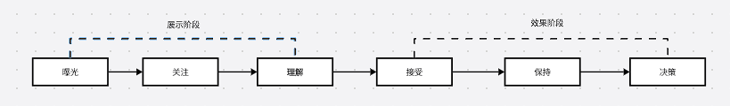

广告不论怎么聊，都离不开3个角色之间的博弈，一个广告主一个是媒体一个是用户

# 1. 从用户视角看广告的展示流程

对用户来说，关注的是广告本身

## 广告的一次展示从用户视角看



从用户侧观看角度来理解，一次广告展示经历了两个过程。

（1）展示阶段。这一阶段指的是广告物理上展现出来的过程，比如开屏广告，好的广告位可以给媒体提供更多的收益，对用户来说开屏开启媒体或者其他广告载体必走的路径，对于广告主来说，开屏广告可以获得更多的曝光。

（2）效果阶段。这一阶段指的是受众从物理上接触到广告，到意识上关注到它的过程。这里会考察几个关键指标，比如停留时间，转化率等等。和广告的素材，展示形式，受众，人群有的强关联。

### 展示阶段：在线广告 （从用户侧视角）

#### 1. 广告的展示形式

在展示阶段的时候，用户视角看一个广告关注的主要是广告的样式和内容。

**在用户视角上互联网时代广告在媒体上的表现有很多种。** 比如

| 广告类型                      | 在媒体上的表现形式/典型位置                                                                 | 主要作用                                                         | 设计出发点（为什么这么设计）                                                                                   |
|-------------------------------|----------------------------------------------------------------------------------------------|------------------------------------------------------------------|--------------------------------------------------------------------------------------------------------------|
| 搜索广告（SEM）              | 搜索结果页顶部/前几位的“广告/推广”结果；文字+少量图片、评分等                                 | 承接主动搜索需求，提升点击和转化（咨询、注册、下单等）          | 利用搜索词暴露的明确意图；商业化搜索结果第一页，不改变用户路径又能高效变现                                    |
| 信息流 / 原生广告            | 今日头条、抖音、快手、微博、小红书、朋友圈等内容流中穿插的图文/短视频广告，标注“广告/推广”     | 高频曝光+导流，兼顾品牌与效果；利用“刷内容”的惯性              | 让广告在样式上接近内容，降低打扰感和抗拒感，让广告像普通内容一样被消费                                         |
| 展示类广告（横幅、矩形等）   | 网页顶部Banner、文章中间矩形、右侧栏图片、APP底部条幅、动画Banner 等                         | 提升品牌曝光和识别度；是网站/APP的基础流量变现方式              | 尺寸标准化，便于联盟/程序化投放；占据固定视觉位置，展示量可控、易计费                                         |
| 视频贴片广告                 | 视频前贴片（片前15–30秒）、中插、后贴片；播放器上的悬浮条、角标广告                          | 利用画面+声音强烈输出品牌信息，提升记忆；可附带按钮促进转化      | 继承电视广告“片前必看”逻辑；利用视频平台可统计播放、完播、点击，便于评估效果                                   |
| 开屏 / 插屏 / 弹窗广告       | 打开APP时的全屏图片/短视频（开屏）；页面切换时的全屏插屏；网页弹窗、浮层                      | 短时间内获取极高曝光，适合大促/活动；CPM 高，是重要收入来源      | 抓住“进入/切换”这种必经路径，视线无法绕开；用大面积、短时冲击换取强记忆                                       |
| 激励式广告（Rewarded Ads）   | 游戏、工具APP中“看30秒广告得金币/道具/会员”；短视频中“看完解锁内容/权益”                      | 提高完播率和互动率；在用户“自愿”前提下提高对广告的接受度        | 把被动打扰变成“价值交换”，用户清楚能拿到什么回报，心理阻力小；更容易完整传递广告信息                          |
| 社交广告 & KOL/达人种草      | 朋友圈广告、微博粉丝头条、社交位广告；小红书种草笔记，抖音/B站达人视频植入、口播、测评分享     | 借助“人”与社交关系建立信任，实现种草与口碑扩散，带货转化显著    | 用户更信“朋友/达人推荐”而非品牌自夸；把广告包装成真实体验和分享，让推荐自然可信                                |
| 电商场景广告               | 淘宝/京东/拼多多搜索广告、首页橱窗位、“猜你喜欢”、直播间坑位；商详页关联推荐、结算,*优惠券*页推荐      | 抢占临门一脚，在强购买场景直接转为订单；提升曝光、加购与转化    | 利用用户强购买心智，让广告更像“商品推荐”；结合历史行为做千人千面，提高转化效率                                |
| 音频广告 / 播客口播          | 音乐APP音频插播广告、节目片头片尾赞助语；播客主播口播、节目冠名                              | 适合通勤/运动等“耳机场景”的长期陪伴式传播；塑造好感与记忆点    | 把广告嵌入节目内容中，用户不易完全跳过；利用声音和主播人格魅力，弱化生硬硬广感                               |
| 沉浸式互动广告(AR/VR/MR)     | 虚拟试妆/试穿、3D家居摆放、互动小游戏广告、元宇宙空间品牌店。                            | 深度参与，增强记忆通过交互体验提升品牌好感度，降低退货率（如试穿后购买）。 | “体验至上”

#### 2. 广告展示的内容

广告展示的内容，主要依赖于平台想要投放给用户什么内容，取决于，广告主的投放计划内容，平台自身收益和广告主价值考量，来进行决策。 

#### 3. 广告展示之后的后续动作和结果


| 阶段            | 可能产生的结果/事件                          | 对用户的影响                                                   | 对广告主/平台的影响                                                                                 |
|-----------------|----------------------------------------------|-----------------------------------------------------------------|------------------------------------------------------------------------------------------------------|
| 1. 广告被展示   | 广告曝光（Impression）                       | 在页面/信息流/视频里看到一次广告                               | 记录一次曝光；CPM计费模式下可能直接产生费用；用于计算曝光量、到达人数、CTR 等                     |
|                 | 快速滑过/跳过                                | 主观感觉“没看广告”或只略过                                    | 系统记录“曝光但无点击”；对模型是一次负样本，降低该类广告对该用户的推荐概率                        |
| 2. 初步互动     | 点击广告（Click）                            | 跳转到落地页/应用商店/小程序等新页面                          | 触发CPC计费；提升该广告的CTR；模型判断该用户可能对该品类/创意更感兴趣                              |
|                 | 对视频广告静音/跳过                          | 尽快回到内容，减少干扰                                        | 作为互动信号（负向），影响该广告/类似广告后续在此用户身上的投放权重                               |
|                 | 点赞/收藏/不感兴趣/关闭此类广告              | 明确表达“喜欢/不喜欢”                                         | “不感兴趣”类操作会被强烈记入偏好，减少类似广告推送；“点赞收藏”等是强正反馈，增加类似广告投放     |
| 3. 深度互动     | 完看广告视频（高完播率）                     | 获得完整信息/或为拿激励奖励而看完                             | 视频完播被视为“高兴趣”；提高该广告/品牌在相似人群中的出价与展示；影响创意优选                    |
|                 | 参与互动H5/小游戏/问卷                        | 获得趣味体验或奖励                                            | 获得更多用户行为数据（点击路径、题目选择）；便于用户画像细化与后续定向                            |
| 4. 落地页行为   | 访问落地页（Page View / Landing）            | 浏览商品/活动详情，决定是否继续操作                           | 统计到达率、跳出率、停留时长；评估广告引流质量；影响后续优化（创意、定向、出价）                  |
|                 | 停留时间长/多页面浏览                         | 对内容/产品较感兴趣                                           | 被视为高质量流量；可能被纳入“再营销人群”；算法更愿意为类似用户出更高价                           |
|                 | 快速关闭页面/返回                            | 觉得不相关/体验差/加载慢                                     | 被视为低质量流量；影响该广告的优化（减小该人群、调整文案/人群包）                                 |
| 5. 转化行为     | 注册/登录/留资（手机号、表单）                | 成为潜在客户或实际用户                                        | 触发CPA/OCPC计费（如以注册为目标）；用于建立广告效果模型和后续私域运营（短信、社群、CRM等）      |
|                 | 下单购买/加购/支付成功                        | 完成消费行为                                                  | 关键转化事件；作为“成功样本”训练算法（类似人群扩量）；用于ROI评估与预算调整                       |
|                 | 下载并安装APP                                | 获得新应用                                                    | 应用下载/激活被记录；应用广告以此结算；用于后续应用内广告或运营推送                               |
| 6. 后续追踪     | 被加入再营销人群（Retargeting）              | 之后在其它场景看到“你看过的商品/类似商品”广告                | 用浏览/加购/未支付等行为建立再营销列表，提高转化率；用于召回潜客                                   |
|                 | 兴趣标签更新（比如：数码、母婴、理财等）      | 之后看到的广告更集中某些品类/价位                            | 平台更新用户画像；广告系统对该用户的出价、创意、品类定向都会相应调整                              |
|                 | 被纳入相似人群模型（Lookalike）              | 自己不直接感知                                               | 广告系统用“完成转化的人”训练相似人群算法，去找更多“长得像你”的人投放                             |
| 7. 计费与归因   | 计费触发（CPM/CPC/CPA/OCPC 等）              | 用户无直接感知                                               | 根据事先设置的计费方式：曝光就付费（CPM）、点击付费（CPC）、注册/购买付费（CPA）等               |
|                 | 转化归因（Last Click / 多点归因等）          | 无感知                                                        | 广告平台会判断此转化是否算在这次广告身上，用于报表、ROI计算和投放策略优化                         |
| 8. 频控与风控   | 频次控制（不再频繁看到同一广告）             | 减少“同一广告看太多”的烦躁                                  | 若某用户被曝光/点击次数过多，会触发频控策略；节省预算，避免过度打扰                               |
|                 | 命中风控规则（疑似作弊点击、刷量等）          | 正常用户一般无感                                              | 异常点击会被过滤出计费与算法样本；保护广告主预算、防止流量作弊                                   |
| 9. 隐私与合规   | Cookie/IDFA 等被用于跨站追踪（合规前提下）    | 在不同网站/APP看到相关或同类广告                             | 在法律允许与授权前提下，用跨站标识做广告个性化与频控；受隐私法规（GDPR/个保法）强约束            |
|                 | 用户关闭个性化广告/拒绝追踪                   | 看到的广告相关性可能下降                                     | 平台对该用户停止/弱化行为定向，改用上下文或通用投放；影响精细化优化能力                           |

上面的视角是从用户角度向下列出的广告展示的逻辑。 相当于从外层窥探一下整个广告系统。 
用户的所有的操作和信息，都会通过埋点上报给平台，**平台会根据展示的信息和用户标记能力不停的优化广告展示以获取最大的收益**

# 2. 从广告主角度来看广告投放流程

广告主是广告的来源端。

上一章角色关系中有讨论过，其实广告主发布广告，无非2中途径 1. 找人发布比如DSP平台，或者一些广告代理平台 2. 自己发布，广告主自己联系媒体或者平台发布广告。 

这里主要讨论一下DSP上发布广告流程。 

## DSP 平台对于广告主来说的主要作用。

| 作用维度                         | 具体功能/表现                                                                                          | 对广告主的直接价值                                                                                  |
|----------------------------------|--------------------------------------------------------------------------------------------------------|-----------------------------------------------------------------------------------------------------|
| 统一采买与资源接入              | 通过一个DSP接入多家 Ad Exchange / SSP / 媒体（门户、视频、信息流、移动端、OTT 等），含公开拍卖和私有交易PMP | 一站式买全网流量，不必分别找几十家媒体谈判；扩大覆盖面，统一管理投放与结算                         |
| 精准人群定向与再营销            | 按地域、性别、年龄、兴趣、行为、设备、访问网址、APP类别等定向；支持导入自有数据、DMP人群；再营销（浏览/加购未买） | 把钱集中投向“更可能成交的人”；减少无效曝光，提升点击率、转化率和整体ROI                           |
| 实时竞价与成本控制（RTB）       | 对每一次曝光按人群和环境动态出价；支持设置出价上限、底价、投放时段、出价系数；支持 CPM/CPC/CPA/OCPC 等模式 | 在优质流量上愿意出高价，在一般流量压价；整体降低获客成本（CPA/CPS），让预算“花在刀刃上”           |
| 投放策略与自动优化              | 以目标（曝光量、点击量、转化量、CPA、ROI 等）为导向自动调优；按媒体/时段/人群自动分配预算和出价；自动屏蔽效果差的版位 | 减少人工盯盘和手动调价；投放效果可持续爬坡，能快速试错并放大有效策略                             |
| 覆盖与频次控制                  | 设定每个用户的曝光频次上限；跨媒体/跨设备去重；控制覆盖人数（Reach）和频次（Frequency）的组合        | 避免对同一人“洗脑式刷屏”；同样预算下触达更多独立用户，提升品牌到达率又不惹用户反感               |
| 创意管理与动态创意（DCO）       | 统一管理多版本多尺寸素材；根据人群特征、地域、时间、兴趣动态拼接文案和图片/视频；自动优选点击/转化高的创意 | 对不同人展示“更对胃口”的内容；提升CTR和转化率；高效做创意A/B测试，减少设计和投放的反复沟通       |
| 数据整合与人群资产沉淀          | 打通广告曝光/点击数据与网站、APP内的访问/注册/下单数据；对接CDP/CRM/DMP；沉淀高意向人群、老客、流失人群包 | 广告投入不只是一次性流量，而是在积累可反复使用的人群资产，为后续再营销和私域运营做基础           |
| 效果监测与归因分析              | 提供实时报表（曝光、点击、转化、消耗、成本等）；多维分析（媒体、版位、人群、创意、地域…）；支持转化追踪与归因模型 | 清楚知道“钱花在哪、哪块最有效”；指导预算重新分配和下次策略设计，证明投放价值给内部汇报           |
| 品牌安全与反作弊                | 过滤低质/敏感内容环境（色情、暴力、违法等）；黑白名单管理；反作弊（机器人、刷量、异常点击）；Viewability 监测 | 保护品牌形象，避免广告出现在不合适的内容旁边；减少被刷量浪费，保障预算真正打在真实用户身上       |
| 多渠道统一管理与协同效率        | 统一管理PC、移动、APP、视频、原生、OTT等多渠道；支持多账号、多品牌协同；API对接内部BI/投放系统        | 降低运营人力成本和沟通成本；快速响应市场（促销、上新时能很快开/停/调策略），提升整体营销效率       |

### 1. 广告计划的制订

一般DSP平台的广告计划通常包括以下核心内容：


| 配置模块               | 通常包含的具体内容举例                                                                 | 在计划中的作用/说明                                                     |
|------------------------|-----------------------------------------------------------------------------------------|-------------------------------------------------------------------------|
| 一、基础信息           | 计划名称、所属广告主/品牌、推广产品、行业类目、投放类型（品牌/效果）、备注等          | 方便账号内管理归类、统计报表，区分不同产品线或活动                     |
| 二、投放目标与KPI      | 投放目标：曝光量/品牌认知、点击量、APP下载、注册、表单留资、下单购买等；KPI：目标CTR、目标CPA/ROI、预期转化量 | 决定后续的出价策略与优化方向，DSP的自动优化通常围绕“目标事件+KPI”来运行 |
| 三、预算与出价策略     | 总预算、日预算；出价上限/底价；计费模式（CPM/CPC/CPA/OCPM/OCPC）；出价方式（人工出价、智能出价）；投放速度（匀速/加速/冲刺） | 控制整体花费节奏和单次曝光/点击/转化的成本，是成本控制的核心配置       |
| 四、投放时间与节奏     | 投放开始/结束日期；按小时/星期的投放时段（如工作日9–22点）；节假日是否投放           | 把预算集中在“更容易转化”或“人群在线高峰”的时间段，提高效率             |
| 五、地域与设备定向     | 省市/城市/商圈/经纬度圈选；终端类型（PC/手机/平板）；操作系统（iOS/Android）；运营商、联网方式（WiFi/4G/5G）等 | 避免投到完全不相关或无法服务的地区/设备（比如只在有配送能力的城市投放） |
| 六、媒体与广告位选择   | 选择接入的媒体/Ad Exchange/SSP；媒体类型（门户、视频、信息流、APP、OTT等）；广告位类型（横幅、信息流、激励视频、开屏等）；Whitelist/Blacklist（白名单/黑名单） | 决定广告实际会出现在哪里，用哪些版位、哪些APP/网站，直接影响人群和效果 |
| 七、人群定向与人群包   | 性别、年龄段；兴趣标签；访问/购买行为（电商浏览、金融行为等）；自有DMP人群包（老客、高意向、流失用户等）；再营销人群（看过落地页未转化、加购未买）；相似人群（Lookalike）；排除人群（已购买用户等） | 把预算集中投入到“更可能感兴趣或更易转化”的人群身上，减少无效曝光       |
| 八、频次与覆盖控制     | 单用户最大曝光频次（整体/按天/按计划）；是否做跨媒体去重；曝光上限/点击上限；是否启用“新客优先” | 平衡“触达更多人”和“对同一人加深记忆”；避免洗脑式轰炸导致反感           |
| 九、创意与落地页设置   | 上传并管理素材（图片、视频、信息流图文、原生模板等）；创意尺寸/格式；创意标题、副文案、CTA按钮文案；落地页URL/深度链接；动态创意规则（DCO：按地域/人群自动替换文案图等）；创意轮播方式（均匀/优选） | 决定用户真正看到的“广告长什么样”和点开后去哪；也是影响CTR和转化率的关键 |
| 十、转化追踪与归因设置 | 定义转化事件（点击、表单提交、注册、下单、支付、激活等）；埋点方式（JS代码、SDK、S2S回传）；归因窗口（如点击后7天内算转化）；第三方监测链接/曝光监测/点击监测 | 让DSP“知道”哪一次曝光/点击带来了转化，从而能做效果优化和ROI评估       |
| 十一、品牌安全与风控   | 屏蔽内容类目（暴力、低俗、赌博等）；域名/APP黑名单；敏感关键词屏蔽；Viewability最低曝光可见度要求；反作弊开关（过滤机器人、异常点击） | 确保广告不出现在有损品牌形象或违规的内容旁边，减少刷量浪费              |
| 十二、报表与告警配置   | 选报表口径（按媒体、地域、人群、创意等维度）；预警规则（超预算/投放异常/转化骤降等）；数据推送方式（邮件/接口） | 方便实时监控投放表现，发现问题能快速调整，减少“投了半个月才发现浪费”    |

一条完整投放通常是 **「计划 → 单元 → 创意」三级结构**

但是不同的DSP平台会有对应的差异，比如我之前工作的巨量引擎


| 层级        | 模块/字段              | 巨量/穿山甲中常见名称举例                          | 作用/说明                                                         |
|-------------|------------------------|----------------------------------------------------|------------------------------------------------------------------|
| 广告计划    | 计划名称               | 广告计划名称                                      | 内部管理用，建议包含产品+目标+时间，如“4月_线索_华北_表单”        |
|（Campaign） | 推广目的 / 营销目标    | 推广目的：应用推广 / 销售线索收集 / 商品推广等    | 决定后续可选的计费方式、优化目标、可用版位等，是整套投放的“大方向”|
|             | 投放范围 / 媒体范围    | 投放范围：巨量自有+穿山甲 / 仅抖音 / 仅穿山甲等   | 决定主要投向字节自家媒体还是联盟流量，影响人群覆盖和成本          |
|             | 购买方式               | 竞价购买 / 合约保量（如有）                       | 决定是走RTB实时竞价还是走保量/保价资源                         |
|             | 计划预算               | 日预算 / 总预算                                    | 控制该计划整体花费上限，通常支持日预算或整个周期总预算          |
|             | 投放日期               | 开始时间 / 结束时间                                | 决定计划在什么日期内生效                                      |
|             | 投放状态               | 启用 / 暂停                                        | 控制这一整条计划是否参与竞价                                 |
|-------------|------------------------|----------------------------------------------------|------------------------------------------------------------------|
| 广告单元    | 单元名称               | 广告组 / 广告单元名称                              | 通常按「人群+版位」维度拆分，方便后续对比效果                  |
|（Ad Group） | 投放版位 / 广告样式    | 信息流 / 激励视频 / 插屏 / 开屏等；抖音、头条、穿山甲 | 决定广告在什么产品、以什么形式展示                          |
|             | 计费方式               | CPM / CPC / oCPC / oCPM / CPA 等                   | 决定按展示、点击还是按转化付费，并影响出价逻辑                |
|             | 优化目标               | 点击量 / 表单线索 / 下单 / 激活 / 完成支付等       | DSP算法围绕这个目标自动调价和找人，是效果优化的核心           |
|             | 出价                   | 目标出价、出价上限（如转化出价、点击出价）         | 告诉系统你愿意为一次点击/一次转化花多少钱                     |
|             | 投放时间段             | 全天投放 / 自定义时段（小时粒度）                  | 常用于只在工作时间、黄金时段等投放，提升预算利用效率          |
|             | 地域定向               | 投放城市 / 省份 / 商圈 / 位置圈选                  | 避免投到无法服务或不相关地区，例如只在有销售/配送能力的城市投放 |
|             | 设备&网络定向          | iOS/Android、机型、运营商、WiFi/4G/5G等            | 控制设备环境，比如只在WiFi下投放大视频，或只投高端机型人群     |
|             | 人口属性定向           | 性别、年龄段等                                      | 粗粒度过滤，配合兴趣、行为一起使用                           |
|             | 兴趣/行为定向          | 兴趣标签、内容偏好、短视频互动行为等               | 让广告更“对胃口”，例如数码兴趣、母婴兴趣等                  |
|             | 自定义人群 / DMP人群   | 自有人群包、APP活跃人群、网站访客、上传手机号IDFA等 | 把你的老客、高意向用户、再营销人群导入，精准重复触达         |
|             | 再营销设置             | 访问过落地页未转化、加购未购买、看过视频等人群     | 提升“临门一脚”的转化率，常用于召回和二次触达                 |
|             | 智能拓量 / 类似人群    | 智能拓量开关、相似人群比例                          | 让系统自动去找“长得像你目标人群”的更多用户，放量用           |
|             | 频次控制               | 每人每天曝光次数上限 / 每人总曝光上限              | 防止对同一用户刷屏，平衡覆盖人数与记忆度                     |
|             | 媒体白名单/黑名单      | 允许 / 禁投的APP、站点、媒体类型                    | 品牌安全与流量质量控制，比如屏蔽某些低质或不合规媒体         |
|-------------|------------------------|----------------------------------------------------|------------------------------------------------------------------|
| 广告创意    | 创意名称               | 创意名称                                           | 内部区分不同素材版本，便于A/B测试和数据对比                  |
|（Creative） | 创意形式               | 图片大图、小图、竖版视频、横版视频、图文、原生等   | 决定最终展示的展现形态                                       |
|             | 素材文件               | 图片、视频文件；支持自动剪辑/智能生成（视产品线而定）| 直接影响点击率和转化率，是用户第一眼看到的内容               |
|             | 文案                   | 标题、副标题、正文描述                             | 传达卖点与利益点，影响吸引力和点击效果                      |
|             | 行动按钮（CTA）        | 立即下载 / 立即咨询 / 领券购买 / 预约体验等         | 引导用户下一步动作，和推广目的要强相关                      |
|             | 落地页 / 跳转方式      | H5落地页链接、应用商店链接、深度链接、原生表单等   | 决定用户点击后去哪儿：下载APP、进官网、进表单、进直播间等   |
|             | 动态创意/程序化创意    | DCO规则：按城市、性别等自动替换图文                 | 同一单元内对不同人显示不同内容，提高个性化匹配度           |
|             | 第三方监测链接         | 曝光监测、点击监测、激活监测URL                     | 给第三方监测公司用，做独立核算和反作弊                     |
|             | 转化追踪参数           | 落地页URL尾部追踪参数、回传事件配置                 | 便于巨量归因和你自己BI系统的效果统计                       |

制定好广告计划之后就可以开始投放了

### 2. 投放之后的效果回收和监控

广告主在投放之后可以登录DSP平台进行一系列的操作，如下：

| 操作类别              | 广告主上线后常见操作（举例）                                                                 | 目的 / 说明                                                                                  |
|-----------------------|-----------------------------------------------------------------------------------------------|---------------------------------------------------------------------------------------------|
| 1. 启动与基础检查     | - 查看计划/单元/创意审核状态，待审核/未通过及时修改<br> - 自己点一次广告，检查落地页能否正常打开、跳转、表单提交是否正常 | 确保广告真正能跑起来且链路不中断，不因为审核或落地页问题白白消耗预算                      |
| 2. 实时监控与看数     | - 在「计划/单元/创意」维度看：曝光、点击、CTR、转化量、成本、CPA、ROI<br> - 看消耗是否达标（预算花不花得出去）<br> - 看是否出现异常（点击突然暴涨、转化骤降等） | 对整体健康度有感知，第一时间发现问题，判断是创意、人群还是落地页出了问题                  |
| 3. 预算与出价调整     | - 调整计划日预算/总预算：给效果好的计划加预算，差的减预算或暂停<br> - 调整单元出价/目标CPA：降低高成本人群的出价，适当抬高优质人群的出价<br> - 调整投放速度：匀速 / 加速 / 冲刺 | 控制整体成本和消耗节奏，让预算更多集中在“效果好的组合”上                                 |
| 4. 人群与定向优化     | - 收紧或放宽地域、年龄、性别、兴趣标签<br> - 启用/关闭智能拓量、调整类似人群比例<br> - 替换/拆分自定义人群包（高意向、老客、不同渠道人群）<br> - 建立或优化再营销人群（访问未转化、加购未买等） | 把钱从“无效人群”挪到“更有可能转化的人”，并深挖已有高意向人群的价值                       |
| 5. 媒体与版位调整     | - 查看不同媒体/APP/版位的表现，屏蔽效果差、质量差的媒体（黑名单）<br> - 针对效果好/高转化的媒体适当提高出价或单独拆计划放量 | 提升流量质量，减少在低质媒体上的浪费，同时放大头部优质流量的贡献                         |
| 6. 创意管理与优化     | - 持续上新图片/视频/文案，做创意A/B测试<br> - 停掉CTR低、转化差、差评多的创意<br> - 调整创意轮播策略：均匀轮播 or 优选高效创意<br> - 使用/优化动态创意（DCO），按地域、人群自动换图文 | 维持创意新鲜度，防止“审美疲劳”；用数据选出更吸引点击、转化更高的素材                     |
| 7. 频次与节奏控制     | - 调整单用户曝光上限（每天/总计）<br> - 根据数据变化调整投放时段：避开低效时段，集中预算在高转化时段 | 避免对同一人反复刷屏导致反感，同时提高每一次曝光的价值                                   |
| 8. 转化追踪与落地页   | - 检查/修复埋点、转化事件回传（表单、激活、下单等）<br> - 对落地页做简单AB测试：表单项精简、首屏内容调整、加载速度优化<br> - 根据表单质量/线索质量反馈微调投放（比如过滤无效地区） | 让“转化数据”更真实可用，提升落地页本身的转化率，避免广告端效果好但业务端接不住           |
| 9. 再营销与人群沉淀   | - 根据投放结果，把高价值人群打标签并沉淀成新的人群包（高消费、成交用户等）<br> - 新建再营销计划：专门投放给访问/加购未成单的人群，给券、给优惠<br> - 用已转化人群做类似人群扩量 | 把一次投放产生的人群资产反复利用，提升整体投放效率和长期ROI                             |
| 10. 品牌安全与风控    | - 定期查看反作弊报表/第三方监测数据，排查疑似作弊流量<br> - 优化品牌安全设置：屏蔽敏感类目、低质内容位 | 保护品牌形象，减少被刷量、机器人点击等无效消耗                                          |
| 11. 数据报表与复盘    | - 导出/订阅报表（按计划、单元、人群、创意、媒体、地域等维度）<br> - 做阶段性复盘：哪些组合带来最多转化、最低CPA、最高ROI<br> - 总结经验，沉淀下一波投放的模板和SOP | 证明这轮投放的效果，指导之后怎么“少踩坑、多用有效打法”，形成可复制的策略                |

### 3. 投放之后结算

作为广告主，在投放的时候需要关注下面的这些事情。 

| 阶段                  | 关键动作/数据                           | 结算关注点 / 风险点                                                                       |
|-----------------------|------------------------------------------|-------------------------------------------------------------------------------------------|
| 1. 实时记录与扣费     | 实时曝光、点击、转化日志；余额扣减     | 日志是否完整、去重；扣费是否和前端看数一致；超预算是否及时停投                          |
| 2. 日志归集与清洗     | 日志落库、合并、去重、规范化            | 多源日志（多个机房/服务）合并；时间戳对齐；重复曝光/点击过滤                            |
| 3. 反作弊与无效流量   | 过滤机器人、异常IP、极短停留等         | 哪些过滤不计费、规则是否公开透明；过滤后要“冲回”实时消耗；避免误伤真实流量              |
| 4. 可计费事件确认     | 有效曝光、有效点击、有效转化的定义      | viewability（可见曝光）标准？点击去重窗口？转化归因窗口（点击后几天内算）？              |
| 5. 计费量计算         | CPM/CPC/CPA 等模式的计费用量            | 不同计费模式的换算是否统一（eCPM、eCPC）；封顶价/日预算是否正确生效                      |
| 6. 内部对账           | 实时扣费 vs 离线核算后的结果            | 差异来源：反作弊调整、日志丢失、更正；如何把调整透明同步给广告主                        |
| 7. 第三方/客户对账    | 与第三方监测、客户自有埋点的数据核对    | 可接受误差范围；归因口径差异（首点/末点、多点归因）；争议处理流程                       |
| 8. 形成结算单         | 按活动/计划/单元/媒体汇总消耗           | 维度是否满足客户需求（活动维度、地域维度等）；标注清楚计费模式、单价、数量               |
| 9. 发票与合同条款     | 税率、发票类型（专票/普票）、开票抬头   | 是预充值还是后付费？返点/折扣如何在合同中约定和体现；结算币种、汇率问题（跨境时）         |
| 10. 收付款             | 收款到账、账期管理、坏账控制            | 大客户授信额度管理；逾期未付的风险控制与停投策略                                       |
| 11. 退款/补偿/调整    | 异常流量返还、活动失败补贴等            | 调整是否有书面确认；如何在系统中记账（负账单/冲正条目），避免后续数据混乱               |

# 3. 从平台侧角度来看广告投放的技术流程

上一篇文章介绍了广告系统中各个角色，其实属于技术侧需要关注的主要是这几个平台。 

- DSP： 广告主平台 ： 主要是广告主用来发布广告计划和对广告进行监控处理，数据报表，广告投放竞价等等的能力。
- ADX&ADX: 广告交易平台 ： 达成广告计划和真实媒体之间连接和交易的中间层
- SSP ：广告流量提供方平台，比如网站，APP等或者对应的整合平台

针对不同的平台会有不同的架构设计

## 广告平台的架构

### DSP 平台

DSP 平台广告的完整链路如下

```
用户请求 → 流量准入 → 上下文解析（上下文解析+用户画像检索） → 定向过滤 → 多路召回 → 合并去重 → 粗排（预估） → 精排 → 机制层（竞价/分配） → 策略调控（重排） → 创意优选与动态渲染 → 返回广告 → 曝光/展示追踪 → 用户交互 & 转化追踪 → 数据回流 & 模型迭代

用户请求（Ad Request）
      │
      ▼
┌──────────────────────────────────────┐
│  1. 流量准入 (Traffic Gating)         │
│  · 反作弊检测（设备指纹/IP/行为异常） │
│  · 流量质量评级                       │
│  · 广告位合法性校验（是否有广告位）    │
│  · 会员/免广告用户过滤               │
└────────────┬─────────────────────────┘
             ▼
┌──────────────────────────────────────┐
│  2. 上下文解析 (Context Parsing)      │
│  · 设备信息（OS/机型/屏幕尺寸）       │
│  · 地理位置（GPS/IP地理库）           │
│  · 页面/内容语义（关键词/分类/NLP）    │
│  · 网络环境（WiFi/4G/5G）            │
│  · 用户ID映射（Cookie/IDFA/OAID统一） │
└────────────┬─────────────────────────┘
             ▼
┌──────────────────────────────────────┐
│  3. 用户画像检索 (Profile Lookup)     │
│  · 实时特征：session行为序列、         │
│    近期搜索/浏览/加购                 │
│  · 离线画像：兴趣标签、消费能力、      │
│    人群包命中                         │
│  · 生命周期阶段（新客/老客/流失用户）  │
└────────────┬─────────────────────────┘
             ▼
┌──────────────────────────────────────┐
│  4. 定向过滤 (Targeting)              │
│  广告主设定的投放条件匹配：            │
│  · 地域、年龄、性别                   │
│  · 兴趣标签、人群包                   │
│  · 重定向 (Retargeting)              │
│  · 排除条件（已转化用户/竞品等）       │
│  → 筛选出「候选广告集合」             │
│                                      │
│  ⚠ 注：部分系统将定向条件融入召回通道  │
│  内部，而非独立前置步骤               │
└────────────┬─────────────────────────┘
             ▼
┌──────────────────────────────────────┐
│  5. 多路召回 (Retrieval / Matching)   │
│  · 定向命中召回（布尔匹配/倒排索引）  │
│  · 向量化召回（Embedding + ANN检索）  │
│  · 热门/探索召回（保证覆盖+冷启动）   │
│  · 实时行为触发召回（刚搜/刚看/加购） │
│  → 量级：数万级候选                   │
└────────────┬─────────────────────────┘
             ▼
┌──────────────────────────────────────┐
│  6. 合并去重 & 基础过滤               │
│  (Merge & Dedup)                     │
│  · 多路结果合并去重                   │
│  · 预算耗尽过滤                       │
│  · 素材审核状态过滤                   │
│  · 投放时段/排期校验                  │
│  · 频次预过滤                        │
│  → 量级：数千级候选                   │
└────────────┬─────────────────────────┘
             ▼
┌──────────────────────────────────────┐
│  7. 粗排 (Pre-Ranking)               │
│  · 轻量模型快速打分                   │
│    （简单LR / 双塔模型 / 小DNN）      │
│  · 特征：以低成本特征为主             │
│  → 量级：数千 → 截断至数百            │
└────────────┬─────────────────────────┘
             ▼
┌──────────────────────────────────────┐
│  8. 精排 (Ranking)                   │
│  · 复杂模型精确预估：                 │
│    - pCTR（点击率预估）               │
│    - pCVR（转化率预估）               │
│    - 多目标联合建模（点击+转化+时长等）│
│  · 排序分计算：                       │
│    eCPM = bid × pCTR （× pCVR）      │
│  · 特征：用户×广告交叉特征、           │
│    序列特征、实时特征等               │
│  → 量级：数百 → 选出 Top-K            │
└────────────┬─────────────────────────┘
             ▼
┌──────────────────────────────────────┐
│  9. 机制层 / 竞价 (Auction)           │
│  · 竞价机制：GSP / VCG / 深度出价     │
│  · 计费价格计算（如广义第二价格）      │
│  · 底价校验 (Reserve Price)           │
│  · 成本控制（oCPC/oCPM 出价调控）     │
└────────────┬─────────────────────────┘
             ▼
┌──────────────────────────────────────┐
│  10. 策略调控 / 重排 (Re-Ranking)     │
│  · 多样性控制（同广告主/行业打散）     │
│  · 频次控制（用户维度曝光上限）        │
│  · 预算平滑 (Pacing / Budget Smooth)  │
│    ⚠ 部分系统在召回/粗排阶段          │
│    即通过参竞率控制实现 Pacing         │
│  · 广告与自然内容混排（信息流场景）    │
│  · 用户体验约束（广告密度上限等）      │
└────────────┬─────────────────────────┘
             ▼
┌──────────────────────────────────────┐
│  11. 创意优选 (Creative Optimization) │
│  · 多素材择优（同计划下多套素材选最优）│
│  · 动态创意拼装 (DCO)                │
│    标题 × 图片 × CTA 组合优选        │
│  · 创意与用户匹配模型（千人千面素材）  │
│  · 落地页匹配/动态落地页              │
└────────────┬─────────────────────────┘
             ▼
┌──────────────────────────────────────┐
│  12. 广告返回 (Ad Response)           │
│  · 选定广告 + 最终创意素材            │
│  · 落地页 URL（含追踪参数）           │
│  · 计费信息 + 曝光/点击监测链接       │
│  · 响应延迟控制（通常 < 100ms）       │
└────────────┬─────────────────────────┘
             ▼
┌──────────────────────────────────────┐
│  13. 展示 & 曝光追踪                  │
│  (Rendering & Impression Tracking)   │
│  · 客户端渲染广告                     │
│  · 曝光监测上报 (Impression Pixel)    │
│  · 可见性检测 (Viewability / MRC标准) │
│  · 品牌安全校验 (Brand Safety)        │
└────────────┬─────────────────────────┘
             ▼
┌──────────────────────────────────────┐
│  14. 用户交互 & 转化追踪              │
│  (Interaction & Conversion Tracking) │
│  · 点击追踪 (Click Tracking/Redirect)│
│  · 落地页加载 & 行为追踪             │
│  · 转化追踪：                        │
│    - 客户端：SDK / Pixel             │
│    - 服务端：S2S Postback            │
│  · 归因模型 (Attribution)：           │
│    Last-Click / 多触点 / 数据驱动    │
└────────────┬─────────────────────────┘
             ▼
┌──────────────────────────────────────┐
│  15. 数据回流 & 模型迭代              │
│  (Data Feedback & Model Iteration)   │
│  · 日志拼接 (Join)：                  │
│    请求日志 × 曝光日志 × 点击/转化日志│
│  · 样本构建 → 模型训练               │
│  · 特征工程迭代                       │
│  · A/B 实验评估                      │
│  · 自动出价策略优化                   │
│  · 人群包 & 画像更新                  │
│  ──── 形成数据闭环 ────              │
└──────────────────────────────────────┘
```

- 流量准入: 反作弊、频控、流量质量过滤这类过滤逻辑，还包括判断这个请求是否有广告资格（比如某些用户是付费会员、某些页面不允许投放）。
- 上下文解析: 在实际系统中的工作量比较重，需要实时提取用户特征（ID、画像、实时行为序列，实时特征（session行为）+ 离线画像（兴趣标签、人群包））、场景特征（设备、网络、时段、页面语义）等，这些特征会贯穿后续所有环节。
- 定向过滤和多路召回: 他们的先后关系在不同系统中并不固定——有些系统是先做定向圈选缩小候选池，再在池内做多路召回；也有系统把定向条件融入召回阶段本身，作为召回通道的约束条件，而不是单独的前置步骤。 
- - 定向过滤的主要内容主要是广告主设定的定向条件匹配: 地域、年龄、性别、兴趣、人群包、 重定向(Retargeting)、排除条件等 → 筛选出「候选广告集合」 
- - 多路召回的主要方法 定向命中召回（布尔匹配） 向量化召回（Embedding ANN）热门/探索召回  实时行为触发召回（如刚搜/刚看）双塔模型召回  等等
- 合并去重：多路结果合并、去重、基础过滤（预算耗尽、素材审核状态等）
- 粗排:粗排的核心就是用一个轻量模型（简单LR/小DNN）对召回的几千条候选做快速打分，把量级压缩到几百条送入精排。
- 精排:是用复杂模型（通常是多目标模型，同时预估点击率、转化率、时长等）对候选做精细打分。
- 机制层(重排): 这是广告系统区别于推荐系统的核心环节之一——需要做竞价排序（比如 GSP 或 VCG 机制计算 eCPM 排名和实际扣费价格），或者在保量合约场景下做流量分配，计费价格计算（如第二高价），底价校验 (Reserve Price) 。接下来是策略调控层，处理预算控速（pacing）、成本控制（不能让广告主的实际成本超出出价）、多样性打散、频次控制等商业约束。
- 策略调控 / 重排：多样性控制（同广告主/行业打散），频次控制（用户维度） ，预算平滑，广告与自然内容混排，用户体验约束
- 创意优选：一个广告计划下可能有多套素材，需要选出预估效果最好的那一套，有时还要做动态创意拼装（DCO）。最后返回给用户端渲染展示。
- 返回广告：选定广告 + 创意 + 落地页URL + 计费信息等等
- 展示 & 曝光追踪： 监控 客户端渲染广告 ， 曝光监测上报， 可见性检测
- 用户交互 & 转化追踪 ： 点击追踪，跳转/落地页，转化追踪， 归因
- 数据回流 & 模型迭代：日志拼接，样本构建 → 模型训练 ， 特征工程迭代， A/B实验评估  


整体dsp平台基本架构


app 绘制性能 https://tech.qimao.com/zong-heng/

golang 性能工程  https://tech.qimao.com/pyroscope-and-pgo-optimization-guide/

推广 ： https://tech.qimao.com/mei-ti-tui-yan-ye-wu-jia-gou-yan-jin/

推荐： https://tech.qimao.com/qi-mao-suan-fa-tui-jian-yin-qing-jia-gou-yan-hua-zhi-lu/ https://tech.qimao.com/man-tan-jie-ou/

归因 博客 https://tech.qimao.com/mei-ti-tui-yan-ye-wu-jia-gou-yan-jin/   https://tech.qimao.com/wen-ding-xing-zhi-neng-jian-kong-yu-gui-yin/ 

大模型蒸馏  https://tech.qimao.com/ti-sheng-zi-ran-yu-yan-zhuan-huan-wei-sql-cha-xun-nl2sql-zhun-que-du-de-tan-suo-tong-yong-llama-factory-zheng-liu-deepseek-mo-xing-de-fang-fa-jie-shao/


算法预估，机器学习平台 ： https://tech.qimao.com/ji-yu-chen-jin-du-mo-xing-yu-gu-de-yan-gao-dong-tai-zhan-shi/   https://tech.qimao.com/zi-yan-ji-qi-xue-xi-ping-tai/

日志收集系统 https://tech.qimao.com/drs-backend-upload-sdk/ https://tech.qimao.com/qi-mao-ri-zhi-jie-shou-xi-tong-zhi-ke-hu-duan-mai-dian-sdk/

分布式追踪 https://tech.qimao.com/qi-mao-fen-bu-shi-zhui-zong-shi-jian/

adx https://tech.qimao.com/adx-liu-pi-yi-ti-jia-gou-de-yan-jin/ https://tech.qimao.com/cong-0dao-3yan-gao-adx/ https://tech.qimao.com/wen-zhang-biao-ti/
 
倒排索引 https://tech.qimao.com/bitmapzai-guo-lu-chang-jing-de-ying-yong/ 

运维 ： https://tech.qimao.com/tui-jian-yin-qing-jie-ru-ingressfang-an/

报警优化： https://tech.qimao.com/gun-dong-bu-shu-shi-fu-wu-gao-jing-wen-ti-pai-cha-ji-jie-jue-fang-an/

广告激励视频优化 https://tech.qimao.com/wen-zhang-biao-ti/

服务熔断 https://tech.qimao.com/rong-duan/

高效数据去重 