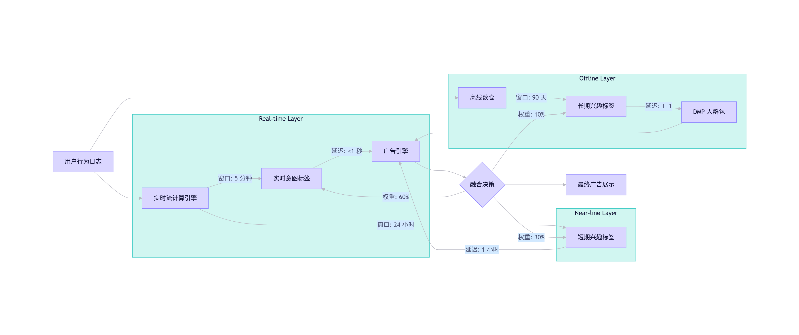
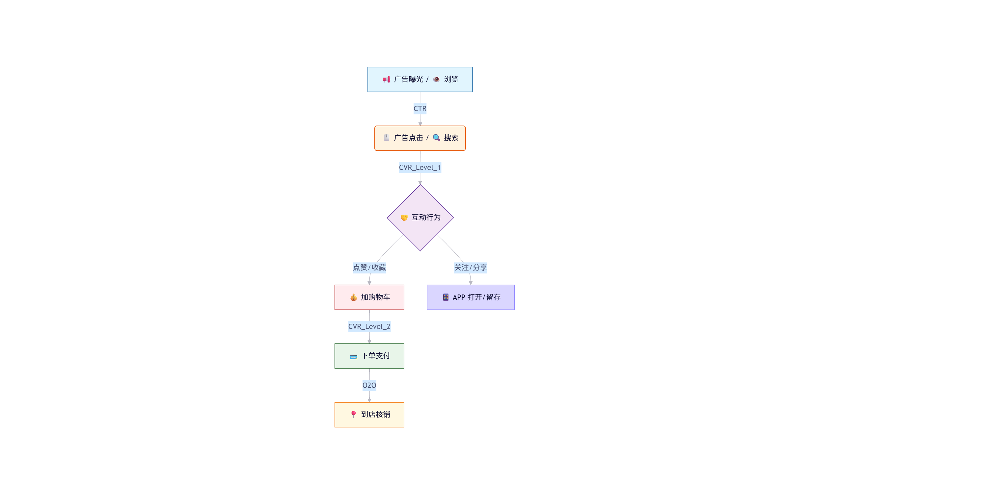
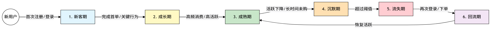
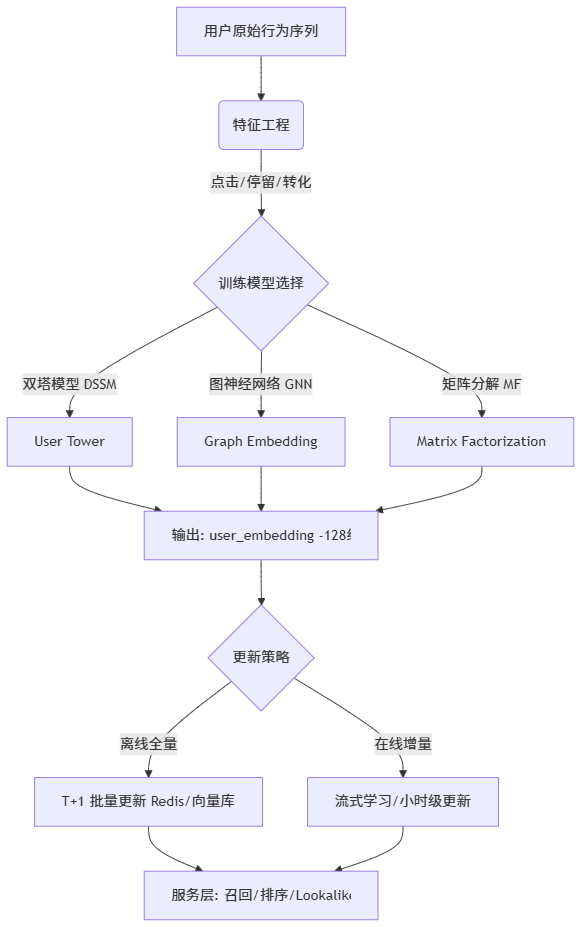
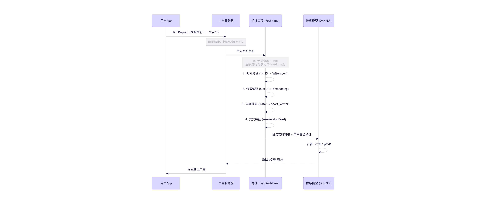
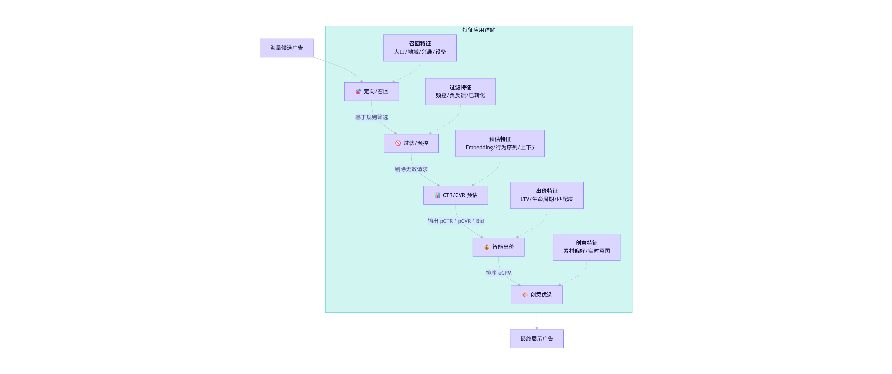

# 用户画像检索在做什么

```
上下文解析完成后，拿到 unified_uid
          │
          ▼
┌─────────────────────────────────────────┐
│         用户画像检索 (Profile Lookup)      │
│                                          │
│  用 unified_uid 作为 key，从 Feature Store │
│  中查出该用户的全部特征，拼入请求上下文     │
│                                          │
│  核心挑战:                                │
│  ① 画像从哪来？怎么建？                   │
│  ② 存在哪？怎么存？                       │
│  ③ 在线怎么查？延迟怎么控？                │
│  ④ 用户没画像（冷启动）怎么办？            │
└─────────────────────────────────────────┘
```

# 用户画像有那些特征

## 1. 身份识别层

身份标识层 — 一切画像的“锚点”

| 字段 | 示例值 | 说明 |
| :--- | :--- | :--- |
|unified_uid|`cdddfd-ffefe-ffff`|合规之后替代device_id的id|
| device_id | `cdda802e-fb9c..` | IDFA/GAID/OAID 主键 |
| device_id_md5 | `a1b2c3d4e5...` | MD5 后的设备 ID (隐私合规) |
| login_uid | `uid_38291045` | 登录账号 ID |
| phone_md5 | `8f14e45f...` | 手机号 MD5 |
| email_md5 | `5d41402a...` | 邮箱 MD5 |
| cookie_id | `_ga=2.123456..` | Web 端 Cookie |
| union_id | `wx_union_xxx` | 微信 UnionID |
| imei_md5 | `e99a18c4...` | IMEI MD5 (Android 旧设备) |
| id_mapping | `{idfa→uid→phone}` | 跨设备 ID 关联图谱 |

关键点总结
- id_mapping：一个自然人可能拥有多个设备 ID，必须通过 ID Mapping 技术将其归一化为同一个用户实体。
- 隐私合规挑战：在 GDPR、CCPA 及《个人信息保护法》等法规下，许多原始 ID（如 IMEI、明文手机号）无法获取或必须进行脱敏处理（如 MD5/SHA256 加盐哈希）。
- 生产环境策略：
- - 主键：通常以 device_id 作为基础主键（因为覆盖度最高）。
- - 辅助关联：以 login_uid 作为强关联纽带，用于打通多设备下的同一用户行为。
- - 新的合规政策之后开始向 unified_uid 迁移

## 2. 人口属性层

| 字段 | 类型 | 示例 | 生产来源/计算逻辑 | 字段业务描述 |
| :--- | :--- | :--- | :--- | :--- |
| gender | 枚举 | `1` | 0=未知, 1=男, 2=女 | 生理性别分类。用于区分男女向产品推荐（如美妆 vs 剃须刀），是基础分群维度。 |
| gender_prob | float | `0.82` | 模型输出概率 (0.0-1.0) | 性别预测置信度。值越接近 1 或 0 越可靠；若接近 0.5 说明特征模糊（如中性消费习惯），建议标记为“未知”。 |
| age_bucket | 枚举 | `3` | 1=<18, 2=18-24, 3=25-34,<br>4=35-44, 5=45-54, 6=55+ | 年龄段分层。将连续年龄离散化为营销常用区间，用于匹配不同生命周期的产品（如校园贷 vs 养老金）。 |
| age_prob | float | `0.65` | 模型输出概率 | 年龄段预测置信度。反映模型对用户真实年龄判断的把握程度，低置信度时需谨慎用于高价值决策。 |
| education | 枚举 | `3` | 1=高中, 2=大专, 3=本科,<br>4=硕博 | 受教育程度推断。通常通过搜索关键词（考研、论文）、APP 安装（学习类、职场类）、消费客单价等特征推测，反映认知水平与消费潜力。 |
| occupation | 枚举 | `5` | 1=学生, 2=白领, 3=蓝领... | 职业身份标签。基于工作时间段活跃度、地点（写字楼/工厂/学校）、消费内容（商务差旅 vs 游戏充值）进行聚类分析得出。 |
| marital_status | 枚举 | `2` | 1=未婚, 2=已婚, 3=未知 | 婚姻状态。通过购买行为（婚庆、家居、双人套餐）、社交互动频率、特定节日行为（情人节/儿童节）等信号推断。 |
| has_children | 枚举 | `1` | 0=无, 1=有, 2=未知 | 是否有子女。强信号包括：购买母婴用品、搜索育儿知识、安装亲子类 APP、节假日儿童相关消费。 |
| children_age | 枚举 | `2` | 1=婴幼儿, 2=学龄前,<br>3=学龄 | 子女成长阶段。根据购买的奶粉段位、童装尺码、教育课程类型（早教 vs 辅导）进一步细化，用于精准母婴营销。 |
| income_level | 枚举 | `3` | 1=低, 2=中, 3=中高, 4=高 | 消费能力/收入等级。<br>⚠️ 注意：并非真实工资，而是基于历史消费金额、频次、品牌偏好、设备价格等综合计算的“支付能力评分”，用于划分高净值用户。 |

实际应用中的注意事项
- 动态性：人口属性会随时间变化（如从“未婚”变为“已婚”，从“学生”变为“白领”），模型需定期（如每月/每季度）重跑更新。
- 冷启动问题：对于新用户或行为数据少的用户，预测概率通常较低，此时应降级使用默认策略或引导用户完善资料。
- 合规红线：
- 此类推断标签属于个人敏感信息的衍生数据。
- - 在对外提供或跨部门使用时，需确保符合《个人信息保护法》关于“自动化决策”的规定，必要时需提供关闭个性化推荐的选项。
- - 严禁利用此类标签进行“大数据杀熟”或歧视性定价。

**这些画像特征是怎么才出来的**

人口属性标签并非凭空产生，而是基于**海量行为数据**作为输入信号，通过**机器学习模型**进行概率推断的结果。其核心逻辑是：**“物以类聚，人以群分”**——通过分析用户的行为轨迹，匹配已知人群的特征模式。

1. 核心预测逻辑与输入信号

| 预测目标 | 🔍 关键输入信号 (Features) | 推断逻辑示例 |
| :--- | :--- | :--- |
| **性别预测***(准确率 ~85%)* | • **APP 安装列表**• **浏览内容类别**• **购物品类偏好**• **搜索关键词**• **设备特征** (品牌/颜色)• **显性注册信息** | • 安装了“小红书/美妆相机” $\rightarrow$ **偏女性**• 安装了“虎扑/足球直播” $\rightarrow$ **偏男性**• 购买“口红/连衣裙” vs “剃须刀/显卡”• 搜索“备孕” vs “机械键盘”• 使用 **iPhone 粉色/白色** $\rightarrow$ 女性概率提升• 直接读取用户填写的“先生/女士” |
| **年龄预测***(准确率 ~65%)* | • **APP 使用时段分布**• **内容消费类型**• **消费价格/档次**• **社交平台偏好**• **语言风格/表情包** | • **深夜活跃** + 游戏高频 $\rightarrow$ **学生/年轻群体**• 消费“二次元/盲盒” $\rightarrow$ **Z 世代**• 消费“理财/母婴/保健” $\rightarrow$ **中青年/中年**• 主刷 **抖音** (偏年轻) vs **微信视频号** (偏年长)• 购买力：平价拼单 vs 高端品牌 |

---

2. 技术实现流程 (The Pipeline)

整个预测过程是一个标准的监督学习流程：

1.  **数据准备 (Data Preparation)**
    *   **训练集 (Labeled Data)**：选取一部分**有真实注册信息**（如实名认证、填写过详细资料）的用户作为“标准答案”。
    *   **特征工程**：将上述输入信号转化为模型可理解的数值向量（例如：安装美妆APP=1，否则=0）。

2.  **模型训练 (Model Training)**
    *   **常用算法**：
        *   **LR (逻辑回归)**：可解释性强，适合基线模型。
        *   **GBDT (XGBoost/LightGBM)**：工业界最常用，处理表格数据效果好，能捕捉非线性关系。
        *   **Simple DNN (深度神经网络)**：用于处理更复杂的序列行为数据。
    *   **学习目标**：让模型学习“行为特征”与“真实属性”之间的映射关系。

3.  **全量预测 (Inference)**
    *   将训练好的模型应用到**全量用户**（包括未填写资料的用户）。
    *   输出结果不仅是类别（如“男”），还包含**概率值**（如“82% 可能是男”）。

4.  **迭代更新 (Iteration)**
    *   **更新频率**：通常 **每周或每月** 重算一次。
    *   **原因**：用户行为会变（如学生毕业工作），且新产生的行为数据能修正旧的预测。

---

这种方法的效果与局限性

*   **准确率参考**：
    *   **性别**：相对较高，约 **85%**（因为男女行为差异在统计上较显著）。
    *   **年龄段**：相对较低，约 **65%**（因为不同年龄段的行为重叠度高，如年轻人也可能看养生内容）。
*   **注意事项**：
    *   **刻板印象风险**：模型可能学习到社会刻板印象（如认为买玩具的一定是有孩子的人，忽略了送礼场景）。
    *   **冷启动**：对于新用户，由于行为数据不足，预测概率会趋向于平均值或标记为“未知”。
    *   **隐私边界**：必须确保训练数据脱敏，且推断过程符合合规要求，不得利用敏感特征进行歧视。

## 3. 地理位置层

| 字段 | 示例值 | 业务含义与生产来源解析 |
| :--- | :--- | :--- |
| home_city | `110100` | 常驻城市代码。<br>🔹 来源：离线聚类。提取用户历史GPS打点，筛选 夜间 (22:00-07:00) 高频出现的位置进行聚类，映射为城市ID。 |
| home_district | `110105` | 常驻区县代码（如：朝阳区）。<br>🔹 来源：同上，基于夜间聚类中心的行政区划映射。用于精细化本地生活投放。 |
| home_geohash | `wx4g0e` | 常驻位置 GeoHash。<br>🔹 来源：夜间聚类中心点的 GeoHash 编码（精度约 ~1km）。用于LBS围栏匹配和附近推荐。 |
| work_city | `110100` | 工作城市代码。<br>🔹 来源：离线聚类。筛选 工作日白天 (09:00-18:00) 且非夜间居住地的高频位置，映射为城市ID。 |
| work_district | `110108` | 工作区县代码（如：海淀区）。<br>🔹 来源：同上，基于工作日白天聚类中心的行政区划映射。用于写字楼商圈定向。 |
| work_geohash | `wx4ex2` | 工作位置 GeoHash。<br>🔹 来源：工作日白天聚类中心点的 GeoHash 编码。 |
| province_id | `11` | 省份ID。<br>🔹 来源：由 `home_city` 或 `realtime` 位置反查静态行政区划表得出。 |
| city_tier | `1` | 城市等级。<br>🔹 来源：静态映射表。`1`=一线, `2`=新一线, `3`=二线... 用于区分市场下沉策略。 |
| realtime_lat | `39.9042` | 实时纬度。<br>🔹 来源：实时信号。直接从 Ad Bid Request 中的 `device.geo` 字段获取（源自 GPS 或 IP 解析）。 |
| realtime_lon | `116.4074` | 实时经度。<br>🔹 来源：同上，实时竞价请求携带。 |
| realtime_poi | `商圈/写字楼` | 实时 POI 类型。<br>🔹 来源：将 `realtime_lat/lon` 与地图 POI 数据库碰撞，识别当前所在的具体兴趣点类型（如：购物中心、机场、住宅区）。 |
| scene_type | `3` | 当前场景标签。<br>🔹 来源：规则引擎 + 模型推断。<br>`1`=家 (匹配 home_geohash)<br>`2`=公司 (匹配 work_geohash)<br>`3`=通勤 (两点之间移动)<br>`4`=商圈 (POI匹配)<br>`5`=旅行 (异地非常驻) |
| mobility_type | `2` | 流动性/人口属性。<br>🔹 来源：基于近期轨迹分析。<br>`1`=本地居民 (长期在本地)<br>`2`=常驻外来 (长期在非户籍地)<br>`3`=出差/旅游 (短期异地) |
| visited_cities | `[310100, 440100]` | 最近访问城市列表。<br>🔹 来源：滑动时间窗口统计（如近30天），记录用户产生过有效定位的城市ID集合。用于跨城营销（如酒店、机票）。 |

**数据生产流水线详解**

1.  **实时层 (Real-time Stream)**
    *   **输入**：每次广告竞价请求 (Bid Request) 携带的 `device.geo` (GPS/IP)。
    *   **处理**：
        *   解析经纬度。
        *   即时碰撞 POI 库 $\rightarrow$ 生成 `realtime_poi`。
        *   对比常驻位置库 $\rightarrow$ 生成 `scene_type` (是在家？在公司？还是在路上？)。

2.  **离线层 (Offline Batch - T+1)**
    *   **输入**：过去 30-90 天的全量历史 GPS 打点日志。
    *   **算法**：**DBSCAN 聚类算法** (基于密度的空间聚类)。
        *   **步骤 1 (过滤)**：按时间段切分数据（夜间包 vs 工作日白天包）。
        *   **步骤 2 (聚类)**：寻找高密度点群，去除噪点（偶尔去一次的餐馆不算家）。
        *   **步骤 3 (标识)**：
            *   夜间簇中心 $\rightarrow$ **Home**。
            *   日间簇中心 $\rightarrow$ **Work**。
        *   **步骤 4 (映射)**：将中心点坐标逆地理编码 (Reverse Geocoding) 为 城市/区县/GeoHash。

3.  **静态层 (Static Mapping)**
    *   **内容**：行政区划代码表、城市分级表（一线/新一线定义）。
    *   **作用**：将计算出的坐标或ID转化为业务可理解的标签（如 `city_tier`）。

应用场景示例
*   **通勤场景 (`scene_type=3`)**：在早晚高峰推送音频APP、新闻资讯或早餐优惠券。
*   **差旅场景 (`mobility_type=3`)**：检测到用户出现在异地且非常驻地，立即推送当地酒店、租车或美食攻略。
*   **商圈引流 (`realtime_poi=商圈`)**：当用户进入特定购物中心范围，推送该商场内的店铺优惠券（电子围栏技术）。
*   **本地化运营 (`home_district`)**：针对“朝阳区”用户推送北京本地的社保政策、社区活动或区域限定商品。

## 4. 设备环境层— 硬件画像与消费潜力

> **核心洞察**：设备数据是用户画像中**最稳定、最客观**的维度。
> 1.  **消费能力锚点**：`device_price`（设备价格）是判断用户购买力的强特征（如：iPhone Pro 系列用户 vs 千元机用户，广告出价策略截然不同）。
> 2.  **兴趣金矿**：`app_list`（已安装应用列表）能直接反映用户的深层兴趣（如：安装“雪球”=理财意向），但受限于 iOS/Android 新版系统的隐私政策，获取难度日益增加。

| 字段 | 示例值 | 业务含义与数据来源解析 |
| :--- | :--- | :--- |
| **os_type** | `2` | **操作系统类型**。`1`=iOS, `2`=Android。🔹 **来源**：User-Agent 解析或 SDK 上报。用于区分投放素材（iOS 通常高价值，Android 覆盖广）。 |
| **os_version** | `"12"` | **系统版本号**。🔹 **来源**：SDK 上报。用于判断设备新旧程度及是否支持最新广告技术（如 SKAdNetwork）。 |
| **device_brand** | `"Apple"` | **设备品牌**。🔹 **来源**：User-Agent 或 Device Model 映射表。 |
| **device_model** | `"iPhone 14 Pro"` | **具体设备型号**。🔹 **来源**：SDK 上报。是计算设备价格的基础。 |
| **device_price** | `8999` | **设备官方首发价/当前估价 (元)**。🔹 **来源**：通过 `device_model` 匹配静态价格库。**核心价值**：**消费能力的强代理变量**。高价机用户通常对价格不敏感，适合推高客单价商品；低价机用户对促销敏感。 |
| **price_bucket** | `4` | **设备价格分层**。`1`=<1k, `2`=1-2k, `3`=2-4k, `4`=4-6k, `5`=6k+。🔹 **用途**：将连续价格离散化，便于快速分群和规则引擎匹配。 |
| **screen_size** | `"6.1"` | **屏幕尺寸 (英寸)**。🔹 **来源**：型号映射。用于决定广告创意素材的适配比例（全屏视频 vs 小图）。 |
| **screen_res** | `"1179x2556"` | **屏幕分辨率**。🔹 **来源**：SDK 上报。用于提供高清素材，避免模糊影响点击率。 |
| **carrier** | `46000` | **运营商代码 (MCC+MNC)**。🔹 **来源**：SIM 卡信息读取。`46000`=中国移动。用于运营商定向活动（如“移动用户专属流量包”）。 |
| **carrier_name** | `"中国移动"` | **运营商名称**。🔹 **来源**：代码转译。 |
| **conn_type** | `6` | **网络连接类型**。`2`=WiFi, `4`=3G, `6`=4G, `7`=5G。🔹 **来源**：实时网络状态。**策略**：WiFi 环境下可推送大体积视频/互动广告；4G/5G 下需注意流量消耗，优先加载轻量素材。 |
| **language** | `"zh-CN"` | **系统语言**。🔹 **来源**：SDK 上报。用于国际化业务的语言定向。 |
| **timezone** | `"GMT+8"` | **时区**。🔹 **来源**：系统设置。用于校准广告投放时间，避免半夜打扰用户。 |
| **battery_level** | `75` | **剩余电量 (%)**。🔹 **来源**：部分 SDK 提供（需权限）。**策略**：低电量（<20%）时避免推送高耗电的互动广告或长视频，以免引起用户反感。 |
| **storage_free** | `32` | **剩余存储空间 (GB)**。🔹 **来源**：部分 SDK 提供。**策略**：空间不足时，避免推送大型游戏安装包（APK/IPA），转化率极低。 |
| **is_rooted** | `false` | **是否 Root/越狱**。🔹 **来源**：安全检测 SDK。**风控**：越狱/Root 设备通常被视为**高风险设备**（易作弊、易被黑产控制），广告主常选择屏蔽此类流量。 |
| **user_agent** | `"Mozilla/5.0.."` | **原始 UA 字符串**。🔹 **来源**：HTTP 请求头。包含最原始的设备和浏览器信息，用于兜底解析。 |
| **app_list** | `[com.taobao, ...]` | **已安装 APP 列表**。🔹 **来源**：Android (旧版本可全量获取，新版需授权); iOS (基本不可获取)。🔸 **金矿价值**：- 装“得到/知乎” $\rightarrow$ **知识付费/高知**- 装“雪球/自选股” $\rightarrow$ **金融理财**- 装“小红书+美图” $\rightarrow$ **美妆时尚** **现状**：随着隐私保护升级，该字段获取越来越难，逐渐被“兴趣标签”替代。 |
| **app_list_hash** | `"a3f2b1c8..."` | **APP 列表哈希值**。🔹 **来源**：对 `app_list` 进行加密 Hash。**用途**：在保护用户隐私（不泄露具体安装了什么）的前提下，用于**去重**或**碰撞匹配**（例如：广告主上传自己的目标用户 APP 列表 Hash，平台计算交集）。 |

**数据应用策略总结**

1.  **高价值人群筛选**：
    *   组合条件：`os_type=iOS` AND `price_bucket >= 4` AND `app_list` 含金融类应用 $\rightarrow$ **高净值理财潜客**。
2.  **创意动态适配**：
    *   若 `conn_type`=WiFi 且 `screen_res` 高 $\rightarrow$ 下发 **4K 高清视频素材**。
    *   若 `conn_type`=4G 且 `battery_level` < 20% $\rightarrow$ 下发 **静态大图或纯文字链**，节省用户资源。
3.  **反作弊风控**：
    *   若 `is_rooted`=true 或 `device_model` 为罕见模拟器特征 $\rightarrow$ **降低出价或直接过滤**，防止广告预算被机器刷走。
4.  **隐私合规趋势**：
    *   由于 `app_list` 获取受限，行业正转向**联邦学习**或**隐私计算**，在不交换原始列表的情况下完成兴趣匹配。

## 5. 兴趣偏好层

用户兴趣标签体系 — 三级分类详解

> **体系概览**：
> *   **结构**：采用 **一级（行业）→ 二级（细分领域）→ 三级（具体品牌/品类/场景）** 的树状结构。
> *   **规模**：整个系统通常包含 **1,000 ~ 5,000** 个叶子节点（三级标签）。
> *   **稀疏性**：单个用户通常命中 **10 ~ 50** 个标签，形成独特的兴趣指纹。
> *   **应用**：用于广告定向（DMP）、内容推荐（RecSys）及用户分群运营。

| 一级分类 (Industry) | 二级分类 (Sub-Category) | 三级标签 (Leaf Tags / Specific Interests) | 典型应用场景与推断逻辑 |
| :--- | :--- | :--- | :--- |
| **汽车** | **新能源车** | `特斯拉`, `比亚迪`, `蔚小理`(蔚来/小鹏/理想), `混动`, `充电桩` | **高潜购车人群**：浏览过车型库、搜索过续航对比、关注新能源政策。 |
| | **燃油车** | `BBA豪华车`(奔驰/宝马/奥迪), `日系合资`, `国产燃油`, `越野车` | **品牌偏好**：搜索特定车系、查看底价、预约试驾。 |
| | **汽车服务** | `保养维修`, `二手车`, `车险比价`, `汽车美容`, `汽配改装` | **后市场服务**：车龄较长用户推保养；近期有卖车行为推二手车评估。 |
| **金融** | **理财** | `基金`, `股票`, `银行理财`, `黄金投资`, `信托` | **资产管理**：安装炒股APP、浏览财经新闻、搜索收益率。 |
| | **信贷** | `消费贷`, `信用卡分期`, `房贷`, `小微经营贷` | **资金需求**：搜索“借钱”、浏览贷款计算器、高频使用支付分期。 |
| | **保险** | `车险`, `重疾险`, `医疗险`, `意外险`, `寿险` | **风险保障**：人生阶段变化（如结婚、生子）触发保险兴趣。 |
| **电商** | **服饰鞋包** | `女装`, `男装`, `运动鞋`, `奢侈品包`, `快时尚`, `汉服` | **风格偏好**：点击过特定风格商品、加购未支付、浏览穿搭内容。 |
| | **数码家电** | `手机`, `耳机`, `笔记本电脑`, `智能手表`, `大家电` | **换机/升级周期**：关注新品发布会、比价行为、旧设备使用年限。 |
| | **美妆护肤** | `护肤`, `彩妆`, `香水`, `医美`, `男士护理` | **品牌忠诚度**：复购特定品牌、浏览成分党内容、关注美妆博主。 |
| | **母婴亲子** | `奶粉`, `纸尿裤`, `童装`, `玩具`, `早教`, `孕产` | **生命周期营销**：根据孩子年龄（0岁/3岁/6岁）推送不同品类。 |
| | **食品饮料** | `零食`, `生鲜`, `酒水`, `保健品`, `预制菜` | **日常消耗**：高频复购品类，适合周期性触达和促销提醒。 |
| **游戏** | **手游** | `MOBA`(王者), `FPS`(吃鸡), `RPG`, `卡牌`, `休闲益智` | **游戏类型偏好**：基于已安装游戏列表、游戏时长、充值记录。 |
| | **端游/主机** | `Steam`, `Switch`, `PS5`, `3A大作`, `电竞外设` | **硬核玩家**：浏览游戏攻略、关注硬件配置、购买主机游戏。 |
| **教育** | **K12教育** | `数学辅导`, `英语培训`, `编程少儿`, `升学考试`, `作业帮` | **家长焦虑点**：搜索学校排名、浏览试卷、关注教育政策。 |
| | **职业教育** | `IT培训`, `考公考研`, `财会证书`, `技能提升` | **自我增值**：浏览招聘网站、搜索职业资格证、关注行业薪资。 |
| | **语言学习** | `雅思托福`, `日语`, `英语口语`, `小语种` | **出国/兴趣导向**：下载背单词APP、浏览留学中介信息。 |
| **旅行** | **出境游** | `东南亚`, `欧洲游`, `日韩`, `签证办理`, `免税店` | **长途规划**：搜索护照办理、浏览目的地攻略、兑换外币。 |
| | **国内游** | `自驾游`, `民宿`, `周边游`, `主题公园`, `网红打卡地` | **周末/节假日**：搜索高铁票、查看天气、预订当地玩乐。 |
| | **酒旅服务** | `酒店预订`, `机票特价`, `高铁票`, `租车服务` | **即时需求**：搜索具体日期和地点，转化意图极强。 |
| **房产** | **新房** | `刚需盘`, `改善型`, `学区房`, `楼盘开盘`, `看房团` | **重大决策**：频繁浏览房产APP、地图搜索特定区域、咨询置业顾问。 |
| | **二手房** | `二手房交易`, `房价查询`, `中介评估` | **存量市场**：关注小区成交价、搜索装修案例。 |
| | **租房** | `长租公寓`, `短租`, `合租`, `写字楼租赁` | **流动人群**：搜索“附近租房”、毕业季/换工作季活跃。 |
| **健康** | **健身运动** | `瑜伽`, `跑步`, `健身房`, `减肥瘦身`, `户外装备` | **生活方式**：穿戴设备数据、运动APP打卡、搜索健身食谱。 |
| | **医疗健康** | `口腔医疗`, `眼科近视`, `体检套餐`, `在线问诊` | **痛点解决**：搜索症状、预约医生、购买医疗器械。 |
| | **营养保健** | `维生素`, `蛋白粉`, `中老年补钙`, `滋补品` | **健康管理**：关注养生内容、复购保健品、节日送礼。 |

标签生成与应用逻辑

1.  **数据来源 (Data Sources)**
    *   **显性行为**：搜索关键词（如“特斯拉价格”）、点击广告、加入购物车、安装APP。
    *   **隐性行为**：页面停留时长、视频完播率、重复浏览同一类目。
    *   **上下文推断**：时间（深夜看游戏 vs 白天看育儿）、地点（在4S店附近）、设备（高价手机推豪车）。

2.  **权重与衰减 (Weighting & Decay)**
    *   **时效性**：兴趣是动态的。昨天的“婚纱摄影”兴趣，在下个月可能变为“蜜月旅行”，一年后变为“母婴”。系统会对旧标签进行**时间衰减**。
    *   **置信度**：搜索 > 点击 > 曝光。深度交互（如留资、购买）的标签权重最高。

3.  **应用场景 (Use Cases)**
    *   **Lookalike 扩展**：找到种子用户（如已购买特斯拉的人），提取他们的共性标签组合，在人群中寻找相似特征的用户进行扩量。
    *   **频次控制**：对“房产”这种长决策周期标签，降低短期高频曝光，避免打扰；对“零食”这种短周期标签，保持适度唤醒。
    *   **创意动态匹配**：
        *   用户标签：`[新能源车, 极客, 露营]` $\rightarrow$ 展示“特斯拉车顶帐篷”广告。
        *   用户标签：`[新能源车, 家庭, 安全]` $\rightarrow$ 展示“车辆主动刹车系统”广告。

4.  **隐私合规**
    *   标签通常以 **ID 映射** 或 **加密向量** 形式存储，避免直接关联个人敏感信息（PII）。
    *   部分敏感标签（如医疗、宗教、政治）在部分司法管辖区可能被禁止用于广告定向。

**兴趣的三个时间维度（生产中必须区分）**

用户的兴趣是动态衰减的。广告系统必须同时捕捉用户的稳定属性（长期）、近期关注（短期）和即时需求（实时），才能在不同场景下实现最优匹配。
价值公式：实时意图 (秒杀级) >> 短期兴趣 (天级) >> 长期兴趣 (月级)
- 长期兴趣决定“能不能投”（定向圈选）
- 短期兴趣决定“投什么类目”（策略调整）
- 实时意图决定“此刻必中”（精准转化）

| 维度 | **长期兴趣 (Long-term)** | **短期兴趣 (Short-term)** | **实时意图 (Real-time Intent)** |
| :--- | :--- | :--- | :--- |
| **定义** | 用户的**稳定画像**与固有偏好 | 用户近期的**关注焦点**与浏览趋势 | 用户当下的**即时需求**与决策信号 |
| **时间窗口** | `30天` ~ `180天` (甚至更久) | `1天` ~ `7天` | `当前Session` / `最近几分钟` |
| **更新频率** | **T+1** (离线批量计算) | **小时级** / 准实时 (微批处理) | **毫秒级** (实时流处理) |
| **典型特征示例** | • “体育爱好者”• “汽车潜在人群”• “0-3岁母婴妈妈”• “数码发烧友” | • “最近在看 SUV 车型”• “正在比较 iPhone 15 价格”• “周末在搜周边民宿”• “关注了某品牌新品发布” | • “刚搜索：北京到三亚机票”• “刚点击：某楼盘预约按钮”• “正在浏览：某款口红详情页”• “购物车结算页停留” |
| **核心算法** | • **TF-IDF** (词频统计)• **LDA** (主题模型)• **行为加权统计** (长周期衰减) | • **近期行为加权** (时间越近权重越高)• **Session 序列分析**• **滑动窗口聚合** | • **实时流计算** (Flink/Spark Streaming)• **搜索词 NLP 解析**• **即时行为序列匹配** |
| **主要用途** | **圈定大盘人群**(DMP 定向包、Lookalike 种子扩展) | **优化广告相关性**(动态创意、类目重定向 Retargeting) | **捕获高转化瞬间**(搜索广告、即时竞价、最后一英里转化) |
| **数据稳定性** | **高** (不易突变，代表基本盘) | **中** (随热点和需求波动) | **低** (稍纵即逝，转瞬即变) |
| **商业价值** | **基础门槛**确保广告不投错人 | **提效关键**提升点击率 (CTR) | **转化之王**极大提升转化率 (CVR) |

**兴趣演化生命周期示例：以“购车”为例**

为了更直观地理解，我们看一个用户从产生念头到完成购买的兴趣流转过程：

| 阶段 | 时间轴 | 用户行为 | 命中兴趣标签 | 广告策略 |
| :--- | :--- | :--- | :--- | :--- |
| 萌芽期 | 过去 3 个月 | 偶尔浏览汽车新闻，关注体育频道（男性） | 长期兴趣：`#汽车潜在人群` `#男性` `#体育` | 广撒网：推送品牌形象广告，测试反应，出价较低。 |
| 关注期 | 过去 3 天 | 密集搜索“30万 SUV 推荐”，对比特斯拉 Model Y 和 比亚迪唐 | 短期兴趣：`#SUV 选购` `#新能源车对比` `#30 万价位` | 精准种草：推送评测视频、竞品对比参数、试驾邀请，出价中等。 |
| 决策期 | 当前 5 分钟 | 在地图 APP 搜索“特斯拉体验店”，并在官网点击“预约试驾” | 实时意图：`#搜索: 特斯拉体验店` `#行为: 预约试驾` | 临门一脚：<br>1. 立即推送附近门店优惠券。<br>2. 推送“限时免息”政策。<br>3. 最高出价，确保广告首位展示。 |
| 衰退期 | 购车后 1 个月 | 不再浏览购车信息，开始看“汽车脚垫”、“儿童座椅” | 兴趣转移：`#汽车用品` `#母婴` (新长期兴趣生成) | 策略切换：停止推整车广告，转为推后市场服务（保养、配件）。 |



关键洞察与策略建议

1.  **权重动态分配**：
    *   在竞价排序公式中，**实时意图**的权重应占据绝对主导（如 60%-70%）。如果用户刚刚搜索了“机票”，哪怕他长期标签是“宅男”，此刻也应优先推送旅游广告。
2.  **负向反馈机制**：
    *   一旦检测到**转化完成**（如已购买机票），必须**立即**将该实时意图标记为“已完成”，并在短期内屏蔽同类广告，避免浪费预算并引起用户反感。
3.  **冷启动补充**：
    *   对于新用户（无实时/短期数据），**长期兴趣**（基于设备、地域、初始行为推断）是唯一可用的定向依据，此时需依赖 Lookalike 技术进行泛化投放。
4.  **隐私与合规**：
    *   实时意图数据极其敏感（暴露用户当下行踪和想法），在存储和使用时需严格脱敏，且保留时间应最短（如仅保留 24 小时用于归因，随后销毁或聚合）。

## 6. 行为序列层

深度推荐模型的“燃料”

> **核心定位**：
> 行为序列是 **DIN (Deep Interest Network)**、**DIEN (Deep Interest Evolution Network)**、**SIM (Search-based Interest Model)** 等深度学习模型的**核心输入**。
> *   **传统模型**看“统计特征”（如：过去7天点击了5次美妆）。
> *   **深度序列模型**看“演化逻辑”（如：先搜防晒 $\rightarrow$ 看兰蔻 $\rightarrow$ 比价SK2 $\rightarrow$ 加购 $\rightarrow$ 最终买了雅诗兰黛 $\rightarrow$ **推断：对高端护肤有强意向，但对价格敏感，且品牌忠诚度不高**）。

---

### 1. 原始数据样例：一个用户的“美妆+生活”轨迹

这是一个经过清洗和结构化的用户最近行为流（按时间戳 `ts` 排序）：

| 序号 | 时间 (TS) | 行为类型 (`type`) | 关键对象 (`item/query/ad`) | 辅助信息 (`context`) | 业务含义解读 |
| :--- | :--- | :--- | :--- | :--- | :--- |
| 1 | `...510400` | **搜索** | `"防晒霜推荐"` | 类目: `2003`(美妆) | **需求萌芽**：用户产生明确防晒需求，处于信息收集阶段。 |
| 2 | `...510500` | **浏览** | `"兰蔻小黑瓶"` | 时长: `45s`, 来源: `小红书` | **种草阶段**：被内容社区种草，停留时间中等，产生初步兴趣。 |
| 3 | `...510800` | **广告点击** | `AdID:88123` (欧莱雅) | 创意: `视频` | **被动触达**：被视频广告吸引，进入品牌对比池（欧莱雅 vs 兰蔻）。 |
| 4 | `...511200` | **浏览** | `"SK2神仙水"` | 时长: `120s`, 来源: `淘宝` | **深度比较**：在电商平台长时间浏览竞品，意向度显著提升。 |
| 5 | `...511300` | **加购** | `"SK2神仙水 230ml"` | 价格: `¥1590` | **高意向信号**：产生购买冲动，但尚未支付，处于犹豫期。 |
| 6 | `...520000` | **搜索** | `"SK2 双12 优惠"` | 类目: `2003` | **价格敏感**：搜索优惠词，表明价格是影响转化的关键阻碍。 |
| 7 | `...530000` | **成交** | `"雅诗兰黛眼霜"` | 价格: `¥520`, 渠道: `京东` | **转化/替代**：最终未买SK2，而是购买了同档次但不同品的雅诗兰黛（可能是凑单或促销驱动）。 |
| 8 | `...540000` | **打开APP** | `"美团"` | - | **场景切换**：美妆购物结束，生活场景开启。 |
| 9 | `...540100` | **浏览** | `"附近火锅店"` | 时长: `30s`, 类目: `5001`(餐饮) | **新需求产生**：兴趣瞬间从“美妆”跳转到“本地生活”，模型需即时捕捉此变化。 |


 **行为分类与意向强度矩阵**
**不同的行为类型代表了用户意向强度（Intent Strength）的逐级跃迁。**

- 浅层行为（浏览、曝光）：用于扩大漏斗开口，训练模型的广泛兴趣。
- 中层行为（互动、搜索）：用于确认兴趣方向，优化推荐相关性。
- 深层行为（交易、转化）：用于计算 ROI，直接驱动商业变现。
- 环境行为（APP、位置、社交）：用于丰富用户画像上下文，辅助归因分析。

| 行为大类 | 细分行为枚举 | 意向强度 | 数据价值与模型应用 | 典型业务场景 |
| :--- | :--- | :---: | :--- | :--- |
| 👁️ 浏览行为<br>(Exposure) | • 页面浏览 (PV)<br>• 内容阅读 (停留时长)<br>• 视频观看 (完播率/进度)<br>• 商品详情页浏览 | 🟢 低 | 兴趣发现：<br>构建用户基础兴趣标签；<br>作为负样本（曝光未点击）训练 CTR 模型；<br>视频完播率是强于普通 PV 的特征。 | 信息流推荐、首页猜你喜欢、内容分发。 |
| 🔍 搜索行为<br>(Search) | • 输入搜索关键词<br>• 搜索结果页点击<br>• 搜索无结果 (Zero Results) | 🟡 中 | 显性意图：<br>关键词是最高置信度的兴趣表达；<br>“搜索无结果”可指导选品或内容补充；<br>搜索后点击是极强的正反馈。 | 电商搜索广告、SEO 优化、长尾需求挖掘。 |
| 🤝 互动行为<br>(Engagement) | • 点赞 / 喜欢<br>• 收藏 / 加入书架<br>• 评论 / 弹幕<br>• 分享 / 转发<br>• 关注账号/店铺 | 🟠 中高 | 情感认同：<br>“收藏”和“加购”是购买前的强信号；<br>“分享”代表社交背书，可用于裂变；<br>“关注”意味着长期留存意愿。 | 社区运营、私域流量沉淀、病毒式营销。 |
| 💰 交易行为<br>(Conversion) | • 加入购物车<br>• 提交订单<br>• 完成支付<br>• 申请退款/售后 | 🔴 极高 | 商业闭环：<br>直接计算 GMV 和 ROI；<br>“加购未支付”是重定向 (Retargeting) 的最佳时机；<br>“退款”需作为负向特征剔除高价值标签。 | 效果广告投放、促销召回、复购预测。 |
| 📱 APP 行为<br>(App Usage) | • APP 安装 / 激活<br>• APP 打开 (DAU)<br>• APP 卸载<br>• 使用时长 / 频次 | 🟡 中 | 生命周期管理：<br>“安装”是归因终点；<br>“卸载”是流失预警；<br>使用时长反映产品粘性，用于 LTV 预测。 | 渠道归因 (MMP)、流失用户召回、活跃度提升。 |
| 📢 广告行为<br>(Ad Specific) | • 广告曝光 (Impression)<br>• 广告点击 (Click)<br>• 广告转化 (Conversion)<br>• 广告跳过 / 关闭 | 🟠 动态 | 效果评估：<br>计算 CTR, CVR, eCPM；<br>“跳过/关闭”是强烈的负反馈，需降低此类素材权重；<br>用于反作弊识别。 | 程序化广告竞价、创意素材优选、频控策略。 |
| 📍 位置行为<br>(Location) | • 到店核销<br>• LBS 签到<br>• 出行轨迹 (常驻地/工作地) | 🟠 高<br>(特定场景) | O2O 连接：<br>验证线上广告对线下实体的引流效果；<br>基于地理位置的围栏推送 (Geo-fencing)；<br>判断用户消费层级（如常去高端商圈）。 | 本地生活服务、门店引流、区域化运营。 |
| 💬 社交行为<br>(Social) | • 发帖 / 动态<br>• 私信 / IM 聊天<br>• 加好友 / 建立关系<br>• 加入群组 | 🟡 中 | 关系链挖掘：<br>构建社交图谱 (Graph)；<br>利用 KOL/KOC 影响力进行 Lookalike 扩展；<br>群组成员属性往往高度相似。 | 社交电商、社群运营、口碑营销。 |

**将上述行为串联，形成典型的用户转化漏斗：**



**数据处理关键点**

1.  **权重分配 (Weighting)**：
    在计算用户兴趣分或训练模型时，不同行为赋予不同权重：
    *   `浏览` = 1 分
    *   `点击` = 3 分
    *   `互动 (点赞/收藏)` = 5 分
    *   `加购` = 8 分
    *   `支付` = 10 分
    *   *(注：具体分值需根据业务实际情况调整)*

2.  **时间衰减 (Time Decay)**：
    行为的价值随时间流逝而降低。
    *   公式示例：$Score = Weight \times e^{-\lambda \Delta t}$
    *   昨天的“加购”比上个月的“加购”价值高得多。

3.  **负反馈处理 (Negative Feedback)**：
    *   **显性负反馈**：点击“不感兴趣”、关闭广告、退款。需立即降低相关物品推荐权重，甚至短期屏蔽。
    *   **隐性负反馈**：曝光后快速滑过（<0.5 秒）、搜索后无点击。需作为难负样本 (Hard Negative) 加入训练。

4.  **序列建模 (Sequence Modeling)**：
    不仅看单点行为，更看**行为组合**。
    *   *例*：`搜索` $\rightarrow$ `浏览` $\rightarrow$ `加购` $\rightarrow$ `支付` (标准转化路径)
    *   *例*：`浏览` $\rightarrow$ `加购` $\rightarrow$ `退款` (价格或质量敏感型用户)
    *   *例*：`广告点击` $\rightarrow$ `跳出` (落地页体验差或素材误导)

通过这套体系，可以将杂乱的用户操作转化为结构化的**决策信号**，驱动推荐系统和广告引擎实现精准匹配。

### 2.  存储与工程架构策略

为了兼顾**实时推理的低延迟**与**离线训练的全量性**，采用分层存储策略：

| 存储层级 | 技术选型 | 数据范围 | 更新机制 | 用途 |
| :--- | :--- | :--- | :--- | :--- |
| **热数据层**(在线推理) | **Redis / Tair**(或内存数组) | **最近 50 ~ 200 条**关键行为 | **实时写入**(毫秒级) | 喂给 **DIN/DIEN** 模型进行实时预测。只保留 ID 序列，去除冗余文本。 |
| **冷数据层**(离线训练) | **HBase / HDFS**(Data Lake) | **全量历史行为**(1年+) | **T+1 批量归档** | 用于训练深度模型、挖掘长周期兴趣、生成负样本。 |
| **特征工程层** | **Feature Store** | **ID 化映射** | 实时/准实时 | 将原始文本转化为模型可理解的 Embedding ID。 |

**🔧 关键处理逻辑：ID 化 (Tokenization)**
模型不直接处理字符串，而是将其映射为稀疏 ID：
*   **原始**：`"SK2神仙水"`
*   **处理后**：`item_id: 102938`, `cate_id: 2003`, `brand_id: 556`
*   **输入向量**：`[102938, 2003, 556, ...]` $\rightarrow$ Embedding Lookup $\rightarrow$ 稠密向量

---

### 3. 深度模型如何利用这个序列？

这个序列不仅仅是记录，它是模型理解用户**兴趣演化**的剧本：

1.  **注意力机制 (Attention - DIN)**：
    *   当候选广告是 **“SK2”** 时，模型会给予序列中 `浏览SK2`、`加购SK2`、`搜索SK2优惠` 极高的权重。
    *   当候选广告是 **“火锅”** 时，模型会忽略前面的美妆行为，仅关注最后的 `打开美团` 和 `浏览火锅店`。
    *   *作用：解决“用户兴趣多样性”问题。*

2.  **兴趣演化 (Evolution - DIEN)**：
    *   模型捕捉到：`搜索` $\rightarrow$ `浏览` $\rightarrow$ `加购` $\rightarrow$ `搜索优惠` $\rightarrow$ `购买竞品`。
    *   **推断**：用户对 SK2 有强兴趣，但因价格犹豫，最终被雅诗兰黛的促销截胡。
    *   **策略**：下次再推 SK2 时，必须搭配“优惠券”或“降价”素材，否则转化率极低。
    *   *作用：解决“兴趣随时间动态变化”的问题。*

3.  **长短期记忆 (SIM)**：
    *   从全量历史中检索出与当前候选广告相关的“关键片段”（比如用户去年双11也买过雅诗兰黛）。
    *   *作用：解决“超长序列计算效率”与“长周期依赖”问题。*

### 从数据到智能

*   **输入**：杂乱的行为日志 (Search, View, Click...)
*   **处理**：ID化 + 时间排序 + 分层存储
*   **模型**：DIN/DIEN 提取**兴趣权重**与**演化趋势**
*   **输出**：`P(Click | User_Sequence, Ad_Candidate)` —— **精准预估点击率/转化率**

这种基于序列的建模方式，让广告系统从**“猜用户是谁”**（静态画像）进化到了**“懂用户此刻想要什么”**（动态意图）。

## 7.  消费能力层

用户消费能力与价格敏感度画像体系

> **核心逻辑**：
> 消费能力是广告变现（eCPM）和商品推荐（GMV）的**基石特征**。
> *   **硬指标**：设备价格、房产/车辆资产（高置信度，直接映射）。
> *   **软指标**：客单价、品牌偏好、促销依赖度（需模型综合推断）。
> *   **应用**：高消费人群推奢侈品/高端服务；价格敏感人群推性价比/优惠券活动。


消费特征字段详解与推断逻辑表

| 字段名 (Field) | 示例值 | 数据含义/枚举定义 | 🏭 生产环境推断逻辑 (Inference Logic) | 特征重要性 |
| :--- | :---: | :--- | :--- | :---: |
| **`device_price_lv`**(设备价位) | `4` | **手机价位等级**1=低端 (<1k)2=中低 (1k-2k)3=中端 (2k-4k)4=中高 (4k-6k)5=高端 (>6k) | **规则映射 (最强单特征)**：1. 获取用户设备型号 (User-Agent/DeviceID)。2. 匹配 `机型 - 发布价/当前二手价` 映射表。3. 若多设备，取最高价位或加权平均。*(注：iPhone Pro 系列通常直接标记为 5)* | 5(最稳定、最难造假) |
| **`consume_level`**(消费水平) | `3` | **综合消费能力档位**1=低 · 2=中低 · **3=中** · 4=中高 · 5=高 | **多模态融合模型**：1. **输入**：设备价位 + 历史客单价 + 月支出 + 资产标签。2. **算法**：使用 XGBoost/LightGBM 回归模型预测得分，再分桶 (Binning)。3. **修正**：结合浏览内容层级（如常看豪宅/豪车内容加分）。 | 5(核心定向依据) |
| **`avg_order_price`**(平均客单价) | `280.5` | **历史平均订单金额**(单位：元) | **统计聚合**：1. 提取过去 90 天已支付订单金额。2. 计算加权平均（近期订单权重更高）。3. 剔除异常值（如代付、极低价引流款、极高价特殊品）。 | 4 |
| **`monthly_spend`**(月消费档位) | `3` | **月度总支出等级**反映现金流充裕度 | **时间窗口聚合**：1. 统计近 30 天全平台/全站支付总额。2. 根据业务分布进行分位点切分 (Percentile Binning)。3. 结合信贷额度使用率进行修正。 | 4 |
| **`price_sensitive`**(价格敏感度) | `0.35` | **敏感得分 (0~1)**0=完全不敏感 (土豪)1=极度敏感 (羊毛党) | **行为序列分析**：1. **搜索词**：频繁搜“便宜”、“打折”、“平替”、“领券” $\rightarrow$ 高分。2. **购买时机**：仅在双11/大促期间下单，平时只逛不买 $\rightarrow$ 高分。3. **比价行为**：同一商品浏览多个店铺/平台 $\rightarrow$ 高分。4. **模型**：逻辑回归或分类模型输出概率。 | 4 |
| **`coupon_prefer`**(优惠券偏好) | `0.72` | **优惠依赖度 (0~1)**越高越依赖优惠券成交 | **转化率对比**：1. 计算 `有券下单转化率` vs `无券下单转化率` 的差值。2. 统计订单中使用了优惠券的比例。3. 若用户无券几乎不下单，则标记为高偏好。 | 3 |
| **`brand_prefer`**(品牌偏好) | `"mid-hi"` | **品牌档次偏好**`low` (白牌/拼多多)`mid` (大众品牌)`mid-hi` (轻奢/一线)`luxury` (顶奢) | **购物篮分析**：1. 提取用户购买/收藏/加购的品牌列表。2. 匹配 `品牌 - 档次` 知识库 (如：爱马仕=Luxury, 优衣库=Mid)。3. 计算加权众数或平均档次得分。 | 4 |
| **`pay_method`**(支付方式) | `[1, 3]` | **常用支付工具**1=支付宝 · 2=微信3=信用卡 · 4=花呗/白条 | **交易日志统计**：1. 统计近半年支付渠道频次。2. **信用卡/分期**高频 $\rightarrow$ 暗示高消费力或现金流管理意识强。3. **货到付款/余额支付** $\rightarrow$ 特定人群特征。 | 2 |
| **`has_car`**(有车一族) | `1` | **资产标签**0=无 · 1=有 · -1=未知 | **APP 安装与 LBS 推断**：1. **APP 列表**：安装“加油类”(易捷/团油)、“停车类”、“车企官方 APP”、“ETC 服务”。2. **LBS 轨迹**：规律性出现在地下车库、加油站、4S 店。3. **搜索行为**：搜索违章查询、车险报价。 | 3 |
| **`has_house`**(有房一族) | `-1` | **资产标签**0=无/租 · 1=有 · -1=未知 | **隐性特征挖掘**：1. **APP 列表**：装修类 (土巴兔)、物业类 (邻里邦)、智能家居高频使用。2. **LBS 轨迹**：夜间常驻小区固定且时长超过 1 年 (排除短租)。3. **收货地址**：同一地址长期稳定，且该地址为住宅区。*(注：此标签推断难度大，置信度通常低于车标)* | 3 |


**特征工程最佳实践**

1.  **设备价位的“锚定效应”**
    *   在所有特征中，`device_price_lv` 是**噪声最小、覆盖最广、更新最及时**的特征。
    *   *策略*：当其他消费数据缺失（如新用户）时，直接用手机价位作为消费能力的**先验概率 (Prior)**。例如：使用 iPhone 15 Pro Max 的用户，默认 `consume_level` 至少为 4。

2.  **价格敏感度的动态计算**
    *   敏感度不是固定的。一个平时买奢侈品的人，在买纸巾时可能极度敏感。
    *   *策略*：构建**分品类敏感度标签**。
        *   `price_sensitive_category_electronics` = 0.8 (买手机必等降价)
        *   `price_sensitive_category_luxury` = 0.1 (买包不看价格)

3.  **资产标签的置信度分级**
    *   `has_car` 和 `has_house` 容易误判。
    *   *策略*：不要只存 `0/1`，建议存储 **置信度分数 (0.0 ~ 1.0)**。
        *   例：`has_car_score: 0.95` (安装了 3 个加油 APP + 每周去加油站)
        *   例：`has_car_score: 0.40` (仅浏览过一次汽车之家)
    *   在广告投放时，设置阈值（如 >0.8）才视为“有车人群”。

4.  **实时性与离线更新结合**
    *   **设备/资产类**：T+1 离线更新即可（变化慢）。
    *   **敏感度/优惠券偏好**：建议准实时更新。如果用户刚才连续搜索了 5 次“优惠券”，其 `price_sensitive` 分值应立即调高，后续推荐立即切换为“特价专区”。

**应用场景示例**

*   **场景 A：高端护肤品新品发布**
    *   **筛选条件**：`device_price_lv` >= 4 AND `brand_prefer` IN ('mid-hi', 'luxury') AND `price_sensitive` < 0.4
    *   **创意策略**：强调成分、科技、尊贵感，**不展示**折扣信息。

*   **场景 B：电商大促清仓活动**
    *   **筛选条件**：`coupon_prefer` > 0.6 OR `price_sensitive` > 0.7
    *   **创意策略**：大字报风格，突出“五折”、“限时抢”、“券后价”，利用损失厌恶心理促单。

*   **场景 C：汽车后市场服务（洗车/保养）**
    *   **筛选条件**：`has_car_score` > 0.8
    *   **创意策略**：基于 LBS 推送附近 3 公里内的门店，提供“首单免费”吸引体验。

## 8.  社交关系层

户社交关系与影响力画像体系

> **核心定位**：
> 社交数据是**平台自有数据的“护城河”**。
> *   **数据壁垒**：微信、抖音、微博等封闭生态内，社交关系链（好友数、社群）和互动数据（影响力）通常**不对外部第三方 DSP 开放**。
> *   **核心价值**：
>     1.  **原生社交广告**：朋友圈/信息流广告的精准定向（如：只投给“高影响力人群”）。
>     2.  **Lookalike 种子扩展**：利用 KOL 或高活跃用户的社交图谱，寻找相似潜客。
>     3.  **裂变营销 (Viral)**：识别高 `referral_value` 用户，作为“种子用户”进行邀请奖励活动。

**社交特征字段详解与应用矩阵**

| 字段名 (Field) | 示例值 | 数据含义/计算逻辑 | 据来源与获取限制 | 核心应用场景 |
| :--- | :---: | :--- | :--- | :--- |
| **`social_active`**(社交活跃度) | `3` | **活跃等级 (1~5)**1=潜水党 · 3=普通用户 · 5=话痨/刷屏*基于发帖频次、评论数、在线时长综合打分* | **平台内部日志**(第三方无法获取真实频次，只能靠归因反推) | **内容分发**：高活跃用户优先推送争议性/话题性内容以引发讨论。**广告频控**：对低活跃用户减少打扰，避免流失。 |
| **`influence_score`**(影响力得分) | `0.15` | **归一化影响力 (0~1)**计算公式：`(粉丝数权重 + 互动率权重 + 转发扩散力)`*注：互动率比粉丝数更重要* | **平台Graph计算**(需全量社交图谱，第三方仅能看到点击后的浅层数据) | **KOC 挖掘**：寻找粉丝不多但互动极高的“关键意见消费者”。**品牌背书**：让高影响力用户试用新品，生成口碑素材。 |
| **`kol_flag`**(达人标识) | `false` | **布尔值**`true`: 认证达人/KOL/大V`false`: 普通用户 | **认证数据库**(平台官方认证列表) | **定向投放**：• B2B 广告：专门投给行业 KOL。• .exclude：某些大众消费品可排除 KOL（避免无效曝光浪费预算）。 |
| **`community_tags`**(社群标签) | `[12, 45]` | **所属圈子 ID 列表**例：`[12: 宝妈群, 45: 数码发烧友, 89: 本地租房]` | **群组关系链**(极度隐私，完全封闭) | **圈层营销**：针对特定社群（如“考研群”）推送相关课程。**事件引爆**：在特定圈子内制造话题，实现定点爆破。 |
| **`friend_count`**(好友数量) | `256` | **一度人脉数量**反映社交广度 | **关系链数据库**(第三方完全不可见) | **Lookalike 种子**：好友数适中的用户通常更具代表性；好友数极多者可能是营销号，需清洗。 |
| **`referral_value`**(裂变价值) | `0.4` | **邀请转化潜力 (0~1)**预测该用户邀请好友后，好友的**注册/付费转化率** | **归因模型推导**(基于历史邀请行为 + 被邀请人质量) | **增长黑客 (Growth)**：在“老带新”活动中，优先向高分用户发送高额奖励邀请码。**ROI 最大化**：只补贴那些能带来高质量新客的用户。 |

**数据壁垒与可用性分析**

这是社交数据最显著的特征：**极强的封闭性**。

| 数据持有方 | 数据可见度 | 典型应用模式 | 局限性 |
| :--- | :--- | :--- | :--- |
| **超级 APP 平台**(微信/抖音/微博) | **全量可见**(拥有完整 Graph 和互动日志) | • 朋友圈/信息流原生广告• 平台内 Lookalike 扩展• 站内裂变活动 | 数据不出域，只能在平台内使用。 |
| **第三方 DSP/广告公司** | **基本不可见**(仅能通过 SDK 回传少量事件) | • **间接推断**：通过“点击广告后是否分享”行为，反推社交意愿。• **设备指纹关联**：若同一设备登录多个社交账号，尝试构建模糊画像（合规风险高）。 | 无法直接定向“好友数>500”或“某社群成员”。主要依赖平台提供的**DMP 包**进行黑盒投放。 |
| **品牌方 (私域)** | **部分可见**(仅限 own 的社群/会员) | • 企业微信好友数• 品牌社群活跃度• 会员推荐记录 | 数据孤岛，仅限于品牌自己的私域池，无法跨平台。 |


**社交数据的三大高阶玩法**

1. 基于“影响力”的分层投放策略
不要对所有用户一视同仁，根据 `influence_score` 制定差异化策略：
*   **高影响力人群 (Top 5%)**：
    *   **策略**：投放**品牌形象广告**、新品首发体验。
    *   **目标**：不求直接转化，求**曝光后的二次传播**（他们转发一条抵普通人一百条）。
    *   **出价**：高 eCPM，争夺注意力。
*   **中腰部用户 (KOC)**：
    *   **策略**：投放**种草内容**、评测视频。
    *   **目标**：利用其真实的互动率，建立信任背书。
*   **普通大众**：
    *   **策略**：投放**效果广告**、促销信息。
    *   **目标**：直接转化 (CPA/ROI)。

2. Lookalike 社交图谱扩展
利用 `community_tags` 和 `friend_count` 进行种子扩展：
*   **步骤**：
    1.  选取一批已转化的优质用户作为种子。
    2.  提取他们的 `community_tags`（如都集中在“健身圈”）。
    3.  在平台内部查找**同样属于这些社群**但未转化的用户。
    4.  或者查找种子的**二度好友**（朋友的朋友），因为社交同质性原理，他们的兴趣高度相似。
*   **优势**：比基于兴趣标签的 Lookalike 更精准，转化率通常更高。

3. 裂变活动的“种子筛选”
在运行“邀请好友得红包”活动时，盲目群发效率极低。
*   **优化方案**：
    *   筛选 `referral_value` > 0.6 且 `social_active` >= 4 的用户。
    *   给予这部分用户**双倍奖励**或**专属海报**。
    *   **逻辑**：一个高裂变价值的用户带来的新客 LTV（生命周期价值），远高于发给 100 个“死粉”用户的成本。

**隐私与合规警示**

*   **最小化原则**：即使是平台内部，也应仅使用标签化后的分数（如 `influence_score`），避免直接在业务层暴露原始好友列表。
*   **第三方限制**：外部开发者严禁尝试爬取或诱导用户授权获取好友列表（如微信早已关闭此类 API），违规将导致封禁。
*   **数据隔离**：社交关系数据必须与交易数据在逻辑上隔离，防止通过交叉分析推断出用户的具体社会关系网。

**社交数据的应用公式**

$$ \text{营销效果} = (\text{内容质量}) \times (\text{ influencer\_score} \times \text{社交系数}) + (\text{referral\_value} \times \text{激励力度}) $$

*   对于**品牌广告**：最大化 `influence_score` 的权重。
*   对于**增长获客**：最大化 `referral_value` 的权重。
*   对于**第三方广告主**：承认数据盲区，善用平台提供的**“社交兴趣包”**进行黑盒投放，而非试图自建社交画像。

##  9. 广告反馈层——竞价时最关键

> **核心定位**：
> 这部分特征是广告引擎（RTB/DSP）在**毫秒级竞价**时最依赖的输入。
> *   **历史效果**：决定基础出价（eCPM = bid * pCTR * pCVR）。
> *   **频控计数**：决定**是否参与竞价**（熔断机制，防止骚扰用户）。
> *   **偏好与负反馈**：决定**创意排序**和**过滤策略**。
> *   **DMP 人群包**：决定**定向匹配度**和**重定向溢价**。


**广告反馈特征全景表**

| 特征类别 | 字段名 (Key) | 示例值 | 数据含义与工程逻辑 | 🚀 决策应用 (Action) |
| :--- | :--- | :--- | :--- | :--- |
| **历史效果统计**(Global Stats) | `imp_count_7d``click_count_7d``conv_count_7d` | `156``8``2` | **滑动窗口计数**：统计最近 7 天的曝光/点击/转化绝对值。*用途：计算分母，评估样本量是否充足。* | **冷启动判断**：样本量过少时，使用全局平均率；样本量大时，信赖个体历史率。 |
| | `historical_ctr``historical_cvr` | `0.051``0.025` | **平滑后的转化率**：公式：$(Click + \alpha) / (Imp + \beta)$。避免分母为 0 或样本少时概率极端化。 | **核心出价因子**：$Bid_{final} = Bid_{base} \times CTR_{pred} \times CVR_{pred}$。直接决定出价高低。 |
| | `last_click_ts``last_convert_ts` | `170351..``170340..` | **时间戳**：记录最近一次关键行为的时间。 | **时间衰减**：距离现在越近，权重越高。若 `last_convert_ts` 很近，可能触发“转化去重”（不再投同类商品）。 |
| **品类维度统计**(Category Stats) | `cat_imp_map``cat_click_map``cat_ctr_map` | `{游戏:45, 电商:30}``{游戏:5, 电商:2}``{游戏:0.11, 电商:0.07}` | **分品类画像**：Map 结构，记录用户在特定垂直领域的表现。解决“用户只爱看游戏广告，对电商无感”的问题。 | **精细化出价**：当候选广告是“游戏”时，使用 `cat_ctr_map['游戏']` (0.11) 而非全局 CTR (0.051) 进行出价，大幅提升竞争力。 |
| **频控计数器**(Frequency Cap)*(极重要!)* | `freq_advertiser``freq_campaign``freq_creative` | `{adv_123: {1h:2, 24h:8}}``{camp_456: {24h:3}}``{crt_789: {24h:2}}` | **多级漏斗计数**：记录用户对**广告主/计划/创意**在**1h/6h/24h/7d**内的曝光次数。*数据结构：Nested Map 或 Redis Hash* | **竞价熔断 (Filter)**：若 `freq_advertiser[adv_123]['24h']` >= 设定阈值 (如 5)，**直接剔除**该广告，不参与出价。防止用户反感，保护用户体验。 |
| **广告偏好**(Preference) | `prefer_ad_type``prefer_creative_style` | `[2, 3]` (信息流/视频)`[1, 3]` (促销/展示) | **显性/隐性偏好**：基于历史点击/完播行为聚类的标签列表。1=Banner, 2=Feed, 3=Video... | **创意重排序 (Re-ranking)**：优先展示用户偏好的“视频”或“促销风格”创意，提升 CTR。 |
| | `click_ad_ids_recent``convert_adv_ids` | `[88123, 77456]``[adv_10, adv_23]` | **近期行为序列/集合**：最近点击的广告 ID 列表；已转化过的广告主 ID 集合。 | **排重与交叉销售**：1. 若广告主在 `convert_adv_ids` 中，且商品相同 $\rightarrow$ **降权/过滤** (已买无需再推)。2. 若商品不同 $\rightarrow$ **推荐关联品** (Cross-sell)。 |
| | `negative_feedback` | `{adv_55: "close"}` | **负反馈记录**：用户主动点击“关闭”、“不感兴趣”或“举报”的记录。 | **强力黑名单**：命中即**永久或长期屏蔽**该广告主/创意，出价直接置为 0。 |
| **DMP 人群包**(Audience) | `crowd_packages` | `[1001, 2035, 3012]` | **命中标签集合**：1001=高价值, 2035=汽车意向, 3012=Retargeting 池。 | **定向匹配与溢价**：1. 广告主定向了 `2035` $\rightarrow$ **允许参与竞价**。2. 命中高价值包 $\rightarrow$ **出价系数上浮 20%**。 |
| | `retarget_advertisers` | `[adv_10]` | **重定向列表**：访问过落地页但未转化的广告主。 | **重定向策略 (Retargeting)**：对此类广告给予**最高优先级**和**高出价**，因为转化概率极高 (Warm Lead)。 |

**实时竞价中的特征处理流程**


**关键工程策略详解**

1.  **平滑技术 (Smoothing)**：
    *   **问题**：新用户或新广告 `imp_count` 很少，导致 `CTR = 1/1 = 100%`，虚高误导出价。
    *   **解决**：贝叶斯平滑或加权平均。
        $$ CTR_{smooth} = \frac{Clicks + \mu \cdot CTR_{global}}{Impressions + \mu} $$
        其中 $\mu$ 是置信度参数，样本越少，越趋向于全局平均值。

2.  **多层级频控 (Multi-level Frequency Capping)**：
    *   必须同时满足三个维度的限制：
        *   **广告主级**：防止同一个品牌（如耐克）全天轰炸用户。
        *   **计划级**：防止同一个营销活动过度曝光。
        *   **创意级**：防止用户看腻了同一张图/视频（创意疲劳 Creative Fatigue）。
    *   *实现*：通常使用 Redis 的 `INCR` + `EXPIRE` 原子操作，或者专门的计数器服务。

> **核心目标**：
> 在**用户体验**（不被骚扰）与**广告效果**（避免疲劳导致 CTR 下跌）之间寻找最佳平衡点。
> *   **过度曝光** = 用户厌烦 + 预算浪费 + 品牌损伤。
> *   **曝光不足** = 触达不够 + 转化机会流失。
> *   **关键要求**：**强实时性**。必须在竞价前（Pre-bid）毫秒级完成检查，一旦超限立即熔断。

**多层级频控规则矩阵**

频控不是单一维度的，而是从**微观创意**到**宏观行业**的立体防护网。

| 控制维度 (Dimension) | 典型规则示例 | 业务逻辑与目的 | 优先级 |
| :--- | :--- | :--- | :---: |
| **创意级 (Creative)***最细粒度* | **每用户 / 每天 ≤ 3 次** | **防止创意疲劳 (Creative Fatigue)**。同一张图/视频看多了会产生“横幅盲区”，CTR 断崖式下跌。 |  **P0 (最高)** |
| **计划级 (Campaign)***活动粒度* | **每用户 / 每天 ≤ 5 次** | **控制营销活动节奏**。确保用户在一天内对该活动有印象，但不过度打扰。 |  **P1** |
| **广告主级 (Advertiser)***品牌粒度* | **每用户 / 每天 ≤ 8 次** | **品牌总曝光上限**。防止同一个品牌（如耐克）的所有广告铺天盖地，引起用户反感。 | **P2** |
| **行业级 (Industry)***宏观粒度* | **每用户 / 每小时 ≤ 2 次**(如：游戏、金融) | **防止同类轰炸**。避免用户短时间内连续看到 5 个不同的游戏广告，产生“怎么全是游戏”的错觉。 |  **P3** |
| **全局级 (Global)***系统保护* | **每用户 / 每小时 ≤ 20 次**(所有广告总和) | **系统级防骚扰**。保护 APP 整体体验，防止广告加载过多影响页面性能或用户留存。 | **基础** |


**技术实现架构**

大多数都是基于redis 分布式频率控制

| 方案 | 实现方式 | 优点 | 缺点 | 适用场景 |
| :--- | :--- | :--- | :--- | :--- |
| 固定窗口 (Fixed Window) | `INCR` + `EXPIRE`<br>(按自然小时/天切分) | 实现简单，性能极高，内存占用小。 | 临界问题：在 10:59 和 11:01 各发生一次，虽间隔 2 分钟，但分别计入两个窗口，导致实际频率翻倍。 | 大多数通用场景<br>(对精度要求不极端苛刻) |
| 滑动窗口 (Sliding Window) | `ZSET` (Sorted Set)<br>记录每次曝光的时间戳 | 精准控制：严格保证任意滚动时间片内不超过 N 次。 | 实现复杂，内存占用大 (需存时间戳)，性能略低。 | 高频/严苛场景<br>(如：每小时限 1 次的强干扰广告) |


**关键工程挑战与解决方案**

1.  **计数时机：预占 (Pre-deduction) vs 后报 (Post-report)**
    *   **方案 A：曝光后上报 (Post-report)**
        *   *逻辑*：先展示广告，用户看到后，客户端/服务端异步发日志更新 Redis。
        *   *风险*：高并发下，可能在日志写入前，该用户又请求了一次，导致**超投 (Over-delivery)**。
        *   *适用*：对频控精度要求不严（如天级别限制）。
    *   **方案 B：竞价前预占 (Pre-deduction) —— 推荐**
        *   *逻辑*：在 Lua 脚本中，如果 `INCR` 成功（未超限），直接视为“已占用名额”。
        *   *补偿*：如果广告最终没展示成功（如网络中断），需要有一个**回滚机制**（较复杂，通常忽略少量误差，或通过定时任务校准）。
        *   *优势*：严格保证不超投。

2.  **缓存穿透与热点 Key**
    *   **问题**：超级头部广告（如双 11 主会场）对所有用户都投放，导致 Redis 中生成海量 Key，或单个 Key 被极高频访问。
    *   **解决**：
        *   **Key 分散**：确保 Key 中包含 `user_id`，天然分散压力。
        *   **本地缓存 (Local Cache)**：对于极热数据，可在广告服务器内存中做一层短时缓存（如 1 秒），减少 Redis IO。

3.  **跨地域一致性**
    *   **问题**：用户在北京刷新，然后在上海刷新，不同机房 Redis 数据可能不一致。
    *   **解决**：
        *   **单元化部署**：同一用户的请求始终路由到同一机房/Redis 集群。
        *   **多活同步**：使用 Redis Cluster 或中间件进行跨机房准实时同步（成本高，通常按用户 ID 哈希路由即可解决 99% 问题）。

3.  **实时性与一致性**：
    *   `click_count_7d` 等统计值不需要强实时，可以 **准实时 (Near Real-time)** 更新（延迟秒级）。
    *   `freq_24h` 频控计数器必须 **强实时**，否则会导致超投。
    *   `last_convert_ts` 必须实时回传，避免用户刚买完手机，下一秒又收到手机广告（体验灾难）。

4.  **负反馈的“长尾效应”**：
    *   用户的“关闭”操作权重极大。一旦记录 `negative_feedback`，不仅当前广告被过滤，同广告主、同创意风格、甚至同类目的广告在接下来的一段时间内（如 7 天）都应被**降权处理**。

这套**广告反馈特征**是连接**用户意图**与**商业变现**的桥梁。
*   **没有它**：广告系统是盲目的，只能随机展示或仅靠静态画像猜测。
*   **有了它**：广告系统变成了“懂分寸”的管家——知道你喜欢什么（偏好），知道你买了什么（去重），知道你对谁反感（负反馈），并严格控制打扰你的次数（频控），从而在**用户体验**和**广告收入**之间找到最佳平衡点。

## 10  生命周期层

> **核心定位**：
> 这是用户运营（CRM）、精细化营销和推荐系统的**“战略地图”**。
> *   **目的**：将用户从“流量”转化为“留量”，识别用户当前所处阶段，匹配差异化的运营策略（拉新、促活、留存、召回）。
> *   **核心价值**：最大化用户生命周期价值 (LTV)，降低流失率 (Churn Rate)。
> *   **关键模型**：RFM 模型 + 流失预测模型 + LTV 预测模型。

**用户生命周期特征全景表**

| 特征类别 | 字段名 (Field) | 示例值 | 数据含义与计算逻辑 | 🚀 运营策略应用 (Action) |
| :--- | :--- | :---: | :--- | :--- |
| **核心阶段**(Stage) | `lifecycle_stage` | `3` | **生命周期阶段枚举**：1=新客 (New)2=成长 (Growth)**3=成熟 (Mature)**4=沉默 (Silent)5=流失 (Churned)6=回流 (Returned)*基于活跃天数、最后活跃时间、消费频次规则判定* | **策略路由总开关**：• 新客 → 新手引导/首单优惠• 成熟 → 会员权益/交叉销售• 流失 → 强力召回/大额券 |
| **时间维度**(Time) | `first_seen_date` | `20230315` | **注册/首次访问日期**用于计算用户“龄期”。 | **Cohorts 分析**：分析不同时期获客用户的留存表现，评估渠道质量。 |
| | `last_active_ts` | `170355..` | **最后一次活跃时间戳**精确到秒。 | **实时触发**：若用户刚活跃，立即推送“趁热打铁”的转化活动。 |
| | `days_since_last` | `2` | **距上次活跃天数 (Recency)**`(CurrentDate - LastActiveDate)` | **流失预警前置**：• <3天：正常活跃• 7-14天：进入沉默预警区• >30天：判定为流失风险 |
| **活跃度**(Activity) | `active_days_30d``active_days_7d` | `18``5` | **滑动窗口活跃天数**反映近期粘性。 | **分层运营**：• 30天活跃>20天：超级用户，邀请做 KOC• 7天活跃=0：重点监控对象 |
| **价值维度**(Value) | `total_orders``total_spend` | `12``3680.5` | **历史累计贡献**订单数 & 总金额 (GMV)。 | **VIP 服务**：高累计消费用户自动升级会员等级，提供专属客服。 |
| | `predicted_ltv` | `256.8` | **预测生命周期价值**模型预测该用户未来还能贡献多少利润。 | **出价上限控制**：广告获取成本 (CAC) 不应超过 `predicted_ltv` 的 30%-50%。高 LTV 用户可承受更高的召回成本。 |
| **风险预警**(Risk) | `churn_prob` | `0.15` | **流失概率 (0~1)**由机器学习模型输出（基于活跃下降、投诉、竞品行为等）。 | **干预阈值**：• Prob > 0.8：发送“我们想你了”关怀短信 + 无门槛券• Prob > 0.5：推送高频刚需内容 |
| **分群标签**(Segmentation) | `rfm_segment` | `"211"` | **RFM 模型编码**R(近度) F(频度) M(额度) 的分位值。例：2=中等近期，1=低频，1=低额 | **精准画像**：• "111" (重要保持客户)：重点维护• "555" (重要发展客户)：引导升单• "155" (一般挽留客户)：促销激活 |
| | `activation_src` | `"sem"` | **获客来源渠道**SEM, SEO, Social, Direct, Referral... | **渠道归因**：分析不同渠道用户的生命周期长短，优化预算分配（如：SEM 来的用户 LTV 更高）。 |

**生命周期阶段判定逻辑**



判定规则示例：
- 新客：total_orders == 0 且 days_since_last < 7
- 成熟：active_days_30d > 15 且 churn_prob < 0.2
- 流失：days_since_last > 90 (电商) 或 > 30 (工具类)

**分阶段运营策略矩阵**

| 阶段 | 用户特征 | 核心目标 | 典型触达手段 | 关键指标 (KPI) |
| :--- | :--- | :--- | :--- | :--- |
| **1. 新客期**(New) | 好奇、试探、信任低 | **激活 (Activation)**完成“啊哈时刻” (Aha Moment) | • 新手大礼包• 引导式任务教程• 首单全额返/低价试用 | 转化率、首单完成率 |
| **2. 成长期**(Growth) | 开始产生依赖、尝试复购 | **留存 (Retention)**培养使用习惯 | • 签到打卡• 会员体系介绍• 个性化推荐 | 次月留存率、复购率 |
| **3. 成熟期**(Mature) | 高活跃、高贡献、稳定 | **变现 (Revenue)**挖掘最大价值 (LTV) | • 高价/新品推荐• 会员续费/升级• 邀请好友 (裂变) | ARPU、LTV、分享率 |
| **4. 沉默期**(Silent) | 活跃骤降、犹豫观望 | **唤醒 (Win-back)**防止滑向流失 | • “好久不见”关怀 Push• 限时回归优惠券• 爆款内容推送 | 唤醒率、回归活跃度 |
| **5. 流失期**(Churned) | 长期未动、已卸载/遗忘 | **召回 (Recall)**低成本尝试挽回 | • 短信/邮件营销 (EDM)• 超大额回归礼包• 电话回访 (高价值用户) | 召回 ROI、回流率 |
| **6. 回流期**(Returned) | 重新登录、试探性消费 | **再留存**避免二次流失 | • 专属回归身份标识• 连续登录奖励• 满意度调研 | 二次留存率 |

**高级应用场景**

1.  **基于 LTV 的动态出价 (Bid Shading)**
    *   在广告投放时，读取 `predicted_ltv`。
    *   若 `predicted_ltv` > 500元，系统自动将获客出价上限提高 30%，确保抢到高价值用户。
    *   若 `predicted_ltv` < 50元，降低出价或直接放弃，避免亏损。

2.  **RFM 自动化营销流**
    *   针对 `rfm_segment` = "高近期-低频次-高金额" 的用户（有钱但买得少）：
        *   **策略**：推送“多买多送”或“组合装优惠”，提升频次 (F)。
    *   针对 `rfm_segment` = "低近期-高频次-低金额" 的用户（以前常买便宜货，最近不来了）：
        *   **策略**：推送“限时特价”或“小额无门槛券”，快速激活。

3.  **流失预防 (Churn Prevention)**
    *   监控 `churn_prob` 的变化趋势。
    *   当某高价值用户的 `churn_prob` 从 0.1 突增至 0.6 时（可能发生了投诉或竞品挖角），**立即触发人工客服介入**，而不是等待其完全流失后再召回。

**数据更新频率建议**

*   **实时/准实时**：`last_active_ts`, `days_since_last`, `lifecycle_stage` (状态变更需及时)。
*   **T+1 (每日)**：`active_days_30d`, `rfm_segment`, `total_orders`, `total_spend`。
*   **周期性 (每周/月)**：`predicted_ltv`, `churn_prob` (模型训练和预测成本高，无需实时)。

## 11 向量表征层

> **核心定位**：
> Embedding 是将离散的用户行为（点击、浏览、购买）压缩为**连续稠密向量**的技术。
> *   **本质**：用户在高维语义空间中的“数学坐标”。距离越近，兴趣越相似。
> *   **价值**：解决了传统特征工程无法捕捉的**隐性关联**和**语义泛化**问题（例如：买了“尿布”的用户可能也对“啤酒”感兴趣，即使两者类别不同）。
> *   **应用场景**：从**粗排召回**到**精排特征**的全链路核心。

向量规格与存储概览

| 属性 | 规格详情 | 工程考量 |
| :--- | :--- | :--- |
| **维度 (Dimension)** | **64 / 128 / 256** (常见) | • **维度越高**：表达能力越强，但计算量呈平方级增长，存储占用大。• **维度越低**：检索快，但可能丢失细节信息。• *趋势*：随着硬件升级，主流正从 64 向 128/256 演进。 |
| **数据类型** | `float32` (标准) / `float16` (量化) | • `float32`：精度最高，训练推理标配。• `float16` / `int8`：**显存/内存节省 50%-75%**，用于大规模向量库检索，精度损失通常可忽略 (<1%)。 |
| **单用户存储大小** | **512 Bytes** (以 128 维 float32 为例) | 计算公式：$128 \times 4 \text{ Bytes} = 512 \text{ Bytes}$。对于 1 亿用户，仅需约 **50 GB** 内存，完全可放入 Redis 集群或单机内存数据库。 |
| **示例数据** | `[0.023, -0.156, 0.891, ..., -0.332]` | 归一化后的浮点数序列，通常满足 $\sum x_i^2 = 1$ (单位向量)，便于直接做点积计算余弦相似度。 |

 三大核心应用场景

Embedding 贯穿了广告/推荐系统的**漏斗全链路**：

| 应用环节 | 具体用途 | 技术实现逻辑 | 业务价值 |
| :--- | :--- | :--- | :--- |
| **1. 向量召回**(Vector Recall) | **快速筛选候选集** | **近似最近邻搜索 (ANN)**：计算 $Similarity(user\_emb, ad\_emb)$。使用 Faiss/Milvus 从亿级广告库中秒级捞出 Top-K 最相关广告。 | **解决冷启动与长尾**：不依赖精确 ID 匹配，能召回语义相似但未直接交互过的内容（泛化能力）。 |
| **2. 精排模型输入**(Ranking Feature) | **DNN 深层特征** | **拼接输入 (Concatenation)**：将 `user_emb` 直接作为 Deep Neural Network (DNN) 的第一层输入，与其他统计特征交叉。 | **捕捉非线性关系**：让模型自动学习用户向量与广告向量的高阶交互，提升 CTR/CVR 预估准确度。 |
| **3. 人群扩圈**(Lookalike) | **种子用户扩散** | **空间聚类/相似度搜索**：选取高价值种子用户（如已付费），在向量空间寻找距离最近的“邻居”用户进行投放。 | **低成本获客**：找到与高价值用户“长得像”的潜客，大幅提升转化率。 |

**生产流水线：从行为到向量**



**主流训练来源详解：**
1.  **双塔模型 (DSSM)**：
    *   **结构**：用户塔（输入行为序列）和 广告塔（输入广告特征）分别编码，通过对比学习（Contrastive Learning）拉近正样本距离，推远负样本。
    *   **优势**：解耦用户和广告，线上只需查表获取向量做点积，速度极快。
2.  **协同过滤 (Matrix Factorization)**：
    *   **结构**：分解 用户-物品 交互矩阵。
    *   **优势**：经典稳定，适合稀疏数据，但泛化能力弱于深度学习。
3.  **图嵌入 (Graph Embedding / GraphSAGE)**：
    *   **结构**：构建 用户-商品-广告-品类 的异构图，通过随机游走或消息传递聚合邻居信息。
    *   **优势**：能捕捉高阶连通性（二度、三度关系），发现隐性兴趣链。

工程架构：存储与更新策略

由于向量数据量大且对延迟敏感，存储架构需分层设计：

| 组件 | 角色 | 选型建议 | 关键配置 |
| :--- | :--- | :--- | :--- |
| **在线缓存** | **低延迟点查**(用于精排特征输入) | **Redis** / Tair | • Key: `uid:{user_id}`• Value: `Binary String` (bytes)• 优化：使用 `RedisModule` 或压缩存储减少网络传输。 |
| **向量检索引擎** | **大规模 ANN 搜索**(用于召回阶段) | **Faiss** (Facebook)**Milvus** / **Vespa** | • 索引类型：`IVF_PQ` (倒序乘积量化) 平衡速度与精度。• 度量方式：`Inner Product` (内积) 或 `Cosine`。 |
| **更新机制** | **时效性保障** | **Lambda 架构** | • **离线 (Batch)**：每天凌晨跑全量 DSSM，覆盖 99% 用户。• **近线 (Near-line)**：针对活跃用户，每小时基于最新行为序列做增量推断 (Inference)，更新 Redis。 |

**性能优化技巧**

1.  **量化 (Quantization)**：
    *   将 `float32` 转为 `float16` 甚至 `int8`。
    *   **收益**：内存占用减少 75%，网络带宽压力大幅降低，CPU/GPU 计算速度提升（AVX-512 指令集对 int8 支持极好）。
2.  **预计算 (Pre-computation)**：
    *   广告侧的 `ad_embedding` 通常是静态的（除非广告素材变更），应**提前离线计算好**存入向量库，避免线上实时计算。
    *   用户侧若行为变化不快，也可采用“准实时”策略，而非每次请求都重算。
3.  **多向量融合**：
    *   单一向量可能不足以表达复杂兴趣。可维护多个向量：
        *   `emb_long_term`: 基于过去 30 天行为（长期兴趣）。
        *   `emb_short_term`: 基于最近 1 小时会话（即时意图）。
        *   **用法**：在召回阶段分别检索，或在精排阶段拼接使用。

**Embedding 向量**是连接**用户行为**与**深度学习模型**的桥梁。
*   它将**非结构化行为**转化为**结构化数学语言**。
*   它让系统具备了**“举一反三”**的泛化能力。
*   它是现代推荐/广告系统从“规则驱动”迈向“智能驱动”的**基石**。

> **最佳实践**：对于大多数业务，**128 维 float32** 是性价比最高的起点；配合 **Faiss IVF_PQ** 索引进行亿级召回，并利用 **Redis** 承载精排特征的毫秒级读取。

## 12. 实时上下文层 

> **核心定位**：
> 这是广告竞价请求（Bid Request）中的**“现场快照”**。
> *   **区别画像**：用户画像（User Profile）是**历史积累**的静态/准静态数据（如性别、LTV），需查库获取；而实时上下文是**当前瞬间**的环境状态，直接包含在请求包中，**零延迟**。
> *   **核心价值**：解决 **“在什么时间、什么地点、什么场景下”** 投放最有效的问题。它决定了广告的**相关性**（Relevance）和**即时转化意愿**。
> *   **关键特性**：**高时效性**（秒级变化）、**无需存储**（随请求到来）、**强场景依赖**。

实时上下文特征全景矩阵

我们将这些字段按**业务语义**分为四大维度，以便模型更好地理解场景：

| 维度类别 | 字段名 (Field) | 示例值 | 数据含义与工程处理 | 业务决策价值 (Insight) |
| :--- | :--- | :---: | :--- | :--- |
| **时间情境**(Temporal) | `request_time``day_of_week``is_weekend``is_holiday` | `14:35:22``3` (周三)`false``false` | **时间切片特征**：将时间离散化为“早高峰/午休/晚高峰/深夜”及“工作日/周末/节假日”。 | **时段策略**：• 早晚通勤：推资讯、游戏• 深夜：推宵夜、情感类内容• 周末：推亲子、旅游、大件消费 |
| **媒体环境**(Media & App) | `current_app``current_app_cat` | `"今日头条"``"新闻"` | **流量来源识别**：识别用户当前所处的应用生态及内容调性。 | **场景匹配**：• 新闻App：适合原生信息流广告• 视频App：适合前贴片或沉浸式广告• 工具App：适合Banner或激励视频 |
| **广告位属性**(Slot Info) | `ad_slot_id``ad_slot_type``ad_position` | `"slot123"``"feed"` (信息流)`3` (第3条) | **位置指纹**：定义广告的物理形态、尺寸及在内容流中的排序。 | **样式与出价**：• 首屏/Top 3：曝光率高，出价可更高，需强创意• 信息流 vs 开屏：决定素材尺寸（竖屏/横屏）• 不同Slot的历史CTR差异巨大，需单独建模 |
| **内容语义**(Content Context) | `content_context` | `"体育-NBA"` | **即时兴趣锚点**：用户当前正在消费的内容标签（NLP提取）。 | **语义相关 (Contextual Targeting)**：• 看NBA新闻 → 推球鞋、运动饮料、篮球游戏• 看母婴文章 → 推纸尿裤、奶粉*无需用户历史行为，仅凭当前内容即可精准投放* |
| **设备与环境**(Device & Env) | `network_type``current_geo` | `"4G"``(39.9, 116.4)` | **网络与地理位置**：网络质量决定素材加载策略；坐标决定LBS投放。 | **体验与LBS**：• WiFi环境：可加载高清视频/大图• 4G/5G：注意素材大小，避免消耗用户流量• 坐标：推附近3km内的门店、餐饮优惠券 |
| **会话状态**(Session State) | `session_depth``session_duration` | `12` (页)`480` (秒) | **当前活跃度**：本次打开App后的浏览深度和时长。 | **意图判断**：• 深度深/时长长：用户沉浸度高，适合推高客单价商品• 刚打开/深度浅：用户可能在试探，适合推低门槛、强吸引内容 |

 实时特征在竞价链路中的流转

这些特征不需要查数据库，而是直接在 **Ad Server** 接收请求后，经过 **特征工程模块** 实时处理，输入到 **排序模型 (Ranking Model)**。



**关键应用场景详解**

1. 语义上下文广告 (Contextual Advertising)
*   **原理**：利用 `content_context`。即使用户是第一次访问（无画像），只要他正在看“装修攻略”，系统就能立刻推断他此刻对“家具”、“建材”感兴趣。
*   **优势**：解决**冷启动**问题，保护隐私（无需追踪用户历史）。

2. 动态创意优化 (DCO) 基于环境
*   **原理**：结合 `network_type` 和 `current_geo`。
*   **案例**：
    *   检测到 `network_type = "WiFi"` + `ad_slot_type = "feed"` → 下发 **15秒高清视频广告**。
    *   检测到 `network_type = "4G"` → 下发 **静态大图或轻量级GIF**，防止加载失败。
    *   检测到 `current_geo` 在“星巴克”附近 → 创意文案自动变为“就在您楼下，第二杯半价”。

3. 流量价值分层 (Floor Price Strategy)
*   **原理**：结合 `ad_position` 和 `current_app`。
*   **策略**：
    *   `ad_position = 1` (首条) 且 `current_app_cat = "金融"` → **底价 (Floor Price) 上调 50%**，只接高价广告主。
    *   `ad_position = 10` (底部) 且 `session_depth = 1` (刚打开就滑到底) → **底价下调**，填充长尾广告，保证填充率。

4. 疲劳度与频次控制的辅助
*   **原理**：结合 `session_depth` 和 `session_duration`。
*   **策略**：如果 `session_depth` 很深（用户看了很久），说明用户当前粘性极高，可以适当**放宽频控限制**，多展示一条广告，因为此时用户容忍度高且转化意愿强。


**工程实现注意事项**

1.  **特征离散化 (Discretization)**：
    *   连续值（如 `session_duration`）不能直接输入模型，需分桶：`[0-60s], [60-300s], [300s+]`。
    *   时间需转换为周期特征：`Hour_of_Day` (0-23), `Is_Peak_Hour` (Bool)。

2.  **Embedding 查找表**：
    *   对于高基数特征（如 `ad_slot_id`, `current_app`），通常维护一个实时的 **Embedding Table**。
    *   如果是新出现的 App 或 Slot ID（Cold Start），需有默认的 `<UNK>` 向量兜底。

3.  **缺失值处理**：
    *   实时请求中常缺少某些字段（如未获取到GPS，或内容标签提取失败）。
    *   必须预设默认值（Default Value），例如 `current_geo` 缺失时默认为“未知”，而不是报错或丢弃请求。

4.  **一致性校验**：
    *   确保线上推理时的特征处理逻辑（分桶边界、编码映射）与离线模型训练时**完全一致**，否则会导致模型效果崩塌（Training-Serving Skew）。

**实时上下文**是广告系统的**“感官”**。
*   用户画像是**“记忆”**（记得你是谁）。
*   实时上下文是**“感知”**（知道你现在在哪、在干嘛、心情如何）。
*   **最佳实践**：将**画像的稳定性**与**上下文的即时性**完美结合，才能实现“在对的时间，对的地点，把对的广告推给对的人”。

# 一个完整用户画像的实际数据

```json
{
  "_comment": "这是一个 28岁左右 北京女性白领 的画像，对美妆和旅行感兴趣",
  
  "device_id_md5": "a1b2c3d4e5f6789012345678abcdef01",
  "update_ts": 1703550000,
  
  "basic": {
    "gender": 2,
    "gender_prob": 0.88,
    "age_bucket": 3,
    "age_prob": 0.71,
    "education": 3,
    "occupation": 2,
    "income_level": 3,
    "marital_status": 1
  },
  
  "geo": {
    "home_city": 110105,
    "home_geohash": "wx4g0e",
    "work_city": 110108,
    "work_geohash": "wx4ex2",
    "city_tier": 1
  },
  
  "device": {
    "os_type": 1,
    "device_brand": "Apple",
    "device_model": "iPhone 14 Pro",
    "device_price": 8999,
    "price_bucket": 5,
    "carrier": 46001,
    "screen_res": "1179x2556"
  },
  
  "interests": [
    {"tag_id": 2003, "name": "美妆-护肤",    "weight": 0.92, "active_days_30d": 22, "source": "browse+search+purchase"},
    {"tag_id": 2004, "name": "美妆-彩妆",    "weight": 0.78, "active_days_30d": 15, "source": "browse+purchase"},
    {"tag_id": 5001, "name": "旅行-国内游",   "weight": 0.65, "active_days_30d": 8,  "source": "browse+search"},
    {"tag_id": 5003, "name": "旅行-酒店",    "weight": 0.55, "active_days_30d": 5,  "source": "search"},
    {"tag_id": 4002, "name": "服饰-女装",    "weight": 0.71, "active_days_30d": 18, "source": "browse+purchase"},
    {"tag_id": 6001, "name": "美食-探店",    "weight": 0.48, "active_days_30d": 10, "source": "browse"},
    {"tag_id": 3001, "name": "金融-理财",    "weight": 0.33, "active_days_30d": 4,  "source": "app"},
    {"tag_id": 8001, "name": "健身-瑜伽",    "weight": 0.41, "active_days_30d": 6,  "source": "app+browse"}
  ],
  
  "recent_intent": {
    "keywords": ["三亚亲子酒店", "防晒霜推荐", "SK2双12"],
    "intent_categories": [5003, 2003],
    "intent_strength": 0.85,
    "intent_window": "last_6h"
  },
  
  "behavior_seq_last50": [
    {"type": "search",   "query": "三亚亲子酒店推荐",      "ts": 1703510400, "cat": 5003},
    {"type": "view",     "item_id": 990123, "item": "亚特兰蒂斯", "ts": 1703510500, "cat": 5003, "dur": 95},
    {"type": "view",     "item_id": 990456, "item": "海棠湾民宿", "ts": 1703510800, "cat": 5003, "dur": 45},
    {"type": "search",   "query": "防晒霜推荐 2024",       "ts": 1703520000, "cat": 2003},
    {"type": "view",     "item_id": 110234, "item": "安耐晒金瓶", "ts": 1703520200, "cat": 2003, "dur": 60},
    {"type": "click_ad", "ad_id": 88123,    "adv": "兰蔻",      "ts": 1703525000, "cat": 2003},
    {"type": "cart",     "item_id": 110234, "price": 198,       "ts": 1703530000, "cat": 2003}
  ],
  
  "consume": {
    "consume_level": 4,
    "avg_order_price": 320.5,
    "price_sensitive": 0.25,
    "coupon_prefer": 0.40,
    "brand_prefer": "mid-high"
  },
  
  "ad_features": {
    "imp_7d": 203,
    "click_7d": 12,
    "conv_7d": 3,
    "hist_ctr": 0.059,
    "hist_cvr": 0.025,
    "cat_ctr": {"美妆": 0.085, "旅行": 0.062, "游戏": 0.012},
    "prefer_ad_type": ["feed", "video"],
    "last_click_ts": 1703525000,
    
    "freq_cap": {
      "adv_兰蔻_24h": 3,
      "adv_兰蔻_7d": 12,
      "camp_12345_24h": 2,
      "industry_美妆_1h": 1
    },
    
    "retarget": ["adv_雅诗兰黛", "adv_携程"],
    "converted_advs": ["adv_完美日记"],
    "negative": {"adv_某借贷": "closed"}
  },
  
  "lifecycle": {
    "stage": 3,
    "first_seen": "20230315",
    "active_days_30d": 22,
    "predicted_ltv": 420.0
  },
  
  "crowd_packages": [1001, 2035, 3200, 4050],
  
  "user_embedding": [0.023, -0.156, 0.891, "...(128维)...", -0.332],
  
  "_meta": {
    "profile_version": 3,
    "total_bytes": 1847,
    "basic_updated": 1703376000,
    "interest_updated": 1703548000,
    "realtime_updated": 1703550000
  }
}
```

# 广告全链路特征应用架构 (Feature Usage in Ad Pipeline)

> **💡 核心逻辑**：
> 广告系统是一个**漏斗型**的决策过程。特征在不同阶段扮演着完全不同的角色：
> *   **上游（召回/过滤）**：特征是**“硬规则”**，用于快速筛选和剔除（Boolean Logic）。
> *   **中游（预估）**：特征是**“软信号”**，用于模型计算概率（Continuous Probability）。
> *   **下游（出价/创意）**：特征是**“调节器”**，用于价值最大化与个性化展示（Optimization & Personalization）。

## 广告决策漏斗与特征流转图



**分阶段特征应用全景表**

| 决策阶段 | 核心目标 | 关键特征 (Key Features) | 应用逻辑与算法机制 | 业务价值 |
| :--- | :--- | :--- | :--- | :--- |
| **1. 定向/召回**(Recall) | **快速缩小范围**从亿级库中捞出百级候选 | • **人口属性** (年龄/性别)• **地理位置** (Geo)• **兴趣标签** (Tags)• **人群包** (DMP)• **设备信息** (OS/Model)• **Retargeting** (重定向) | **布尔逻辑过滤 (Boolean Filtering)**：`IF user.age IN [25,35] AND user.city == 'Beijing' AND user.interest HAS 'Beauty' THEN Keep`**向量召回**：利用 `user_emb` 与 `ad_emb` 做 ANN 搜索，召回语义相似广告。 | **精准触达**：确保广告只展示给符合广告主硬性要求的人群，避免预算浪费。 |
| **2. 过滤**(Filtering) | **体验与合规**剔除无效或骚扰请求 | • **频控数据** (Frequency Cap)• **转化状态** (Converted Users)• **负反馈** (Negative Feedback) | **状态检查 (State Check)**：`IF view_count(today) >= 3 THEN Drop``IF has_installed_app == true THEN Drop``IF user_blocked_advertiser == true THEN Drop` | **用户体验保护**：防止广告骚扰，避免对已转化用户重复投放，提升品牌好感度。 |
| **3. CTR 预估**(Prediction) | **点击率预测**计算用户点击概率 (pCTR) | • **用户 Embedding**• **行为序列** (Sequence)• **品类 CTR 统计** (Prior)• **上下文特征** (Context)• **消费能力** (Spending Power) | **深度学习模型 (DNN)**：• **Embedding 层**：`user_emb` × `ad_emb` 点积。• **Attention 层** (DIN/DIEN)：分析行为序列中与当前广告相关的部分。• **特征交叉**：时间×地点×人群的复杂组合。 | **相关性排序**：找出用户最可能感兴趣的广告，是 eCPM 排序的核心因子之一。 |
| **4. CVR 预估**(Conversion) | **转化率预测**计算用户购买/下载概率 (pCVR) | • **深度行为序列** (加购/收藏)• **历史 CVR 统计**• **消费能力** (Affordability)• **实时意图** (Real-time Intent) | **多任务学习 (MMoE/ESMM)**：重点捕捉**强意图信号**：• 用户刚搜索过同类商品 → CVR 权重激增• 高消费能力 + 高价商品 → 转化概率提升 | **商业价值最大化**：区分“只看不买”和“高意向”用户，优化广告主的 ROI。 |
| **5. 智能出价**(Bidding) | **价值评估**决定愿意出多少钱 (Bid Price) | • **Predicted LTV**• **Lifecycle Stage**• **兴趣匹配度** | **价值公式调整**：`Final_Bid = Base_Bid × (1 + α*LTV_Score + β*Lifecycle_Bonus)`• **新客**：高出价抢量 (获客优先)• **高 LTV**：高出价保量 (长期价值) | **预算效率**：把昂贵的流量留给最有价值的用户，实现长期收益最大化。 |
| **6. 创意优选**(Creative) | **千人千面**选择最佳素材样式 | • **Prefer Ad Type** (视频/图文)• **人口画像** (性别/年龄)• **实时意图** (Keywords) | **动态创意优化 (DCO)**：• **样式选择**：偏好视频 → 强制下发视频素材。• **文案生成**：检测到搜“防晒” → 动态插入文案“夏日必备防晒”。• **素材映射**：女性 25-34 岁 → 展示精致生活类素材。 | **点击转化提升**：用用户最喜欢的形式和内容打动他，通常可提升 20%+ 的 CTR。 |

**核心技术细节解析**

1. 行为序列的特征工程 (Behavior Sequence)
在 **CTR/CVR 预估** 阶段，简单的统计（如“过去点击次数”）已不够用，主流采用 **Sequence Modeling**：
*   **输入**：用户最近 N 次行为 `[Ad_1, Ad_2, ..., Ad_N]`。
*   **机制 (Attention)**：当候选广告是“口红”时，模型会自动关注序列中相关的“美妆”、“护肤”行为，忽略“游戏”、“汽车”行为。
*   **模型**：DIN (Deep Interest Network), DIEN (Deep Interest Evolution Network)。

2. 实时意图的捕捉 (Real-time Intent)
在 **CVR 预估** 和 **创意优选** 中，**秒级延迟**的数据至关重要：
*   **场景**：用户在 App 内搜索框输入了“跑鞋”。
*   **处理**：该关键词立即作为强特征输入模型。
*   **效果**：接下来 5 分钟内的广告请求，CVR 预估值会大幅提升，且创意文案会自动变为“跑鞋促销”。

3. 生命周期与出价的博弈 (Lifecycle vs. Bidding)
在 **出价** 阶段，策略需平衡短期 ROI 和长期 LTV：
*   **新客 (Stage 1)**：即使当前 pCVR 低，也愿意**高出价**，因为目标是“破冰”，获取未来的 LTV。
*   **成熟客 (Stage 3)**：pCVR 高，但为了利润，出价趋于**理性/保守**，追求边际收益。
*   **流失风险 (Stage 4/5)**：结合 `churn_prob`，若概率高，可能通过**补贴性出价**（发大额券）来挽留。

**据流处理架构建议**

| 阶段 | 数据时效性要求 | 存储/计算引擎 | 典型延迟 |
| :--- | :--- | :--- | :--- |
| **定向/过滤** | **实时 (ms 级)** | Redis / HBase (KV 存储) | < 5ms |
| **召回** | **实时 (ms 级)** | Faiss / Milvus (向量检索) | < 10ms |
| **预估 (CTR/CVR)** | **实时 (ms 级)** | TensorFlow Serving / ONNX Runtime | < 20ms |
| **出价/创意** | **实时 (ms 级)** | 规则引擎 / DCO 服务 | < 5ms |
| **特征更新** | **近实时/离线** | Flink (流式更新) + Spark (离线训练) | T+1 或 分钟级 |

> **总结**：
> 广告系统的核心竞争力在于**如何将同一份数据（特征），在不同的决策环节“吃干抹净”**。
> *   在**召回**时，它是**筛子**；
> *   在**预估**时，它是**燃料**；
> *   在**出价**时，它是**砝码**；
> *   在**创意**时，它是**画笔**。

