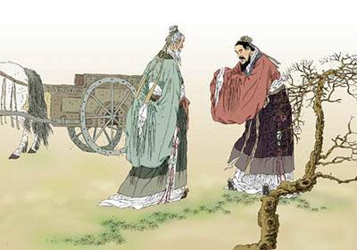
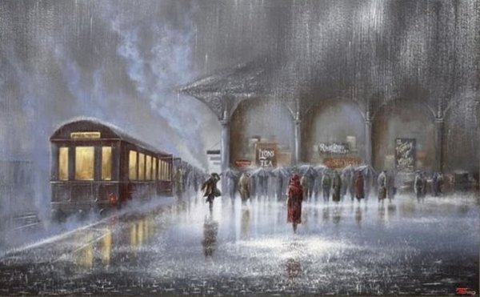

&emsp;&emsp;之前很喜欢写文章，喜欢那种对自己灵魂深处的剖析，喜欢整理自己。工作四舍五入凑个整可以说一年，忙碌的节奏，似乎都忘了自己还有这样的乐趣，一年了没有动过一次笔，也许一个人青春的激情就是被忙碌消磨殆尽。

&emsp;&emsp;但是这是我吗？或者说这种消磨就真的是大多数人都应该经历的吗？难道，我们每个人的激情都要被工作妥协，都要被金钱蹂躏吗？

&emsp;&emsp;我想去否定它，也许这就是我失败的原因，太过于尖锐，不懂得顺从。但是我觉得我需要这么去做，因为这样活的才像我自己。

# 忆过去，痛苦-经历-成长-反思

> 24岁的我过去能有多久，过去的10年？并没有这么长，如果真的要回忆过去，我只想回忆一件经历，高中生活和高考。

&emsp;&emsp;如果整个高中是一场电影，那么我的高中简单的可能只有几张胶片——强制只能睡5小时困到半死的我、英语常年70分但理科年级前茅的我、文章时常成为范文但是语文老是不过100的我、经常在外面罚站的我，抄作业的我、183体重190坐在班级第一排的我和最后差一分上了一本线的我。

&emsp;&emsp;如果说把上面这些都统一起来去考量，一句话就可以总结高中的我自己——有潜力的学渣（PS老师评）。何为潜力，我理解就是可以达到一个高度但是目前没有达到的就叫做潜力。何为学渣，我理解就是成绩差，态度差，不听话、不学习、不守纪律的三不“差生”。

&emsp;&emsp;说实话，有点后悔当年高中的我是这样的，如果要重来一遍做一个正常的学生，上面的问题我会这样改正。因为强制睡觉五小时大小自习轮着上所以不想干——我的问题，思想上没有提高，只要可以提升成绩无需考虑身体。英语常年70分——我的问题，我再也不会在英语课研究数学难题了，再也不会提前自学后面理科的知识了，再也不会排斥当时只是为了考试的英语了，数学之研究怎么拿分就好，英语认真背单词句子钻研做题技巧。会写文章语文成绩差——我的问题，阅读理解我会死套模版的，不会天马行空的去写我理解的作者的笔法和思想了。罚站抄作业——我会用咖啡和红牛顶住因睡眠严重匮乏如洪峰般的困意的。总之都是我的问题，当今这种教育体制一直存在必然有他的道理。错就错在我当年过于幼稚以至于高考后我才明白这样一个简单的道理——当你想改变一件事情你必须先适应然后不忘本心，再去改变。这一点我一直铭记至今。

&emsp;&emsp;高中很痛苦，很不适应，老师给了很大的厚望（坐在第一排压力很大），最后失眠抑郁也是顺理成章。不过失眠抑郁的这段时间，我看到更多别人看不到的东西，体会到了别人可能体会不到的状态。有失必有得想到了一个国外的谚语When god closes a door, he opens a window。

&emsp;&emsp;高考如期而至，我的成绩也理所当然，对有些人来说高考失利带来的是伤心痛苦的像一个人在风中飘零那样的无助，但是我是一个差生，思想觉悟太低，高考分数下来时差一分上一本线还阿Q般的自嘲，“真好，还好没上一本线，要不还要去思考上那个一本院校了”。填志愿的时候貌似我也没有什么选择困难症，我现在还记得我填写的内容——计算机科学与技术、软件工程、物理、数学、金融。“呀你怎么没填满啊，都填满啊”，老妈说。“好好好”，于是剩下的空都填的计算机技术了。我是一个真的“差生”。

&emsp;&emsp;记得那年暑假，我睡的很舒服。

# 忆大学，师者传道授业解惑和挑战规则

&emsp;&emsp;傅玄在《太子少傅箴》中指出：“近朱者赤，近墨者黑；声和则响清，形正则影直。”像我这种学渣，只能去那些所谓的“学渣”聚集地了。

&emsp;&emsp;我依然保持着高中的“学渣”的学习方法，按照不听课逃课、自学、不是为了考试而学习、75分（75+左右绩点就是B）就可以的原则一路走到黑。不过对于计算机专业来说，听课可能没有这么重要，只要把数学基础打好，计算机组成原理、操作系统、计算机网路三门专业课学好貌似就没什么问题了。而且充分的发现了我高中上课不听课自学带来的能力的提高——我可以通过自学，一个星期学完别人需要一个学期才能学完的东西，而且这个能力在非应试教育的情况下给我的帮助越大，尤其是现在工作之后。

&emsp;&emsp;没去过好大学，不知道好大学里的老师如何，我只知道我大学的大部分教育工作者还是很负责的但是没有给我带来什么太大的影响。教育工作者里也有很功利的，我不喜欢也不做评价，人各有志，君子爱财取之有道，人为名死鸟为食亡，人家一没犯法二没图财害命，姜太公钓鱼愿者上钩。他们“画地为牢”。他们想着让学生来我小组，做我项目，用我机器，义务劳动，各取所需。他们整天夸夸其谈，弹冠相庆。韩愈在《师说》里写过：“师者，所以传道授业解惑也”，为师者不仁，子何仁。只是生气有些人玷污老师二字。很庆幸，学生时代遇到了几位背得起老师二字的人，传我道、解我惑。但是大多数的也不过是为了考核罢了，所做的很多也不是为传道授业解惑，而是“中庸”按部就班罢了。

&emsp;&emsp;二本大学，不一定都是渣，人喜欢带有色眼镜看别人。我大学同学同样有优秀的——有的人听话，通过自己的努力和老师学长的帮助，去了BAT之类的大公司，也有的人在实验室里，听话努力，获得保送资格。而我呢，依然玩世不恭，我不听话，自然老师手上的内推资源不会普及到我身上。那又如何，我的大学生活就是开挂就是奋斗，我的大学生活就是和规则对抗不服从不妥协。简单说就是每天努力奋斗，一直坚持，抓住机会，看清形势，多去闯。如果总结成几件事的话，可以概括成如下几件1. 大学时课外技术书（不算博客电子书）总量厚度1.7m 2. 利用学校和培训机构的PY交易漏洞提前半年外出找实习 3. 走过三个城市（上海，杭州，北京），共去了三家公司实习大中小都呆过 4. 拿到一家大公司的SP offer 5. 收获了一份爱情。

&emsp;&emsp;毕业那天我是宿舍最后一个离开的，不是规矩让我最后走，而是想纪念我即将结束的学生，有时候在想我留下了什么，又带走了什么。有的时候在梦里也会梦见学生时代的情景，当年“走南闯北”实习、当年高中英语课罚站、当年盛夏没有空调、当年严冬没有暖气，也许我真的是怀念。离开时，想起了徐志摩的那首诗：“我轻轻的走了，又轻轻的来，挥一挥手，不带走一片云彩”。我送走了一个有一个同学，他们转身后可能一辈子都不会再相遇，我脑袋里只回荡着一首歌：“长亭外,古道边,芳草碧连天，晚风拂柳笛声残,夕阳山外山，天之涯,地之角,知交半零落，人生难得是欢聚，唯有别离多”。

&emsp;&emsp;别了我的大学，虽然你有很多问题，虽然你被很多人看不上眼，但是怎么说你都是我的母校，你教会我很多，“采得青梅香，不忘山中来”。作别我的学生时代。

# 工作后整理和规划

## 人人都是老师

之前提到过老师，其实真正的老师只有在生活工作中才能遇到，孔子云：“三人行，必有我师”。这句话不假，这里记录两位让我影印象最深刻的三个人。

- 第一位——死胖子，一句名言：“不就是两三行代码的事吗，说白了就是你懒。”师傅受我一拜，受益终身。

- 第二位——大泉，死胖子名言的坚实，实现者，做事绝不拖拉，雷厉风行，学习学习。

- 第三位——森爷，“这个问题你为啥不提前说好，我都开发完了，再做的话排期吧”、“提需求啊”、“我暂时没空别找我”、“我不知道，谁做的找谁”。反面典型，作为一个研发需要职业素养，做事的态度，一定的情商，引以为鉴。

## 工作就是工作，生活就是生活

&emsp;&emsp;其实人如果工作了，可能就是少了很多浪漫，更多的时候是沉浸在工作的忙碌或者业务的处理中了。今天反思自己工作的这一年时光，霎时想起了老大说过的一句话：“自从来到了这里，我发现很多能力都没了，希望你们不要这样。”工作多我们来说其实是一种剥削，但是换来的是金钱。

&emsp;&emsp;但是真的是这样吗？我不认同剥削这种观点，最好的雇佣关系，是个人能力的提升间接的带动公司效益的提升，从而形成良性循环。如果要实现这一点，被雇佣者必须要有主动学习的欲望和动力，因为工作的时候大部分时间还是在对外输出，如果不及时补血，终有一天你的你能力会被抽空。

&emsp;&emsp;工作是忙碌的，很多时候我们会发现根本没有这么多时间去自我提高。世面上很多职业发展的课程或者论调，但是我觉得，那些只不过是纸上谈兵罢了。适合自己的方法才是正确的方法。但是有一种观点我认为是通用的——工作就是工作，生活就是生活。当你离开了公司，请关闭所有有关公司的情绪，投入到自己的生活中，支配那些属于自己的时间，用这些时间去完善和发展自己，实现自己的跃迁并创造更多的价值。

## 追逐星辰大海

&emsp;&emsp;在开会的时候，时常会听见又有会说这样的一句话：“我们追逐的不是眼前的目标，我们追逐的是星辰大海。”现在每次听见这句话都会感觉有丝丝的尴尬，因为很多时候这种观点只不过是一种空话。

&emsp;&emsp;这个词语本来是很美的，可能是人们绎译源自日本的太空歌剧《银河英雄传说》外传的第九章『星を砕く者』的结尾处的这么一段话：“两人并排坐在长椅上，透过透明墙远眺星海。这是他们目前渡过的海，也是将来想要征服的海。星星闪烁，波踌涌起，沸腾的能量掀起无声的潮音，投向莱因哈特意识的原野。”但是现在很多人将这个词变成了一个口号，人人都可以喊，但是实际上的结果又是如何呢。

&emsp;&emsp;说实话，人有的时候需要多喊喊口号，作为部门的老大，更应该这样，如果自己都没有干劲，手下的人又谈什么拼搏和努力呢。当目标有了，其实最重要的就不在是口号了，而是做法。所以有的时候，当大家都知道目标的时，再高喊追逐星辰大海，不就成了空有理论没有实践作用的纸上谈兵了吗。

&emsp;&emsp;其实星辰大海这句话本来也很空，又想起老大的一句话：“我们不缺能做事的人，我们缺的是能统一规划指定目标的人。”很明显，星辰大海这个词其实连目标都没有。星辰是啥，大海又是啥，我们追逐的到底是啥。喊话的人说不明白，听话的人也模模糊糊，就像现在的互联网，高级词语层出不穷，“区块链”、“新零售”、“AI”，其实对于一个发展中的领域，最重要的创造价值，而不是整理名词。那些夸夸其谈的名词不就和整天高喊追逐星辰大海一样吗。其实总结成两个字就是浮躁。

&emsp;&emsp;其实也没有办法，经济再高速发展的过程中肯定是会遇到瓶颈的，这个时候就需要喊口号去振奋人心！重要的是我们要明这么做是什么方法、为什么要这么做、要怎么去做。当前的风气是浮躁的，节奏可能不是这么整齐，无论是国际大环境还是国内的市场经济，所以做重要的是在当前风气中，不迷失自己，不忘本心，就像开头写的那样，永远保持青春，活成自己。希望以后的生活中，能一帆风顺，希望自己的未来能一片光明。

长路漫漫，路途多舛，道阻且长，作为我，更应该勉励前行，杜绝浮躁。沉稳努力，明智慎言才是正解。

