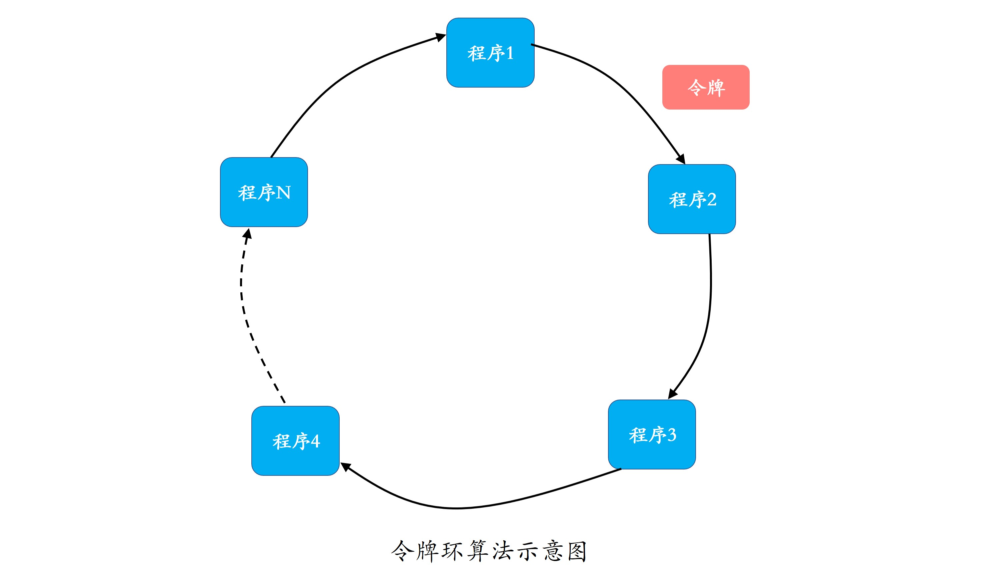
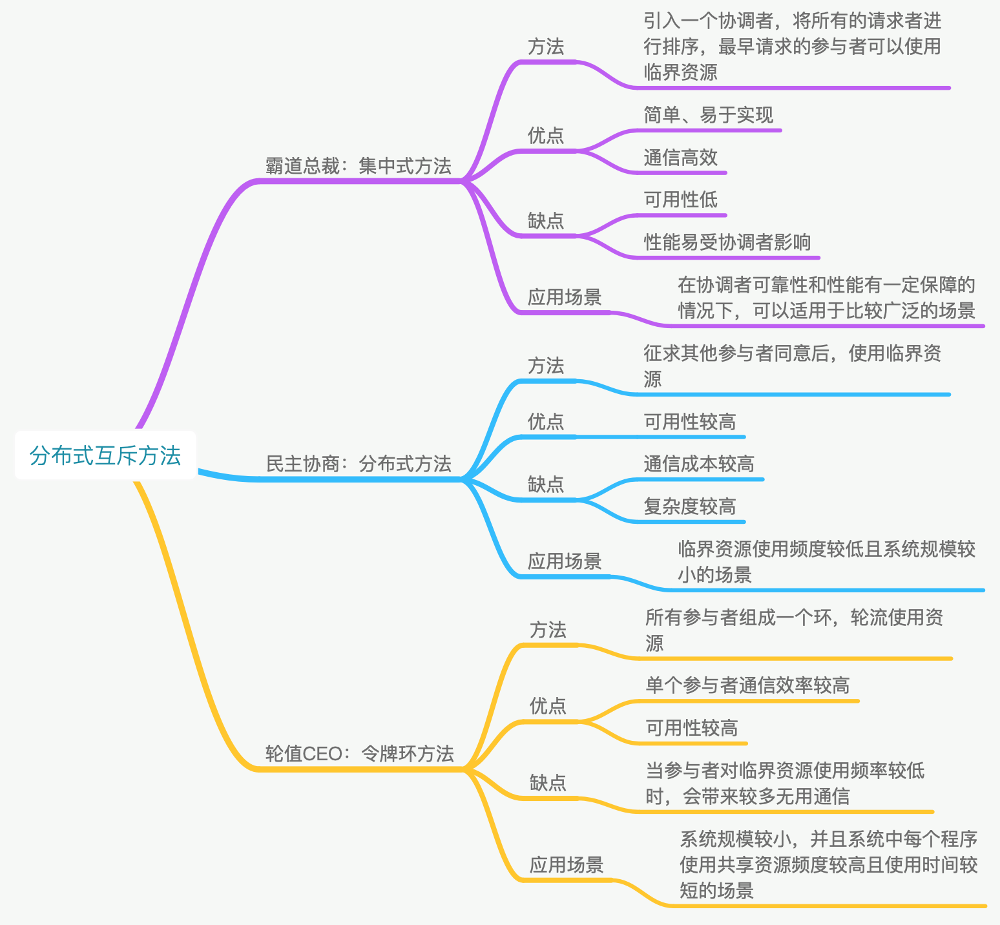
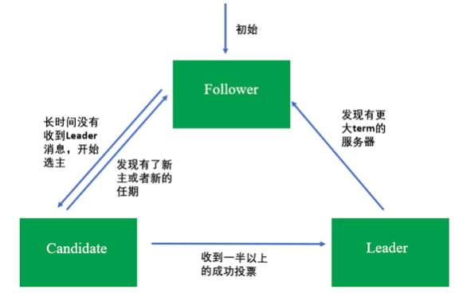

本质上是让分布在不同计算机上的程序具有“团队精神”，换句话说就是让程序通过协作共同去达成一个业务目标

# 分布式互斥

对于同一共享资源，一个程序正在使用的时候也不希望被其他程序打扰。这，就要求同一时刻只能有一个程序能够访问这种资源。

在分布式系统里，这种排他性的资源访问方式，叫作分布式互斥（Distributed Mutual Exclusion），而这种被互斥访问的共享资源就叫作临界资源（Critical Resource）。

## 如何才能让分布式系统里的程序互斥地访问临界资源?三种算法-> 集中式算法 , 分布式算法 , 令牌环算法

### 集中式算法

我们引入一个协调者程序，得到一个分布式互斥算法。每个程序在需要访问临界资源时，先给协调者发送一个请求。如果当前没有程序使用这个资源，协调者直接授权请求程序访问；否则，按照先来后到的顺序为请求程序“排一个号”。如果有程序使用完资源，则通知协调者，协调者从“排号”的队列里取出排在最前面的请求，并给它发送授权消息。拿到授权消息的程序，可以直接去访问临界资源。

这个互斥算法，就是我们所说的集中式算法，也可以叫做中央服务器算法。之所以这么称呼，是因为协调者代表着集中程序或中央服务器。

集中式算法的示意图如下所示：

从上述流程可以看出，一个程序完成一次临界资源访问，需要如下几个流程和消息交互：

1. 向协调者发送请求授权信息，1 次消息交互；
2. 协调者向程序发放授权信息，1 次消息交互；
3. 程序使用完临界资源后，向协调者发送释放授权，1 次消息交互

不难看出，集中式算法的优点在于直观、简单、信息交互量少、易于实现，并且所有程序只需和协调者通信，程序之间无需通信。但是，这个算法的问题也出在了协调者身上

- 一方面，协调者会成为系统的性能瓶颈。想象一下，如果有 100 个程序要访问临界资源，那么协调者要处理 100*3=300 条消息。也就是说，协调者处理的消息数量会随着需要访问临界资源的程序数量线性增加。
- 另一方面，容易引发单点故障问题。协调者故障，会导致所有的程序均无法访问临界资源，导致整个系统不可用。

因此，在使用集中式算法的时候，一定要选择性能好、可靠性高的服务器来运行协调者。

### 分布式算法

当一个程序要访问临界资源时，先向系统中的其他程序发送一条请求消息，在接收到所有程序返回的同意消息后，才可以访问临界资源。其中，请求消息需要包含所请求的资源、请求者的 ID，以及发起请求的时间。

类似民主协商,在分布式领域中，我们称之为分布式算法，或者使用组播和逻辑时钟的算法。

一个程序完成一次临界资源的访问，需要进行如下的信息交互：

- 向其他 n-1 个程序发送访问临界资源的请求，总共需要 n-1 次消息交互；
- 需要接收到其他 n-1 个程序回复的同意消息，方可访问资源，总共需要 n-1 次消息交互。

可以看出，一个程序要成功访问临界资源，至少需要 2*(n-1) 次消息交互。假设，现在系统中的 n 个程序都要访问临界资源，则会同时产生 2n(n-1) 条消息。总结来说，在大型系统中使用分布式算法，消息数量会随着需要访问临界资源的程序数量呈指数级增加，容易导致高昂的“沟通成本”。

从上述分析不难看出，分布式算法根据“先到先得”以及“投票全票通过”的机制，让每个程序按时间顺序公平地访问资源，简单粗暴、易于实现。但，这个算法可用性很低，主要包括两个方面的原因：

- 当系统内需要访问临界资源的程序增多时，容易产生“信令风暴”，也就是程序收到的请求完全超过了自己的处理能力，而导致自己正常的业务无法开展。
- 一旦某一程序发生故障，无法发送同意消息，那么其他程序均处在等待回复的状态中，使得整个系统处于停滞状态，导致整个系统不可用。所以，相对于集中式算法的协调者故障，分布式算法的可用性更低。

> 针对可用性低的一种改进办法是，如果检测到一个程序故障，则直接忽略这个程序，无需再等待它的同意消息。这就好比在自助餐厅，一个人离开餐厅了，那你在使用咖啡机前，也无需征得他的同意。但这样的话，每个程序都需要对其他程序进行故障检测，这无疑带来了更大的复杂性。

因此，分布式算法适合节点数目少且变动不频繁的系统，且由于每个程序均需通信交互，因此适合 P2P 结构的系统。比如，运行在局域网中的分布式文件系统，具有 P2P 结构的系统等。

> 那么，在我们工作中，什么样的场景适合采用分布式算法呢？

Hadoop 是我们非常熟悉的分布式系统，其中的分布式文件系统 HDFS 的文件修改就是一个典型的应用分布式算法的场景。

如下图所示，处于同一个局域网内的计算机 1、2、3 中都有同一份文件的备份信息，且它们可以相互通信。这个共享文件，就是临界资源。当计算机 1 想要修改共享的文件时，需要进行如下操作：

1. 计算机 1 向计算机 2、3 发送文件修改请求；
2. 计算机 2、3 发现自己不需要使用资源，因此同意计算机 1 的请求；
3. 计算机 1 收到其他所有计算机的同意消息后，开始修改该文件；
4. 计算机 1 修改完成后，向计算机 2、3 发送文件修改完成的消息，并发送修改后的文件数据；
5. 计算机 2 和 3 收到计算机 1 的新文件数据后，更新本地的备份文件

> 归纳一下：分布式算法是一个“先到先得”和“投票全票通过”的公平访问机制，但通信成本较高，可用性也比集中式算法低，适用于临界资源使用频度较低，且系统规模较小的场景。

### 令牌环算法

所有程序构成一个环结构，令牌按照顺时针（或逆时针）方向在程序之间传递，收到令牌的程序有权访问临界资源，访问完成后将令牌传送到下一个程序；若该程序不需要访问临界资源，则直接把令牌传送给下一个程序。

因为在使用临界资源前，不需要像分布式算法那样挨个征求其他程序的意见了，所以相对而言，在令牌环算法里单个程序具有更高的通信效率。同时，在一个周期内，每个程序都能访问到临界资源，因此令牌环算法的公平性很好。

但是，不管环中的程序是否想要访问资源，都需要接收并传递令牌，所以也会带来一些无效通信。假设系统中有 100 个程序，那么程序 1 访问完资源后，即使其它 99 个程序不需要访问，也必须要等令牌在其他 99 个程序传递完后，才能重新访问资源，这就降低了系统的实时性。

> 小结一下：令牌环算法的公平性高，在改进单点故障后，稳定性也很高，适用于系统规模较小，并且系统中每个程序使用临界资源的频率高且使用时间比较短的场景。

## 有适合大规模系统中的分布式互斥算法吗?

可以看到，上面提到的集中式、分布式和令牌环 3 个互斥算法，都不适用于规模过大、节点数量过多的系统。那么，什么样的互斥算法适用于大规模系统呢？

由于大规模系统的复杂性，我们很自然地想到要用一个相对复杂的互斥算法。时下有一个很流行的互斥算法，两层结构的分布式令牌环算法，把整个广域网系统中的节点组织成两层结构，可以用于节点数量较多的系统，或者是广域网系统。

我们知道，广域网由多个局域网组成，因此在该算法中，局域网是较低的层次，广域网是较高的层次。每个局域网中包含若干个局部进程和一个协调进程。局部进程在逻辑上组成一个环形结构，在每个环形结构上有一个局部令牌 T 在局部进程间传递。局域网与局域网之间通过各自的协调进程进行通信，这些协调进程同样组成一个环结构，这个环就是广域网中的全局环。在这个全局环上，有一个全局令牌在多个协调进程间传递。总结

> 本质上可以实用集中式算法+令牌环算法组合来实现大规模互斥

集中式算法：可参照redis集群通信模式，通过hash key将大量的请求分散到不同的master,以处理大量请求,每个master由小集群主从节点来保障单点故障
分布式算法：分布式算法可在集群中过半数同意就识为其同意，降低通信数，如分布式选举场景
令牌环算法：可根据参与者使用频率列出权重，结合平滑加权轮询算法选出下一个参与者

# 分布式选举

提出一个问题对于一个集群来说，多个节点到底是怎么协同，怎么管理的呢。比如，数据库集群，如何保证写入的数据在每个节点上都一致呢?

也许你会说，这还不简单，选一个“领导”来负责调度和管理其他节点就可以了啊。这个想法一点儿也没错。这个“领导”，在分布式中叫做主节点，而选“领导”的过程在分布式领域中叫作分布式选举。然后，你可能还会问，怎么选主呢?

## 为什么进行分布式选举

主节点，在一个分布式集群中负责对其他节点的协调和管理，也就是说，其他节点都必须听从主节点的安排。

主节点的存在，就可以保证其他节点的有序运行，以及数据库集群中的写入数据在每个节点上的一致性。这里的一致性是指，数据在每个集群节点中都是一样的，不存在不同的情况。

当然，如果主故障了，集群就会天下大乱，就好比一个国家的皇帝驾崩了，国家大乱一样。比如，数据库集群中主节点故障后，可能导致每个节点上的数据会不一致。

这，就应了那句话“国不可一日无君”，对应到分布式系统中就是“集群不可一刻无主”。总结来说，选举的作用就是选出一个主节点，由它来协调和管理其他节点，以保证集群有序运行和节点间数据的一致性。

## 分布式选举算法

目前常见的选主方法有基于序号选举的算法（ 比如，Bully 算法）、多数派算法（比如，Raft 算法、ZAB 算法）等

### Bully 算法

Bully 算法是一种霸道的集群选主算法，为什么说是霸道呢？因为它的选举原则是“长者”为大，即在所有活着的节点中，选取 ID 最大的节点作为主节点。

在 Bully 算法中，节点的角色有两种：普通节点和主节点。初始化时，所有节点都是平等的，都是普通节点，并且都有成为主的权利。但是，当选主成功后，有且仅有一个节点成为主节点，其他所有节点都是普通节点。当且仅当主节点故障或与其他节点失去联系后，才会重新选主。

Bully 算法在选举过程中，需要用到以下 3 种消息：

- Election 消息，用于发起选举；
- Alive 消息，对 Election 消息的应答；
- Victory 消息，竞选成功的主节点向其他节点发送的宣誓主权的消息。

Bully 算法选举的原则是“长者为大”，意味着它的假设条件是，集群中每个节点均知道其他节点的 ID。在此前提下，其具体的选举过程是：

1. 集群中每个节点判断自己的 ID 是否为当前活着的节点中 ID 最大的，如果是，则直接向其他节点发送 Victory 消息，宣誓自己的主权；
2. 如果自己不是当前活着的节点中 ID 最大的，则向比自己 ID 大的所有节点发送 Election 消息，并等待其他节点的回复；
3. 若在给定的时间范围内，本节点没有收到其他节点回复的 Alive 消息，则认为自己成为主节点，并向其他节点发送 Victory 消息，宣誓自己成为主节点；若接收到来自比自己 ID 大的节点的 Alive 消息，则等待其他节点发送 Victory 消息；
4. 若本节点收到比自己 ID 小的节点发送的 Election 消息，则回复一个 Alive 消息，告知其他节点，我比你大，重新选举。

> 其实Victory可以理解成一种特殊的Election

目前已经有很多开源软件采用了 Bully 算法进行选主，比如 MongoDB 的副本集故障转移功能。MongoDB 的分布式选举中，采用节点的最后操作时间戳来表示 ID，时间戳最新的节点其 ID 最大，也就是说时间戳最新的、活着的节点是主节点。

> 小结一下。Bully 算法的选择特别霸道和简单，谁活着且谁的 ID 最大谁就是主节点，其他节点必须无条件服从。这种算法的优点是，选举速度快、算法复杂度低、简单易实现。

但这种算法的缺点在于，需要每个节点有全局的节点信息，因此额外信息存储较多；其次，任意一个比当前主节点 ID 大的新节点或节点故障后恢复加入集群的时候，都可能会触发重新选举，成为新的主节点，如果该节点频繁退出、加入集群，就会导致频繁切主。

### Raft 算法

Raft 算法是典型的多数派投票选举算法，其选举机制与我们日常生活中的民主投票机制类似，核心思想是“少数服从多数”。也就是说，Raft 算法中，获得投票最多的节点成为主。

采用 Raft 算法选举，集群节点的角色有 3 种：

1. 初始化时，所有节点均为 Follower 状态。
2. 开始选主时，所有节点的状态由 Follower 转化为 Candidate，并向其他节点发送选举请求。
3. 其他节点根据接收到的选举请求的先后顺序，回复是否同意成为主。这里需要注意的是，在每一轮选举中，一个节点只能投出一张票。
4. 若发起选举请求的节点获得超过一半的投票，则成为主节点，其状态转化为 Leader，其他节点的状态则由 Candidate 降为 Follower。Leader 节点与 Follower 节点之间会定期发送心跳包，以检测主节点是否活着。
5. 当 Leader 节点的任期到了，即发现其他服务器开始下一轮选主周期时，Leader 节点的状态由 Leader 降级为 Follower，进入新一轮选主。

请注意，每一轮选举，每个节点只能投一次票。这种选举就类似人大代表选举，正常情况下每个人大代表都有一定的任期，任期到后会触发重新选举，且投票者只能将自己手里唯一的票投给其中一个候选者。对应到 Raft 算法中，选主是周期进行的，包括选主和任值两个时间段，选主阶段对应投票阶段，任值阶段对应节点成为主之后的任期。但也有例外的时候，如果主节点故障，会立马发起选举，重新选出一个主节点。

Google 开源的 Kubernetes，擅长容器管理与调度，为了保证可靠性，通常会部署 3 个节点用于数据备份。这 3 个节点中，有一个会被选为主，其他节点作为备。Kubernetes 的选主采用的是开源的 etcd 组件。而，etcd 的集群管理器 etcds，是一个高可用、强一致性的服务发现存储仓库，就是采用了 Raft 算法来实现选主和一致性的。

> 小结一下。Raft 算法具有选举速度快、算法复杂度低、易于实现的优点；缺点是，它要求系统内每个节点都可以相互通信，且需要获得过半的投票数才能选主成功，因此通信量大。该算法选举稳定性比 Bully 算法好，这是因为当有新节点加入或节点故障恢复后，会触发选主，但不一定会真正切主，除非新节点或故障后恢复的节点获得投票数过半，才会导致切主。

### ZAB 算法

ZAB（ZooKeeper Atomic Broadcast）选举算法是为 ZooKeeper 实现分布式协调功能而设计的。相较于 Raft 算法的投票机制，ZAB 算法增加了通过节点 ID 和数据 ID 作为参考进行选主，节点 ID 和数据 ID 越大，表示数据越新，优先成为主。相比较于 Raft 算法，ZAB 算法尽可能保证数据的最新性。所以，ZAB 算法可以说是对 Raft 算法的改进。

使用 ZAB 算法选举时，集群中每个节点拥有 3 种角色：

- Leader，主节点；
- Follower，跟随者节点；
- Observer，观察者，无投票权。

选举过程中，集群中的节点拥有 4 个状态：

- Looking 状态，即选举状态。当节点处于该状态时，它会认为当前集群中没有 Leader，因此自己进入选举状态。
- Leading 状态，即领导者状态，表示已经选出主，且当前节点为 Leader。
- Following 状态，即跟随者状态，集群中已经选出主后，其他非主节点状态更新为 Following，表示对 Leader 的追随。
- Observing 状态，即观察者状态，表示当前节点为 Observer，持观望态度，没有投票权和选举权。

投票过程中，每个节点都有一个唯一的三元组 (server_id, server_zxID, epoch)，其中 server_id 表示本节点的唯一 ID；server_zxID 表示本节点存放的数据 ID，数据 ID 越大表示数据越新，选举权重越大；epoch 表示当前选取轮数，一般用逻辑时钟表示。

ZAB 选举算法的核心是“少数服从多数，ID 大的节点优先成为主”，因此选举过程中通过 (vote_id, vote_zxID) 来表明投票给哪个节点，其中 vote_id 表示被投票节点的 ID，vote_zxID 表示被投票节点的服务器 zxID。ZAB 算法选主的原则是：server_zxID 最大者成为 Leader；若 server_zxID 相同，则 server_id 最大者成为 Leader。

