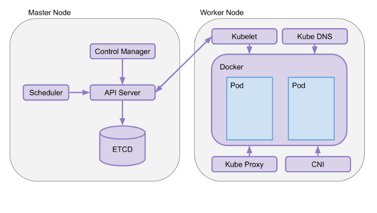
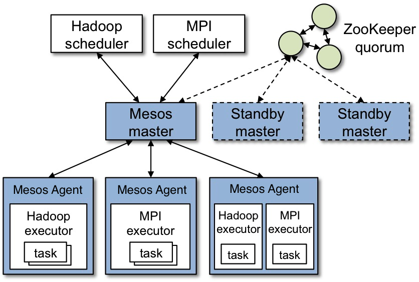

# 分布式体系结构之集中式结构：一人在上，万人在下

很多场景下，我们的请求都会汇总到一台服务器上，由这台服务器统一协调我们的请求和其他服务器之间的关系。这种由一台服务器统一管理其他服务器的方式，就是分布式体系结构中的集中式结构（也称为 Master/Slave 架构），其中统一管理其他服务器的服务器是主，其他服务器是从，可以形象地比喻为“一人在上，万人在下”。

集中式结构就是，由一台或多台服务器组成中央服务器，系统内的所有数据都存储在中央服务器中，系统内所有的业务也均先由中央服务器处理。多个节点服务器与中央服务器连接，并将自己的信息汇报给中央服务器，由中央服务器统一进行资源和任务调度：中央服务器根据这些信息，将任务下达给节点服务器；节点服务器执行任务，并将结果反馈给中央服务器。

集中式结构最大的特点，就是部署结构简单。这是因为，集中式系统的中央服务器往往是多个具有较强计算能力和存储能力的计算机，为此中央服务器进行统一管理和调度任务时，无需考虑对任务的多节点部署，而节点服务器之间无需通信和协作，只要与中央服务器通信协作即可，具体示意图如下所示：

## 经典集中式结构

Borg 是 Google 内部使用的集群管理系统，采用了典型的集中式结构，负责提交、调度、开始、重启和管理 Google 运行在其上的所有应用。

在 Borg 中，一个集群称为一个 Cell，每个 Cell 里面有一个 Leader，称为 BorgMaster，即为中央服务器；其他服务器为节点服务器或从服务器，被称为 Borglet。

首先，我们一起看看 BorgMaster。它由两个进程组成，一个是 Borgmaster 主进程，一个是独立的 scheduler 进程：

- 主进程处理客户端的 RPC 请求，比如任务的执行状态更新或者查询等；同时，管理系统中所有实体的状态（比如，服务器、任务等），并负责和 Borglet 通信。
- scheduler 进程负责任务调度，通过任务对资源的需求以及当前 Borglet 所在服务器的资源情况进行匹配，为任务寻找一个合适的节点服务器执行。我会在第 11 篇文章“分布式调度之单体调度：物质文明、精神文明一手抓”中与你详细讲述具体的调度流程。

接下来，我们一起看看 Borglet。它是运行在每个节点机器的一个 agent，负责任务的拉起、停止、重启等，并管理和搜集本服务器资源，将任务的状态、服务器状态等信息上报给 BorgMaster。而 BorgMaster 会周期性地轮询每个 Borglet，以获取节点服务器的状态和资源信息等。

Borg 的整体架构示意图如下所示：

Borg 的主要用户是 Google 的开发者以及运行 Google 应用和服务的系统管理员（网站可靠性工程师，简称 SRE）。用户以 Job 的形式向 Borg 提交工作，每个 Job 由运行一个或多个运行相同程序的 Task 组成。每个 Job 运行在一个 Borg Cell 中，并将一组机器当做一个单元进行管理。

Borg 可以运行各种各样的任务，这些任务主要分为两类：

- 第一类是长服务，即长时间运行不停止的服务，并且要求能够处理短暂的、延迟敏感的请求（延迟要求在几微秒到几百毫秒之间）。这些服务主要用于面向终端用户的服务（比如 Gmail、Google Docs、Web 搜索），以及内部的一些基础设施服务（比如 BigTable）。
- 第二类是批处理任务。通常需要几秒到几天的时间来完成的批处理 Job，这些 Job 对短时间的性能波动并不是非常敏感。

这些负载通常在 Cell 之间混合分布，每个 Cell 随着主要租户以及时间的不同会运行各种不同的应用：批处理类型的 Job 来了又走，而许多面向终端用户的 Job 又期望一个能长时间使用的模式。

对于这些不同的服务，要求 Borg 能很好地处理所有的情况。Borg 主要有三大优点：

- 开发者只需关注应用，不需要关注底层资源管理。它隐藏了资源管理以及错误处理，因此用户能集中精力开发应用。
- 高可靠性和可用性，支持多种应用。
- 支持上千级服务器的管理和运行。

Borg 并不是第一个解决这些问题的系统，但却是少数能在这么大规模处理这些问题的同时，还能实现这样的弹性和完整性的系统之一。

## Kubernetes

Kubernetes 是 Google 开源的容器集群管理系统，是 Borg 的一个开源版本。Kubernetes 是用于自动部署、扩展和管理容器化应用程序的开源系统。其核心是，在集群的节点上运行容器化应用，可以进行自动化容器操作，包括部署、调度和在节点间弹性伸缩等。

Kubernetes 也是典型的集中式结构，一个 Kubernetes 集群，主要由 Master 节点和 Worker 节点组成，以及客户端命令行工具 kubectl 和其他附加项。

我们先来看看 Master 节点。它运行在中心服务器上，Master 节点由 API Server、Scheduler、Cluster State Store 和 Control Manger Server 组成，负责对集群进行调度管理。

- API Server：是所有 REST 命令的入口，负责处理 REST 的操作，确保它们生效，并执行相关业务逻辑。
- Scheduler：根据容器需要的资源以及当前 Worker 节点所在节点服务器的资源信息，自动为容器选择合适的节点服务器。
- Cluster State Store：集群状态存储，默认采用 etcd，etcd 是一个分布式 key-value 存储，主要用来做共享配置和服务发现。
- Control Manager：用于执行大部分的集群层次的功能，比如执行生命周期功能（命名空间创建和生命周期、事件垃圾收集、已终止垃圾收集、级联删除垃圾收集等）和 API 业务逻辑。

接下来，我们看看 Worker 节点吧。它作为真正的工作节点，运行在从节点服务器，包括 kubelet 和 kube-proxy 核心组件，负责运行业务应用的容器。

- kubelet：用于通过命令行与 API Server 进行交互，根据接收到的请求对 Worker 节点进行操作。也就是说，通过与 API Server 进行通信，接收 Master 节点根据调度策略发出的请求或命令，在 Worker 节点上管控容器（Pod），并管控容器的运行状态（比如，重新启动出现故障的 Pod）等。Pod 是 Kubernetes 的最小工作单元，每个 Pod 包含一个或多个容器。
- kube-proxy：负责为容器（Pod）创建网络代理 / 负载平衡服务，从 API Server 获取所有 Server 信息，并根据 Server 信息创建代理服务，这种代理服务称之为 Service。Kube-proxy 主要负责管理 Service 的访问入口，即实现集群内的 Pod 客户端访问 Service，或者是集群外访问 Service，具有相同服务的一组 Pod 可抽象为一个 Service。每个 Service 都有一个虚拟 IP 地址（VIP）和端口号供客户端访问。

Kubernetes 架构示意图如下所示：

图中， Kube DNS 负责为整个集群提供 DNS 服务；CNI 是 Container Network Interface 的一个标准的通用接口，用于连接容器管理系统和网络插件。

与 Borg 不同的是，Kubernetes 主要是一个容器编排引擎，不仅支持 Docker，还支持 Rocket(另一种容器技术)。

Kubernetes 也已经被很多公司采用，比如网易云、华为在需要使用容器进行资源隔离以运行相关业务的场景下，采用了大规模 Kubernetes 集群。

在容器管理方面，Kubernetes 有很多优势。

- 自动化容器的部署和复制。Kubernetes 执行容器编排，因此不必人工编写这些任务的脚本。
- 将容器组织为组，弹性伸缩。Kubernetes 引入 Pod 机制，Pod 代表着能够作为单一应用程序加以控制的一组容器集合。通过 Pod 机制，Kubernetes 实现了多个容器的协作，能够有效避免将太多功能集中到单一容器镜像这样的错误实践中。此外，软件可以向外扩展跨越多个 Pods 实现初步部署，且相关部署可随时进行规模伸缩。
- 容器间负载均衡。Services 用于将具备类似功能的多个 Pod 整合为一组，可轻松进行配置以实现其可发现性、可观察性、横向扩展以及负载均衡。
- 易于版本控制与滚动更新。Kubernetes 采取“滚动方式”实现编排，且可跨越部署范围内的全部 Pod。这些滚动更新可进行编排，并以预定义方式配合当前可能尚不可用的 Pods 数量，以及暂时存在的闲置 Pods 数量。Kubernetes 利用新的应用程序镜像版本对已部署 Pods 进行更新，并在发现当前版本存在不稳定问题时回滚至早期部署版本。

## Mesos

理解了 Google Borg 和 Kubernetes 的集中式结构，接下来我们再看看 Apache 旗下的开源分布式资源管理框架 Mesos 吧。它被称为是分布式系统的内核，最初由加州大学伯克利分校的 AMPLab 开发，后在 Twitter 得到广泛使用。

Mesos 的开发受到了 Borg 系统的启发，也是采用的典型的集中式架构。Mesos 与 Borg 不同之处在于，Borg 的 Master 直接对接用户应用，也就是说用户可以向 Borg 的 Master 直接请求任务。但 Mesos 不可以，Mesos 只负责底层资源的管理和分配，并不涉及存储、 任务调度等功能，因此 Mesos Master 对接的是 Spark、Hadoop、Marathon 等框架，用户的任务需要提交到这些框架上。也正因为此，Mesos 的任务调度框架是双层结构。

在 Mesos 中，一个集群包括 Mesos Master 和多个 Mesos Agent。其中，Mesos Master 运行在中央服务器，Mesos Agent 运行在节点服务器上。

Mesos Master 负责收集和管理所有 Agent 所在服务器的资源和状态，并且对接 Spark、Hadoop 等框架，将集群中服务器的资源信息告知给这些框架，以便这些框架进行任务资源匹配和调度。Mesos Agent 负责任务的拉起、停止、重启等，并负责收集所在服务器的资源 (比如 CPU、内存等) 信息和状态，上报给 Mesos Master。

Mesos Master 通常采用一主两备的方式，以方便故障处理和恢复。而 Mesos Master 的选主策略，采用的就是 ZAB 算法。

Mesos 架构示意图如下所示：

如上所述，Mesos 对接的是框架，并且可以同时对接多个框架，目前已经被很多公司使用。比如，国外的 Twitter、Apple、Airbnb、Uber 等，国内的爱奇艺、去哪儿、携程、当当等。

这些公司选择 Mesos，主要是因为它具有如下优势：

- 效率。Mesos 对物理资源进行了逻辑抽象，在应用层而不是物理层分配资源，通过容器而不是虚拟机（VM）分配任务。因为应用程序的调度器知道如何最有效地利用资源，所以在应用层分配资源能够为每个应用程序的特殊需求做考量 ; 而通过容器分配任务则能更好地进行“装箱”。
- 可扩展性。Mesos 可扩展设计的关键是两级调度架构，其中 Framework 进行任务调度，Mesos Master 进行资源分配。由于 Master 不必知道每种类型的应用程序背后复杂的调度逻辑，不必为每个任务做调度，因此可以用非常轻量级的代码实现，更易于扩展集群规模。
- 模块化。每接入一种新的框架，Master 无需增加新的代码，并且 Agent 模块可以复用，为此开发者可以专注于应用和框架的选择。这，就使得 Mesos 可以支持多种框架，适应不同的应用场景。

随着分布式应用程序和微服务的流行，越来越多的用户正在寻找一种技术，来帮助他们管理这些复杂的应用程序。而 Mesos 为数据中心带来的这些好处，就使得越来越多的人关注 Mesos 及其相关项目。

## 引申: 知识扩展：Mesos 是如何支持容器部署的？

Mesos 本身只负责资源管理，不负责任务调度。但 Mesos 可以对接不同的框架，Mesos+Marathon 可以支持容器调度和部署。Marathon 支持容器的调度，将容器部署请求发给 Mesos Master，Mesos Master 再将请求转发给 Mesos Agent，Mesos Agent 的执行器会将容器拉起。

目前，Mesos+Marathon 支持的容器，主要包括 Docker 和 cgroups。
