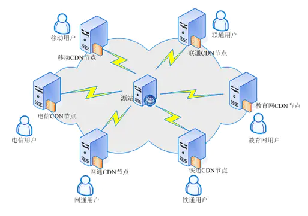
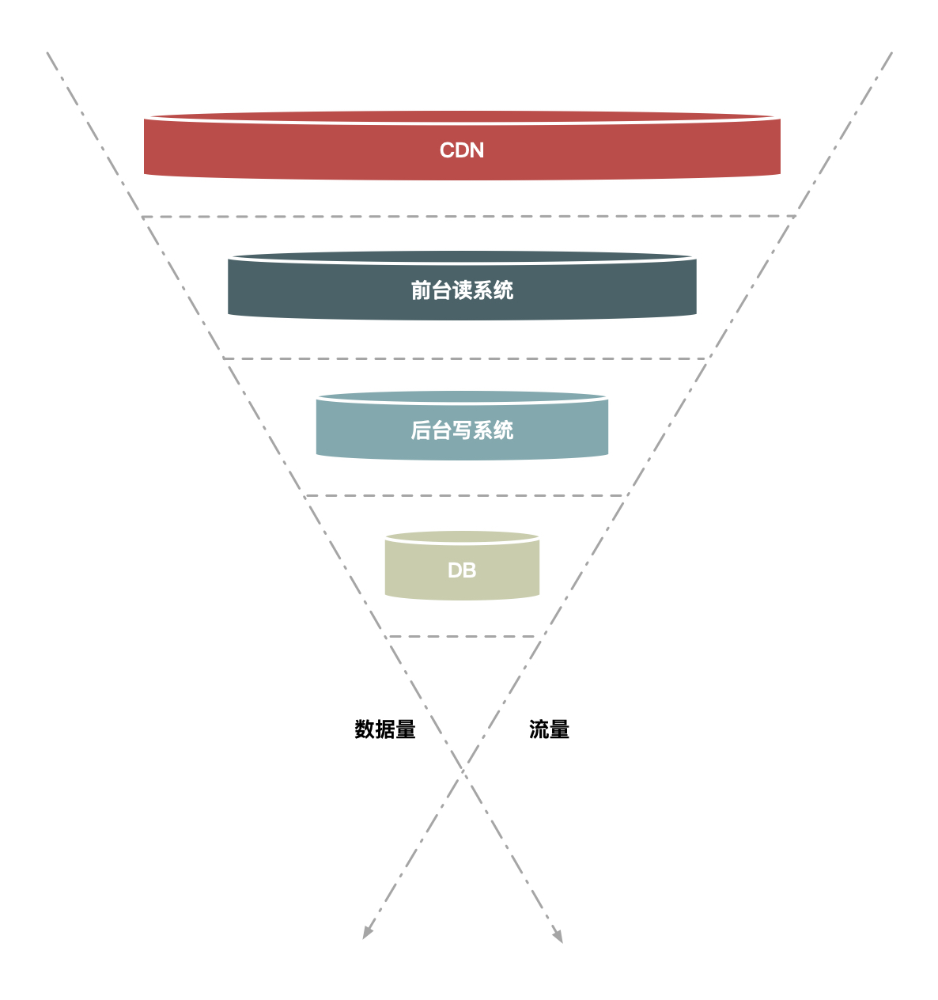

# 高并发架构设计都有哪些关键点？

秒杀其实主要解决两个问题，一个是并发读，一个是并发写

其实，秒杀的整体架构可以概括为“稳、准、快”几个关键字

然后就是“准”，就是秒杀 10 台 iPhone，那就只能成交 10 台，多一台少一台都不行。一旦库存不对，那平台就要承担损失，所以“准”就是要求保证数据的一致性。

最后再看“快”，“快”其实很好理解，它就是说系统的性能要足够高，否则你怎么支撑这么大的流量呢？不光是服务端要做极致的性能优化，而且在整个请求链路上都要做协同的优化，每个地方快一点，整个系统就完美了。

所以从技术角度上看“稳、准、快”，就对应了我们架构上的高可用、一致性和高性能的要求，我们的专栏也将主要围绕这几个方面来展开，具体如下。

- 高性能。 秒杀涉及大量的并发读和并发写，因此支持高并发访问这点非常关键。本专栏将从设计数据的动静分离方案、热点的发现与隔离、请求的削峰与分层过滤、服务端的极致优化这 4 个方面重点介绍。

- 一致性。 秒杀中商品减库存的实现方式同样关键。可想而知，有限数量的商品在同一时刻被很多倍的请求同时来减库存，减库存又分为“拍下减库存”“付款减库存”以及预扣等几种，在大并发更新的过程中都要保证数据的准确性，其难度可想而知。因此，我将用一篇文章来专门讲解如何设计秒杀减库存方案。

- 高可用。 虽然我介绍了很多极致的优化思路，但现实中总难免出现一些我们考虑不到的情况，所以要保证系统的高可用和正确性，我们还要设计一个 PlanB 来兜底，以便在最坏情况发生时仍然能够从容应对。专栏的最后，我将带你思考可以从哪些环节来设计兜底方案。

# 设计高并发系统时应该注意的5个架构原则

> 高并发系统本质上就是一个满足大并发、高性能和高可用的分布式系统

## 设计原则

### 数据操作要尽量少

1. 请求的数据能少就少。请求的数据包括上传给系统的数据和系统返回给用户的数据

2. 返回的数据能少就少, 减少后端序列化的时间

3. 数据库操作能少就少 , 这个就不说了

### 请求数要尽量少

这个就很直观了 , 请求数少并发量就少

### 调用链路要尽量短

高并发系统 1. 要降低系统依赖 , 防止因为依赖造成的各种问题 , 提高可用性 2. 降低流量入侵 , 大流量尽量隔绝在外面 

### 不要有单点

系统中的单点可以说是系统架构上的一个大忌，因为单点意味着没有备份，风险不可控 , 其次流量不能分发像redis这种会有热点数据问题

## 一些基本案例

其实构建一个高并发系统并没有那么复杂 , 有一下的几个方法可以扛住比较高的并发

1. 把高并发系统独立出来单独打造一个系统，这样可以有针对性地做优化，例如这个独立出来的系统就减少了店铺装修的功能，减少了页面的复杂度
2. 在系统部署上也独立做一个机器集群，这样秒杀的大流量就不会影响到正常的商品购买集群的机器负载
3. 将热点数据（如库存数据）单独放到一个缓存系统中，以提高“读性能”
4. 增加秒杀答题，防止有秒杀器抢单
5. 一些数据放入cdn中进行缓存
6. 使用本地缓存部分数据

对电商来说系统差不多是这种样子 :

# 高并发系统场景优化1 - 动静分离

所谓动静分离 , 就是将一些不常变化 , 可以静态化 , 无状态 , 不需要逻辑处理的一些字段放在一个专门的系统或者地方 , 获取的时候不需要走后端系统的方法

## 动静分离原则

### 1. 把静态数据缓存到离用户最近的地方

常见的就三种 , 用户浏览器里、CDN 上 或者 在服务端的 Cache 中

### 2. 缓存http链接信息减少解析过程

Web 代理服务器根据请求URL查找缓存,直接取出对应的 HTTP 响应头和响应体然后直接返回，这个响应过程简单得连 HTTP 协议都不用重新组装，甚至连 HTTP 请求头也不需要解析

## 如何动静分离改造

### 静态数据处理方法

1. URL 唯一化 : 为啥要 URL 唯一呢？前面说了我们是要缓存整个 HTTP 连接，那么以什么作为 Key 呢？就以 URL 作为缓存的 Key，例如以 id=xxx 这个格式进行区分
2. 分离浏览者相关的因素。浏览者相关的因素包括是否已登录，以及登录身份等，这些相关因素我们可以单独拆分出来，通过动态请求来获取
3. 分离时间因素。服务端输出的时间也通过动态请求获取。
4. 异步化地域因素。详情页面上与地域相关的因素做成异步方式获取，当然你也可以通过动态请求方式获取，只是这里通过异步获取更合适。
5. 去掉 Cookie。服务端输出的页面包含的 Cookie 可以通过代码软件来删除，如 Web 服务器 Varnish 可以通过 unset req.http.cookie 命令去掉 Cookie。注意，这里说的去掉 Cookie 并不是用户端收到的页面就不含 Cookie 了，而是说，在缓存的静态数据中不含有 Cookie

### 动态数据处理方法

这个没有什么好办法 , 动态数据一定会将流量打到后端 , 所以尽可能的减少这部分 , 如果不行就加机器

## 动静分离的几种架构方案

有 3 种方案可选：

1. 单机本地cache层
2. 统一 Cache 层
3. 上 CDN。

### 1. 单机本地cache层

就是使用内存缓存比如java的ehcache等

| 优点       | 缺点                         |
|------------|------------------------------|
| 无网络开销 | 占用内存大                   |
| 使用简单   | 同步机制需要使用其他方法保证 |

## 统一 Cache 层

典型的就是redis集群

| 优点| 缺点|
|----------------------------------------------------|-------------------------------------------------------------------------------|
| StartFragment单独一个 Cache 层，可以减少多个应用接入时使用 Cache 的成本。这样接入的应用只要维护自己的 Java 系统就好，不需要单独维护 Cache，而只关心如何使用即可 EndFragment | StartFragmentCache 层内部交换网络成为瓶颈 EndFragment|
| StartFragment统一 Cache 的方案更易于维护，如后面加强监控、配置的自动化，只需要一套解决方案就行，统一起来维护升级也比较方便。 EndFragment                                    | StartFragment缓存服务器的网卡也会是瓶颈； EndFragment                         |
| StartFragment可以共享内存，最大化利用内存，不同系统之间的内存可以动态切换，从而能够有效应对各种攻击。 EndFragment                                                           | StartFragment机器少风险较大，挂掉一台就会影响很大一部分缓存数据。 EndFragment |

> 要解决上面这些问题，可以再对 Cache 做 Hash 分组，即一组 Cache 缓存的内容相同，这样能够避免热点数据过度集中导致新的瓶颈产生。 比如redis 热点数据分组

## 上 CDN

在将整个系统做动静分离后，我们自然会想到更进一步的方案，就是将 Cache 进一步前移到 CDN 上，因为 CDN 离用户最近，效果会更好

有以下几个问题需要解决

1. 失效问题。前面我们也有提到过缓存时效的问题，不知道你有没有理解，我再来解释一下。谈到静态数据时，我说过一个关键词叫“相对不变”，它的言外之意是“可能会变化”。比如一篇文章，现在不变，但如果你发现个错别字，是不是就会变化了？如果你的缓存时效很长，那用户端在很长一段时间内看到的都是错的。所以，这个方案中也是，我们需要保证 CDN 可以在秒级时间内，让分布在全国各地的 Cache 同时失效，这对 CDN 的失效系统要求很高

2. 命中率问题。Cache 最重要的一个衡量指标就是“高命中率”，不然 Cache 的存在就失去了意义。同样，如果将数据全部放到全国的 CDN 上，必然导致 Cache 分散，而 Cache 分散又会导致访问请求命中同一个 Cache 的可能性降低，那么命中率就成为一个问题。

3. 发布更新问题。如果一个业务系统每周都有日常业务需要发布，那么发布系统必须足够简洁高效，而且你还要考虑有问题时快速回滚和排查问题的简便性。

因为上面的这些问题 , 所以cdn的部署方法一般都是分网络分区域的中心化部署

# 高并发系统场景优化2 - 处理热点

## 要关注热点

首先，热点请求会大量占用服务器处理资源，虽然这个热点可能只占请求总量的亿分之一，然而却可能抢占 90% 的服务器资源，如果这个热点请求还是没有价值的无效请求，那么对系统资源来说完全是浪费。

其次，即使这些热点是有效的请求，我们也要识别出来做针对性的优化，从而用更低的代价来支撑这些热点请求

## 热点操作和热点数据

所谓“热点操作”，例如大量的刷新页面、大量的添加购物车、双十一零点大量的下单等都属于此类操作。对系统来说，这些操作可以抽象为“读请求”和“写请求”，这两种热点请求的处理方式大相径庭，读请求的优化空间要大一些，而写请求的瓶颈一般都在存储层，优化的思路就是根据 CAP 理论做平衡

热点数据”比较好理解，那就是用户的热点请求对应的数据。而热点数据又分为“静态热点数据”和“动态热点数据”

### 静态热点数据和动态热点数据

所谓“静态热点数据”，就是能够提前预测的热点数据。例如，我们可以通过卖家报名的方式提前筛选出来，通过报名系统对这些热点商品进行打标。另外，我们还可以通过大数据分析来提前发现热点商品，比如我们分析历史成交记录、用户的购物车记录，来发现哪些商品可能更热门、更好卖，这些都是可以提前分析出来的热点

所谓“动态热点数据”，就是不能被提前预测到的，系统在运行过程中临时产生的热点。例如，卖家在抖音上做了广告，然后商品一下就火了，导致它在短时间内被大量购买

## 我们如何处理热点数据

### 发现热点数据

#### 热点数据静态发现

静态热点数据可以通过商业手段，例如强制让卖家通过报名参加的方式提前把热点商品筛选出来，实现方式是通过一个运营系统，把参加活动的商品数据进行打标，然后通过一个后台系统对这些热点商品进行预处理，如提前进行缓存 . 或者使用技术手段提前预测，例如对买家每天访问的商品进行大数据计算，然后统计出 TOP N 的商品，我们可以认为这些 TOP N 的商品就是热点商品。

#### 热点数据动态发现

主要处理动态热点数据的 , 都是使用技术手段实现的

1. 构建一个异步的系统，它可以收集交易链路上各个环节中的中间件产品的热点 Key，如 Nginx、缓存、RPC 服务框架等这些中间件（一些中间件产品本身已经有热点统计模块）。
2. 建立一个热点上报和可以按照需求订阅的热点服务的下发规范，主要目的是通过交易链路上各个系统（包括详情、购物车、交易、优惠、库存、物流等）访问的时间差，把上游已经发现的热点透传给下游系统，提前做好保护。比如，对于大促高峰期，详情系统是最早知道的，在统一接入层上 Nginx 模块统计的热点 URL。
3. 将上游系统收集的热点数据发送到热点服务台，然后下游系统（如交易系统）就会知道哪些商品会被频繁调用，然后做热点保护。

这里我给出了一个图，其中用户访问商品时经过的路径有很多，我们主要是依赖前面的导购页面（包括首页、搜索页面、商品详情、购物车等）提前识别哪些商品的访问量高，通过这些系统中的中间件来收集热点数据，并记录到日志中。

我们通过部署在每台机器上的 Agent 把日志汇总到聚合和分析集群中，然后把符合一定规则的热点数据，通过订阅分发系统再推送到相应的系统中。你可以是把热点数据填充到 Cache 中，或者直接推送到应用服务器的内存中，还可以对这些数据进行拦截，总之下游系统可以订阅这些数据，然后根据自己的需求决定如何处理这些数据。

打造热点发现系统时，我根据以往经验总结了几点注意事项。

1. 这个热点服务后台抓取热点数据日志最好采用异步方式，因为“异步”一方面便于保证通用性，另一方面又不影响业务系统和中间件产品的主流程。
2. 热点服务发现和中间件自身的热点保护模块并存，每个中间件和应用还需要保护自己。热点服务台提供热点数据的收集和订阅服务，便于把各个系统的热点数据透明出来。
3. 热点发现要做到接近实时（3s 内完成热点数据的发现），因为只有做到接近实时，动态发现才有意义，才能实时地对下游系统提供保护。

### 处理热点数据

处理热点数据通常有几种思路：一是优化，二是限制，三是隔离。

#### 优化

优化热点数据最有效的办法就是缓存热点数据，如果热点数据做了动静分离，那么可以长期缓存静态数据。但是，缓存热点数据更多的是“临时”缓存，即不管是静态数据还是动态数据，都用一个队列短暂地缓存数秒钟，由于队列长度有限，可以采用 LRU 淘汰算法替换。

#### 限制

限制更多的是一种保护机制，限制的办法也有很多，例如对被访问商品的 ID 做一致性 Hash，然后根据 Hash 做分桶，每个分桶设置一个处理队列，这样可以把热点商品限制在一个请求队列里，防止因某些热点商品占用太多的服务器资源，而使其他请求始终得不到服务器的处理资源。

#### 隔离

高并发系统设计的第一个原则就是将这种热点数据隔离出来，不要让 1% 的请求影响到另外的 99%，隔离出来后也更方便对这 1% 的请求做针对性的优化。

> 具体到“秒杀”业务，我们可以在以下几个层次实现隔离。

1. 业务隔离。把秒杀做成一种营销活动，卖家要参加秒杀这种营销活动需要单独报名，从技术上来说，卖家报名后对我们来说就有了已知热点，因此可以提前做好预热。
2. 系统隔离。系统隔离更多的是运行时的隔离，可以通过分组部署的方式和另外 99% 分开。秒杀可以申请单独的域名，目的也是让请求落到不同的集群中。
3. 数据隔离。秒杀所调用的数据大部分都是热点数据，比如会启用单独的 Cache 集群或者 MySQL 数据库来放热点数据，目的也是不想 0.01% 的数据有机会影响 99.99% 数据。

当然了，实现隔离有很多种办法。比如，你可以按照用户来区分，给不同的用户分配不同的 Cookie，在接入层，路由到不同的服务接口中；再比如，你还可以在接入层针对 URL 中的不同 Path 来设置限流策略。服务层调用不同的服务接口，以及数据层通过给数据打标来区分等等这些措施，其目的都是把已经识别出来的热点请求和普通的请求区分开

# 高并发系统场景优化3 - 流量削峰

## 为什么要削峰

我们知道服务器的处理资源是恒定的，你用或者不用它的处理能力都是一样的，所以出现峰值的话，很容易导致忙到处理不过来，闲的时候却又没有什么要处理。但是由于要保证服务质量，我们的很多处理资源只能按照忙的时候来预估，而这会导致资源的一个浪费

## 流量削峰的一些操作思路：排队、答题、分层过滤

### 排队

要对流量进行削峰，最容易想到的解决方案就是用消息队列来缓冲瞬时流量，把同步的直接调用转换成异步的间接推送，中间通过一个队列在一端承接瞬时的流量洪峰，在另一端平滑地将消息推送出去

如果流量峰值持续一段时间达到了消息队列的处理上限，例如本机的消息积压达到了存储空间的上限，消息队列同样也会被压垮，这样虽然保护了下游的系统，但是和直接把请求丢弃也没多大的区别

消息队列，类似的排队方式还有很多，例如：

1. 利用线程池加锁等待也是一种常用的排队方式；
2. 先进先出、先进后出等常用的内存排队算法的实现方式；
3. 把请求序列化到文件中，然后再顺序地读文件（例如基于 MySQL binlog 的同步机制）来恢复请求等方式。

可以看到，这些方式都有一个共同特征，就是把“一步的操作”变成“两步的操作”，其中增加的一步操作用来起到缓冲的作用。

### 答题

增加答题其实有很多目的

1. 第一个目的是防止部分买家使用秒杀器在参加秒杀时作弊 , 过滤无用请求
2. 延缓请求，起到对请求流量进行削峰的作用，从而让系统能够更好地支持瞬时的流量高峰

### 分层过滤

前面介绍的排队和答题要么是少发请求，要么对发出来的请求进行缓冲，而针对秒杀场景还有一种方法，就是对请求进行分层过滤，从而过滤掉一些无效的请求。分层过滤其实就是采用“漏斗”式设计来处理请求的

假如请求分别经过 CDN、前台读系统（如商品详情系统）、后台系统（如交易系统）和数据库这几层，那么：

1. 大部分数据和流量在用户浏览器或者 CDN 上获取，这一层可以拦截大部分数据的读取；
2. 经过第二层（即前台系统）时数据（包括强一致性的数据）尽量得走 Cache，过滤一些无效的请求；
3. 再到第三层后台系统，主要做数据的二次检验，对系统做好保护和限流，这样数据量和请求就进一步减少；
4. 最后在数据层完成数据的强一致性校验。

分层过滤的核心思想是：在不同的层次尽可能地过滤掉无效请求，让“漏斗”最末端的才是有效请求。而要达到这种效果，我们就必须对数据做分层的校验。

分层校验的基本原则是：

1. 将动态请求的读数据缓存（Cache）在 Web 端，过滤掉无效的数据读；
2. 对读数据不做强一致性校验，减少因为一致性校验产生瓶颈的问题；
3. 对写数据进行基于时间的合理分片，过滤掉过期的失效请求；
4. 对写请求做限流保护，将超出系统承载能力的请求过滤掉；
5. 对写数据进行强一致性校验，只保留最后有效的数据。

分层校验的目的是：在读系统中，尽量减少由于一致性校验带来的系统瓶颈，但是尽量将不影响性能的检查条件提前，如用户是否具有秒杀资格、商品状态是否正常、用户答题是否正确、秒杀是否已经结束、是否非法请求、营销等价物是否充足等；在写数据系统中，主要对写的数据（如“库存”）做一致性检查，最后在数据库层保证数据的最终准确性（如“库存”不能减为负数）。

# 高并发系统场景优化4 - 类库存扣减场景

库存场景非常典型 , 是高并发情况下对数据进行读写操作的场景

> 先说一下场景

总结来说，减库存操作一般有如下几个方式：

1. 下单减库存，即当买家下单后，在商品的总库存中减去买家购买数量。下单减库存是最简单的减库存方式，也是控制最精确的一种，下单时直接通过数据库的事务机制控制商品库存，这样一定不会出现超卖的情况。但是你要知道，有些人下完单可能并不会付款。

2. 付款减库存，即买家下单后，并不立即减库存，而是等到有用户付款后才真正减库存，否则库存一直保留给其他买家。但因为付款时才减库存，如果并发比较高，有可能出现买家下单后付不了款的情况，因为可能商品已经被其他人买走了。

3. 预扣库存，这种方式相对复杂一些，买家下单后，库存为其保留一定的时间（如 10 分钟），超过这个时间，库存将会自动释放，释放后其他买家就可以继续购买。在买家付款前，系统会校验该订单的库存是否还有保留：如果没有保留，则再次尝试预扣；如果库存不足（也就是预扣失败）则不允许继续付款；如果预扣成功，则完成付款并实际地减去库存。

“下单减库存”在数据一致性上，主要就是保证大并发请求时库存数据不能为负数，也就是要保证数据库中的库存字段值不能为负数，一般我们有多种解决方案

1. 一种是在应用程序中通过事务来判断，即保证减后库存不能为负数，否则就回滚；
2. 直接设置数据库的字段数据为无符号整数，这样减后库存字段值小于零时会直接执行 SQL 语句来报错
3. 再有一种就是使用 CASE WHEN 判断语句，例如这样的 SQL 语句：UPDATE item SET inventory = CASE WHEN inventory >= xxx THEN inventory-xxx ELSE inventory END

## 秒杀减库存的极致优化

在交易环节中，“库存”是个关键数据，也是个热点数据，因为交易的各个环节中都可能涉及对库存的查询。但是，我在前面介绍分层过滤时提到过，秒杀中并不需要对库存有精确的一致性读，把库存数据放到缓存（Cache）中，可以大大提升读性能。

解决大并发读问题，可以采用 LocalCache（即在秒杀系统的单机上缓存商品相关的数据）和对数据进行分层过滤的方式，但是像减库存这种大并发写无论如何还是避免不了，这也是秒杀场景下最为核心的一个技术难题。

因此，这里我想专门来说一下秒杀场景下减库存的极致优化思路，包括如何在缓存中减库存以及如何在数据库中减库存。

